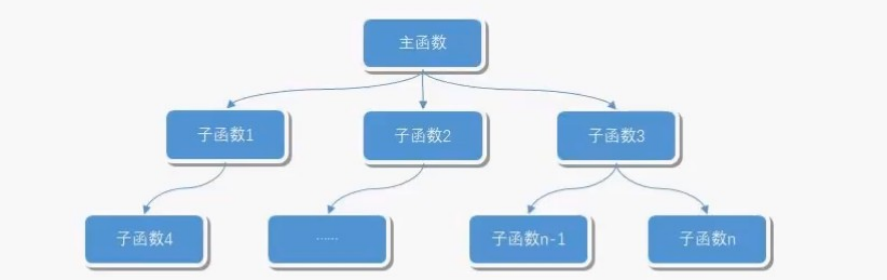

# VS快捷键

## **1、窗口快捷键** 

**（大家有没有发现但凡跟窗口挂上钩的快捷键当中都有一个W，那是因为W代表Windows也就是窗口的意思）**

Ctrl+W,W: 浏览器窗口 

Ctrl+W,S: 解决方案管理器 （解决方案是Solution）
Ctrl+W,C: 类视图 （类自然是Class）
Ctrl+W,E: 错误列表 （错误是Error）
Ctrl+W,O: 输出视图 （输出Output ）用过输出窗口的猿们自然知道它的厉害啦 我觉得是一个挺强悍的窗口
Ctrl+W,P: 属性窗口 （属性 Property）
Ctrl+W,T: 任务列表 （任务Task）
Ctrl+W,X: 工具箱  （事实上工具应该是Tool  但t已被任务列表占用了  那总归得找一个字母用吧  哈哈  自然就想到了X  大家看看X的体型就知道了它可是四通八达呀  微软用它自然就想表达我们的VS工具箱可是各色各样的工具都有的哦  这是我瞎诌的）
Ctrl+W,B: 书签窗口 （书签 Bookmark  ）书签其实是挺好用的  用熟悉的猿们肯定对它爱不释手
Ctrl+W,U: 文档大纲 
Ctrl+D,B: 断点窗口 （断点 breakpoint）

Ctrl+D,I: 即时窗口 （即时immediately ）

## **2、项目功能快捷键** 

总结：  c trl是强制功能键  shift有给项目增加功能作用

CTRL + F6 /CTRL + TAB下一个文档窗口即活动窗体切换 （相信使用过windows操作系统的伙伴们都知道alt+tab表示在任务之间切换  那如果在当中任务不同的活动标签中切换就是ctrl+tab了  嘿嘿）
CTRL + SHIFT + F6 / CTRL + SHIFT + TAB上一个文档窗口 （在windows系统操作中  相信大家都知道shift有相反的功能  哈哈  在这里体现了）


F7: 查看代码 
Shift+F7: 查看窗体设计器 (coding的大家相信用过最多的就是在视图界面的代码界面切换  那就用它了  如果是想再切换回视图界面  哈哈 记得加相反键 shift)

 

Ctrl+Shift+N: 新建项目 （N是New新建的意思  那如果需要强制在项目中新建项目的话  自然就是组合键Ctrl+Shift+N）
Ctrl+Shift+O: 打开项目 （O代表Open打开的意思）

CTRL + SHIFT + C显示类视图窗口（C代表Class类的意思）

CTRL + F4关闭文档窗口 （相信用过qq的大家都有使用alt+f4来关闭当前聊天窗口   想想用ctrl+tab在活动标签窗口切换就知道为什么关闭当前标签窗口是ctrl+f4）

CTRL + SHIFT + E显示资源视图 （E代表Explorer资源管理器的意思）

CTRL + SHIFT + B生成解决方案 （B代表Build生成的意思  其实用F6也可以实现）

Shift+F6表示生成当前项目 (上面已经说过使用f6可以生成整个解决方案  那如果是当前项目的生成那自然就是加上功能键shift了 )

F4 显示属性窗口 
SHIFT + F4显示项目属性窗口

Ctrl+Shift+S: 全部保存 （S代表Save保存的意思  这里表示全部保存是因为如果只是单个保存Ctrl+S跟整个项目没有任何瓜葛  而全部保存的概念应该是说在整个项目中  所以组合键中自然会有shift了哦）

Ctrl+Shift+A: 新建项（A是Add的意思）

Shift+Alt+C: 新建类 （大家可以会想为什么新建类是shift+alt+c  c自然是class啦  我相信平时的coding工作当中添加类是最多的而alt键是我们使用的最多的键空格键旁边的小功能键 shift是跟项目有关的功能键  这样一记不就哈哈  进入脑海啦）

## 3、书签相关快捷键

（B代表Bookmark  ）

Ctrl+B,T  切换书签开关 （切换是trigger 哦）

Ctrl+B,N  移动到下一书签 （下一个是Next）
Ctrl+B,P: 移动到上一书签 （上一个是Previous）
Ctrl+B,C: 清除全部标签（C是Clear）

## **4、查找相关快捷键**

Ctrl+F: 查找 （Find）
Ctrl+Shift+F: 在文件中查找 (上面已经提过了shift是表示在项目中  所以如果需要在项目中的文件中查找的话  那自然就少不了Shift)
F3: 查找下一个 （相信使用过windows系统的人都知道f3是查找的快捷键）
Shift+F3: 查找上一个 （shift在此有反向的功能哦）
Ctrl+H: 替换 
Ctrl+Shift+H: 在文件中替换

## **5、代码快捷键**

Ctrl+E,D（ctrl+k,d） ----格式化全部代码 （每个使用过vs的人  如果不会用这个快捷键那可是亏大了哦）

Ctrl+E,F ----格式化选中的代码（如果你已经记住Ctrl+E+D是格式化全部代码的话  那你想想规律不就知道了吗 F不就在D的右边表示它是特定某一范围）

Ctrl+K,C: 注释选定内容 
Ctrl+K,U: 取消选定注释内容 （平常注释和反注释  大家相信都用的比较平凡  kernel核心内容 c表示Comment selected text  U表示Uncomment selected text）

Ctrl+J /Ctrl+K,L: 智能提示  列出成员 （kernel核心内容 list列表  如果我们想查看一个对象具有的成员具体信息的时候试下这个快捷键吧）

Ctrl+K,P: 参数信息 （kernel核心内容 Parameters参数  如果我们想查看一个方法的具体参数的时候这个组合键可是挺有用的哦）

Ctrl+K,I: 快速信息

 

Ctrl+K,X: 插入代码段 
Ctrl+K,S: 插入外侧代码（平时个人习惯会时不时的用#region  用了region之后代码看起来就特别整洁  所以自然而然的就用习惯了这个）

CTRL + M, CTRL + M 折叠或展开当前方法

CTRL + M, CTRL + O 折叠所有方法

CTRL + M, CTRL + L展开所有方法

Ctrl+M,P: 停止大纲显示 （用了region将代码折叠起来之后试试用这组组合键吧  体验一下折叠和展开的快感吧  看着舒服的代码我相信你记住这对快捷键肯定是值得的）

 

ctrl+shift+f10：自动添加using命名空间

插入自动属性：输入prop后按两下tab

## **6、调试快捷键** 

F5: 启动调试 
Ctrl+F5: 开始执行(不调试) 
Shift+F5: 停止调试 
Ctrl+Shift+F5: 重启调试


F9: 切换断点 
Ctrl+F9: 启用/停止断点 
Ctrl+Shift+F9: 删除全部断点

F10: 逐过程 
Ctrl+F10: 运行到光标处 
F11: 逐语句

## **7、编辑快捷键** 

Shift+Alt+Enter: 切换全屏编辑（如果想一心一意的只写代码  让整个vs铺满全屏  感觉还不错哦）

F12: 转到所调用过程或变量的定义 

Alt+F12: 查找符号(列出所有查找结果) 

shift+f12:查找所有引用（讲光标放在单词上， 然后按Shift + F12）

Ctrl+U: 全部变为小写  (个人最喜欢这组快捷键了  因为平常写sql语句的时候都是在sqlserver里面写的 然后再粘贴到vs里来  了解了一些sql语句性能优化的皮毛知识就免不了想把粘贴过来的sql语句全部转换成大写以提高丁点儿性能  )

Ctrl+Shift+U: 全部变为大写  （U表示Upper ）

Ctrl+Shift+V: 剪贴板循环 （平时我们都只习惯用ctrl+c 和ctrl+v  大家可能还不知道事实上微软都已经帮我们把多次剪切的结果都保存了下来  记下这组快捷键吧  可以粘贴上几次剪切的结果  一用便知道它的强大厉害之处）


Ctrl+Shift+L: 删除当前行 （这个很有用哦  因为大家常常会要删除多余的空行  哈哈  这组快捷键会让你省力不少）

Ctrl+E,S: 查看空白(ctrl+r,w  和它一样可以查看空白或者说显示或隐藏tab标记)

Ctrl+E,W: 自动换行 （这组快捷键真的是太方便了，平常一行代码太长 然后老是要拉滚动条  用了组快捷键就能将手从鼠标解放出来啦）


Ctrl+G: 转到指定行 （通过情况下 我们想在跳转到具体某一行 用它太方便了）

Shift+Alt+箭头键: 选择矩形文本 
Alt+鼠标左按钮: 选择矩形文本

CTRL + DELETE删除至词尾 
CTRL + BACKSPACE删除至词头 
SHIFT + TAB取消制表符

Ctrl+左右箭头键: 一次可以移动一个单词

Ctrl+单击: 选中当前点击的整个单词

SHIFT + END选择至行尾 
SHIFT + HOME选择至行开始处

CTRL + SHIFT + END选择至文档末尾 
CTRL + SHIFT + HOME选择至文档末尾开始

CTRL + SHIFT + PAGE UP选择至本页前面 
CTRL + SHIFT + PAGE DOWN选择至本页后面

CTRL + PAGE DOWN光标定位到窗口上方 
CTRL + PAGE UP光标定位到窗口下方

CTRL + END文档定位到最后 
CTRL + HOME文档定位到最前

按两下tab快速插入代码段（写for, foreach循环，或者try, 还有绑定事件方法） 

ctrl+减号：回退到光标上一次的位置（这个真心挺有用的）

# C# 基础

## 一、C#语言及其特点

- C#是微软公司发布的一种面向对象的、运行于.NET Framework和.NET Core（完全开源，跨平台）之上的高级程序设计语言
- C#是一种安全的、稳定的、简单的、优雅的，由C和C++衍生出来的面向对象的编程语言。它在继承C和C++强大功能的同时去掉了一些它们的复杂特性
- C#是面向对象的编程语言

## 二、C#语法基础

### cs文件结构展示：


1、程序的第一行using system；using 关键字用于在程序中包含system 命名空间。一个程序一般有多个using语句。

2、下一行是namespace声明。一个namespace是一系列的类。webApplication1命名空间包含了类Program。

3、下一行是c1ass声明。类Program·包含了程序使用的数据和方法声明。类-般包含多个方法。方法定义了类的行为。在这里，Program类只有一个Main方法。，

4、下一行定义了Main 方法，是所有C#程序的入口点。Main方法说明当执行时类将做什么动作。

5、Main方法通过方法体中的语句指定它的行为。

### C#基本语法

注意：

- C#大小写敏感的。
- 所有的语句和表达式必须以分号; 结尾。
- 与Java不同的是，文件名可以不同于类的名称。

C#是一种面向对象的编程语言。在面向对象的程序设计方法中，程序由各种对象组成。相同种类的对象 通常具有相同的类型。

### 关键字

关键字，是对编译器有特殊意义的预定义保留标示符，它们不能在程序中用作标示符。

- using关键字

    在任何C#程序中的第一条语句都是:

    using 关键字用于在程序中包含命名空间。一个程序可以包含多个using 语句。

- class关键字

    class关键字用于声明一个类。

- C#的注释方式

    1.// 单行注释

    2. /**/ 多行注释

    3./// 文档注释

    4.注释的作用:

    ​	解释:说明代码作用

    ​	注销:将暂时不需要的代码注销

### 变量

变量是一个供程序存储数据盒子。在C#中，每个变量都有一个特定的类型，不同类型的变量其内存大小也不尽相同。

C# 中提供的基本类型大致分为以下几类：

| **类型**   | **举例**               |
| ---------- | ---------------------- |
| 整数类型   | byte、short、int、long |
| 浮点型     | float、double          |
| 十进制类型 | decimal                |
| 布尔类型   | bool                   |
| 字符类型   | string、char           |
| 空类型     | null                   |

​	所谓整型就是存储整数的类型，按照存储值的范围不同，C# 语言将整型分成了 byte 类型、short 类型、int 类型、long 类型等，并分别定义了有符号数和无符号数。

整型类型的分类、占用内存大小以及最大可表示范围如下图所示：

​	其中sbyte中的s字母是取自 signed 单词中的首字母，代表有符号；ushort，uint，ulong中的u字母是取自 unsigned 单词中的首字母,代表无符号。


浮点类型和十进制类型的分类、占用内存大小以及最大可表示范围如下图所示：


注意： 

- 如果计算结果对精度要求非常高，如财务金融计算，就应该使用decimal类型，而不是浮点数据类型。这是因为decimal类型比浮点数据类型较高的精度和较小的值域，decimal不受舍入错误影响。

- 如果不做任何设置，包含小数点的数值都会被认为是double类型，如果要将数值以float或者decimal类型来处理，则要进行强制转换。

- 初始化decimal类型时需要使用m/M后缀，不用的话会被认为隐式的将double类型转换为decima类型而报错。（float也是，加f/F后缀）

    decimalx=77.2m；//使用后缀m/M指明为decimal类型

- 类型转换

    1. 当把整型数值赋值给decimal变量时，不需要使用m/M后缀。整型数值会被隐式的转换为decimal类型。

        decimaly=87；//87会被隐式的转换为decima类型

    2. 在浮点型与decimal之间不存在隐式的转换，因此需要强制类型转换

        decimalx=123.4m；//声明decimal类型变量

        double y=（double）x；//声明double类型变量y，并将decimal类型变量x强制转换为double类型，并赋值给y。 

        x=（decimal）y；//将double类型变量y强制转换为decimal类型，并赋值给x

## 三、C#语法进阶

### 表达式

​	表达式由操作数(operand)和运算符(operator)构成。运算符的示例包括+ 、- 、\* 、/ 和new 。操作数的示例包括文本、字段、局部变量和表达式。

​	当表达式包含多个运算符时，运算符的优先级(precedence)控制各运算符的计算顺序。例如，表达 式x + y * z 按x + (y * z) 计算，因为* 运算符的优先级高于+ 运算符。

​	(了解)大多数运算符都可以重载(overload)。运算符重载允许指定用户定义的运算符实现来执行运算，这些运算的操作数中至少有一个，甚至所有操作数都属于用户定义的类类型或结构类型。

​	下表总结了C#简单常用的运算符，并按优先级从高到低的顺序列出各运算符类别。同类别中的运算 符 优先级相同。

| **类别** | **表达式**     | **说明**                                        |
| -------- | -------------- | ----------------------------------------------- |
| 基本     | x.m            | 成员访问                                        |
|          | x(...)         | 方法和委托调用                                  |
|          | x[...]         | 数组和索引器访问                                |
|          | newT(...)      | 对象和委托创建                                  |
|          | newT(...){...} | 使用初始值设定项创建对象                        |
|          | new{...}       | 匿名对象初始值设定项                            |
|          | newT[...]      | 数组创建                                        |
| 一元     | +x             | 恒等                                            |
|          | -x             | 求相反数                                        |
|          | !x             | 逻辑求反                                        |
|          | ~x             | 按位求反                                        |
|          | ++x            | 前增量                                          |
|          | --x            | 前减量                                          |
|          | x++            | 后增量                                          |
|          | x--            | 后减量                                          |
|          | (T)x           | 将x显示转换为类型T                              |
| 二元     | x * y          | 乘法                                            |
|          | x / y          | 除法                                            |
|          | x % y          | 取余                                            |
|          | x + y          | 加法，字符串串联                                |
|          | x - y          | 减法                                            |
|          | x << y         | 位左移                                          |
|          | x >> y         | 位右移                                          |
|          | x < y          | 小于                                            |
|          | x > y          | 大于                                            |
|          | x <= y         | 小于或等于                                      |
|          | x >= y         | 大于或等于                                      |
|          | x is T         | 如果 x 位 T ，返回true ，否则false              |
|          | x as T         | 返回转换为类型 T 的 x ,如果 x 不是 T 则返回null |

| **类别**       | **表达式** | **说明**                                        |
| :------------- | ---------- | :---------------------------------------------- |
|                | x == y     | 等于                                            |
|                | x != y     | 不等于                                          |
|                | x & y      | 整形按位与 ,布尔逻辑AND                         |
|                | x \| y     | 整形按位或 ,布尔逻辑OR                          |
|                | x && y     | 且，当 x 为true 时，才对 y 求值                 |
|                | x \|\| y   | 或，当 x 为false 时。才对 y 求值                |
|                | x ?? y     | 如果 x 为null ，则计算结果为 y，否则为 x        |
| 三元           | x ? y : z  | 如果 x 为true ,对 y 求值，x 为false ，对 z 求值 |
| 赋值或匿名函数 | x = y      | 赋值                                            |
|                | x = x + y  | 复合赋值                                        |
|                | (T x) => y | 匿名函数（lambda表达式）                        |

### 分支语句

```c#
if 语句    
if-else 语句
    if(i>=10){...}else if(i>0&&i<10){...}else{...}
switch 语句循环语句
    switch(i){
        case 1: 
            ... 
            break;
        case 2:break;case3:break; default: break;}
for 循环
	for(int i = 0; i<10;i++ ){	}
while 循环
	while(true){ }
do-while 循环
	do{ }while(true)
```

### 数组

- 数组是一组相同类型的数据。
- 数组中的数据需要通过数字索引来访问。

**数组的声明**

- 数组的声明需要使用new 关键字。
- 在声明数组时，可以使用{} 来初始化数组中的元素。
- 如果在数组声明之初没有使用大括号来初始化数组中的元素，则需要指定数组的大小。在声明初始化有元素的数组时，也可以指定数组大小。

```c#
1//声明没有元素的数组
2	int[] ints = new int[6]
3//声明初始化有元素的数组
4 	int[] ints = new int[]{1, 3, 4, 5}
5//在声明初始化有元素的数组时，也可以指定数组大小
6	string[] strings = new int[5]{"H"， “E"， "L"，“L","0"}
```

**通过索引获取数组中的元素**

- 给数组指定长度时，数组准备存放多少元素，长度就设置为多少。
- 用索引获取数组内的元素时，索弓|从0开始获取。
- 所以数组中最大的索引数字，比指定数组长度小1。

```c#
1 //声明初始化有元素的数组
2  int[] ints = new int[]{1, 3，4，5}
3 //获取数组中第1个的元素。
4  int i1 = ints[0];
5 //给数组内的元素赋值6 ints[0] = 1
```

### 扩展

- 变量名*只有在某一区域内第1次出现时才要声明变量。
- 变量名在区域内第二次出现时不用声明变量，而是直接使用之前声明的变量。
- 变量名命名是我们一般遵循驼峰命名法，即以小写宇母开头，多个单词拼接时，除第一个单词外， 其余首字母大写。
- 在程序开发中可以修改之前保存的变量值。

- 对于数组的初始化还有一种简便的方式:string[] strs = {"张三”， "李四”，“王五”，”赵六”，"田七”，”周八”} 。
- 获取数组长度的方式: strs .Length 。
- 需要跳出某个循环时可以使用break 关键字，跳出当前循环。
- 满足某些条件后需要直接快进到下一轮循环而不再执行当前循环下的代码，可以使用continue 关键字实现。

- (int) 表示使用显式强制转换，是一种类型转换，C#默认整型是int32, 因此使用此方法转成int32位，不遵循四舍五入,只截取整数部分;	(int)5.21 //输出5
- Int.Parse(): 只支持将string 类型转成int , Parse 就是把String 类型转换成int , char , double 等

```c#
1String st="5.21";
2double n=5.21;
3Int . Parse(st);//输出5
4Int .Parse(n);//报错
```

- Convert.Tolnt32(double value)不完全遵循四舍五入，如果value为两个整数中间的数字，则返回二者中的偶数，

```c#
1Console.WriteLine(Convert.ToInt32(4.3));//四舍五入，输出4
2Console.WriteLine(Convert.ToInt32(4.5));//第一位小数为5时，4.   5在4和5之间，输出偶数4
3Console.WriteLine(Convert.ToInt32(4.53)); //四舍五入，输出5
4Console.WriteLine(Convert.ToInt32(5.3));//四舍五入，输出5
5Console.WriteLine(Convert.ToInt32(5.5));   //第一位小数为5时，5.5在5和6之间，输出偶数6
6Console.WriteLine(Convert.ToInt32(5.53)); //四舍五入，输出6
```

注意： 

ConvertToInt32() 和int.Parse() 对于空值（ null ）的处理不同，ConvertToInt32(null) 会返回0而不会产生任何异常，但int.Parse(null) 则会产生异常。

### 函数初识

函数好比是对象的动作行为。在定义函数要想好函数所承担的作用，职责(作用) 越单一越好。

**函数的命名规范**

- 函数命名使用大驼峰命名，即开头首字母大写.
- 多个单词拼接时，所有单词首字母大写。

​	Add();	AddCount();	GetUsrInfo();

**函数的参数设置&传参行为**

- ​	参数可认为是外部需要函数帮忙处理的数据。
- ​	外部通过传递参数的形式，将需要处理的数据交给函数处理。

**函数返回值的设置**

函数返回值可以认为是外部调用某种行为后得到的一种反馈。

**参数修饰符**

参数修饰符种类

1. 无修饰符:如果一个参数没有用参数修饰符标记，则认为它将按值进行传递，这将意味着被调用的方法收到原始数据的一份副本。
2. out : 输出参数由被调用的方法赋值，因此按引用传递，如果被调用的方法没有给输出参数赋值， 就会出现编译错误，也就是说，只要调用了，就必须给赋值。 out 最大的用途就是调用者只使用一次方法的调用就能获得多个返回值。（在C#7.0中要实现一次方法的调用就能获得多个返回值， 建议使用元组。是元组不是元祖），调用的是指针，是地址
3. ref : 调用者赋初值，并且可以由被调用的方法可选的重新赋值（数据是按引用传递的）。如果被调用的方法未能给ref 参数赋值，也不会有编译器错误。
4. params ：这个参数修饰符允许将一组可变的数量的参数作为单独的逻辑参数进行传递， 方法只能有一个params 修饰符，而且必须是方法的最后一个参数。
5. out 和ref 的区别
    out 修饰的参数必须在方法内修改，而ref 可以修改也可以不修改;
    out 在传入参数的时候，参数是局部变量的话，可以不用赋值，因为out 一定会对其进行赋值;
    而ref 修饰的参数，在实参必须有初始值才能调用。因为ref 修饰的不一定会给它赋值。


## 四、面向对象(OOP)基本概念

面向对象编程--- Object Oriented Programming 简写OOP

1.1过程和函数

​	过程是早期的一个编程概念

​	过程类似于函数，只能执行，但是没有返回值函数不仅能执行，还可以返回结果

1.2面向过程和面向对象基本概念

1.2.1面向过程---怎么做?

```
1. 把完成某一个需求的所有步骤从头到尾 逐步实现
2. 根据开发需求，将某些功能独泣的代码封装成一个又一个函数
3. 最后完成的代码，就是顺序的调用不同的函数
```

面向过程的特点

1.注重步骤与过程，不注重职责分工
2.如果需求复杂，代码会变得很复杂
3.复杂项目，没有固定的套路，难度很大!



1.2.2面向对象---谁来做

```
在完成某一个需求前，首先确定职责，要做的事情（方法）
根据职责确定不同的对象，在对象内部封装不同的方法（多个）
最后完成代码，就是顺序的让不同的对象调用不同的方法、
```

面向对象的特点

1.注重对象和职责，不同的对象承担不同的职责
2.更加适合应对复杂的需求变化，题门应对复杂项目开发，提供固定套路
3.要在面向过程基础上，学习些面向对象的语法

## 五、类和对象

### 01.类和对象的概念

类和对象是面向对象编程的两个核心概念

**1.1类**

类是对一群具有相同特征或者行为的事物的一个统称，是抽象的，不能直接使用

​	特征被称为属性行为被称为方法
​	类就相当于制汽车是的图纸，是-一个模板，是负责创建对象的

类就相当于制汽车是的图纸，是-一个模板，是负责创建对象的

**1.2对象**

​	对象是由类创造出来的一个具体存在，可以直接使用

​	由哪一个类创造出来的对象，就拥有在哪一个类中定义的属性和方法

​	在程序开发中，应先有类，再有对象

### 02.类和对象的关系

- 类是模板，对象是根据类这个模板创建出来的，应该先有类，再有对象
- 类只有一个， 而对象可以有很多个，不同的对象之间属性的具体内容可能各不相同。
- 类中定义了什么属性和方法，对象中就有什么属性和方法，不可能多，也不可能少

### 03.类的设计

在程序开发中要设计一个类，通常需要满足以下三个要素:

​	1.类名这类事物的名称，满足大驼峰命名法
​	2.属性这类事物具有什么样的特征
​	3.方法这类事物具有什么样的行为

3.1类名的确定

​	名词提炼法分析整个业务流程，出现的名词，通常就是找到的类。

3.2属性和方法的确定

​	对对象的特征，描述通常可以定义成属性。
​	对象具有的行为通常可以定义为方法。注：方法般是动作即动词
​	需求没有涉及的属性或者方法在设计类时，不需要考虑

### 04.类和对象的使用

4.1声明类

声明一个类需要使用class 关键字类的属性及方法写在{} 中，后面不加分号

```c#
1 public class Person{}
```

4.2声明属性

​	属性在C#中较为独特，他既不同于方法，也不同于字段。属性依旧遵循大驼峰命名法
​	属性最常用的书写方法:  public int Age {get; set;}
​	如果属性中具有get 关键字，说明可以获取该属性的值。如果属性中具有set 关键字，说明可以向该属性设置值。

4.3声明方法

​	详见函数初识

4.4实例化

​	类使用关键字new 实例化对象。一个类可以实例化多个对象。
​	对象可以使用类定义的属性和方法。

4.5访问修饰符

- public : 公有的，所有的类都可以访问
- private : 私有的，当前类内部可访问。
- protected : 受保护的，当前类以及继承他的子类可访问
- internal :内部的，只限于本项目内访问，其他的不能访问。
- protected internal :内部保护访问，只能是本项目内部或子类访问，其他类不能访问

访问级别约束:

- 父类子类访问修饰符要保持一 致
- 方法的访问修饰符要和方法参数的访问修饰符保持一致
- 注意: 类的访问级别默认为隐式私有需要加上public 才可让外部访问

静态方法、 属性：

- 静态属性和方法通过static 关键字修饰
- 静态属性和方法可以通过类型直接获取，非静态属性和方法则必须通过实例化的对象获取

静态类

- 静态类通过static 关键字修饰
- 一般情况下类型不需要使用静态修饰，只有当类型中存在扩展方法时需要使用静态类

## 六、集合&字典的初识	

### 01.集合的使用

集合与数组比较类似，都用于存放一组值。

**1.1数组的优劣分析**

优势：数组在内存中是连续存储的，所以它的索引速度是非常的快，而且赋值与修改元素也很简单。
劣势：在数组的两个数据间插入数据很麻烦。在声明数组的时候， 必须同时指明数组的长度，数组的长度过长，会造成内存浪费，数组和长度过短，会造成数据溢出的错误。

**1.2ArrayList 的使用**

​	ArrayList 是.NET Framework提供的用于数据存储和检索的专用类它是命名空间System.Collections 下的一部分

ArrayList 的优势

- ArrayList 的大小是按照其中存储的数据来动态扩充与收缩的。
- 在声明ArrayList 对象时并不需要指定它的长度。
- ArrayList 可以很方便的进行数据的添加，插入和移除。

```c#
ArrayList arrayList=new ArrayList();
arrayList.Add(123);//将数据新增到集合结尾处
arrayList.Add("abc");//将数据新增到集合结尾处
arrayList[2]=345;//修改指定索引的数据
arrayList.RemoveAT(0); //移除指定索引处的数据
arrayList.Remove(123); //移除内容为123的数据
arrayList.Insert(0,"hello world");//再指定索引处插入数据
```

ArrayList 的劣势

- ArrayList 在存储数据时是使用object 类型进行存储的
- ArrayList 不是类型安全的，使用时很可能会出现类型不匹配的错误
- 就算都有插入了同一类型的数据，但在使用的时候，我们也需要将它们转化为对应的原类型来处理
- ArrayList 的存储存在装箱和拆箱操作，导致其性能低下

**1.3装箱与拆箱的概念**

装箱就是将比如int 类型或者string 等不同的对象通过隐式转换赋给object 对象

```c#
int i = 123;
object o= 1;

```

拆箱就是将object 对象通过显示转换赋给int 类型的变量

```c#
object o =123;
int i = (int)o;
```

装箱与拆箱的过程会产生较多的性能损耗。

**1.4List 集合**

List集合的声明

集合与ArrayList 由于都继承成了相同的接口，故使用与ArrayList 相似。

在声明List 集合时，需要同时为其声明List 集合内数据的对象类型

```c#
List<int> list = new List<int>();// 第一种初始化方式
list.Add(123);// 新增数据到结尾处
List<int> intList = new List<int> {123,456,789}; // 第二种初始化方式
intList[2] = 345;// 修改指定索引处的数据
intList.RemoveAt(0); // 删除指定索引处的数据
intList.Remove(123);// 删除内容为123的数据
intList.Insert(0, 6688);// 在指定索引处插入数据
```

总结

- 集合与数组比较类似，都用于存放一组值
- 集合中提供了特定的方法能直接操作集合中的数据，并提供了不同的集合类来实现特定的功能
- 简单的说就是数组的升级版。他可以动态的对集合的长度(也就是集合内最大元素的个数)进行定义和维护
- List 泛型的好处指通过允许指定泛型类或方法操作的特定类型，减少了类型强制转换的需要和运行时错误的可能性，泛型提供了类型安全，但没有增加开销。

### 02.Dictionary 字典的使用

在声明Dictionary 字典时，需要同时为其声明Dictionary 字典内的键与值的类型

键与值可以是任何类型，但是键必须在设置时是唯一的，而值可以不唯一

```c#
Dictionary<int, string> dictionary = new Dictionary<int, string>();
// 方 式 一 ：Add 方 法 赋 值
dictionary.Add(1, "98分"); dictionary.Add(2, "92分"); dictionary.Add(3, "89分");
dictionary.Add(1, "88分");//系统会报错
//方式二：索引器赋值
dictionary[1] = "88分"; dictionary[4] = "99分";
//dictionary[1]方式既可以赋新值也可以修改原来已键有的值，类似于数组索引器的使用, 所以可以使用之前已使用过的键。但是Add方法不可以添加已有键的值。
//方式三：对象初始化器
Dictionary<string, string> dictionary2 = new Dictionary<string, string>()
{
	{"A","aa" },
	{"B","BB" },
	{"C","CC" }
};

//获取键为1的值
//方式一：索引器取值
string value = dictionary[1];
//方式二：foreach遍历取值
foreach (KeyValuePair<string, string> item in dictionary) {
	int key = item.Key;
	string value = item.Value;
}

//移除键为1的键值对
dictionary.Remove(1);
```

总结

​	键与值可以是任何类型，但是键必须在设置时是唯一 的，而值可以不唯一

​	使用Add() 方法添加键值对，不可添加已有的键名

​	索引模式可以新赋值也可以修改已有的键值

### 03.foreach 的使用

​	foreach 就是增强for 循环或者称作foreach 循环

​	foreach 对遍历字典或集合具备天然优势，效率高过for 循环

3.1 foreach 操作数组

```c#
int[] ints= {1，2，3，4，5，6};
foreach (int item in ints){ //每次循环，其item都是整型数组中的一个元素  }
```

3.2 foreach 操作集合

```c#
List<int> intList = new List<int>() { 1, 2，3, 4，5, 6 };
foreach (int item in ints){ //每次循环，其item都是List集合中的一个元素  }
```

3.3 foreach 操作字典

```c#
Dictionary<string, string> dictionary = new Dictionary<string, string>() { 2	{ "A","aa"},
	{ "B","bb"},
	{ "C","cc"}，
 };
foreach (KeyValuePair<int, string> item in dictionary) {
int key = item.Key;
string value = item.Value;
}
```

## 七、委托和事件

### 什么是委托

委托（delegate）是函数指针的“升级版”
	实例：C/C++中的函数指针？

一切皆地址
	变量（数据）是以某个地址为起点的一段内存中所存储的值
	函数（算法）是以某个地址为起点的一段内存中所存储的一组机器语言指令

直接调用与间接调用
	直接调用：通过函数名来调用函数，CPU通过函数名直接获得函数所在地址并开始执行〉返回
	间接调用：通过函数指针来调用函数，CPU通过读取函数指针存储的值获得函数所在地址并开始执行〉返回

Java中没有与委托相对应的功能实体

委托的简单使用：
	Action委托，无参数返回值
	Func委托，有参数、返回值

```c#
using System;
using System.Collections.Generic;
using System.Linq;
using System.Threading.Tasks;
namespace WebApplication1
{
    public class Class
    {
        static void Main(string[] args)
        {
            Calculator calculator = new Calculator();
            Action action = new Action(calculator.Report);
            calculator.Report();//直接调用方法
            action.Invoke();//间接调用方法，委托
            action();//简洁写法，模仿函数指针
			 
		   //最后一个参数是返回值
            Func<int, int, int> fun1 = new Func<int, int, int>(calculator.Add);
            Func<int, int, int> fun2 = new Func<int, int, int>(calculator.Sub);

            int x = 200;
            int y = 100;
            int z = 0;

            z = fun1(x, y);
            Console.WriteLine(z);
            z = fun2(x, y);
            Console.WriteLine(z);
        }
    }
    class Calculator
    {
        public void Report() 
        {
            Console.WriteLine("I hava 3 methods");
        }

        public int Add(int a,int b) 
        {
            int result = a + b;
            return result;
        }

        public int Sub(int a, int b)
        {
            int result = a - b;
            return result;
        }

    }
    
}
```

### 自定义委托

委托是一种类（class），类是数据类型所以委托也是一种数据类型

它的声名方式与一般的类不同，主要是为了照顾可读性和C/C++传统

注意声明委托的位置
	避免写错地方结果声明成嵌套类型

委托与所封装的方法必需“类型兼容”

​	返回值的数据类型一致

​	参数列表在个数和数据类型上一致（参数名不需要一样）


```c#
	public delegate int Calc(int x, int y);

    public class Class
    {
        static void Main(string[] args)
        {
            Calculator calculator = new Calculator();
            Calc calc1 = new Calc(calculator.Add);
            Calc calc2 = new Calc(calculator.Sub);

            int x = 200;
            int y = 100;
            int z = 0;

            z = calc1(x, y);
            Console.WriteLine(z);
            z = calc2(x, y);
            Console.WriteLine(z);
        }
    }
```

### 委托的使用

#### 委托的一般使用

实例：把方法当作参数传给另一个方法

正确使用1：模板方法

​	借用“指定的外部方法来产生结果，相当于“填空题"，常位于代码中部，委托有返回值。

正确使用2：回调（calback）方法

​	调用指定的外部方法，相当于“流水线"，常位于代码未尾。

注意：

难精通+易使用+功能强大东西，一旦被滥用则后果非常严重

缺点1：这是一种方法级别的紧耦合，现实工作中要慎之又慎
缺点2：使可读性下降、debug的难度增加
缺点3：把委托回调、异步调用和多线程纠缠在一起，会让代码变得难以阅读和维护
缺点4：委托使用不当有可能造成内存泄漏和程序性能下降

#### 委托的高级使用

1、多播（multicast）委托

```c#
		   Student stu1 = new Stdent() {ID = 1, PenColor = Console.Yellow};
            Student stu2 = new Stdent() {ID = 2, PenColor = Console.Green};
            Student stu3 = new Stdent() {ID = 3, PenColor = Console.Red};

            Action action1 = new Action(stu1.DoHomework);
            Action action2 = new Action(stu2.DoHomework);
            Action action3 = new Action(stu3.DoHomework);

		   //一个委托合并其他委托，将其他委托中的方法封装到主委托中
            action1 += action2;
            action1 += action3;
		   //按方法的封装顺序执行，1=>2=>3
            action1.Invoke();
```

2、隐式异步调用

​	同步与异步的简介·
​		中英文的语言差异
​		同步：你做完了我（在你的基础上）接着做
​		异步：咱们两个同时做（相当于汉语中的“同步进行"）


​	同步调用与异步调用的对比

​		每一个运行的程序是一个进程（process），每个进程可以有一个或者多个线程（thread）
​		同步调用是在同一线程内，异步调用的底层机理是多线程
​		串行==同步==单线程，并行==异步==多线程

​	隐式多线程VS显式多线程

​		直接同步调用：使用方法名
​		间接同步调用：使用单播/多播委托的Invoke方法
​		隐式异步调用：使用委托的Beginlnvoke方法
​		显式异步调用：使用Thread类或Task类的Start方法

```c#
	Thread thread1 = new Thread(new ThreadStart(stu1.DoHomework));
	thread1.Start();

	Task task1 = new Task(new Action(stu1.Homework));
	task1.Start();
```

3、应该适时地使用接口（interface）取代一些对委托的使用
	Java完全地使用接口取代了委托的功能，即Java没有与C#中委托相对应的功能实体

### 事件

定义：单词Event，译为“事件”，通顺的解释就是“能够发生的什么事情"。

角色：使对象或类具备通知能力的成员，事件（event）是一种使对象或类能够提供通知的成员
			”对象O拥有一个事件E"想表达的思想是：当事件E发生的时候，O有能力通知别的对象

使用：事件的功能=通知+可选的事件参数（即详细信息），事件用于对象或类间的动作协调与信息传递（消息推送）

原理：事件模型（event model）中的两个“5
	发生=>响应"中的5个部分——闹钟响了你起床、孩子饿了你做饭……再加上隐含的“订阅"关系——我的闹钟，我的孩子，共有五个部分
	发生=>响应”中的5个动作——（1）我有一个事件〉（2）一个人或者一群人关心我的这个事件（3）我的这个事件发生了>（4）关心这个事件的人会被依次通知到>（5）被通知到的人根据拿到的事件信息（又称“事件数据”、“事件参数”、“通知”）对事件进行响应（又称“处理事件"）。

提示：

事件多用于桌面、手机等开发的客户端编程，因为这些程序经常是用户通过事件来“驱动”的
各种编程语言对这个机制的实现方法不尽相同
Java语言里没有事件这种成员，也没有委托这种数据类型。Java的“事件”是使用接口来实现的
MVC、MVP、MVVM等模式，是事件模式更高级、更有效的“玩法"

### 事件的应用

实例演示：派生（继承）和拓展

事件模型的五个组成部分：

​	1.事件的拥有者（event source，对象）
​	2.事件成员（event，成员）
​	3.事件的响应者（event subscriber，对象）
​	4.事件处理器（event handler，成员）——本质上是一个回调方法
​	5.事件订阅——把事件处理器与事件关联在一起，本质上是一种以委托类型为基础的“约定”


注意：

​	事件处理器是方法成员
​	挂接事件处理器的时候，可以使用委托实例，也可以直接使用方法名，这是个《语法糖"
​	事件处理器对事件的订阅不是随意的，匹配与否由声明事件时所使用的委托类型来检测
​	事件可以同步调用也可以异步调用

### 事件的声明

事件的声明

​	完整声明
​	简略声明（字段式声明，field-like）

```c#
using System;
using System.Threading;

namespace ConsoleApp1
{
    class Program
    {
        static void Main(string[] args)
        {
            Customr customr = new Customr();
            Waiter waiter = new Waiter();
            //事件的订阅
            customr.Order += waiter.Action;
            customr.Action();
            customr.PayBill();
        }
    }
    //委托
    public delegate void OrderEventHandler(Customr customr, OrderEventArgs e);

    //事件信息
    public class OrderEventArgs : EventArgs
    {
        public string DishNme { get; set; }
        public string Size { get; set; }

    }
    //事件的拥有者
    public class Customr
    {
        //简略声明（字段式声明，field-like）
        public event OrderEventHandler Order; 
        
        //完整声明事件
        //声明委托
        private OrderEventHandler orderEventHandler;
        //声明事件
        public event OrderEventHandler Order
        {
            add
            {
                this.orderEventHandler += value;
            }
            remove
            {
                this.orderEventHandler -= value;
            }
        }
        

        public double Bill { get; set; }
        public void PayBill()
        {
            Console.WriteLine("I will pay {0}", this.Bill);
        }
        public void WalkIn()
        {
            Console.WriteLine("Customer Walk in");
            for (int i = 0; i < 5; i++)
            {
                Console.WriteLine("Let me think...");
                Thread.Sleep(1000);
            }
		   //简略声明时，没有手动声明委托字段，使用事件名Order替代委托字段orderEventHandler
            if (this.orderEventHandler != null)
            {
                OrderEventArgs e = new OrderEventArgs();
                e.DishNme = "KONGFU Chicken";
                e.Size = "large";
                this.orderEventHandler.Invoke(this, e);
            }
        }
        //触发事件
        public void Action()
        {
            Console.ReadLine();
            this.WalkIn();
        }
    }
    //事件的响应者
    public class Waiter
    {
        //事件的处理器
        public void Action(Customr customr, OrderEventArgs e)
        {
            Console.WriteLine("I will serve you the dish {0}", e.DishNme);
            double price = 10;
            switch (e.Size)
            {
                case "small":
                    price = price * 0.5;
                    break;
                case "large":
                    price = price * 1.5;
                    break;
                default:
                    break;
            }
            customr.Bill += price;
        }
    }
}
```

事件的本质是委托字段的一个包装器

​	这个包装器对委托字段的访问起限制作用，相当于一个”蒙板”
​	封装（encapsulation）的一个重要功能就是隐藏
​	事件对外界隐藏了委托实例的大部分功能，仅暴露添加/移除事件处理器的功能
​	添加/移除事件处理器的时候可以直接使用方法名，这是委托实例所不具备的功能

用于声明事件的委托类型的命名约定

​	用于声明Foo事件的委托，一般命名为FooEventHandler（除非是一个非常通用的事件约束）
​	FooEventHandler委托的参数一般有两个（由Win32API演化而来，历史悠久）

​			第一个是object类型，名字为sender，实际上就是事件的拥有者、事件的source。
​			第二个是EventArgs类的派生类，类名一般为FooEventArgs，参数名为e。也就是前面讲过的事件参数
​			虽然没有官方的说法，但我们可以把委托的参数列表看做是事件发生后发送给事件响应者的“事件消息"

​	触发Foo事件的方法一般命名为OnFoo，即“因何引发”、“事出有因"
​			访问级别为protected，不能为public，不然又成了可以“借刀杀人"了

事件的命名约定

​	带有时态的动词或者动词短语
​	事件拥有者“正在做”什么事情，用进行时；事件拥有者“做完了“什么事情，用完成时

### 事件与委托的关系

事件真的是“以特殊方式声明的委托字段/实例”吗？

​	不是！只是声明的时候"看起来像"（对比委托字段与事件的简化声明，field-like）
​	事件声明的时候使用了委托类型，简化声明造成事件看上去像一个委托的字段（实例）而event关键字则更像是一个修饰符——这就	是错觉的来源之一
​	订阅事件的时候+=操作符后面可以是一个委托实例，这与委托实例的赋值方法语法相同，这也让事件看起来像是一个委托字段——这是错觉的又一来源
​	重申：事件的本质是加装在委托字段上的一个”蒙板”（mask），是个起掩蔽作用的包装器。这个用于阻挡非法操作的“蒙板”绝不是委托字段本身

为什么要使用委托类型来声明事件？

​	站在source的角度来看，是为了表明source能对外传递哪些消息
​	站在subscriber的角度来看，它是一种约定，是为了约束能够使用什么样签名的方法来处理（响应）事件
​	委托类型的实例将用于存储（引用）事件处理器

对比事件与属性

​	属性不是字段——很多时候属性是字段的包装器，这个包装器用来保护字段不被滥用
​	事件不是委托字段——它是委托字段的包装器，这个包装器用来保护委托字段不被滥用
​	包装器永远都不可能是被包装的东西

# NET Core

​	ASP.NET Core是一个跨平台，高性能的开源框架，用于构建现代的，基于云连接互联网的应用程序。ASP.NET Core是ASP.NET4.x的重新设计。出于这个原因，它最初称为ASP.NET5，但后来重命名为ASP.NET Core 1.0。

ASP.NET Core的亮点及特性：

1.跨平台：

​	ASP.NET Core应用程序可以在不同的开发系统中运行和开发，如：Windows 、macoS、Linux

​	ASP.Net Core应用程序可以托管在更多的地方，如：IlS 、Apacche、 Docker、自托管

2.MVC与WebAPI统一的编程模型：

​	在MVC Controller 和ASP.NET Web API在这两种情况下，我们创建的Controller都从相同的Controller基类继承并返回IActionResult。


3.模块化：

​	ASP.NET Core提供了模块化的中间件组件。
​	请求（Request）和响应（Response）的管道都使用了中间件组件。
​	提供了一组丰富的内置中间件。
​	我们也可以自定义的创建属于我们自己的中间件（造轮子）

4.依赖注入

5.可测试性

6.开源

## 项目文件

### .csproj

-  .csproj是根据编程语言的文档所使用，
- 不需要卸载项目就可以编辑项目文件。
- 项目文件不包含任何文件夹或文件引用。
- 文件系统确定哪些文件和文件夹属于项目。

属性：

**TargetFramework：**

在应用程序中指定你的目标框架，指定目标版本需要用到的TargetFrameworkMoniker  （TFM）  


**PackageReference：**

​	用于包含对应用程序安装的nuget包的引用
​	Metapackage（综合包）-Microsoft.AspNetCore.App，（Metapackage本身是没有任何内容的）

**AspNetCoreHostingModel：**

​	指定应用程序的托管形式：InProcess还是OutOfProcess。
​	InProcess的值指定我们想要使用进程内托管模型，即在IIS工作进程（w3wp.exe）中托管我们的ASP.NET Core应用程序。
​	OutOfProcess的值指定我们要使用进程外托管模型，即将Web请求转发到后端的ASP.NET Core中，而整个应用程序是运行在ASP.NET Core 中内置的Kestrel中。
​	Asp.Net Core 默认采用的是OutOfProcess托管。

### 进程托管：

**ASP.NET Core 进程内（InProcess）托管**


配置进程内托管

```c#
<AspNetCoreHostingModel> InProcess </AspNetCoreHostingModel>
```

获取执行应用程序的进程名称

```c#
System.Diagnostics.Process.GetCurrentProcess（）.ProcessName
```

​	在InProcess托管的情况下，CreateDefaultBuilder（）方法调用UsellS（）方法并在IIS工作进程（w3wp.exe或isexpress.exe）内托管应用程序。

​	从性能的角度来看，InProcess托管比OutOfProcess托管提供了更高的请求吞吐量。

**ASP.NET Core 进程外（Out-of-Process）托管**


​	有2个Web服务器-内部Web服务器和外部Web服务器。
​	内部Web服务器是Kestrel，
​	外部Web服务器可以是lIS，Nginx或Apache。

什么是Kestrel Web Server？
	Kestrel是ASP.NET Core的跨平台Web服务器
	Kestrel本身可以用作边缘服务器。
	Kestrel中用于托管应用程序的进程是dotnet.exe

**进程内（InProcess）和进程外（out-of-Process）托管的对比**


### Main方法

​	控制台应用程序通常有一个Main方法
​	ASP.NET Core 应用程序在大部分情况下作为控制台应用程序
​	启动Main（）方法配置ASP并启动它到那时，它就变成了一个ASP-NETCore网络应用程序
​	通过配置Main（）方法，然后启动ASP.NETCore，这时它就变成了一个ASP.NET Core web应用程序

```c#
namespace Acme.SimpleTaskApp.Web.Startup
{
    public class Program
    {
        public static void Main(string[] args)
        {
            var host = new WebHostBuilder()
                .UseKestrel()
                .UseContentRoot(Directory.GetCurrentDirectory())
                .UseIISIntegration()
                .UseStartup<Startup>()
                .Build();

            host.Run();
        }
    }
}
```

### ASP.NET Core中的配置源：

​	appsettings.json，appsettings.{Environment.json，不同环境下对应不同的托管环境。
​	User secrets（用户机密）
​	Environment variables（环境变量）
​	Command-line arguments（命令行参数）

访问配置信息：IConfiguration 配置接口

## 中间件（Middleware）

ASP.NET Core的中间件：
	可同时被访问和请求。
	可以处理请求后，然后将请求传递给下一个中间件。
	可以处理请求后，并使管道短路。
	可以处理传出响应。
	中间件是按照添加的顺序执行的


请求处理流程：


1、所有的请求处理都会在每个中间件组件调用next（）方法之前触发。请求按照图中箭头的所示方向，依次穿过所有管道。

2、当中间件处理请求并产生响应时，请求流程会在管道开始反向传递。

3、所有的响应处理都会在每个中间件组件（反向传递）调用next（）方法之前触发。响应按照图中箭头的所示方向，依次穿过所有管道。

## 静态文件

​	ASP.Net Core 默认不支持静态文件的服务
​	默认的静态服务文件夹为wwwroot
​	要使用静态文件，必须使用UseStaticFiles（）中间件
​	要定义默认文件，必须使用UseDefaultFiles（）中间件
​	默认支持的文件列表：

​		Index.htm
​		Index.html
​		Default.htm

​	Default.htm·UseDefaultFiles（）必须注册在UseStaticFiles（）前面
​	UseFileServer结合了UseStaticFiles，UseDefaultFiles和UseDirectoryBrowser中间件的功能。

## 开发环境：

​	ASPNETCORE_ENVIRONMENT 变量可以设置在运行时环境（Runtime Environment）
​	在开发机器上，我们在launchsettings.json文件中设置环境变量
​	而Staging或者Production的变量，我们尽量在操作系统中设置
​	使用lHosttingEnvironment 服务访问运行时环境
​	除了标准环境（Development，Staging，Production）之外，还支持自定义环境（UAT，QA等）

# MVC

安装MVC


AddMvcCore（）方法只会添加最核心的MVC服务。
AddMvc（）方法添加了所有必需的MVC服务，会在内部调用AddMvcCore（）方法

## 依赖注入：

​		依赖注入是一种软件设计模式，指一个或多个依赖（或服务）被注入，或通过引用传递，传入一个依赖对象（或客户端）并成为客户状态的一部分。该模式通过自身的行为分离了客户依赖的创建，这允许程序设计是松耦合的，同时遵循依赖倒置和单一职责原则。与服务定位器模式直接进行对比，它允许用户了解他们用来查找依赖的机制。

ASP.NET Core 依赖注入容器注册服务：
	AddSingleton（）
	Add Transient（）
	AddScoped（）

依赖注入的亮点：
	低耦合
	提供了高测试性，使单元测试更加的容易

## Model：


## Controller:


## View：


## 自定义视图：


将数据从控制器传递到视图的方法：

​	1.使用ViewData

​	2.使用ViewBag

​	3.强类型视图

ViewData特点：

​	1.是弱类型的字典（dictionary）对象。
​	2.使用string类型的键值，存储和查询ViewData字典中的数据
​	3.运行时动态解析
​	4.没有智能感知，编译时也没有类型检查

ViewData 和Viewbag 对比：
	ViewBag是ViewData的包装器
	它们都创建了一个弱类型的视图
	ViewData使用字符串键名，来存储和查询数据
	ViewBag使用动态属性来存储和查询数据。
	均是在运行时动态解析。
	均不提供编译时类型检查，没有智能提示。
	首选方法是使用强类型模型对象，将数据从控制器传递到视图。

```c#
//controller
public IActionResult Details()
{
    Student mode1=_studentRepository.GetStudent(1);
    //1.使用ViewData
    ViewData["PageTitle"]="学生详情";
    ViewData["Student"]=model;
    //2.使用ViewBag
    ViewBag.PageTitle = "学生详情";
    ViewBag.Student = model;
    
    return View();
    //3.强类型视图
    return View(model);
}
```

```html
 //1.使用ViewData
<h3>@ViewData["PageTitle"]</h3>
@{
	var student=ViewData["Student"] as Student;
}
<div>
姓名：@student.Name
</div>
<div>
邮箱：@student.Emai1
</div>
<div>
班级名称：@student.ClassName
</div>

 //2.使用ViewBag
<h3>@ViewBag.PageTitle</h3>
<div>
姓名：@ViewBag.Student.Name
</div>
<div>
邮箱：@ViewBag.Student.Email
</div>
<div>
班级名称：@ViewBag.Student.ClassName
</div>
```


## ViewModel:


布局页面

​	让web应用程序中所有的视图保持外观一致性。
​	布局视图看起来像ASP.NET Web Form中的母版页。
​	布局视图也具有.cshtml扩展名
​	在ASP.NET Core MVC中，默认情况下布局文件名为_Layout.cshtml
​	布局视图文件通常放在“Views/Shared”的文件夹中
​	在一个应用程序中可以包含多个布局视图文件。

## 模型绑定

​	模型绑定是将HTTP请求中的数据映射到控制器操作方法上对应的参数。
​	操作方法中的参数可以是简单类型，如整数，字符串等，也可以是复杂类型，如Customer，Employee，Order等。

## 模型验证：


## AddSingleton vs AddScoped vs AddTransient 

AddSingleton()：

​	AddSingleton（）方法创建一个Singleton’服务。首次请求时会创建Singleton’服务。然后，所有后续的请求中都会使用相同的实例。因此，通常，每个应用程序只创建一次Singleton’服务，并且在整个应用程序生命周期中使用该单个实例。

AddScoped()：

​	此方法创建一个Scoped’服务。在范围内的每个请求中创建一个新的Scoped服务实例。例如，在Web应用程序中，它为每个http请求创建1个实例，但在同一Web请求中的其他服务在调用这个请求的时候，都会使用相同的实例。

​	注意，它在一个客户端请求中是相同的，但在多个客户端请求中是不同的。

Add Transient()：此方法创建一个Transient 服务。每次请求时，都会创建一个新的‘Transient服务实例。


# EF Core

什么是Entity Framework Core：

ORM（对象关系映射器）Object-Relational Mapper 

EF Core是轻量级，可扩展和开源的软件，跨平台的，微软官方推荐的数据访问平台。


## 领域驱动设计的经典分层架构：

用户界面/展现层
	向用户提供一个接口（UI），使用应用层来和用户（UI）进行交互。
应用层
	应用层是展现层和领域层能够实现交互的中间者，协调业务对象去执行特定的应用任务。

领域层
	负责表达业务概念，包括业务对象和业务规则，领域模型处于这一层，是业务软件的核心。
基础设施层
	提供通用技术来支持更高的层。例如基础设施层的仓储（Repository）可通过ORM来实现数据库交互，提供了层间的通信；为领域层实现持久化机制；总之，基础设施层可以通过架构和框架来支持其他层的技术需求；。


## DbContext：

1. 要将应用程序的配置信息传递给DbContext，我们需要对DbContextOptions进行实例化
2. 在DbContext类中我们要对使用到的每个实体，都添加DbSet<TEntity〉属性。
    - 我们将使用此DbSet<Student〉属性，Students来查询和保存类文件Student的实例。
    - 当对DbSet采用Linq查询的时候，它会自动转换为SQL语句来对基础数据库做查询操作。

```c#
public class AppDbContext : DbContext
{
    public AppDbContext(DbContextoptions<AppDbContext> options ) : base(options)
    {
        
    }
	public DbSet<Student> Students {get; set;}
}
```


## 迁移功能：

​	迁移是为了让我们的数据库架构设计与应用程序的模型类（也称为实体类）保持同步的功能。

领域模型与数据库架构：

- 使用迁移功能来同步我们的领域模型和数据库架构设计，使它们保持一致。
- 使用Add-Migration命令来创建一个新的迁移记录要更新我们的数据库架构，需要采用Update-Database命令	
- 使用Remove-Migration 命令可以删除尚未应用到数据库的迁移记录
- _EFMigrationsHistory表用于跟踪应用于数据库的迁移记录看息
- ModelSnapshot.cs文件顾名思义，它是当前模型的快照，用于确定将在下一次迁移时发生了什么变化
- 要删除已经应用到数据库的迁移记录
    首先，使用Update-Database命令撤消已应用到的数据库的迁移更改记录
    接下来，使用Remove-Migration命令删除迁移代码文件

## 上传文件:

