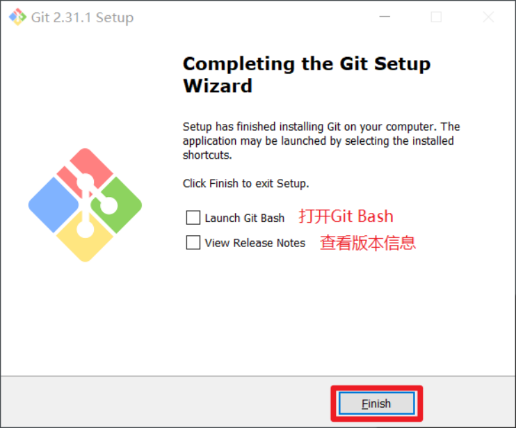
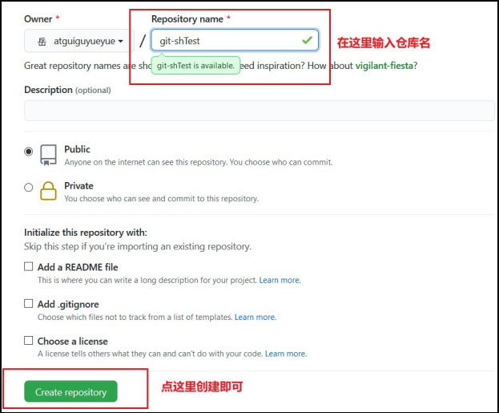

# Git 安装

官网地址： https://git-scm.com/

查看GNU 协议，可以直接点击下一步。

 

选择Git 安装位置，要求是非中文并且没有空格的目录，然后下一步。

 

Git 选项配置，推荐默认设置，然后下一步。


Git 安装目录名，不用修改，直接点击下一步。

 


Git 的默认编辑器，建议使用默认的 Vim 编辑器，然后点击下一步。


默认分支名设置，选择让Git 决定，分支名默认为 master，下一步。

 

修改Git 的环境变量，选第一个，不修改环境变量，只在Git Bash 里使用Git。

 

选择后台客户端连接协议，选默认值 OpenSSL，然后下一步。

 

配置 Git 文件的行末换行符，Windows 使用 CRLF，Linux 使用 LF，选择第一个自动转换，然后继续下一步。

 

 选择Git 终端类型，选择默认的Git Bash 终端，然后继续下一步。

 

 选择Git pull 合并的模式，选择默认，然后下一步。


 选择Git 的凭据管理器，选择默认的跨平台的凭据管理器，然后下一步。


 其他配置，选择默认设置，然后下一步。

 

 实验室功能，技术还不成熟，有已知的 bug，不要勾选，然后点击右下角的 Install按钮，开始安装Git。


点击 Finsh 按钮，Git 安装成功！

 

右键任意位置，在右键菜单里选择Git Bash Here 即可打开 Git Bash 命令行终端。


在 Git Bash 终端里输入 git --version 查看 git 版本，如图所示，说明Git 安装成功。

 

# Git常用命令

| 命令名称                             | 作用           |
| ------------------------------------ | -------------- |
| git config --global user.name 用户名 | 设置用户签名   |
| git config --global user.email 邮箱  | 设置用户签名   |
| git init                             | 初始化本地库   |
| git status                           | 查看本地库状态 |
| git add 文件名                       | 添加到暂存区   |
| git commit -m "日志信息" 文件名      | 提交到本地库   |
| git reflog                           | 查看历史记录   |
| git reset --hard 版本号              | 版本穿梭       |

## 1设置用户签名

1）基本语法

git config --global user.name 用户名git config --global user.email 邮箱

2）案例实操


说明：

​	签名的作用是区分不同操作者身份。用户的签名信息在每一个版本的提交信息中能够看到，以此确认本次提交是谁做的。Git 首次安装必须设置一下用户签名，否则无法提交代码。

※注意：这里设置用户签名和将来登录 GitHub（或其他代码托管中心）的账号没有任何关系。

## 2初始化本地库

1）基本语法

​	git	init 

2）案例实操


3）结果查看

  

## 3查看本地库状态

1）基本语法

git status 

2）案例实操
首次查看（工作区没有任何文件）

 

## 4添加暂存区

3.4.1将工作区的文件添加到暂存区

1）基本语法

git add 文件名

git add 文件夹/    添加整个文件夹及内容

git add doc.md user/profile.txt    将多个文件到暂存区 

git add *.文件类型   添加目录中所有此文件类型的文件

git add -A, --all 添加所有跟踪和未跟踪文件的更改 (add changes from all tracked and untracked files)

git add -u, --update 只更新已被跟踪文件

2）案例实操


3.4.2查看状态（检测到暂存区有新文件）


3.4.3将暂存区的文件删除

git rm --cached 文件名

## 5提交本地库

3.5.1将暂存区的文件提交到本地库

1）基本语法

git commit -m "日志信息" 文件名

2）案例实操


3.5.2查看状态（没有文件需要提交）


## 6历史版本

3.6.1 查看历史版本

1）基本语法

git reflog	查看版本信息

git log	查看版本详细信息

2）案例实操


3.6.2版本穿梭

1）基本语法

git reset --hard 版本号

2）案例实操


Git 切换版本，底层其实是移动的 HEAD 指针，具体原理如下图所示。


# 分支

## 分支的好处

​	在版本控制过程中，同时推进多个任务，为每个任务，我们就可以创建每个任务的单独分支。使用分支意味着程序员可以把自己的工作从开发主线上分离开来，开发自己分支的时候，不会影响主线分支的运行。

​	同时并行推进多个功能开发，提高开发效率。

​	各个分支在开发过程中，如果某一个分支开发失败，不会对其他分支有任何影响。失败的分支删除重新开始即可。


## 分支的操作

| 命令名称            | 作用                         |
| ------------------- | ---------------------------- |
| git branch 分支名   | 创建分支                     |
| git branch -v       | 查看分支                     |
| git checkout 分支名 | 切换分支                     |
| git merge 分支名    | 把指定的分支合并到当前分支上 |

### 4.3.1查看分支

1）基本语法

git branch -v 

2）案例实操


### 4.3.2创建分支

1）基本语法

git branch 分支名

2）案例实操


### 4.3.3切换分支

1）基本语法

git checkout 分支名

2）案例实操


### 4.3.4合并分支

1）基本语法

git merge 分支名

案例实操 在 master 分支上合并 hot-fix 分支

  

### 4.3.5合并产生冲突

冲突产生的表现：

​	后面状态为 MERGING

​	Layne@LAPTOP-Layne MINGW64 /d/Git-Space/SH0720 (master|MERGING)

冲突产生的原因：

​	合并分支时，两个分支在同一个文件的同一个位置有两套完全不同的修改。Git 无法替我们决定使用哪一个。必须人为决定新代码内容。

解决冲突

1）修改有冲突的文件，删除特殊符号，决定要使用的内容。

特殊符号：

```
<<<<<<< HEAD 
当前分支的代码 
=======	
合并过来的代码 
>>>>>>> hot-fix
```

2）添加到暂存区

3）执行提交（注意：此时使用 git commit 命令时不能带文件名）


# GitHub 操作

GitHub 网址：https://github.com/

## 创建远程仓库




## 远程仓库操作

| 命令名称                           | 作用                                                     |
| ---------------------------------- | -------------------------------------------------------- |
| git remote -v                      | 查看当前所有远程地址别名                                 |
| git remote add 别名 远程地址       | 起别名                                                   |
| git push 别名 分支                 | 推送本地分支上的内容到远程仓库                           |
| git clone 远程地址                 | 将远程仓库的内容克隆到本地                               |
| git pull 远程库地址别名 远程分支名 | 将远程仓库对于分支最新内容拉下来后与当前本地分支直接合并 |

###  创建远程仓库别名

1）基本语法

git remote -v 查看当前所有远程地址别名

git    remote    add     别名 远程地址

2）案例实操


### 推送本地分支到远程仓库

1）基本语法

git push 别名 分支

2）案例实操


### 拉取远程库内容

1）基本语法

git pull 远程库地址别名 远程分支名

2）案例实操


### 克隆远程仓库到本地

1）基本语法

​	git clone 远程地址

2）案例实操


小结：clone 会做如下操作。1、拉取代码。2、初始化本地仓库。3、创建默认别名origin
