JavaSE学习笔记

# JAVA基础

## 1、变量

### 1.1变量的概念：

在程序运行过程中，其值可以发生改变的量，变量相当于内存中一个数据储存空间的表示。

变量的三要素：变量=变量名+值+数据类型 

变量的定义格式：

```javascript
数据类型 变量名 = 初始化值; // 声明变量并赋值 
int age = 18; 
System.out.println(age);
```

变量必须先声明后使用，在同一个作用域不能重名，该区域的数据/值可以在同一类型范围内不断变化。

### 1.2数据类型

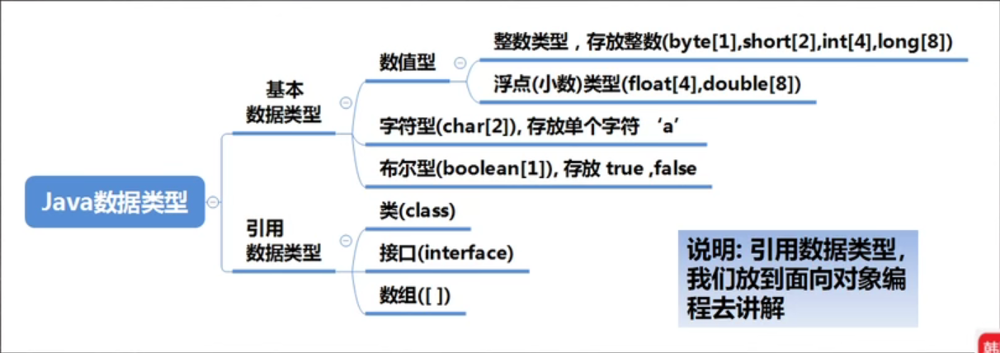

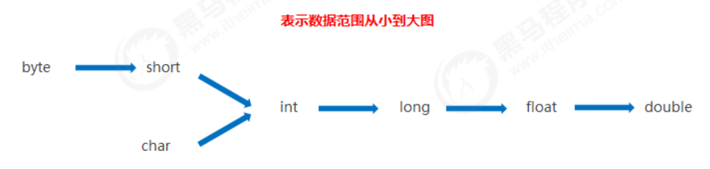

#### 整型的使用细节：

1）各个整数类型有固定的范围和字段长度，不受具体操作系统影响，以保证程序的可移植性。

2）整型常量默认为int型，声明long型变量需要在后面加 ‘l’ 或者 'L' ，程序中常量常声明为int型，除非不足以表示，才使用long。

3）bit是计算机中的最小储存单位。byte（-128~127）是计算机中的基本储存单位，1 byte=8 bit

#### 浮点类型的使用细节：

1）与整数类型相似，浮点数也有固定的范围和字段长度，不受具体操作系统影响，以保证程序的可移植性。

2）浮点型常量默认值为double型，声明float型变量需要在后面加 ‘f’ 或者 'F'.

3)  浮点型常量 有两种表示形式：

十进制数形式：如512	512.0f	.512(必须有小数点)

科学计数法形式：如5.12e2(5.12*10的2次方)		5.12E-2（5.12/10的2次方）

4）通常情况下，应该使用double型，因为double比float更精准。

5）浮点数陷阱：2.7!=8.1/3 

```java
double num1 = 2.7;
double num2 = 8.1/3;
Sysytem.out.println(num1);//2.7
Sysytem.out.println(num2);//接近于2.7的一个小数，而不是2.7
//当我们对运算结果是小数的进行相等判断时，应该以两个数差值的绝对值是否在某个精度中来判断。
(Math.abs(num1-num2)<0.000001）
```

#### 字符型使用细节：

1)字符型是是用单引号 '' 括起来的某个字符。如 char c1='a'; char c2='7';

2)char 的本质是一个整数，输出该整数在unicode表中对应的字符。char类型可以进行运算。

3）字符型存储时，需要先将字符对应的码值（整数）找出来：

存储：'a'  ==>  码值97	==> 二进制	==>存储

读取：二进制  ==>  码值97	==> 'a'	==>显示

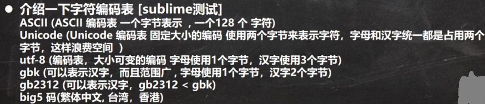

#### 布尔类型

1）布尔类型只能取值true或者false，占一个字节

2）适用于逻辑运算，一般用于流程控制：if	while	do-while	for循环语句

### 1.3类型转换

#### 自动类型转换：

1. 整数默认是int类型，byte、short和char类型数据之间不会相互转换，参与运算时均会自动转换为int类型。boolean不参与基本数据类型相互转换。
2. 多种类型混合运算时，会将所有数据转换成容量最大的数据类型，然后计算。
3. 将精度（容量）较小的数据类型赋值给精度（容量）较大的数据类型时，会发生自动类型转换，反之则报错，需要强制类型转换。

#### 强制类型转换

1. 强转符号只针对于最近的操作数有效，往往需要（）提升优先级：

   ```java
   int x = (int)(10*2.3+1.3*4);
   ```

2. char类型保存的是int的常量值，但不能保存int的变量值，需要强制转换

   ```java
   int m=100;
   char c1 = 100;
   char c2 = (char)m;
   ```

#### 基本数据类型和String数据类型的转换

将String类型转成j基本数据类型时，要确保String类型能转成有效的数据。比如把"123"转成123。

```javascript
//String-> int
String str = "123";
int n1 = Integer.parseInt(str);
//int->String
int n1=1234;
String str =Integer.toString(n1);   
```

## 2、运算符

### 2.1算术运算符

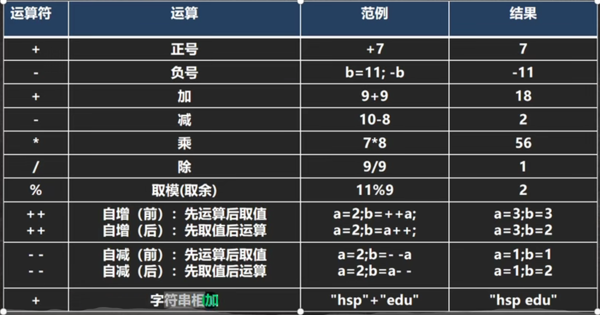

### 2.2关系运算符（比较运算符）

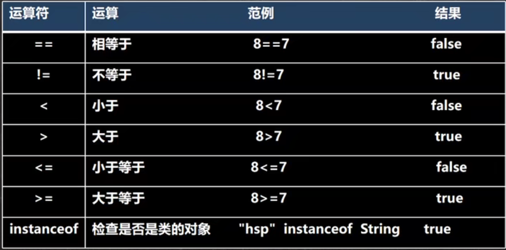

### 2.3逻辑运算符

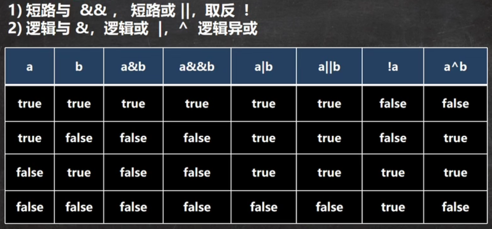

### 2.4赋值运算符

分类：

```java
基本赋值运算符： =
复合赋值运算符：+=	-=	*=	/=	%=	
```

特点：

1）运算顺序从右往左

2）赋值运算符的左边只能是变量，右边可以是变量，表达式，常量值。

3）复合赋值运算符a+=3等价于a=a+3，会进行类型转换。

### 2.5三元运算符

基本语法：条件表达式？表达式1：表达式2；

如果条件表达式为真，则执行表达式1输出结果；如果条件表达式为假，则执行表达式2输出结果；

表达式1和2需要是可以赋给结果接受变量的类型（或可以自动转换）

三元运算符是一个整体，输出结果的数据类型 为所有表达式中容量最大的数据类型。

### 2.6运算符优先级

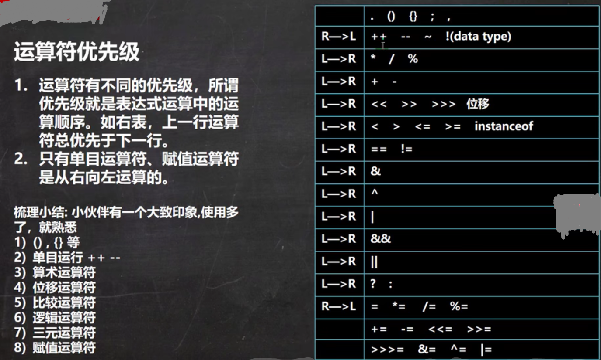

### 2.7关键字保留字

关键字定义：被Java语言赋予了特殊含义，用作专门用途的字符串。public 	int	if

保留字定义：现有Java版本尚未使用，但以后版本可能会作为关键字使用。byValue	cast

### 2.8标识符

#### 1）概念：

对各种变量、方法、类等命名时使用的字符序列称为标识符。

#### 2）命名规则：

1. 由26个英文字母大小写、0-9、_或$组成，不能包含空格。
2. 数字不可以开头，字母严格区别大小写，长度无限制。
3. 不可以单独使用关键字和保留字，但可以包含。

#### 3）命名规范：

1. 包名：多单词组成时所有字母小写：com.aaa.bbb
2. 类名，接口名：多单词组成时所有单词首字母大写：XxxYyCcc
3. 变量名、方法名：多单词组成时第一个单词首字母小写，后面每个单词首字母大写：xxxYyyCc
4. 常量名：所有字母大写。多单词组成时每个单词用下划线连接：XXX_YYY_ZZZ

### 2.9进制

1. 二进制：0，1，满2进1，以0b或0B开头
2. 八进制：0~7，满8进1，以0开头
3. 十进制：0~9，满10进1
4. 十六进制：0 ~ 9，A ~ F（10~15），满16进1，以0x或0X开头

### 2.10进制转换

#### 1.二进制，八进制，十六进制转十进制

从最低位（最右位）开始，每个位子上的数乘以2的（位数减1次方），求和

ob1011 = 1 * 2（1-1次方） + 1*2(2-1次方) + 0 *2（3-1次方）+1 *2（4-1次方）=1+1+0+8=16

0234 = 4*8的0次方 + 3 *8的1次方 + 2 *8的2次方 +1 *8的3次方=4+24+128=156

0x23A = 10 *16的0次方+3 *16的1次方+2 *16的2次方=10+48+512=570

```java
int n1=0b1011;
int n2=0234;
int n3=0x23A;
System.out.println(n1);
```

#### 2.十进制转二进制，八进制，十六进制

将十进制数不断除以2，8，16。将最后的商加上每一次除法得到的余数从下往上排列。

34/2=17...0	17/2=8...1	8/2=4...0	4/2=2..0	2/2=1...0

34=0b100010		131=0203	 	237=0xED

#### 3.二进制转八进制，十六进制

从最低位开始，二进制数每三位一组转成对应的八进制数

0b11010101=0 	11（3）	010（2）	101（5）=0325

从最低位开始，二进制数每四位一组转成对应的十六进制数

0b11010101=0x	1101(D)	0101(5)=0xD5

#### 4.八进制，十六进制转二进制

将八进制每一位转成对应的3位二进制数

0237=0b	2(010)	3(011)	7(111)=0b010011111

将十六进制每一位转成对应的4位二进制数

0x23B=0b	2(0010)	3(0011)	B（1011）=ob001000111011

### 2.11原码，反码，补码

1. 二进制的最高位为符号位：0表示正数，1表示负数。
2. 正数的原码、反码、补码都是其本身（三码合一），0的反码和补码都为0
3. 负数的反码=原码符号位不变，其他位取反。0换1，1换0。
4. 负数的补码=反码+1；负数的反码=补码-1
5. java中没有无符号数，计算机运算时都是以补码的形式运算的
6. 我们查看结果时需要查看的是结果的原码

### 2.12位运算

位运算符：

​	按位与&：两位全为1，结果为1，否则为0

​	按位或 | ：两位有一位为1，结果为1，否则为0

​	按位异或^：一位为1另一位为0，结果为1，否则为0

​	按位取反~：0变1，1变0

先取位运算数的补码，再进行位运算得到结果的补码，最后取结果的原码。

## 3、控制结构

### 3.1顺序控制


程序从上到下逐行的执行，中间没有任何判断和跳转。

### 3.2分支控制

if-else：

1. 单分支

   if(条件表达式)｛执行代码块；｝

2. 双分支

   if(条件表达式)｛执行代码块1；｝else{执行代码块2；}

3. 多分支

   if(条件表达式)｛执行代码块1；｝else{执行代码块2；}else{执行代码块3；}

4. 嵌套分支

   在一个分支结构中又完整的嵌套了另一个完整的分支结构，里面的分支结构称为内层分支，外面的分支称为外层分支（最好不要操作三层，可读性低）

   if(){

   ​	if(){

   ​		}else{} 	}

### 3.3循环控制

#### 	switch循环控制：

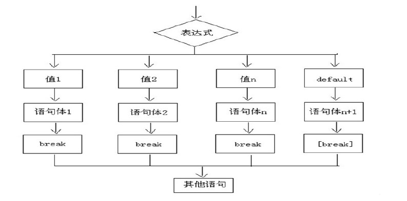

1. 表达式数据类型switch（a）应该和case的值一致，或者可以自动转换成可以相互比较的类型，如char和int
2. case 子句中的值必须是常量。
3. case中表达式得值必须是byte、short、int、char、String、enum
4. default语句可选，没有匹配的case语句才会执行default。
5. break语句用于在执行一个case分支后使程序跳出Switch结构，没有break，程序会顺序执行到switch结尾。

#### for循环控制：


四要素：循环判断条件、循环变量初始化、循环变量迭代、循环体

1. 循环条件是返回一个布尔值的表达式
2. for（；循环判断条件；）中的初始化和变量迭代可以写到其他位置，但分号不可省略。
3. 循环初始值和变量迭代可以有多条语句，但要求类型一致且中间用逗号隔开

#### while循环控制

与for循环一样也有四要素但位置与for循环不同。


#### do-while循环控制:

1. 与for循环一样也有四要素但位置与for循环不同。
2. 先执行后判断，一定会执行一次循环操作

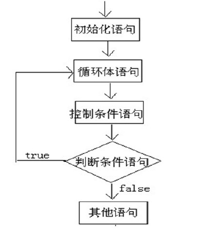

### 3.4多重循环控制

1. 将一个循环体放在另一个循环体内，形成嵌套循环。for，while，do-while都可以作为外层循环和内层循环。

   建议只使用两层，否则代码可读性很差。

2. 嵌套循环就是将内层循环作为外层循环的循环体，只有当内层循环的循环条件为false才会完全跳出内层循环，结束外层循环的当前一次循环，开始下一次的循环。

### 3.5跳转控制语句

break：

1. break语句用于终止某个语句块的执行，一般使用在switch或者循环中。
2. break语句出现在多层嵌套的语句块中，可以通过标签指明终止哪一层语句块，指定到那个标签，就退出到哪里，但在实际开发中尽量不要使用标签。
3. 如果没有指定break，则默认退出最近的循环体。

continue：

1. continue语句用于结束本次循环，继续执行下一次循环。
2. continue语句出现在多层嵌套的语句块中，可以通过标签指明跳过哪一层循环，指定到那个标签，就跳出到哪里，但在实际开发中尽量不要使用标签。

return

使用在方法中，表示跳出所在的方法，return在main方法中表示退出程序。

## 4、数组、排序、查找

### 4.1数组

#### 1.注意事项：

1. 数组是多个相同类型数据的组合，实现对这些数据的统一管理。
2. 数组中的元素可以是任何数据类型，包括基本类型和引用类型，但是不能混用。
3. 数组创建后如果没有赋值，根据数组类型有默认值。
4. 数组的下标从0开始，下标必须在指定范围内使用，否则造成下标越界异常
5. 数组属于引用类型，数组型类型本质为对象object。

#### 2.数组拷贝：

```java
int[] arr1 = {10,20,30};
int[] arr2 =new int[arr1.length];
for(i=0;i<arr2.length;i++){
    arr2[i]=arr1[i];
}
arr2[0]=100;
```

#### 3.数组翻转：

```java
int[] arr={11,22,33,44,55};
int[] arr2=new int[arr.length];
for (int i = arr.length-1,j=0; i>=0; i--,j++) {
     arr2[j]=arr[i];
}
arr=arr2;
```

#### 4.数组扩容：

```java
        Scanner sc=new Scanner(System.in);
        int[] arr={11,22,33,44,55};
        do{
            int[] arrNew=new int[arr.length+1];
            for (int i = 0; i < arr.length; i++) {
                arrNew[i]=arr[i];
            }
            System.out.println("输入扩容的元素");
            arrNew[arr.length]=sc.nextInt();
            arr=arrNew;
            System.out.println("选择是否继续添加y/n");
            char c = sc.next().charAt(0);
            if(c=='y'){
                break;
            }
        }while (true);
```

#### 5.数组缩减：

```java
        Scanner sc=new Scanner(System.in);
        int[] arr={11,22,33,44,55};
        do{
            int[] arrNew=new int[arr.length-1];
            for (int i = 0; i < arrNew.length; i++) {
                arrNew[i]=arr[i];
            }
            arr=arrNew;
            System.out.println("选择是否继续删减y/n");
            char c = sc.next().charAt(0);
            if(c=='y'){
                break;
            }
        }while (true);
```

### 4.2排序

#### 1.内部排序：

将需要处理的所有数据加载到内部储存器中进行排序。有交换式排序法、选择式排序法、插入式排序法。

#### 2.外部排序：

数据量过大无法全部加载到内存中时，需要借助外部储存进行排序。包括合并排序法，直接合并排序法。

#### 3.冒泡排序（Bubble Sorting）：

基本思想：

​	通过对待排序序列从后往前，即下标较大的元素开始，依次比较相邻元素的值，若发现逆序则交换，使值较大的元素逐渐从前向后移动，就像水底下的气泡一样逐渐向上冒。

```java
        int arr[] ={42,35,24,68,60,97};
        int temp=0;
        for (int i = 0; i < arr.length-1; i++) {
            for (int j = 0; j < arr.length-1-i; j++) {
                if(arr[j]>arr[j+1]){
                    temp=arr[j];
                    arr[j]=arr[j+1];
                    arr[j+1]=temp;
                }
            }
        }
```

### 4.3.顺序查找

```java
        String arr[]={"一","二","三","四","五"};
        Scanner myScanner = new Scanner(System.in);
        String name = myScanner.next();
        int index=-1;
        for (int i = 0; i < arr.length; i++) {
            if(arr[i].equals(name)){
                index=i;
                System.out.println("找到了，下标为"+index);
                break;
            }

        }
        if(index==-1){
            System.out.println("没找到");
        }
```

### 4.4二维数组

1.二维数组的声明方式：

```
int[][] y ; 	int[] y[];	int y[][];
```

2.二维数组实际上是多个一维数组组成。每个一维数组的长度可以不同，称为l列数不等的二维数组。

# IntelliJ IDEA 常用快捷键列表及技巧大全

## 1、IntelliJ Idea 常用快捷键列表

Alt+回车 导入包,自动修正

Ctrl+N  查找类

Ctrl+Shift+N 查找文件

Ctrl+Alt+L 格式化代码

Ctrl+Alt+O 优化导入的类和包

Alt+Insert 生成代码(如get,set方法,构造函数等)

Ctrl+E或者Alt+Shift+C 最近更改的代码

Ctrl+R 替换文本

Ctrl+F 查找文本

Ctrl+Shift+Space 自动补全代码

Ctrl+空格 代码提示

Ctrl+Alt+Space 类名或接口名提示

Ctrl+P 方法参数提示

Ctrl+Shift+Alt+N 查找类中的方法或变量

Alt+Shift+C 对比最近修改的代码

Shift+F6 重构-重命名

Ctrl+Shift+先上键

Ctrl+X 删除行

Ctrl+D 复制行

Ctrl+/ 或 Ctrl+Shift+/ 注释（// 或者/*...*/ ）

Ctrl+J 自动代码

Ctrl+E 最近打开的文件

Ctrl+H 显示类结构图

Ctrl+Q 显示注释文档

Alt+F1 查找代码所在位置

Alt+1 快速打开或隐藏工程面板

Ctrl+Alt+ left/right 返回至上次浏览的位置

Alt+ left/right 切换代码视图

Alt+ Up/Down 在方法间快速移动定位

Ctrl+Shift+Up/Down 代码向上/下移动。

F2 或Shift+F2 高亮错误或警告快速定位

代码标签输入完成后，按Tab，生成代码。

选中文本，按Ctrl+Shift+F7 ，高亮显示所有该文本，按Esc高亮消失。

Ctrl+W 选中代码，连续按会有其他效果

选中文本，按Alt+F3 ，逐个往下查找相同文本，并高亮显示。

Ctrl+Up/Down 光标跳转到第一行或最后一行下

Ctrl+B 快速打开光标处的类或方法

## 2、最常用快捷键

1.Ctrl＋E，可以显示最近编辑的文件列表

2.Shift＋Click可以关闭文件

3.Ctrl＋[或]可以跳到大括号的开头结尾

4.Ctrl＋Shift＋Backspace可以跳转到上次编辑的地方

5.Ctrl＋F12，可以显示当前文件的结构

6.Ctrl＋F7可以查询当前元素在当前文件中的引用，然后按F3可以选择

7.Ctrl＋N，可以快速打开类

8.Ctrl＋Shift＋N，可以快速打开文件

9.Alt＋Q可以看到当前方法的声明

10.Ctrl＋W可以选择单词继而语句继而行继而函数

11.Alt＋F1可以将正在编辑的元素在各个面板中定位

12.Ctrl＋P，可以显示参数信息

13.Ctrl＋Shift＋Insert可以选择剪贴板内容并插入

14.Alt＋Insert可以生成构造器/Getter/Setter等

15.Ctrl＋Alt＋V 可以引入变量。例如把括号内的SQL赋成一个变量

16.Ctrl＋Alt＋T可以把代码包在一块内，例如try/catch

17.Alt＋Up and Alt＋Down可在方法间快速移动

下面的不是很有用

18.在一些地方按Alt＋Enter可以得到一些Intention Action，例如将”==”改为”equals()”

19.Ctrl＋Shift＋Alt＋N可以快速打开符号

20.Ctrl＋Shift＋Space在很多时候都能够给出Smart提示

21.Alt＋F3可以快速寻找

22.Ctrl＋/和Ctrl＋Shift＋/可以注释代码

23.Ctrl＋Alt＋B可以跳转到抽象方法的实现

24.Ctrl＋O可以选择父类的方法进行重写

25.Ctrl＋Q可以看JavaDoc

26.Ctrl＋Alt＋Space是类名自动完成

27.快速打开类/文件/符号时，可以使用通配符，也可以使用缩写

28.Live Templates! Ctrl＋J

29.Ctrl＋Shift＋F7可以高亮当前元素在当前文件中的使用

30.Ctrl＋Alt＋Up /Ctrl＋Alt＋Down可以快速跳转搜索结果

31.Ctrl＋Shift＋J可以整合两行

32.Alt＋F8是计算变量值

## 3、IntelliJ IDEA使用技巧一览表

在使用 InelliJ IDEA 的过程中，通过查找资料以及一些自己的摸索，发现这个众多 Java 程序员喜欢的 IDE

里有许多值得一提的小窍门，如果能熟练的将它们应用于实际开发过程中，相信它会大大节省你的开发时间，而且随之而来的还会有那么一点点成就感：）

1 、写代码时用 Alt-Insert （ Code|Generate… ）可以创建类里面任何字段的 getter 与 setter 方法。

2 、右键点击断点标记（在文本的左边栏里）激活速查菜单，你可以快速设置 enable/disable 断点或者条件它的属性。

3 、 CodeCompletion （代码完成）属性里的一个特殊的变量是，激活 Ctrl-Alt-Space 可以完成在或不在当前文件里的类名。如果类没有引入则 import 标志会自动创建。

4 、使用 Ctrl-Shift-V 快捷键可以将最近使用的剪贴板内容选择插入到文本。使用时系统会弹出一个含有剪贴内容的对话框，从中你可以选择你要粘贴的部分。

5 、利用 CodeCompletion （代码完成）属性可以快速地在代码中完成各种不同地语句，方法是先键入一个类名地前几个字母然后再用 Ctrl-Space 完成全称。如果有多个选项，它们会列在速查列表里。

6 、用 Ctrl-/ 与 Ctrl-Shift-/ 来注释 / 反注释代码行与代码块。

-/ 用单行注释标记（“ //… ”）来注释 / 反注释当前行或者选择地代码块。而 Ctrl-Shift-/ 则可以用块注释标记（“ /*…*/ ”）把所选块包围起来。要反注释一个代码块就在块中任何一个地方按 Ctrl-Shift-/ 即可。

7 、按 Alt-Q （ View|Context Info ）可以不需要移动代码就能查看当前方法地声明。连续按两次会显示当前所编辑的类名。

8 、使用 Refactor|Copy Class… 可以创建一个所选择的类的“副本”。这一点很有用，比如，在你想要创建一个大部分内容都和已存在类相同的类时。

9 、在编辑器里 Ctrl-D 可以复制选择的块或者没有所选块是的当前行。

10 、 Ctrl-W （选择字）在编辑器里的功能是先选择脱字符处的单词，然后选择源代码的扩展区域。举例来说，先选择一个方法名，然后是调用这个方法的表达式，然后是整个语句，然后包容块，等等。

11 、如果你不想让指示事件细节的“亮球”图标在编辑器上显示，通过按 Alt-Enter 组合键打开所有事件列表然后用鼠标点击它就可以把这个事件文本附件的亮球置成非活动状态。

这样以后就不会有指示特殊事件的亮球出现了，但是你仍然可以用 Alt-Enter 快捷键使用它。

12 、在使用 CodeCompletion 时，可以用逗点（ . ）字符，逗号（，）分号（；），空格和其它字符输入弹出列表里的当前高亮部分。选择的名字会随着输入的字符自动输入到编辑器里。

13 、在任何工具窗口里使用 Escape 键都可以把焦点移到编辑器上。

Shift-Escape 不仅可以把焦点移到编辑器上而且还可以隐藏当前（或最后活动的）工具窗口。

F12 键把焦点从编辑器移到最近使用的工具窗口。

14 、在调试程序时查看任何表达式值的一个容易的方法就是在编辑器中选择文本（可以按几次 Ctrl-W 组合键更有效地执行这个操作）然后按 Alt-F8 。

15 、要打开编辑器脱字符处使用的类或者方法 Java 文档的浏览器，就按 Shift-F1 （右键菜单的 External JavaDoc ）。

要使用这个功能须要把加入浏览器的路径，在“ General ”选项中设置（ Options | IDE Settings ），另外还要把创建的 Java 文档加入到工程中（ File | Project Properties ）。

16 、用 Ctrl-F12 （ View | File Structure Popup ）键你可以在当前编辑的文件中快速导航。

这时它会显示当前类的成员列表。选中一个要导航的元素然后按 Enter 键或 F4 键。要轻松地定位到列表中的一个条目，只需键入它的名字即可。

17 、在代码中把光标置于标记符或者它的检查点上再按 Alt-F7 （右键菜单中的 Find Usages… ）会很快地查找到在整个工程中使用地某一个类、方法或者变量的位置。

18 、按 Ctrl-N （ Go to | Class… ）再键入类的名字可以快速地在编辑器里打开任何一个类。从显示出来的下拉列表里选择类。

同样的方法你可以通过使用 Ctrl-Shift-N （ Go to | File… ）打开工程中的非 Java 文件。

19 、要导航代码中一些地方使用到的类、方法或者变量的声明，把光标放在查看项上再按 Ctrl-B 即可。也可以通过按 Ctrl 键的同时在查看点上单击鼠标键调转到声明处。

20 、把光标放到查看点上再按 Ctrl-Alt-B 可以导航到一个抽象方法的实现代码。

21 、要看一个所选择的类的继承层次，按 Ctrl-H （ Browse Type Hierarchy

）即可。也可以激活编辑器中的继承关系视图查看当前编辑类的继承关系。22 、使用 Ctrl-Shift-F7 （ Search |

Highlight Usages in File ）可以快速高亮显示当前文件中某一变量的使用地方。按 Escape 清除高亮显示。

23 、用 Alt-F3 （ Search | Incremental Search ）在编辑器中实现快速查查找功能。

在“ Search for: ”提示工具里输入字符，使用箭头键朝前和朝后搜索。按 Escape 退出。

24 、按 Ctrl-J 组合键来执行一些你记不起来的 Live Template 缩写。比如，键“ it ”然后按 Ctrl-J 看看有什么发生。

25 、 Introduce Variable 整合帮助你简化代码中复杂的声明。举个例子，在下面的代码片断里，在代码中选择一个表达式：然后按 Ctrl-Alt-V 。

26 、 Ctrl-Shift-J 快捷键把两行合成一行并把不必要的空格去掉以匹配你的代码格式。

27 、 Ctrl-Shift-Backspace （ Go to | Last Edit Location ）让你调转到代码中所做改变的最后一个地方。

多按几次 Ctrl-Shift-Backspace 查看更深的修改历史。

28 、用 Tools | Reformat Code… 根据你的代码样式参考（查看 Options | IDE Setting | Code Style ）格式化代码。

使用 Tools | Optimize Imports… 可以根据设置（查看 Options | IDE Setting | Code Style | Imports ）自动“优化” imports （清除无用的 imports 等）。

29 、使用 IDEA 的 Live Templates | Live Templates 让你在眨眼间创建许多典型代码。比如，在一个方法里键入。再按 Tab 键看有什么事情发生了。

用 Tab 键在不同的模板域内移动。查看 Options | Live Templates 获取更多的细节。

30 、要查看一个文件中修改的本地历史，激活右键菜单里的 Local VCS | Show History…

。也许你可以导航不同的文件版本，看看它们的不同之处再回滚到以前的任何一个版本吧。

使用同样的右键菜单条目还可以看到一个目录里修改的历史。有了这个特性你就不会丢失任何代码了。

31 、如果要了解主菜单里每一个条目的用途，把鼠标指针移到菜单条目上再应用程序框架的底部的状态栏里就会显示它们的一些简短描述，也许会对你有帮助。

32 、要在编辑器里显示方法间的分隔线，打开 Options | IDE Settings | Editor ，选中“ Show method separators ”检查盒（ checkbox ）。

33 、用 Alt-Up 和 Alt-Down 键可以在编辑器里不同的方法之间快速移动。

34 、用 F2/Shift-F2 键在高亮显示的语法错误间跳转。用 Ctrl-Alt-Down/Ctrl-Alt-Up 快捷键则可以在编译器错误信息或者查找操作结果间跳转。

35 、通过按 Ctrl-O （ Code | Override Methods… ）可以很容易地重载基本类地方法。要完成当前类

implements 的（或者抽象基本类的）接口的方法，就使用 Ctrl-I （ Code | Implement Methods… ）。

36 、如果光标置于一个方法调用的括号间，按 Ctrl-P 会显示一个可用参数的列表。

37 、要快速查看编辑器脱字符处使用的类或方法的 Java 文档，按 Ctrl-Q （在弹出菜单的 Show Quick JavaDoc 里）即可。

38 、像 Ctrl-Q （ Show Quick JavaDoc 显示简洁 Java 文档）， Ctrl-P （ Show

Parameter Info 显示参数信息）， Ctrl-B （ Go to Declaration 跳转到声明）， Shift-F1 （

External JavaDoc 外部 Java 文档）以及其它一些快捷键不仅可以在编辑器里使用，也可以应用在代码完成右键列表里。

39 、 Ctrl-E （ View | Recent Files ）弹出最近访问的文件右键列表。选中文件按 Enter 键打开。

40 、在 IDEA

中可以很容易地对你的类，方法以及变量进行重命名并在所有使用到它们的地方自动更正。试一下，把编辑器脱字符置于任何一个变量名字上然后按

Shift-F6 （ Refactor | Rename… ）。在对话框里键入要显示地新名字再按 Enter

。你会浏览到使用这个变量地所有地方然后按“ Do Refactor ”按钮结束重命名操作。

41 、要在任何视图（ Project View 工程视图， Structure View 结构视图或者其它视图）里快速选择当前编辑地部分（类，文件，方法或者字段），按 Alt-F1 （ View | Select in… ）。

42 、在“ new ”字符后实例化一个已知类型对象时也许你会用到 SmartType 代码完成这个特性。比如，键入再按 Ctrl-Shift-Space ：

43 、通过使用 SmartType 代码完成，在 IDEA 中创建接口的整个匿名 implementation 也是非常容易的，比如，对于一些 listener （监听器），可以键入

Component component;

component.addMouseListener(

new

);

然后再按 Ctrl-Shift-Space 看看有什么发生了。

44 、在你需要设置一个已知类型的表达式的值时用 SmartType 代码完成也很有帮助。比如，键入

String s = (

再按 Ctrl-Shift-Space 看看会有什么出现。

45 、在所有视图里都提供了速查功能：在树里只需键入字符就可以快速定位到一个条目。

46 、当你想用代码片断捕捉异常时，在编辑器里选中这个片断，按 Ctrl-Alt-T （ Code | Surround with…

）然后选择“ try/catch ”。它会自动产生代码片断中抛出的所有异常的捕捉块。在 Options | File Templates |

Code tab 中你还可以自己定制产生捕捉块的模板。 用列表中的其它项可以包围别的一些结构。

47 、在使用代码完成时，用 Tab 键可以输入弹出列表里的高亮显示部分。 不像用 Enter 键接受输入，这个选中的名字会覆盖掉脱字符右边名字的其它部分。这一点在用一个方法或者变量名替换另一个时特别有用。

48 、在声明一个变量时代码完成特性会给你显示一个建议名。比如，开始键入“ private FileOutputStream ”然后按

Ctrl-Space 在 Options | IDE Setting | Code Style

中还可以为本地变量，参数，实例及静态字段定制名字。

# 面向对象编程基础

## 5、类与对象

### 5.1类和对象的理解

客观存在的事物皆为对象，所以我们也常常说万物皆对象。

1.类的理解
类是对现实生活中一类具有共同属性和行为的事物的抽象
类是对象的数据类型，类是具有相同属性和行为的一组对象的集合，

简单理解︰类就是对现实事物的一种描述

2.类的组成
属性︰指事物的特征，例如∶手机事物（品牌，价格，尺寸).

行为︰指事物能执行的操作，例如∶手机事物（打电话，发短信)

3.类和对象的关系
o类:类是对现实生活中一类具有共同属性和行为的事物的抽象

o对象:是能够看得到摸的着的真实存在的实体
o简单理解∶类是对事物的一种描述，对象则为具体存在的事物

### 5.2属性

1. 属性的定义语法同变量：访问修饰符 属性类型 属性名；
2. 属性的定义类型可以为任意类型，包含基本类型和引用类型；
3. 属性如果不赋值，根据属性的类型有默认值。

### 5.3对象

#### 对象的分配机制：

1. 栈：一般存放基本数据类型，局部变量
2. 堆：存放对象，数组等
3. 方法区：常量池（常量），类加载信息

```
Person p1 = new Person();
p1.age=10;
p1.name="小明"；
Person p2 = p1;
```

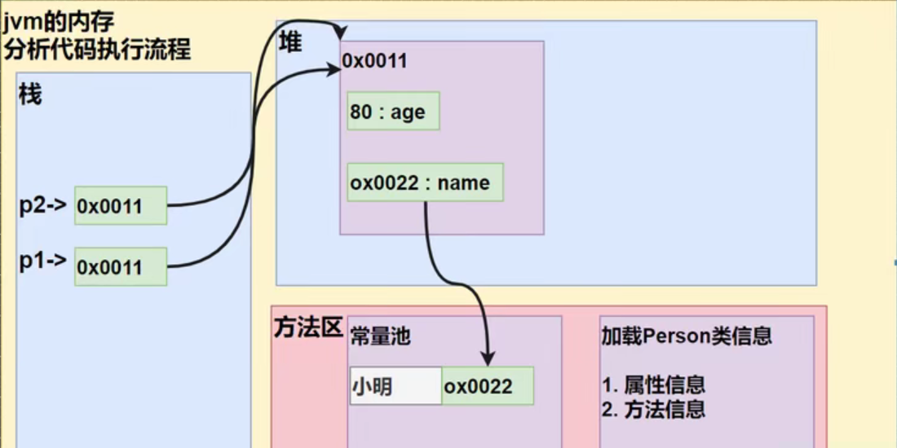

#### 对象的创建过程：

1. 方法区先加载Person类信息（属性和方法信息，只加载一次）
2. 在堆中分配空间，默认初始化属性，再进行显式的指定初始化，将值赋值给属性，最后进行构造器的初始化
3. 将对象在堆中的地址赋值给对象名p，p指向对象

### 5.4方法

#### 1.方法的注意事项：

访问修饰符：public 	protected 	默认	 private

修饰符可以用来修饰类中的属性，成员方法以及类。只有默认和public可以修饰类，并且遵从访问权限特点：

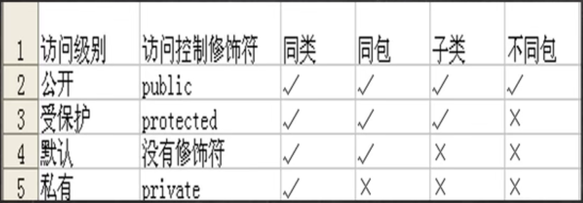

返回类型：

1. 一个方法最多只能有一个返回值。（返回多个结果可以通过返回数组的方式）
2. 返回类型可以为任意类型，包含基本类型和引用类型（数组，对象）
3. 方法要求有返回数据类型，则方法体中最后的执行语句必须是return 值；且值的类型与返回数据类型一致或兼容。
4. 方法是void方法，则方法体中可以不没有return语句或只写return。

形参列表：

1. 一个方法中可以有0~n个参数。
2. 参数类型可以为任意类型，包含基本类型和引用类型
3. 方法定义时的参数称为形式参数，简称形参；方法调用时传入的参数称为实际参数，简称实参。
4. 调用带参数的方法时，一定要对应参数列表传入相同类型或兼容类型的参数，个数和顺序必须一致

#### 2.方法调用规则：

同一个类中的方法调用，直接调用即可。跨类的方法调用需要通过对象名调用：对象名.方法名（参数）

#### 3.方法传参机制：

基本数据类型，传递的是值（值传递），形参的改变不影响实参！

引用类型传递的是地址（传递的也是值，但是值是地址）可以通过形参来影响实参！传对象也是一样。因为对象也是引用类型。

#### 4.方法递归调用：

方法自己调用自己，每次调用时传入不同的变量，有助于解决某些复杂问题。

1. 执行一个方法时，就会在栈中创建一个新的受保护的独立空间
2. 方法中的局部变量是独立的，不会相互影响
3. 如果方法中使用了引用类型变量，方法会共享改引用数据类型
4. 递归调用时，每一次的方法调用必须向退出递归的条件逼近，否则会出现无线递归。
5. 当方法执行完毕或执行到return语句，就会返回，该方法执行完毕。遵守谁调用就将结果返回给谁。

#### 5.方法重载（OverLoad）:

同一个类中，存在多个重名方法（必须相同）但形参列表不同（个数或顺序至少有一样不同，参数名无要求）。

#### 6.可变参数：

将同一个类中多个同名同功能但参数个数不同的方法，封装成一个方法。

基本语法：访问修饰符 返回类型 方法名（数据类型 形参名1，数据类型 形参名2，数据类型... 形参名）｛｝

1. 可变参数的实参可以为0~n个，可以为数组
2. 可变参数的本质就是数组
3. 可变参数可以和普通类型参数一起放在参数列表，但必须保证可变参数在最后且只有一个。

### 5.5作用域

java编程中，主要的变量就是成员变量（属性）和局部变量。

属性和局部变量可以重名，访问时遵循就近原则；同一个作用域中，局部变量不能重名

#### 全局变量：

1. 也就是属性，作用域为整个类体，可以被本类或者其他类调用；
2. 可以不赋值，有默认值；可以加修饰符；
3. 生命周期较长，伴随对象的创建而创建，对象的死亡而死亡；

#### 局部变量：

1. 除了属性之外的变量，一般指成员方法中定义的变量，作用域为定义它的代码块，只能在本类中的对应方法使用；
2. 无默认值，必须赋值后才能使用；不可以加修饰符；
3. 生命周期较断，伴随着调用它的代码块的执行而创建，代码块的结束而死亡，即在一次方法的调用过程中

### 5.6构造方法（构造器）

1. 一个类可以定义多个构造器，即构造器重载。

2. 构造器名要与类名相同，构造器没有返回值。

3. 构造器的实质是完成对象的初始化，并不是创建对象。

4. 创建对象时，系统会自动调用该类的构造方法。

5. 如果没有定义构造方法，系统有一个默认的无参构造方法，一定定义了构造方法，默认的构造器就被覆盖，

   如果想调用无参构造器可以显式的定义后再调用

### 5.7this关键字

1. this关键字可以用来访问本类的属性、方法、构造器
2. this可以用来区分当前类的全局变量（属性）和局部变量
3. 访问成员方法：this.方法名（参数列表）；访问构造器：this（参数列表）（只能在构造器中使用访问另一个构造器，必须放在第一条语句）
4. this只能在类定义的方法中使用，不能在类定义的外部使用。

# 面向对象编程中级

三大特点：封装，继承，多态

## 1、封装

### 1.定义

封装encapsulation就是把抽象出来的数据【属性】和对数据的操作【方法】封装在一起，数据被保护在内部，

程序的其他部分只有通过被授权的操作【方法】，才能对数据进行操作。

### 2.优点

通过方法来控制成员变量的操作，提高了代码的安全性 把代码用方法进行封装，提高了代码的复用性。

### 3.原则 

将类的某些信息隐藏在类内部，不允许外部程序直接访问，而是通过该类提供的方法来实现对隐藏

信息的操作和访问 成员变量private，提供对应的getXxx()/setXxx()方法

### 4.步骤

1. 将属性进行私有化private【不能直接修改属性】
2. 提供一个公共的（public）set方法，用于对属性的判断并赋值，加入数据验证的逻辑
3. 提供一个公共的（public）get方法，用于获取属性的值，加入权限判断的逻辑

## 2、继承

### 1.继承的概念 

#### 1.概念：

继承是面向对象三大特征之一，可以使得子类具有父类的属性和方法，还可以在子类中重新定义，以及 

追加属性和方法。

#### 2.定义格式：

继承通过extends实现 ，实现继承的格式 ：class 子类 extends 父类 { } 		举例：class Dog extends Animal { }

#### 3.应用场景： 

使用继承，需要考虑类与类之间是否存在is..a的关系，不能盲目使用继承 。

is..a的关系：谁是谁的一种，例如：老师和学生是人的一种，那人就是父类，学生和老师就是子类 

#### 4.继承的好处与弊端：

好处：

1. 继承可以让类与类之间产生关系，子父类关系，产生子父类后，子类则可以使用父类中非私有的成员。
2. 提高了代码的复用性(多个类相同的成员可以放到同一个类中) 
3. 提高了代码的维护性(如果方法的代码需要修改，修改一处即可)

弊端：

继承让类与类之间产生了关系，类的耦合性增强了，当父类发生变化时子类实现也不得不跟着变化，削 

弱了子类的独立性

#### 5.继承原理图：

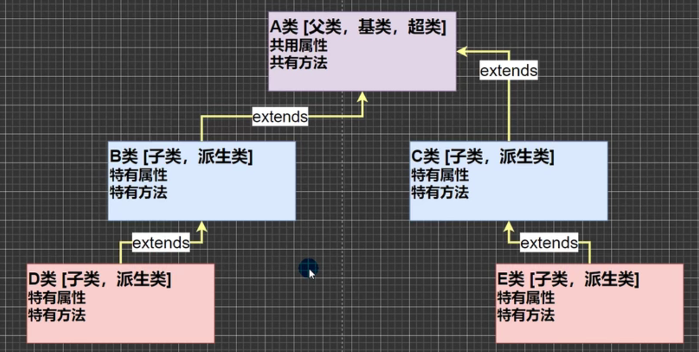

### 2.继承的细节

1. 子类继承了父类所有的属性与方法，非私有的属性和方法可以在子类直接访问，但是私有（private）属性和方法不能在子类直接访问，要通过父类提供公共（public）的方法去访问。
2. 子类必须调用父类的构造器，完成父类的初始化。
3. 当创建子类对象时，不管使用子类的哪一个构造器，都会默认调用父类的无参构造器，如果父类没有提供无参构造器，则必须在子类构造器中使用super关键字去指定调用父类的某个构造器完成对父类的初始化，否则无法通过编译
4. 如果希望调用父类的某个构造器，则显式的调用：super（参数列表）
5. super（）和this（）调用构造器都只能放在构造器的第一行，因此两者不能共存一个构造器
6. java中所有类都是object类的子类
7. 父类构造器的调用不限于直接父类，会一直想追溯到object类（顶级父类）
8. 子类最多只能直接继承一个父类，即java中的单继承机制。
9. 不能滥用继承，需要考虑类与类之间是否存在is..a的关系。 

### 3.继承的内存图

```java
public class ExtendsTheory {
    public static void main(String[] args) {
        Son son = new Son();
    }
}
class GrandPa{
    String name = "大头爷爷";
    String hobby = "旅游";
}
class Father extends GrandPa{
    String name = "大头爸爸";
    int age =39;
}
class Son extends Father{
    String name = "大头儿子";
}
```

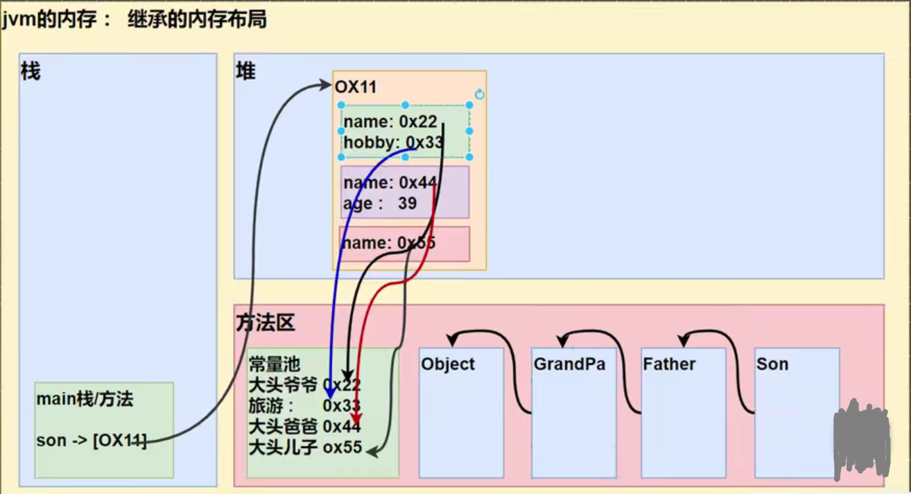

### 4.super关键字

1.调用父类构造器，分工明确，父类属性有父类构造器初始化，子类的属性由子类初始化

2.当子类中有和父类中的成员（属性和方法）重名时，为了访问父类的成员，必须通过super；如果没有重名，使用super和this或者直接访问没有区别。

#### this和super的使用区别： 

1. 成员变量： this.成员变量 - 访问本类成员变量 ；super.成员变量 - 访问父类成员变量 
2. 成员方法： his.成员方法 - 访问本类成员方法；super.成员方法 - 访问父类成员方法 
3. 构造方法： this(…) - 访问本类构造方法 ；(…) - 访问父类构造方法

### 5.方法重写/覆盖（override）

概念：

方法重写就是子类中有一个方法和父类某个方法的名称、返回类型、参数一样，

那么子类的这个方法就覆盖（重写）了父类的那个方法。

1. 子类方法的形参列表，方法名称要和父类的形参列表，方法名称完全一致。
2. 子类方法的返回类型和父类方法的返回类型一样或者子类的返回类型是父类的返回类型的子类
3. 子类方法不能缩小父类方法的访问权限。

## 3、多态

### 1.多态的概念

同一个对象，在不同时刻表现出来的不同形态。是面向对象的第三大特征，多态是建立在封装和继承基础上的。

好处：提高程序的扩展性。定义方法时候，使用父类型作为参数，在使用的时候，使用具体的子类型参与操作 

弊端：不能使用子类的特有成员 

### 2.多态的体现

方法的多态：方法重写和方法重载

对象的多态：

1. 多态的前提是：两个对象（类）存在继承关系
2. 一个对象的编译类型和运行类型可以不一致
3. 编译类型在定义对象时就确定了，不能改变；运行类型是可以改变的。
4. 编译类型看定义时，=的左边，运行类型看定义时，=的右边。

### 3.多态的向上转型

1. 本质：父类的引用指向了子类的对象

2. 语法：父类类型 引用名=new 子类类型（）；

3. 特点：编译类型看左边，运行类型看右边。

   ​		   可以调用父类中的所有成员（遵从访问权限）

   ​		   不能调用子类中的特有成员

   ​		   最终运行效果看子类的具体实现

### 4.多态的向下转型

1. 语法：子类类型 引用名=（子类类型） 父类引用；
2. 只能强转父类的引用，不能强转父类的对象
3. 要求父类的引用必须指向的是当前目标子类类型的对象
4. 向下转型后可以调用子类类型中所有的成员

### 5.多态的注意事项

1. 属性没有重写，属性的值看编译类型
2. 动态绑定机制：调用对象方法时，该方法会和对象的内存地址/运行类型绑定
3. 调用对象属性时，没有动态绑定机制，哪里声明就使用哪里的属性。

### 6.多态的应用

多态数组：数组的定义类型为父类类型，保存的实际元素类型为子类类型

多态参数：方法定义的形参类型为父类类型，实参类型允许为子类类型

## 4、object类详解

### 1.==和equals的比较

==：

1. 既可以判断基本类型，也可以判断引用类型
2. 判断基本类型，比较的是值是否相等
3. 判断引用类型，比较的是地址是否相等，即判定是不是同一个对象
4. 基本类型和引用类型，比较值是否相等

equals：

1. 是object类中的方法，只能判断引用类型。
2. 默认是判断地址是否相等，子类String、Integer等往往重写了该方法，用于判断内容是否相等。

```java
//String重写equals方法
	public boolean equals(Object anObject) {
        if (this == anObject) {
            return true;
        }
        if (anObject instanceof String) {
            String anotherString = (String)anObject;
            int n = value.length;
            if (n == anotherString.value.length) {
                char v1[] = value;
                char v2[] = anotherString.value;
                int i = 0;
                while (n-- != 0) {
                    if (v1[i] != v2[i])
                        return false;
                    i++;
                }
                return true;
            }
        }
        return false;
    }
//Integer重写equals方法
	public boolean equals(Object obj) {
        if (obj instanceof Integer) {
            return value == ((Integer)obj).intValue();
        }
        return false;
    }
//Integer.intValue
	public int intValue() {
        return value;
    }
```

### 2.hashcode方法

返回该对象的哈希码值，由Object类定义的hashCode方法针对不同的对象返回不同的整数，一般是通过将该对象的内部地址转换而来。支持此方法是为了提高哈希表的性能。

两个引用指向同一个对象则哈希值一定相同，反之不同；哈希值主要根据地址号而来但不完全等价于地址。

### 3.toString方法

默认返回：全类名+@哈希值的十六进制。

```java
	public String toString() {
        return getClass().getName() + "@" + Integer.toHexString(hashCode());
    }
```

子类往往重写toString方法用于返回对象的属性信息，直接输出一个对象时，默认调用对象的toString方法

```java
	private String cpu;
    private int memory;
    private int disk;
	@Override
    public String toString() {
        return "Computer{" +
                "cpu='" + cpu + '\'' +
                ", memory=" + memory +
                ", disk=" + disk +
                '}';
    }
```

### 4.finalize方法

1. 当对象被回收时，自动调用该对象的finalize方法，子类可以重写该方法释放部分资源。
2. 当某个对象没有任何引用时，则jvm认为该对象是一个垃圾对象，就会使用垃圾回收机制销毁该对象，销毁前会调用finalize方法。
3. 垃圾回收机制是由系统觉得，可以通过System.gc()主动出发垃圾回收机制

# 面对对象编程高级

## 1、类变量和类方法

### 1.类变量

定义

类变量（也叫静态变量/静态属性）是类中独立于方法之外的变量，用static修饰。

static表示“全局的”、“静态的”，用来修饰成员变量和成员方法，或静态代码块

类变量与实例变量（普通变量）的区别：

类变量是该类的所有对象共享的，而实例对象是每个对象独享的。

类变量可以通过 类名.类变量名访问

### 2.类方法

类方法也叫静态方法。

形式：访问修饰符 static 数据返回类型 方法名(){}

1. 类方法和普通方法都是随着类的加载而加载，将信息存储在方法区。

2. 类方法中不允许使用和对象有关的关键字this、super，普通方法隐含this参数，静态方法只能被继承，不能被重写。

3. 类方法可以通过类名或者对象名调用；普通方法和对象有关，需要通过对象名调用，不能通过类名调用。

4. 静态方法中只能访问静态变量或者静态方法；普通成员方法可以访问静态成员和非静态成员。

5. 为什么静态方法不能被重写：

   静态方法只能被继承，不能被重写，如果子类有和父类相同的静态方法，那么父类的静态方法将会被隐藏，对于子类不可见，也就是说，子类和父类中相同的静态方法是没有关系的方法，他们的行为不具有多态性。但是父类的静态方法可以通过父类.方法名调用。

   在Java中我们静态方法的的选择是编译期就选择好的，是编译器自动根据声明类型帮我们选择的，它不依赖与任何对象。

   static、final、private方法本身都是编译期绑定的（也叫前期绑定）这些方法不存在多态，他们是在还没有运行的时候，程序在编译器里面就知道该调用哪个类的哪个方法了，而其他可观察的普通方法的绑定是在运行的时候根据具体的对象决定的，因为从语义上看这些方法是可被继承的，有了多态而造成了不确定性。

## 2、main方法

main方法的形式：public static void main(String[] args) {}

1. JAVA虚拟机需要调用类的main()方法，该方法的访问权限必须是public
2. JAVA虚拟机执行main()方法时不需要创建对象，所以必须由static修饰，可以直接调用main所在类的静态成员
3. 该方法接受String类型的数组参数，该数组中保存执行java命令时传递给 所运行的类 的参数

## 3、代码块

### 1.概念

代码块又称为初始化块，属于类中的成员，将逻辑语句封装在方法体中通过{}包围。

类似于方法，但没有方法名、返回、参数，只有方法体，不用通过对象或类显式调用，而是在加载类或者创建类时被隐式的调用

### 2.语法

基本语法：[修饰符]{代码}；

1. 修饰符可选，只能填static
2. 代码块分为两类，使用static修饰的叫静态代码块，没有使用static修饰的叫非静态代码块。
3. 代码可以是任何逻辑语句， ；号可以省略。

### 3.实质

相当于另一种形式的构造器，即对构造器的补充机制，可以做初始化的操作

如果多个构造器语句重复，可以抽取到代码块中，提高代码复用性。

### 4.细节

#### 1.代码块调用：

静态代码块随着类的加载而执行，只会执行一次；每创建一次对象实例就会被隐式的调用即执行一次普通代码块。

静态代码快只能直接调用静态成员（静态属性和静态方法），普通代码块可以调用任意成员。

#### 2.类的加载：

- 创建对象实例时（new）
- 创建子类对象实例时，父类会被加载
- 使用类的静态成员（静态属性，静态方法）

#### 3.类的调用顺序：

1. 调用父类静态代码块和静态属性初始化（优先级一样，有多个静态代码块和静态属性初始化时，按定义的顺序执行）
2. 调用子类静态代码块和静态属性初始化（优先级一样，有多个静态代码块和静态属性初始化时，按定义的顺序执行）
3. 调用父类普通代码块和普通属性初始化（优先级一样，有多个普通代码块和普通属性初始化时，按定义的顺序执行）
4. 调用父类构造方法（构造器）
5. 调用子类普通代码块和普通属性初始化（优先级一样，有多个普通代码块和普通属性初始化时，按定义的顺序执行）
6. 调用子类构造方法（构造器）（构造器开头隐含了super()和调用普通代码块）

## 4、单例设计模式

单例模式，是一种常用的软件设计模式。在它的核心结构中只包含一个被称为单例的特殊类。通过单例模式可以保证系统中，应用该模式的类一个类只有一个实例。即一个类只有一个对象实例。

### 1.步骤

1. 构造器私有化，防止new
2. 在类的内部创建对象
3. 向外暴露一个静态的公共方法。

### 2.饿汉式

```java
public static void main(String[] args) {
        SingleTon02 instance = SingleTon02.getInstance();
}
class SingleTon01{
    //构造器私有
    private SingleTon01(){}
    //创建对象实例
    private static SingleTon01 instance = new SingleTon01();
    //提供一个静态方法，返回instance
    public static SingleTon01 getInstance(){
        return instance;
    }
}
```

### 3.懒汉式

```java
public static void main(String[] args) {
        SingleTon02 instance = SingleTon02.getInstance();
}
class SingleTon02{
    //构造器私有
    private SingleTon02(){}
    //提供一个静态属性，类型就是SingleTon02
    private static SingleTon02 instance ;
    //提供一个静态方法，返回instance
    public static SingleTon02 getInstance(){
        if(instance == null){
            instance=new SingleTon02();
        }
        return instance;
    }
}
```

### 4.区别

1. 最主要的区别在于创建对象的时机不同。饿汉式是在类加载时就创建了对象实例，而懒汉式是在使用时才创建。
2. 懒汉式存在线程安全问题，饿汉式不存在（多个线程同时进入判断，可能同时创建多个对象，最后只保留最先创建成功的对象）
3. 饿汉式存在浪费资源的可能，如果一个对象实例都没有使用，则创建的对象就浪费了；懒汉式是使用时才创建，就不存在这个问题。

## 5、final

#### 使用：

1. final可以修饰类、属性、方法和局部变量。不能修饰构造器
2. 当不希望类被继承时，用final修饰类
3. 当不希望父类的某个方法被子类覆盖/重写时，用final修饰方法
4. 当不希望类的某个值或局部变量值被修改，可以用final修饰属性。
5. 如果是基本数据类型的变量，则其数值一旦在初始化之后便不能更改；
    如果是引用类型的变量，则在对其初始化之后便不能再让其指向另一个对象。但是引用的值是可变的。

#### 注意事项：

1. final修饰的属性又叫做常量，在定义时必须赋初值且以后不能更改，一般用XXX_YYY_ZZZ命名

2. 赋初值时可以在定义时、构造器中、代码块中赋值；

   如果final修饰的属性是静态的，那么只能在定义时和静态代码块中赋值。

   如果final修饰的是局部变量，系统不会为局部变量进行初始化。因此使用final修饰局部变量时，即可以在定义时指定默认值，也可以不指定默认值，而在后面的代码中对final变量赋初值（仅一次赋值）

3. final类不能继承但能实例化对象

4. 不是final类但含有final对象，此方法不可重写，但类可以被继承。

5. 如果一个类已经是final类了，没有必要将方法修饰成final方法，（无法被继承即无法被重写）

6. final和static往往同时使用，效率更高，不会导致类的加载。

7. 包装类（String、Integer、Double）等都是final类

## 6、抽象类和抽象方法

### 1.定义

当父类中的一些方法不能确定方法体时，可以用abstract关键字修饰该方法，这个方法就叫抽象方法，abstract关键字修饰该类，这个类就叫抽象类。抽象类的价值在于设计，设计好之后让子类继承并实现抽象类。

抽象类： 访问修饰符 abstract class 类名｛｝

抽象方法：访问修饰符 abstract 返回类型 方法名（参数列表）；//没有方法体

### 2.注意事项

1. 抽象类不能被实例化，抽象方法不能有方法体即主体，不能被实现
2. 抽象类不一定要包含抽象方法，但类一旦包含了抽象方法就必须声明为抽象类。
3. abstract只能修饰类和方法。抽象方法不能被private（权限），final（不能继承），static修饰（前期绑定不能重写），因为这些关键字与重写相违背。
4. 抽象类的本质还是一个类，可以有任意成员（非抽象方法，构造器，静态属性等）
5. 如果一个类继承了抽象类，就必须实现该抽象类的所有抽象方法，除非子类也声明为抽象方法。

### 3.模板设计模式

定义一个操作中的算法的骨架，而将一些步骤延迟到子类中。模板方法使得子类可以不改变一个算法的结构即可重定义该算法的某些特定步骤。

```java
abstract class Template{
    public abstract void job();
    public void caleTimes(){
        long start =System.currentTimeMillis();
        job();//动态绑定机制，子类对象调用job方法调用的是运行类型即子类的job方法
        long end = System.currentTimeMillis();
        System.out.println("耗时："+(end-start));
    }
}
class Test extends Template{
    @Override
    public void job() {
        long num = 0;
        for (int i = 0; i < 1000000; i++) {
            num+=i;
        }
    }
    public static void main(String[] args) {
        Test test = new Test();
        test.caleTimes();
    }
}
```

## 7、接口

### 1.定义

接口就是一种公共的规范标准，只要符合规范标准，大家都可以通用。 Java中的接口更多的体现在对行为的抽象！

给出一些没有实现的方法，封装到一起，某个类要使用时，必须在规范标准下根据具体情况把方法实现。

接口的本质是对继承的补充。

interface 接口名 {}

class 类名 implements 接口名 {} 

### 2.注意事项

1. 接口不能被实例化，本质是一个抽象类的变体。
2. 接口中的方法默认public abstract，可以省略修饰符
3. 普通类如果要实现接口，必须将接口中的所有（默认抽象）方法都实现。抽象类实现接口，可以不用实现接口方法。
4. 一个类可以同时实现多个接口：class 类名 implements 接口名1，接口名2 {} ，且遵循上一条。
5. 接口中的属性默认是public static final，访问形式：接口名.属性名
6. 接口不能继承其他类，但能继承其他多个接口。interface 接口名 extend 接口名1，接口名2{}
7. 类和接口的修饰符只能是默认或者public

### 3.接口和继承类区别

1. 解决问题不同：

   ​	继承的价值在于解决代码的复用性和可维护性。

   ​	接口的价值在于设计，设计好各种规范方法，让其他类去实现这些方法。

2. 接口比继承更加灵活

   ​	继承是is-a关系，而接口时like-a的关系

3. 接口在一定程度上实现了代码解耦。

### 4.接口和抽象类的区别

抽象类与接口都用于抽象，但是抽象类(JAVA中)可以有自己的部分实现，而接口则完全是一个标识(同时有多重继承的功能)。
声明方法的存在而不去实现它的类被叫做抽象类（abstractclass），它用于要创建一个体现某些基本行为的类，并为该类声明方法，但不能在该类中实现该类的情况。不能创建abstract类的实例。然而可以创建一个变量，其类型是一个抽象类，并让它指向具体子类的一个实例。不能有抽象构造函数或抽象静态方法。Abstract类的子类为它们父类中的所有抽象方法提供实现，否则它们也是抽象类为。取而代之，在子类中实现该方法。知道其行为的其它类可以在类中实现这些方法；
接口（interface）是抽象类的变体。在接口中，所有方法都是抽象的。多继承性可通过实现这样的接口而获得。接口中的所有方法都是抽象的，没有一个有程序体。接口只可以定义static final成员变量。接口的实现与子类相似，除了该实现类不能从接口定义中继承行为。当类实现特殊接口时，它定义（即将程序体给予）所有这种接口的方法。然后，它可以在实现了该接口的类的任何对象上调用接口的方法。由于有抽象类，它允许使用接口名作为引用变量的类型。通常的动态联编将生效。引用可以转换到接口类型或从接口类型转换，instanceof 运算符可以用来决定某对象的类是否实现了接口。

### 5.接口的多态

1.接口的多态

多态数组、多态参数：方法定义的形参类型为接口，实参类型允许为实现了接口的类的对象。

方法多态、对象多态、向上转型、向下转型与继承类似：父类为接口，子类为实现了接口的类的对象。

2.接口的多态传递：

类实现接口1，接口1继承接口2，通过多态传递机制等价于类同时实现接口1和2。

## 8、内部类

### 1.定义

一个类的内部又完整嵌套了另一个类结构，被嵌套的类称为内部类（inner class），内部嵌套了其他类的类称为外部类(outer class)。

类的五大成员：属性，方法，构造器，代码块，内部类。

内部类的特点：最大的特点是可以直接访问私有属性，并且可以实现类与类之间的包含关系。

基本语法：

```java
class outer｛
	class inner｛
    ｝
｝	
class other｛//外部其他类
｝
```

### 2.内部类的分类

​	定义在外部类的局部位置（如方法内）：

​		1.局部内部类（有类名）

​		2.匿名内部类（无类名）

​	定义在外部类的成员位置上：

​		1.成员内部类（无static修饰）

​		2.静态内部类（static修饰）

### 3.细节

#### 1.局部内部类

1. 局部内部类是定义在外部类的局部位置，比如方法、代码块中，并且有类名

2. 作用域仅在定义他的方法或者代码块中，地位是一个局部变量，本质依然是一个类，类的相关规则都适用。不能使用访问修饰符，但能使用final。

3. 局部内部类可以直接访问外部类的所有成员包括私有；外部类访问局部内部类的成员需要先创建局部内部类的对象，再通过对象名调用成员；外部其他类不能访问局部内部类。

4. 外部类和局部内部类成员重名时，访问遵循就近原则访问局部内部类的成员，

   访问外部类成员：外部类名.this.成员（外部类名.this等于外部类对象的地址；只写一个this等于内部类的对象地址）

#### 2.匿名内部类

1. 匿名内部类是定义在外部类的局部位置，比如方法、代码块中，并且没有类名。

2. 基于接口的基本语法：接口名 对象名=new 接口名()｛接口抽象方法的实现｝；

   基于类的基本语法：类名 对象名=new 类名（参数）｛类体｝；

3. 创建了一个匿名内部类实现接口（继承类），编译类型为接口（类），运行类型为匿名内部类；底层创建了匿名内部类后，会分配类名并立即创建了匿名内部类的实例，并将地址返回给对象名，不再使用该匿名内部类。

4. 匿名内部类的定义即是一个类的定义，本身又是一个对象

   它既有定义类的特征（ 	new 类名(参数){类体}.方法	//调用匿名内部类的方法	）

   又有创建对象的特征（ 	类名 对象名=new 类名(参数){类体}；对象名.方法	//调用匿名内部类的方法 ）

5. 访问特征和局部内部类相同。

#### 3.成员内部类

1. 成员内部类是定义在外部类的成员位置，并且没有static修饰

2. 可以添加任意访问修饰符号，作用域和外部类其他成员一样为整个类体，地位是一个成员变量，本质依然是一个类，类的相关规则都适用。

3. 访问特征除了外部其他类可以访问局部内部类以外，与局部内部类相同。

   ```java
   //外部其他类访问成员内部类的两种方式
   public class Test419 {
       public static void main(String[] args) {
           Outer outer =new Outer();
           Outer.Inner inner1 = outer.new Inner();//第一种，new Inner() 当做外部类的一个成员，调用外部类属性返回给内部类实例对象
           Outer.Inner inner2 = outer.getInner();//第二种，在外部类中定义一个方法返回内部类的对象，调用外部类方法返回给内部类实例对象
   }
   class Outer{
       class Inner{}
       public Inner getInner() {
           return new Inner();
       }
   }
   ```

#### 4.静态内部类

1. 定义在外部类的成员位置，并且有static修饰

2. 可以添加任意访问修饰符号，作用域和外部类其他成员一样为整个类体，地位是一个成员变量，本质依然是一个类，类的相关规则都适用。

3. 外部类和静态内部类成员重名时，访问遵循就近原则访问静态内部类的成员，访问外部类成员：外部类名.成员

4. 可以直接访问外部类的所有静态成员，包括私有，但不能直接访问非静态成员。外部类访问静态内部类的成员需要先创建静态内部类的对象，再通过对象名调用成员。

   ```java
   //外部其他类访问静态内部类的两种方式
   public class Test419 {
       public static void main(String[] args) {
           Outer.Inner inner = new Outer.Inner();//第一种，通过类名直接访问创建内部类对象（满足权限）
           Outer.Inner inner2 = Outer.getInner2();//在外部类中定义一个静态方法返回内部类的对象。通过类名直接调用静态方法，返回内部类实例对象
           Outer outer =new Outer();
           Outer.Inner inner2 = outer.getInner();//第三种，在外部类中定义一个普通方法返回内部类的对象，通过外部类对象调用外部类方法返回给内部类实例对象
           
       }
   }
   class Outer{
       static class Inner{}
       public Inner getInner() {
           return new Inner();
       }
       public static Inner getInner2() {
           return new Inner();
       }
   }
   ```

# 枚举和注解

枚举是一组常量的集合，属于一种特殊的类，里面只包含一组有限的特定的对象。

实现枚举的方式有自定义类实现枚举，enum关键字实现枚举

## 1、自定义类实现枚举

1. 构造器私有化
2. 不提供set方法，防止属性被修改，枚举对象通常为只读
3. 在类的内部创建固定的对象，用public修饰，向外暴露对象。调用：类名.对象名
4. 枚举对象/属性使用final+static修饰，实现底层优化。
5. 枚举对象通常全部大写（常量的命名规范），根据需要可以有多个属性。

## 2、enum关键字实现枚举

### 1.enum实现：

1. 使用关键字enum替代class，创建对象必须位于类的开头
2. 对象定义语法：对象名0(参数列表)，对象名1(参数列表)，对象名2(参数列表)；属性；方法；     
3. 调用语法： 枚举类名 对象名 =   枚举类名.对象名1;
4. 修饰符默认为public final static 可省略，如果调用无参构造器，（参数列表）可省略。
5. 使用enum关键字开发一个枚举类时，默认继承了Enum类，不能再继承其他类。

### 2.Enum类常用方法：

1. toString：Enum类重写过了，返回当前对象名，子类可以重写返回该方法用于返回对象的属性信息。
2. name：返回当前对象枚举常量名称，子类不能重写。
3. ordinal：返回当前对象的编号即枚举类中创建对象的顺序，默认从0开始
4. values：返回枚举类中所有的常量
5. valueOf，将字符串转换成枚举对象，字符串必须为已有的常量名。
6. compareTo：return self.ordinal - other.ordinal，返回差值比较两个枚举常量的编号

## 3、JDK内置的基本注解类型

- 注解Annotation也被称为元数据Metadata，用于修饰包、类、方法、属性、构造器、局部变量等数据信息

和注释一样不影响程序逻辑，但注解可以被编译或者运行，相当于在代码中嵌入补充信息。

- 使用时在其前面添加@符号，把该注解当成一个修饰符使用，用于修饰它支持的程序元素。

### 1.@Override

限定某个方法，是重写父类方法，该注解只能用于方法。

注解后，编译器会进行语法校验。

### 2.@Deprecated

用于表示某个程序元素（类，方法）已过时。

调用元素时显示该元素不推荐使用，但依然能使用；目的是方便版本的兼容和过度

### 3.@SuppressWarinings

语法：@SuppressWarinings({"警告关键字1"，"警告关键字2"})

抑制编译器警告。可以放在具体的语句、方法、类上，作用范围和放置的位置有关。点击warinning可以查看警告关键字

## 4、元注解

修饰注解的注解称为元注解。

### @Retention 

指定注解的作业范围即可以保留多久。@Retention :注解的作用目标

- @Retention(RetentionPolicy.SOURCE)：编译器使用后，直接丢弃这种策略的注释
- @Retention(RetentionPolicy.CLASS)：编译器把注解记录在class文件中，运行程序时不会保留注解。默认值
- @Retention(RetentionPolicy.RUNTIME)：编译器把注解记录在class文件中，运行程序时会保留注解，程序可以通过反射获取该注解

### @Target

指定注解可以在哪些地方使用，@Target:注解的作用目标

- @Target(ElementType.TYPE)——接口、类、枚举、注解
- @Target(ElementType.FIELD)——字段、枚举的常量
- @Target(ElementType.METHOD)——方法
- @Target(ElementType.PARAMETER)——方法参数
- @Target(ElementType.CONSTRUCTOR) ——构造函数
- @Target(ElementType.LOCAL_VARIABLE)——局部变量
- @Target(ElementType.ANNOTATION_TYPE)——注解
- @Target(ElementType.PACKAGE)——包

### @Documented

用于指明该注解将被javadoc工具提取成文档，定义为Documented的注解必须设置Retention的值为RUNTIME。

### @Inherited 

被修饰的注解具有继承性，子类会自动继承该注解

# 异常Excepetion

## 1、异常

### 1.概念

将程序执行中发生的不正常情况称为异常。（开发中的语法和逻辑错误不是异常）

### 2.分类

执行过程中发生的异常事件可分为两类：

1.Error(错误)：java虚拟机无法解决的严重问题，如jvm内部错误，资源耗尽等严重情况，程序会崩溃。

2.Exception：其他因编码错误或偶然的外在因素导致的一般性问题，可以使用针对性的的代码处理，如空指针访问，读取不存在的文件。Exception分为两类：

运行时异常：程序运行时发生的异常，编译器检查不出来，不要求强制处理的异常，一般指编程时的逻辑错误，是程序员应该避免出现的异常，java.long.RuntimeException及其子类都是运行时异常。可以不作处理，因为这类异常很普通，全部处理会对可读性和运行效率产生影响。

编译时异常：程序编译时检查出的异常，程序必须处理的异常

### 3.异常体系图

Throwable 实现java.lang.Serializable接口，继承java.lang.Object类

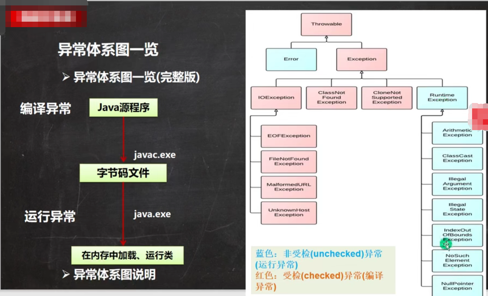

### 4.常见的运行时异常

​	1.NullPointerException空指针异常：当程序在需要对象的地方使用null时

​	2.ArithmeticException数学运算异常：出现了异常的运算条件时

​	3.ArrayIndexOutOfBoundsException数组下标越界异常：用非法索引访问数组时

​	4.ClassCastException类型转换异常：当试图将对象强制转换为不是实例的子类时

​	5.NumberFormatException数字格式不正确异常：当字符串不能转换成一种数值类型的适当格式时

### 5.常见的编译异常

1. SQLException 操作数据库时，查询表异常
2. IOException操作文件时
3. FileNotfoundException操作一个不存在的文件时
4. ClassNotFoundException加载类时，该类不存在
5. EOFException操作文件，到文件末尾发生异常
6. ILLegalArguementException参数异常

## 2、异常处理

### 1.异常处理的概念

当异常发生时，处理异常的方式。

编译时异常必须try-catch-finally和throws二选一；运行时异常默认为throws处理，不要求显式处理。

### 2.try-catch

try-catch-finally程序员在代码中捕获可能发生的异常，自行处理

```java
try {
//可能有异常的代码，，当异常发生时，直接进入catch块，tyr后面的代码不执行
}catch(NullPointerException e){
//1.捕获到异常
//2.当异常发生时系统将异常封装成Exception对象e，传递给catch
//3.得到异常对象后，程序员，自己处理
//4.如果没有发生异常catch代码块不执行
}catch(Exception e){
//1.可以有多个catch语句，捕获不同的异常，进行不同的业务处理
//2.要求父类异常在前，子类异常在后。
//3.每个异常只会匹配并执行一个catch。
}finally{
//1.不管try代码块是否有异常发生，始终要执行finally
//2.所以，通常将释改资源的代码，放在finally    
//3.try-finally配合使用相当于没有捕获异常
//执行一段代码后，无论是否发生异常都会执行finally代码块，执行完毕后程序会直接崩溃。
}
```

最佳案例：

### 3.throws

```
public void test() throws Exception{}
```

1.一个方法中可能生成某种异常，但不确定如何处理时，throws将发生的异常抛出，交给调用方（方法）来处理，最顶级的处理者是JVM，输出异常信息然后退出程序。

2.在方法声明中用throws语句可以声明抛出异常的列表，throws后面的异常类型可以是方法中产生的异常类型，也可以是其父类。

3.子类重写该方法时，子类所抛出的异常类型要么一致，要么是父类异常类型的子类。

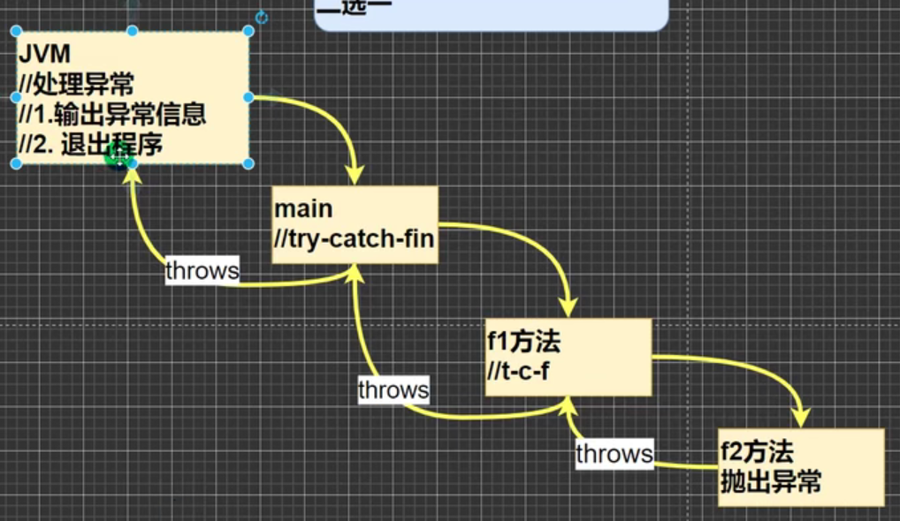

## 3、自定义异常

当程序中出现了某种异常，该错误信息并没有在Throwable子类中描述处理，这时可以选择自行设计异常类，用于描述该异常。

步骤：

1. 定义类：自定义异常类名继承Exception（属于编译时异常）或者RunTimeException（属于运行时异常）。一般继承RunTimeException，因为编译时异常需要调用者必须处理。

2. 通过构造器，输出异常信息。

3. 调用时，通过throw关键字生成异常对象。

   ```java
   public class test {
       public static void main(String[] args) /*throws AgeException*/{
           int age = 80;
           if(!(age>100)){
               throw new  AgeException("年龄需要大于100");
           }
       }
   }
   class AgeException extends RuntimeException{
       public AgeException(String message) {
           super(message);
   //    public Throwable(String message) {
   //        fillInStackTrace();
   //        detailMessage = message;
   //    }
       }
   }
   ```

## 4、throw和throws的区别

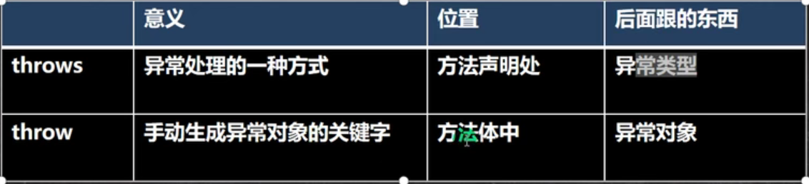

# 常用类

## 1、包装类Wrapper

### 1.概念：

针对八种基本数据类型相应的引用类型类称为包装类。

有了类的特点就可以在对象中定义更多的功能方法操作该数据。（黄色部分的父类为Number）

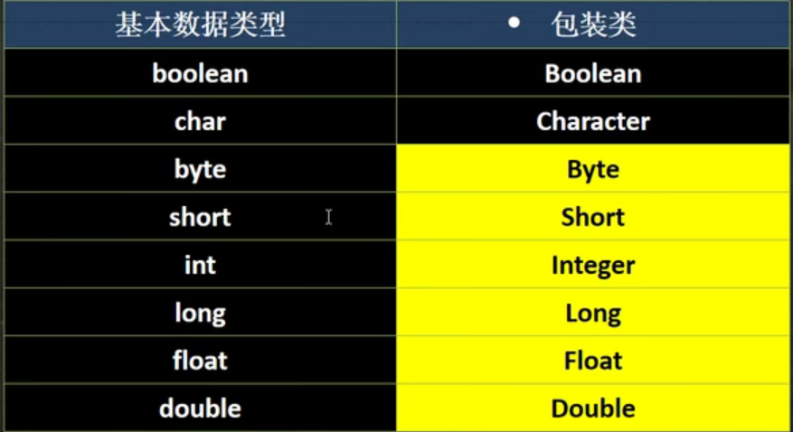

### 2.包装类的继承实现关系：

1.Boolean和Character也分别实现了Serializable和Comparable接口，继承了Object类

2.其他6大包装类的继承实现关系如下：

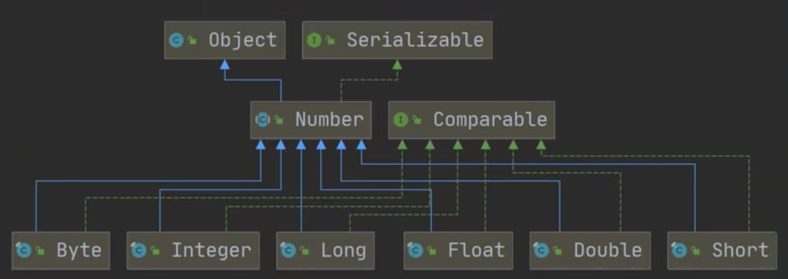

### 3.包装类和基本数据类型的转换

装箱拆箱：

从基本类型转成包装类型的过程称为装箱，反之称为拆箱。

```java
//JDK5之前只能两种方式手动装箱
int n = 100;
Integer integer1 = new Integer(n);
Integer integer2 = Integer.valueOf(n);
//手动拆箱
int i1 = integer1.intValue();

//JDK5之后的自动装箱
Integer integer3 = n;//底层使用的是valueOf()方法
//自动拆箱
int i2 = integer3//底层使用的是intValue()方法
```

### 4.包装类和String类型的转换

```java
		//包装类型-> String
        Integer i = 100;
        String s1 = i.toString();
        String s2= String.valueOf(i);
        String s3= i+"";
        //String->包装类型（能够转换成的字符字符串类型）
        String s = "100";
        Integer i1 = new Integer(s);//构造器
        Integer i2 = Integer.valueOf(s);
        Integer i3 = Integer.parseInt(s);
```

### 5.包装类的常用方法

Integer和Character：

Integer.MIN_VALUE    最小值

Integer.MAX_VALUE   最大值

Character.isDigit('1')                            判断字符是否是数字

Character.isLetter('a')                          判断字符是否是字母

Character.isUpperCase('a')                判断字符是否是大写

Character.isLowerCase('a')                判断字符是否是小写

Character.isWhiterspace('a')              判断字符是否是空格

Character.toUpperCase('a')               将字符转换成大写

Character.toLowerCase('b')               将字符转换成小写

### 6.Integer创建机制

```java
        Integer i = new Integer(1);
        Integer j = new Integer(1);
        System.out.println(i==j);//flase,new了一个新的对象，比较对象。

        Integer m = 1;
        Integer n = 1;
        System.out.println(m==n);//true，m,n是值
        Integer x = 128;
        Integer y = 128;
        System.out.println(x==y);//false，x，y是对象
//调用Integer.valueOf(int i),在范围内直接从cache数组(-128~127)中返回值，范围外new对象。
	    public static Integer valueOf(int i) {
    	    if (i >= IntegerCache.low && i <= IntegerCache.high)
        	    return IntegerCache.cache[i + (-IntegerCache.low)];
        	return new Integer(i);
   		}
```

## 2、String

### 1.理解和创建对象

String类用于保存字符串，也就是一组用双引号""括起来的字符序列。字符使用Unicode编码，一个字符占两个字节。

String类常用的构造方法：

```
String s1 = new String();
String s2 = new String(String original)
String s3 = new String(char[] a);
String s4 = new String(char[] a,int StartIndex,int count);
```

### 2.两种创建String对象的方式区别

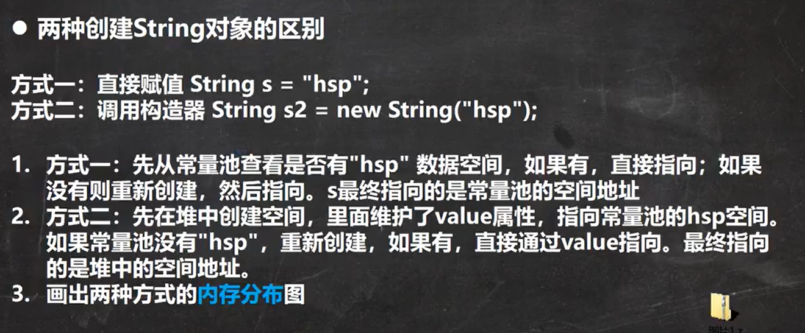

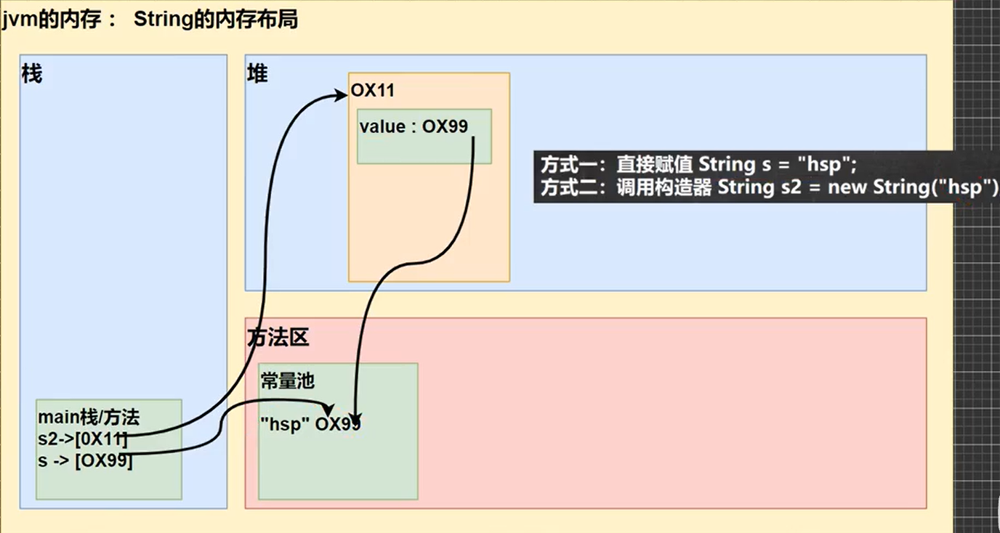

### 3.字符串特性

常量相加在常量池，变量相加在堆。

```java
//编译器自动优化，判断创建的常量池是否有引用指向，
String a = "a"+"b";//等价于 String a = "ab";只创建了一个对象ab。


String a ="a";
String b ="b";
//创建 a，b对象指向常量池中的"a","b"。
String c =a+b;
//1.创建StringBuilder sb = new StringBuilder();
//2.执行sb.append("a");再执行sb.append("b");StringBuilder中的append方法是往String中的char[] value添加;
//3.String c = sb.toString;StringBuilder中的toString方式是截取字符串中的前count(8)位构成一个新的字符串。
public String toString() {
        // Create a copy, don't share the array
        return new String(value, 0, count);
}
//c指向堆中的对象value[] 数组指向常量池中的"ab"。 一共创建了3个对象
```

### 4.String类的常见方法

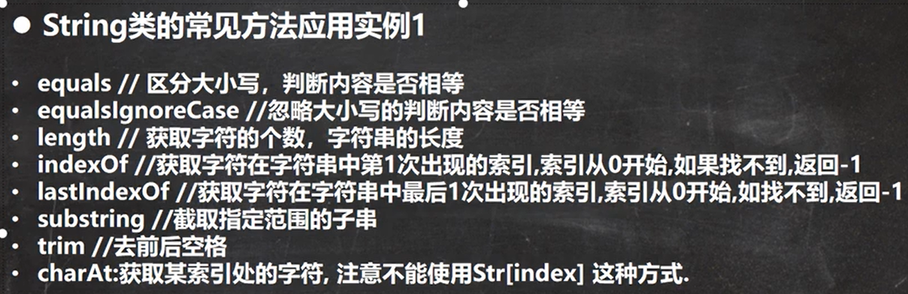

- toUpperCase //全部改为大写
- toLowerCase //全部改为小写
- compareTo //比较字符串的大小
- format //用占位符格式化字符串 

### 6.StringBuffer 和StringBuilder

String类是保存字符串常量的，但每次更新都要重新开辟空间，效率低。提供StringBuffer 和StringBuilder增强String功能。

#### StringBuffer：

代表可变的字符序列，可以对字符串内容进行增删，很多方法与Strng相同，但StringBuffer是可变长度的，是一个容器。

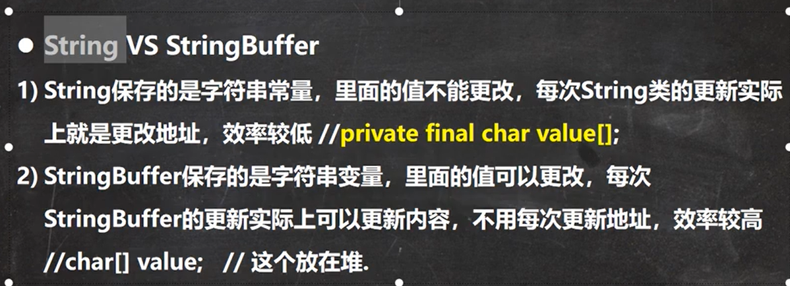

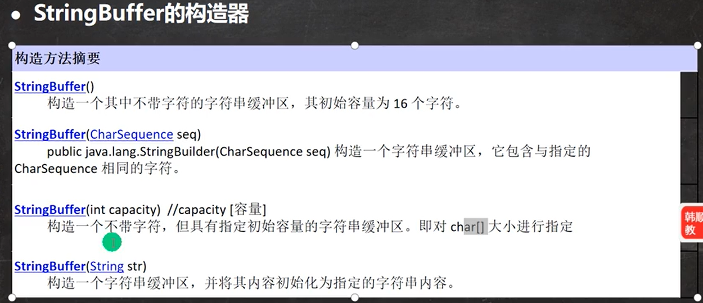

String和Stringbuffer的相互转换：

```java
//String -> StringBuffer
String s = "hello";
StringBuffer b1 = new StringBuffer(s);//使用构造器，返回Stringbuffer对象。

StringBuffer b2 = new StringBuffer();//调用append方法
b2.append(s);

//StringBuffer ->  String 
String s1 = b1.toString();//使用toString方法

String s2 = new String(b2);//使用构造器返回String方法
```

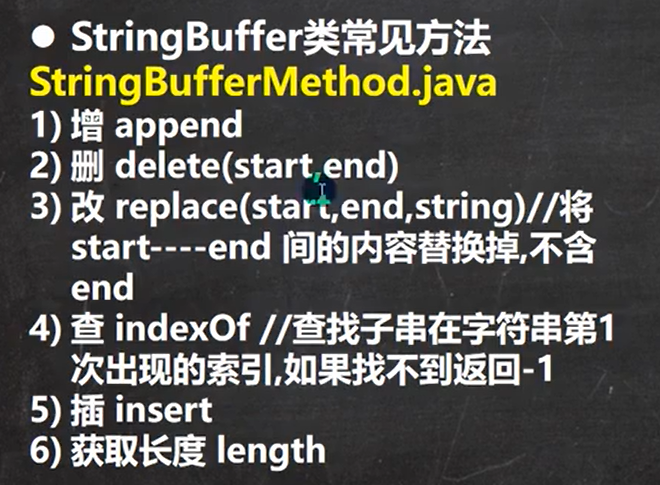

#### StringBuilder：

一个可变的字符序列，提供一个与StringBuffer兼容的API，但不保证同步（即线程不安全）。该类被设计用作StringBuffer的一个简易替换，用在字符缓冲区被单个线程使用时，比StringBuffer的效率更高。

主要操作是append和insert方法，可以重载这些方法接受任意类型的数据。

#### 比较和选择：


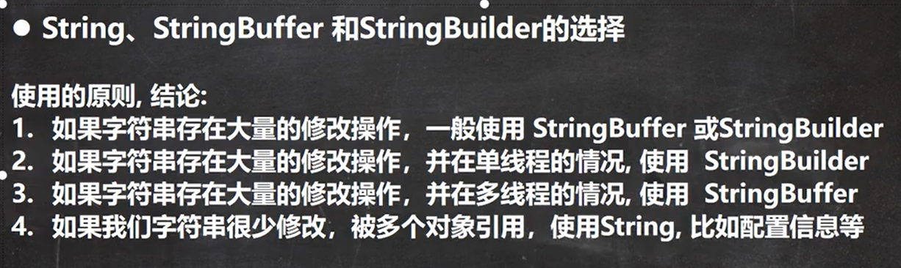

## 3、Math

Math类包含用于执行基本数学运算的方法

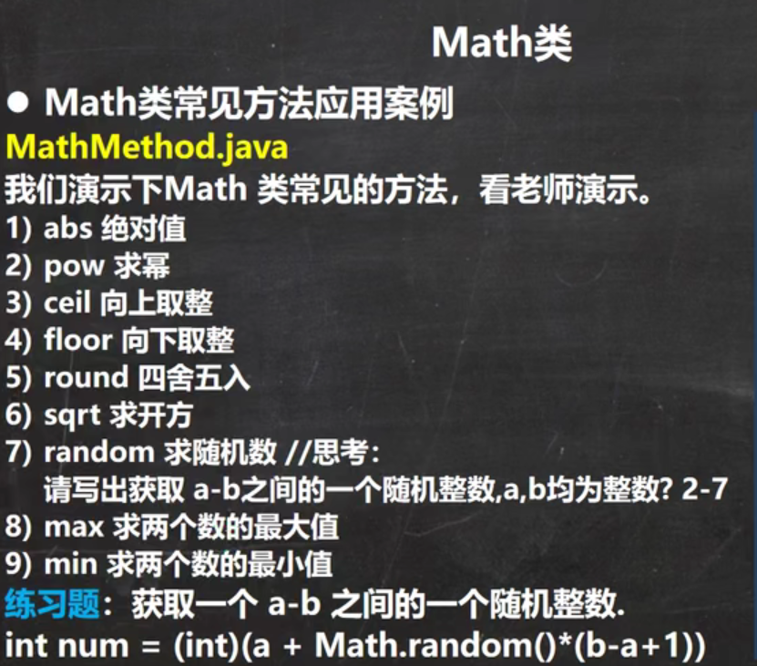

## 4、Date、Calendar、LocalDate

### 1.第一代日期类Date

1. JDK1.0引入，Calendar引入后大部分方法已弃用

2. 精确到毫秒，代表特定的瞬间

3. 搭配类SimpleDateFormat：格式化（日期 ->文本和解析（文本->日期）日期的具体类，格式化）

   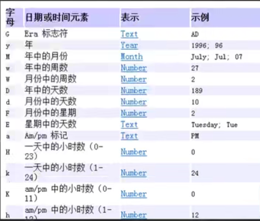

   ```java
           Date date1 = new Date(0);//指定毫秒数得到时间 初始时间0毫秒为Thu Jan 01 08:00:00 CST 1970
           Date date2 = new Date();//获取当前系统时间Thu Dec 09 21:18:55 CST 2021
           date2.getTime();//转换成毫秒数
           SimpleDateFormat sdf = new SimpleDateFormat("yyyy年MM月dd日 hh:mm:ss E");//字母必须按规定
           String format1 = sdf.format(date2);//格式化
   
           //解析, 把String解析成Date时，sdf和String格式必须相同
           String format2 = "2001年01月15日 09:12:23 星期二";
           Date date3 = sdf.parse(format2);//转换异常parseException，需要抛出
   ```

### 2.第二代日期类Calendar

1. JDK1.1引入，Calendar类是一个抽象类，构造器为私有。
2. 为特定瞬间的一组TEAR、MONTH、DAY_OF_MONTH（某个月的第几天）、HOUR等日历字段之间的转换和操作日历字段提供了一些方法。

```java
        Calendar c = Calendar.getInstance();//创建Calendar对象
        //Calendar没有提供格式化类，需要输出时自行自行组合。
        System.out.print(c.get(Calendar.YEAR)+"年");//年
        System.out.print((c.get(Calendar.MONTH)+1)+"月");//月从0开始编号，需要加1
        System.out.print(c.get(Calendar.DAY_OF_MONTH)+"日");//日
        System.out.print(c.get(Calendar.HOUR)+"时");//12时
		System.out.print(c.get(Calendar.HOUR_OF_DAY)+"时");//24时		
        System.out.print("星期"+c.get(Calendar.DAY_OF_WEEK));//星期几
```

### 3.前两代日期类的不足

1. 可变性：日期和时间的类应该是不变的，而Calendar是可变的。
2. 偏移性：Date中的年份从1970开始，月份从0开始
3. 格式化：格式化只对Date有用，Calendar无用
4. 不是线程安全，不能处理闰秒（每两天多1s）

### 4.第三代日期类

1.Jdk8后加入，常用类如下：

1. LocalDate：只包含日期，即年月日，可以获取日期字段。

2. LocalTime：只包含时间，即时分秒，可以获取时间字段。

3. LocalDateTime：包含日期和时间，可以获取日期和时间字段。

   ```java
           LocalDateTime now1 = LocalDateTime.now();//2021-12-10T14:58:22.067
           System.out.println(now1.getYear());//2021
           System.out.println(now1.getHour());//15
   
           LocalDate now2 = LocalDate.now();
           System.out.println(now2.getMonth());//DECEMBER
           LocalTime now3 = LocalTime.now();
           System.out.println(now3.getMinute());//1
   ```

2.DateTimeFormatter格式日期类：

```java
        LocalDateTime now1 = LocalDateTime.now();//2021-12-10T14:58:22.067
        DateTimeFormatter formatter = DateTimeFormatter.ofPattern("yyyy年MM月dd日,HH:mm:ss");
        String time = formatter.format(now1);//2021年12月10日,14:58:22
        System.out.println(time);
```

3.Instant时间戳

类似于Date，提供了一系列和Date类转换的方式。

```java
        Instant instant = Instant.now();//通过静态方法now获取当前时间2021-12-10T07:20:20.085Z
        Date date =Date.from(instant);//Instant->Date   Fri Dec 10 15:18:15 CST 2021
        Instant instant1 = date.toInstant();//Date->Instant  2021-12-10T07:20:20.085Z
```

4.LocalDateTime类中的更多方法


## 5、System

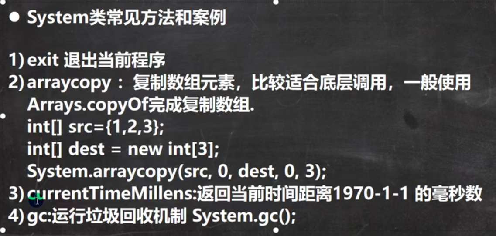

## 6、Arrays

Arrays里面包含了一系列静态方法，用于管理或操作数组。

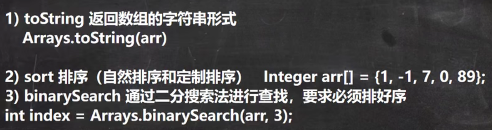

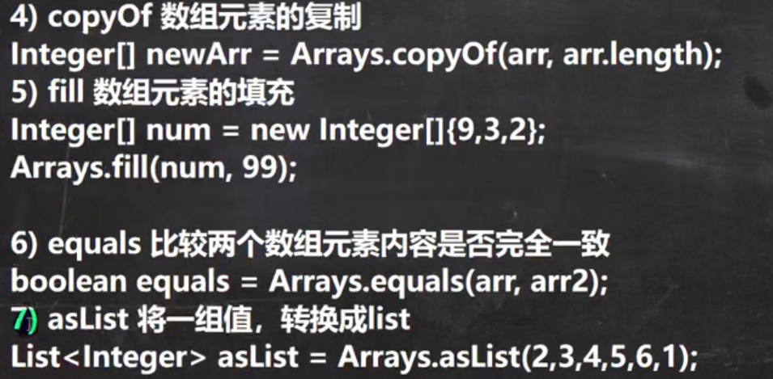

sort的定制排序：

```java
public class Test485 {
    public static void main(String[] args) {
        Book[] books = new Book[4];
        books[0]=new Book("红楼梦",50);
        books[1]=new Book("三国演义",40);
        books[2]=new Book("JAVA入门到放弃",10);
        books[3]=new Book("青年文摘10年",70);
        //价格
        Arrays.sort(books, new Comparator() {
            @Override
            //匿名内部类重写底层Compara方法
            public int compare(Object o1, Object o2) {
                Book book1 = (Book) o1;
                Book book2 = (Book) o2;
                double num = book1.getPrice() - book2.getPrice();
                if (num > 0) {
                    return -1;
                } else if (num < 0) {
                    return 1;
                } else {
                    return 0;
                }
                //底层根据传入两个对象的属性的差值的正负决定是从小到大还是从大到小
                /*while (left < right) {
                int mid = (left + right) >>> 1;
                if (c.compare(pivot, a[mid]) < 0)
                    right = mid;
                else
                    left = mid + 1;
            	}*/
            }
        });
        System.out.println(Arrays.toString(books));
        //书名
        Arrays.sort(books, new Comparator() {
            @Override
            public int compare(Object o1, Object o2) {
                Book book1 = (Book) o1;
                Book book2 = (Book) o2;
                return book2.getName().length()-book1.getName().length();
            }
        });
        System.out.println(Arrays.toString(books));
    }
}
class Book{
    private String name;
    private double price;
    //*******************//
}
```

## 7、BigInteger、BigDecimal

应用场景：

BigInteger适合保存比较大的整形

```java
        //调用构造器传入字符串转换成BigInteger类型整数
        BigInteger bigInteger = new BigInteger("27868641862736186323");
        BigInteger bigInteger1 = new BigInteger("100");
        //对BigInteger进行加减乘除时不能直接使用+-*/,需要调用相应的方法
        bigInteger = bigInteger.add(bigInteger1);
        bigInteger = bigInteger.subtract(bigInteger1);
        bigInteger = bigInteger.multiply(bigInteger1);
        bigInteger = bigInteger.divide(bigInteger1);
```

BigDecimal适合保存精度更高的浮点型小数

```java
        //调用构造器传入字符串转换成BigDecimal类型整数
        BigDecimal bigDecimal = new BigDecimal("823718.247197412974194");
        BigDecimal bigDecimal1 = new BigDecimal("1.1");
        //对BigDecimal进行加减乘除时不能直接使用+-*/,需要调用相应的方法
        bigDecimal = bigDecimal1.add(bigDecimal1);
        bigDecimal = bigDecimal1.subtract(bigDecimal1);
        bigDecimal = bigDecimal1.multiply(bigDecimal1);

        bigDecimal = bigDecimal1.divide(bigDecimal1);
        //如果结果为无限循环小数，则可能抛出异常ArithmeticException,调用时，指定精度BigDecimal.ROUND_XXX
        bigDecimal = bigDecimal1.divide(bigDecimal1,BigDecimal.ROUND_CEILING);//两位
```

# 集合

提供一种存储空间可变的存储模型，存储的数据容量可以随时发生改变。

## 1、集合框架体系

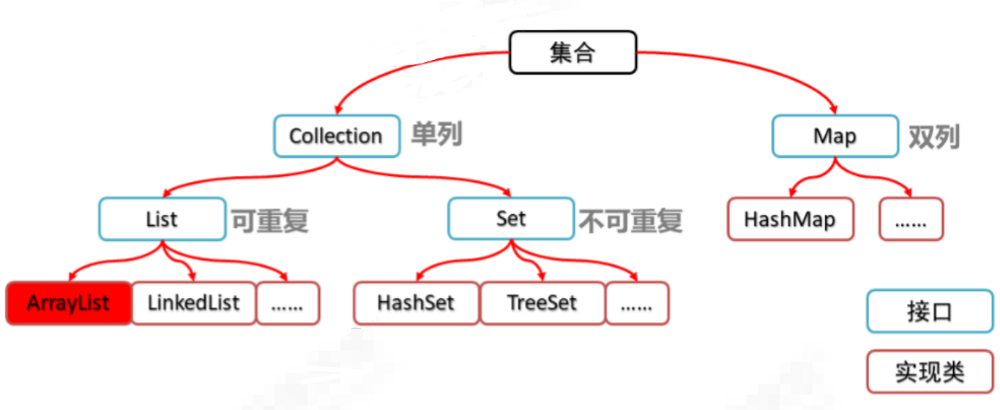

## 2、Collection

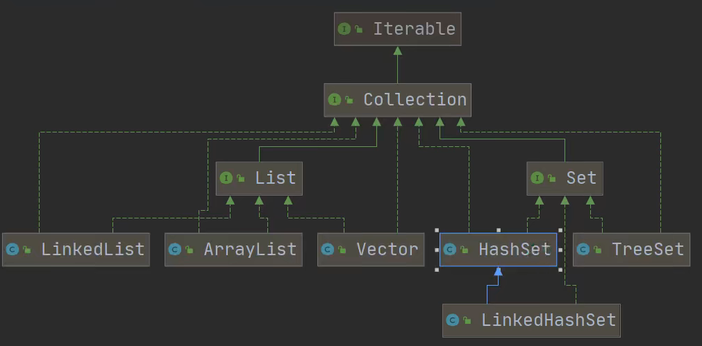

### 1.常用方法：

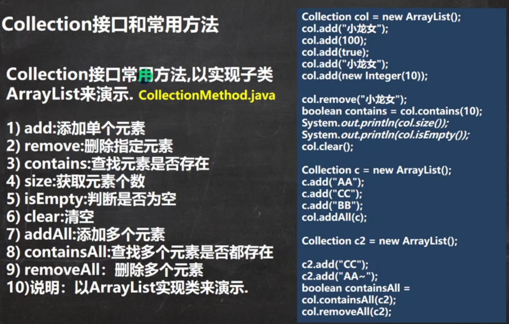

### 2.遍历元素方式：

#### Iterator：

1. Iterator对象称为迭代器，仅用于遍历集合或者数组，本身并不存放对象。

2. 所有实现了Colleection接口的集合类都实现了Iteractor接口中的iterator方法

3. iterator方法：用以返回Iterator接口的对象，即返回一个迭代器。

4. Iteractor的结构图：

   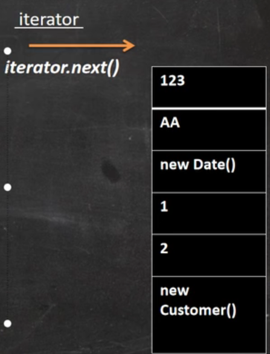

   Iteractor的执行原理：

   ```java
   class Book{
       	private String name;
      	 	private String author;
       	private double price;
       	//********
   }
   public static void main(String[] args) {
           Collection col = new ArrayList();
           col.add(new Book("三国演义", "罗贯中", 13.4));
           col.add(new Book("西游记", "吴承恩", 24.1));
           col.add(new Book("红楼梦", "曹雪芹", 33.5));
           //1.得到col对应的迭代器
           Iterator iterator = col.iterator();
           //2.使用while循环遍历
           while (iterator.hasNext()) {//iterator.hasNext()判断迭代器中是否还有下一个数据
               Object next = iterator.next();
               //iterator.next()方法：每调用一次，指针下移一次，并将下移后指针指向的元素返回
           }
           //3.当退出循环后,iterator.next().next()方法指针指向最后一个元素
           //不能再执行iterator.next()方法，否则会抛出NoSuchElementException异常
           //需要重置迭代器
           iterator = col.iterator();
      	 	}
   
   ```

#### 增强for循环：

增强for循环就是简易版的iterator，本质一样底层依然是调用迭代器，只能用于遍历集合或者数组。

```java
基本语法：
for(元素类型 元素名:集合名或数组名){
	访问元素
}
//使用增强for循环
for(Object book:col){
    System.out.println(book);
}
```

### 3.List

List集合概述

有序集合(也称为序列)，用户可以精确控制列表中每个元素的插入位置。用户可以通过整数索引访问元素，并搜索列表中的元素，与Set集合不同，列表通常允许重复的元素

List集合特点

有索引

可以存储重复元素

元素存取有序

#### 1.介绍：

1. List接口是Collection接口的子接口
2. List集合类中的元素有序，即添加顺序与输出顺序一致，元素可以重复
3. 每个元素都对应一个整数型的序号记载其在容器中的位置，即每个元素都有其对应的顺序索引，从0开始

#### 2.常用方法：

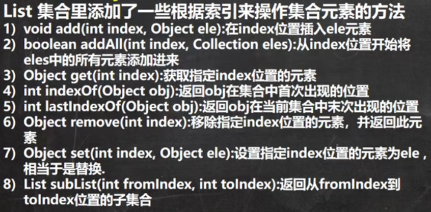

#### 3.三种遍历方式

List接口是Collection接口的子接口，同样可以使用Iteractor、增强for循环遍历

```java
		//普通for循环
        List list = new ArrayList();
        for (int i = 0; i < list.size(); i++) {
            System.out.println("对象"+list.get(i));
        }
```

#### 4.ArrayList、Vector、LinkedList等实现类

ArrayList注意事项：

1. ArrayList是由数组来实现数据存储的，可以加入多个null

2. ArrayList基本等同于Vector，除了ArrayList是线程不安全的，但执行效率高；多线程情况下不建议使用ArrayList。

3. ArrayList的底层操作机制：

   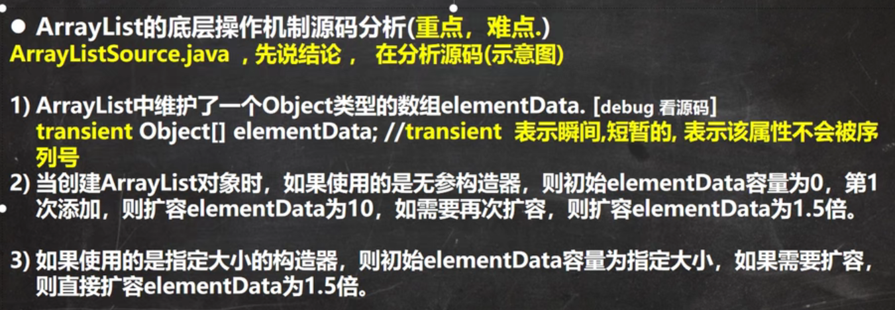

Vector注意事项：

1. Vector底层也是一个对象数组，protected Object[] elementData

   ```java
   //2.Vector类的定义
   public class Vector<E> 
   extends AbstractList<E>
   implements List<E>, RandomAccess, Cloneable, Serializable
   //3.Vector是线程安全的，类的操作方法中带有synchronized
   public synchronized E get(int index){
       if (index >=elementCount)
       	throw new ArrayIndexOutBoundsException(index);
       return elementData(index);
   }
   ```

   4.Vector和ArraysList的区别：

   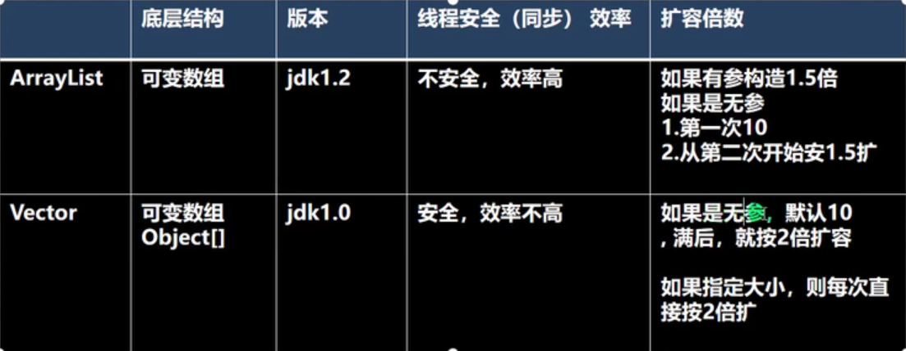

LinkedList的特点：

1. 实现了双层链表和双端队列的特点

2. 可以添加任意元素（重复，null）

3. 线程不安全，没有实现同步

4. 底层操作机制：

   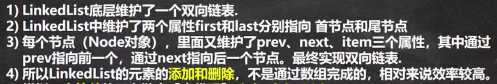

```java
        LinkedList list = new LinkedList();
        list.add(1);
        list.add(2);
        //1. 无参构造器 public LinkedList(){} 此时LinkedList的属性first last指针为null
        //2.将int参数 装箱成Integer对象e
        //3.执行add方法：
        //    public boolean add(E e) {
        //        linkLast(e);
        //        return true;
        //    }
        //4.linkLast方法
        //void linkLast(E e) {
        //        final Node<E> l = last;
        //        final Node<E> newNode = new Node<>(l, e, null);
        //        last = newNode;
        //        if (l == null)
        //            first = newNode;
        //        else
        //            l.next = newNode;
        //        size++;
        //        modCount++;
        //    }
        list.remove();//默认删除第一个节点
        //private E unlinkFirst(Node<E> f) {
        //        // assert f == first && f != null;
        //        final E element = f.item;
        //        final Node<E> next = f.next;
        //        f.item = null;
        //        f.next = null; // help GC
        //        first = next;
        //        if (next == null)
        //            last = null;
        //        else
        //            next.prev = null;
        //        size--;
        //        modCount++;
        //        return element;
        //    }
        list.remove(2);
        //E unlink(Node<E> x) {
        //        // assert x != null;
        //        final E element = x.item;
        //        final Node<E> next = x.next;
        //        final Node<E> prev = x.prev;
        //
        //        if (prev == null) {
        //            first = next;
        //        } else {
        //            prev.next = next;
        //            x.prev = null;
        //        }
        //
        //        if (next == null) {
        //            last = prev;
        //        } else {
        //            next.prev = prev;
        //            x.next = null;
        //        }
        //
        //        x.item = null;
        //        size--;
        //        modCount++;
        //        return element;
        //    }
```

Arrays和LinkedList的区别和选择：

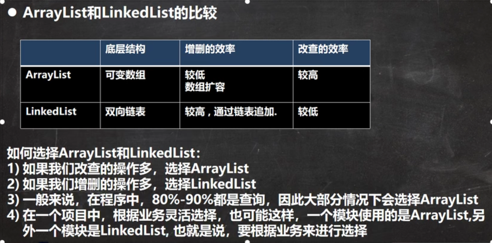

### 4.Set

1. 无序，即无索引，元素的添加和取出顺序不一致。
2. 不允许重复元素，最多包含一个null。
3. 是collection的子接口，常用方法一致，遍历方式可以使用迭代器和增强for循环，不能使用索引方式。

#### 1.HashSet：

HashSet实现了Set接口，实际上底层是HashMap；HashMap底层是（数组+链表+红黑树），底层机制：

添加元素：

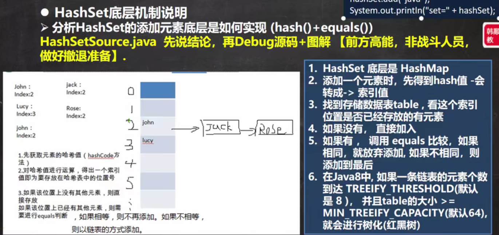

添加了一个元素时，封装成Node加入table表，无论是在表中还是链表上都视为添加了一个元素，超过临界值就扩容。

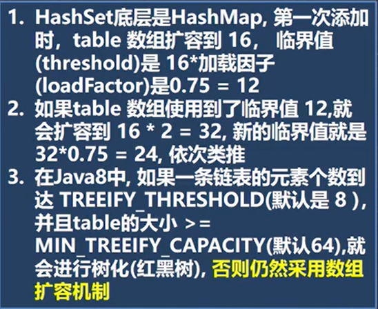

#### 2.LinkedHashSet：

1. 是HashSet的子类，底层是一个LinkedHashMap底层维护了一个数据➕双向链表，不允许添加重复元素。
2. 根据元素的hashCode值来决定元素存储的位置，同时使用链表维护元素的次序，看起来像是以插入顺序保存。

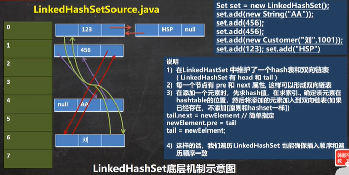

#### 3.TreeSet

- 使用无参构造器创建TreeSet时，仍然是无序的
- 使用TreeSet提供的构造器，可以传入比较器（匿名内部类），赋给TreeSet的底层TreeMap，并制定排序规则

```java
	public static void main(String[] args) {
       TreeSet treeSet = new TreeSet(new Comparator() {
           @Override
           public int compare(Object o1, Object o2) {
               //调用String的compareTo方法比较字符串大小
               return ((String) o2).compareTo((String) o1);
               //按照字符串长度比较
               return ((String) o2).length()-((String) o1).length();
           }
       });
       treeSet.add("JACK");
       treeSet.add("Tom");
    }
	//构造器把传入的比较器对象赋给TreeSet的底层TreeMap的this.comparator
	public TreeSet(Comparator<? super E> comparator) {
        this(new TreeMap<>(comparator));
    }

	public TreeMap(Comparator<? super K> comparator) {
        this.comparator = comparator;
    }
	//调用treeSet.add("Tom");时
	Comparator<? super K> cpr = comparator;
        if (cpr != null) {//cpr 匿名内部类
            do {
                parent = t;
                cmp = cpr.compare(key, t.key);//动态绑定到传入的匿名内部类compare
                if (cmp < 0)
                    t = t.left;
                else if (cmp > 0)
                    t = t.right;
                else//返回0 即相等时，Key相同无法加入 
                    return t.setValue(value);
            } while (t != null);
        }
```

## 3、Map

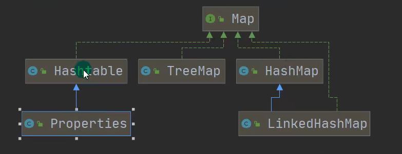

### 特点：

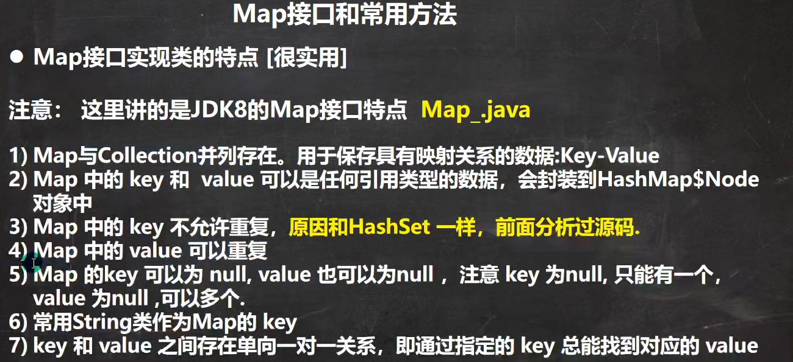

### 常用方法：

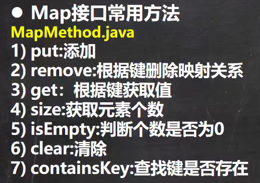

### 遍历方式：

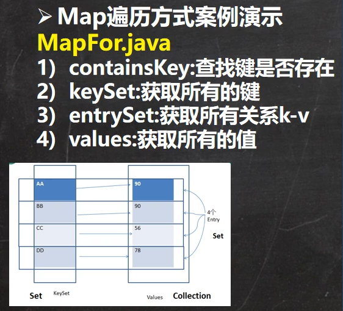

```java
public static void main(String[] args) {
        Map map = new HashMap();
        map.put("邓超","孙俪");
        map.put("王宝强","马蓉");
        map.put("宋喆","马蓉");
        map.put("null","刘亦菲");
        map.put("王宝强","null");
        //第一种 取出所有的key，通过key取出对应的value
        Set keySet = map.keySet();//获取所有的键
        //增强for循环
        for (Object key : keySet) {
            System.out.println(key+"="+map.get(key));//通过key对应的value
        }
        //迭代器
        Iterator iterator = keySet.iterator();
        while (iterator.hasNext()) {
            Object key =  iterator.next();
            System.out.println(key+"="+map.get(key));
        }

        //第二种 取出所有的value
        Collection values = map.values();
        //增强for循环
        for (Object value : values) {
            System.out.println(value);
        }
        //迭代器
        Iterator iterator2 = values.iterator();
        while (iterator2.hasNext()) {
            Object value =  iterator2.next();
            System.out.println(value);
        }

        //第三种 通过EntrySet获取key-value关系
        Set entrySet = map.entrySet();
        //增强for循环
        for (Object entry : entrySet) {
            Map.Entry m =(Map.Entry) entry;//向下转型
            System.out.println(m.getKey()+"="+m.getValue());
        }
        //迭代器
        Iterator iterator3 = entrySet.iterator();
        while (iterator3.hasNext()) {
            Object entry =  iterator3.next();
            Map.Entry m =(Map.Entry) entry;//向下转型
            System.out.println(m.getKey()+"="+m.getValue());
        }
    }
```

### 实现类：

1.HashMap：

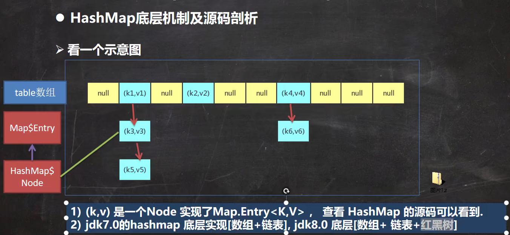

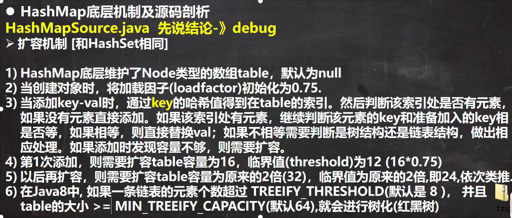

2.HashTable：

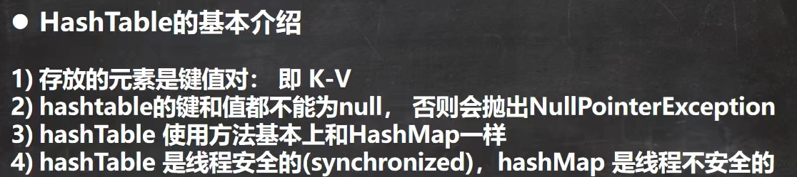

底层有数组Hashtable$Entry[] 初始大小为11，临界值threshold 8 = 11 * 0.75。执行方法addEntry(hash，key， value， index)；添加K-V封装到Entry。当if(count >=threshold)满足时，按照int newCapacity = (oldCapacity<<1)+1（两倍加一）的大小来扩容。

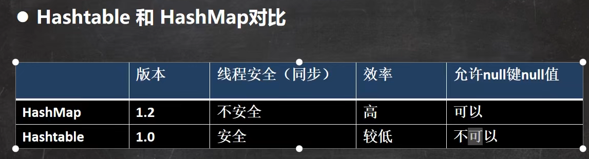

## 4、集合的选择


## 5、Collections工具类

1. Collections 是一个操作 Set、List和Map等集合的工具类

2. Collections 中提供了一系列静态的方法对集合元素进行排序、查询和修改等操作

    


# 泛型

使用传统方法的问题分析:

1）不能对加入到集合ArrayList中的数据类型进行约束（不安全）

2）遍历的时候，需要进行类型转换，如果集合中的数据量较大，对效率有影响

泛型的好处:

1）编译时，检查添加元素的类型，提高了安全性

2）减少了类型转换的次数，提高效率

不使用泛型：

Dog-加入->Object-取出->Dog //放入到ArrayList 会先转成Object，在取出时，还需要转换成Dog

使用泛型：
Dog->Dog->Dog  //放入时，和取出时，不需要类型转换，提高效率

3）不再提示编译警告

## 1.概念


```java
//E表示s的数据类型，在定义对象时指定，即编辑期间
class Person<E>{
    E s ;
    public Person(E s) {//参数类型
        this.s = s;
    }
    public E f(){//返回类型
        return s;
    }
}
public class Test {
    public static void main(String[] args) {
        Person<String> person= new Person<String>("小明");
    }
}
```


```java
public class Test {
    public static void main(String[] args) {
        //使用泛型给HashSet放入对象

        HashSet<Student> set= new HashSet<Student>();
        set.add(new Student("jack",18));

        //增强for遍历
        for (Student student :set) {
            System.out.println(student);
        }


        //使用泛型给HashMap放入对象

        HashMap<String,Student> map = new HashMap<String,Student>();
        //public class HashMap<K,V>{}

        map.put("smith",new Student("smith",20));

        //迭代器遍历
        Set<Map.Entry<String, Student>> entries = map.entrySet();
        /*
        public Set<Map.Entry<K,V>> entrySet() {
        Set<Map.Entry<K,V>> es;
        return (es = entrySet) == null ? (entrySet = new EntrySet()) : es;
        }
         */

        Iterator<Map.Entry<String, Student>> iterator = entries.iterator();
        /*
        final class EntrySet extends AbstractSet<Map.Entry<K,V>> {
        public final Iterator<Map.Entry<K,V>> iterator() {
            return new EntryIterator();
        }
        }
         */

        while (iterator.hasNext()) {
            Map.Entry<String, Student> next =  iterator.next();
            System.out.println(next.getKey()+"--"+next.getValue());
        }
    }
}
```


## 2.自定义泛型

自定义泛型类：

基本语法
class 类名<T，R..…>{}  //..表示可以有多个泛型成员
注意细节
1）普通成员可以使用泛型（属性、方法）

2）使用泛型的数组，不能初始化（数组new时，不确定类型，无法在内存中开辟空间）

3）静态方法中不能使用类的泛型（类加载时。对象还未创建，无法完成初始化）

4）泛型类的类型，是在创建对象时确定的（因为创建对象时，I需要指定确定类型）

5）如果在创建对象时，没有指定类型，默认为Object


自定义泛型接口：

基本语法
interface 接口名<T，R..>{}
注意细节
1）接口中，静态成员也不能使用泛型

2）泛型接口的类型，在继承接口或者实现接口时确定

3）没有指定类型，默认为Object


自定义泛型方法:

基本语法
修饰符<T，R..>返回类型 方法名（参数列表）{
注意细节
1.泛型方法，可以定义在普通类中，也可以定义在泛型类

2.泛型方法可以使用泛型类声明的泛型，也可以自己声明泛型

3.当泛型方法被调用时，类型会确定

4.public void eat（E e）{}，修饰符后没有<T，R.>eat方法不是泛型方法，而是使用了泛型


## 3.继承和通配符


# 线程

## 1.线程相关概念

程序：

是为完成特定任务、用某种语言编写的一组指令的集合。简单的说：就是我们写的代码

进程：

进程是指运行中的程序，操作系统就会为该进程分配内存空间。当我们启动了一个进程，操作系统将分配新的内存空间。进程是程序的一次执行过程，或是正在运行的一个程序。是动态过程：有它自身的产生、存在和消亡的过程。

线程：

线程由进程创建的，是进程的一个实体。一个进程可以拥有多个线程

单线程：同一个时刻，只允许执行一个线程

多线程：同一个时刻，可以执行多个线程

并发：同一个时刻，多个任务交替执行，造成一种“貌似同时”的错觉，简单的说，单核cpu实现的多任务就是并发。

并行：同一个时刻，多个任务同时执行。多核cpu可以实现并行。

串行：在时间上不可能发生重叠，前一个任务没搞定，下一个任务就只能等着。

## 2.基本使用


创建线程的两种方式：

1.继承Thread类，重写run方法

2.实现Runnable接口，重写run方法

```java
        /*
        当主线程main启动一个子线程Thread-0时，主线程不会阻塞，会继续执行。主线程与子线程是交替执行的。
        public synchronized void start(){
            start0();//真正实现多线程效果,本地方法，JVM调用，而不是run方法，
        }
         */

public class Test {
    public static void main(String[] args) {
        Student student = new Student();//创建对象当做线程使用
        student.start();//启动线程，最终会执行student的run方法
        student.run();//执行一个普通的方法，没有启动子线程，会阻塞主线程，run方法执行完毕后才继续执行。     
    }
}

//当一个类继承Thread类，该类就可以当做线程使用，重写run方法，实现业务逻辑
class Student extends Thread {
    @Override
    public void run() {
        super.run();
    }
}
//java是单继承的，一个类可能已经继承了某个父类，这时在用继承Thread类方法来创建线程显然不可能了。
class Student implements Runable{
    @Override
    public void run() {
        super.run();
    }
}
```

多线程执行：

main线程结束，子线程不一定结束


区别：


## 3.线程终止


1.当线程完成任务后，会自动退出。

2.还可以通过使用变量来控制run方法退出的方式停止线程，即通知方式

```java
public class Test {
    public static void main(String[] args) throws InterruptedException {
        T t = new T();
        t.start();
        Thread.sleep(10*1000);//主线程休眠10s
        t.setLoop(false);
    }
}

class T extends Thread {
    private boolean loop  =  true;
    @Override
    public void run() {
        while(loop){
            try {
                Thread.sleep(50);//当前线程休眠50ms
            }catch (InterruptedException e){
                e.printStackTrace();
            }
            System.out.println("T 运行中..");
        }
    }
    //提供set方法控制变量
    public void setLoop(boolean loop) {
        this.loop = loop;
    }
}
```

## 4.常用方法


sleep()、wait()的区别：

1、sleep是Thread类的静态本地方法，wait则是Object类的本地方法。

2、sleep方法不会释放lock，但是wait会释放，而且会加入到等待队列中。
	sleep就是把cpu的执行资格和执行权释放出去，不再运行此线程，当定时时间结束再取回cpu资源，参与cpu的调度，获取到cpu资源后就可以继续运行了。而如果sleep时该线程有锁，那么sleep不会释放这个锁，而是把锁带着进入了冻结状态，也就是说其他需要这个锁的线程根本不可能获取到这个锁。也就是说无法执行程序。如果在睡眠期间其他线程调用了这个线程的interrupt方法，那么这个线程也会抛出interruptexception异常返回，这点和wait是一样的。

3、sleep方法不依赖于同步器synchronized，但是wait需要依赖synchronized关键字。

4、sleep不需要被唤醒（休眠之后推出阻塞），但是wait需要（不指定时间需要被别人中断）。

5、sleep一般用于当前线程休眠，或者轮循暂停操作，wait 则多用于多线程之间的通信。

6、sleep会让出CPU执行时间且强制上下文切换，而 wait 则不一定，wait 后可能还是有机会重新竞争到锁继续执行的。

线程的礼让和插队：


join()、yield()的区别：

yield（）执行后线程直接进入就绪状态，马上释放了cpu的执行权，但是依然保留了cpu的执行资格，所以有可能cpu下次进行线程调度还会让这个线程获取到执行权继续执行。

join（）执行后线程进入阻塞状态，例如在线程B中调用线程A的join（），那线程B会进入到阻塞队列，直到线程A结束或中断线程。

## 用户线程和守护线程：


​	守护线程：为所有非守护线程提供服务的线程；任何一个守护线程都是整个JVM中所有非守护线程的保姆；

​	守护线程类似于整个进程的一个默默无闻的小喽喽；它的生死无关重要，它却依赖整个进程而运行；哪天其他线程结束了，没有要执行的了，程序就结束了，理都没理守护线程，就把它中断了；注意：由于守护线程的终止是自身无法控制的，因此千万不要把IO、File等重要操作逻辑分配给它；因为它不靠谱；

守护线程的作用是什么：

​	举例，GC垃圾回收线程：就是一个经典的守护线程，当我们的程序中不再有任何运行的Thread，程序就不会再产生垃圾，垃圾回收器也就无事可做，所以当垃圾回收线程是JVM上仅剩的线程时，垃圾回收线程会自动离开。它始终在低级别的状态中运行，用于实时监控和管理系统中的可回收资源。

应用场景：

（1）来为其它线程提供服务支持的情况；

（2）或者在任何情况下，程序结束时，这个线程必须正常且立刻关闭，就可以作为守护线程来使用；

（3）反之，如果一个正在执行某个操作的线程必须要正确地关闭掉否则就会出现不好的后果的话，那么这个线程就不能是守护线程，而是用户线程。通常都是些关键的事务，比方说，数据库录入或者更新，这些操作都是不能中断的。

用法：

```java
//将子线程设置为守护线程。则当main线程结束时，子线程自动结束
public class Test {
    public static void main(String[] args) throws InterruptedException {
        T t = new T();
        t.setDaemon(true);
        t.start();
    }
}
```

thread.setDaemon（true）必须在thread.start（）之前设置，否则会跑出一个llegalThreadStateException异常。你不能把正在运行的常规线程设置为守护线程。

在Daemon线程中产生的新线程也是Daemon的。

守护线程不能用于去访问固有资源，比如读写操作或者计算逻辑。因为它会在任何时候甚至在一个操作的中间发生中断。

Java自带的多线程框架，比如ExecutorService，会将守护线程转换为用户线程，所以如果要使用后台线程就不能用java的线程池

## 5.线程状态


## 6.线程同步机制

线程同步：

在多线程编程，一些敏感数据不允许被多个线程同时访问，此时就使用同步访问技术，保证数据在任何同一时刻，最多有一个线程访问，以保证数据的完整性。

即当有一个线程在对内存进行操作时，其他线程都不可以对这个内存地址进行操作，直到该线程完成操作，其他线程才能对该内存地址进行操作。

同步方法：


## 7.锁

锁池：

​	所有需要竞争同步锁的线程都会放在锁池当中，比如当前对象的锁已经被其中一个线程得到，则其他线程需要在这个锁池进行等待，当前面的线程释放同步锁后锁池中的线程去竞争同步锁，当某个线程得到后会进入就绪队列进行等待cpu资源分配。

等待池：

​	当我们调用wait（）方法后，线程会放到等待池当中，等待池的线程是不会去竞争同步锁。只有调用了notify（）或notifyAl（）后等待池的线程才会开始去竞争锁，notify（）是随机从等待池选出一个线程放到锁池，而notifyAll（）是将等待池的所有线程放到锁池当中

互斥锁：


死锁：

多个线程都占用了对方的锁资源，但不肯相让，导致了死锁，在编程是一定要避免死锁的发生.

释放锁：

1.当前线程的同步方法、同步代码块执行结束

2.当前线程在同步代码块、同步方法中遇到break、return。

3.当前线程在同步代码块、同步方法中出现了未处理的Error或Exception，导致异常结束

4.当前线程在同步代码块、同步方法中执行了线程对象的wait（）方法，当前线程暂停，并释放锁。

# IO流（文件）

## 概念与分类

文件是保存数据的地方，在程序中以流的形式来操作的。

流：数据在数据源（文件）和程序（内存）之间经历的路径

输入流：数据从数据源（文件）到程序（内存）的路径

输出流：数据从程序（内存）到数据源（文件）的路径


## 常用操作：

### 创建文件对象：


```java
	//方式1 new File（String pathname）//根据路径构建一个File对象
    public void creat01() throws IOException {
        String filePath = "e:\\news1.txt";
        File file = new File(filePath);//在内存中创建对象
        file.createNewFile();//在磁盘创建文件
    }
    //方式2 new File（File parent，String child）//根据父目录文件+子路径构建
    public void creat02() throws IOException {
        File parentFile = new File("e:\\");
        String fileNmae = "news2.txt";
        File file = new File(parentFile, fileNmae);//在内存中创建对象
        file.createNewFile();//在磁盘创建文件
    }
    //方式3 new File（String parent，String child）/根据父目录+子路径构建
    public void creat03() throws IOException {
        String parentFile ="e:\\";
        String fileNmae = "news3.txt";
        File file = new File(parentFile, fileNmae);//在内存中创建对象
        file.createNewFile();//在磁盘创建文件
    }
```

### 目录文件操作：

获取文件信息：

getName：获取名字	getAbsolutePath：获取绝对路径	getParent：获取父级目录	length：获取文件大小（字节）

exists：判断是否存在	isFile：判断是否是文件	isDirectory：判断是否是目录

目录操作：

mkdir创建一级目录、mkdirs创建多级目录、delete删除空目录或文件


## IO流原理及分类

原理：


分类：


IO流体系图：


### InputStream:


FileInputStream:


### OutputStream:

字节输出流


FileOutputStream:


### 文件拷贝：

```java
public class Test {
    public static void main(String[] args) throws InterruptedException {
        String filePath = "e:\\news1.txt";
        String Path = "c:\\news1.txt";
        FileInputStream fileInputStream =null;
        FileOutputStream fileOutputStream = null;

        try {
            //创建文件输入流 输出流
            fileInputStream =  new FileInputStream(filePath);
            fileOutputStream = new FileOutputStream(Path);

            byte[] buf = new byte[1024];
            int readlen = 0 ;
            //读取文件。写入文件
            while ((readlen=fileInputStream.read(buf))!=-1){//等于-1表示读取完毕
                fileOutputStream.write(buf);//使用该方法完整写入
            }

        } catch (IOException e) {
            e.printStackTrace();
        }finally {
            try {
                //关闭文件输入流 输出流
                if(fileInputStream !=null){
                    fileInputStream.close();
                }
                if(fileOutputStream!=null){
                    fileOutputStream.close();
                }
            }catch (IOException e) {
                e.printStackTrace();
            }
        }
    }
}
```

### Reader:


### Writer:


## 节点流和处理流：

1.节点流可以从一个特定的数据源读写数据

2.处理流（也叫包装流）是“连接”在已存在的流（节点流或处理流）之上，为程序提供更为强大的读写功能


### 处理流：

### 

BufferedReader、BufferedWriter：


文件拷贝：

```java
public class Test {
    public static void main(String[] args) {
        String filePath = "e:\\news1.txt";
        String Path = "c:\\news1.txt";
        BufferedReader br = null;
        BufferedWriter bw = null;
        String line;

        try {
            //创建文件输入流 输出流
            br = new BufferedReader(new FileReader(filePath));
            bw = new BufferedWriter(new FileWriter(Path));

            while ((line=br.readLine())!=null){
                bw.write(line);//每读取一行，写入一行，但该方法没有换行
                bw.newLine();//换行
            }

        } catch (IOException e) {
            e.printStackTrace();
        }finally {
            try {
                //关闭文件输入流 输出流
                if(br !=null){
                    br.close();
                }
                if(bw!=null){
                    bw.close();
                }
            }catch (IOException e) {
                e.printStackTrace();
            }
        }
    }
}
```

 BufferedInputStream、 BufferedOutputStream：


### 对象流：

序列化和反序列化：


ObjectlnputStream和ObjectOutputStream：


### 标准输入输出流：


### 转换流：


### 打印流：

打印流只有输出流，没有输入流

PrintStream和PrintWriter：


## Properties类


# 反射

## 反射机制：

反射机制允许程序在执行期借助于Reflection API取得任何类的内部信息（比如成员变量，构造器，成员方法等等），并能

操作对象的属性及方法。反射在设计模式和框架底层都会用到。

加载完类之后，在堆中就产生了一个Class类型的对象（一个类只有一个Class对象），这个对象包含了类的完整结构信

息。通过这个对象得到类的结构。这个对象就像一面镜子，透过这个镜子看到类的结构，所以，形象的称之为：反射

Java反射机制可以完成

1. 在运行时判断任意一个对象所属的类
2. 在运行时构造任意一个类的对象
3. 在运行时得到任意一个类所具有的成员变量和方法
4. 在运行时调用任意一个对象的成员变量和方法
5. 生成动态代理


优缺点：

优点：可以动态的创建和使用对象（也是框架底层核心），使用灵活，没有反射机制，框架技术就失去底层支撑。

缺点：使用反射基本是解释执行，对执行速度有影响.

反射调用优化：


## Class类：

概念：


获取Class类对象的方式： 


## 类加载：


流程图：


加载阶段：


加载阶段：

JVM在该阶段的主要目的是将字节码从不同的数据源（可能是class 文件、也可能是jar包，甚至网络）转化为二进制字节流加载到内存中，并生成一个代表该类的java.lang.Class 对象

连接阶段：

验证：

1.目的是为了确保 Class 文件的字节流中包含的信息符合当前虚拟机的要求，并且不会危害虚拟机自身的安全。

2.包括：文件格式验证（是否以魔数 oxcafebabe开头）、元数据验证、字节码验证和符号引用验证[举例说明]

3.可以考虑使用-Xverify:none参数来关闭大部分的类验证措施，缩短虚拟机类加载的时间。

准备：

JVM会在该阶段对静态变量，分配内存并默认初始化（对应数据类型的默认初始值，如0、OL、null、false等）。这些变

量所使用的内存都将在方法区中进行分配

解析：

虚拟机将常量池内的符号引用替换为直接引用的过程。

初始化：

到初始化阶段，才真正开始执行类中定义的Java程序代码，此阶段是执行<clinit>()方法的过程。

<clinit>()方法是由编译器按语句在源文件中出现的顺序，依次自动收集类中的所有静态变量的赋值动作和静态代码块中的语句，并进行合并。

虚拟机会保证一个类的<clinit>()方法在多线程环境中被正确地加锁、同步，如果多个线程同时去初始化一个类，那么只会有一个线程去执行这个类的<clinit>()方法，其他线程都需要阻塞等待，直到活动线程执行<clinit>()方法完毕。

## 通过反射

### 通过反射获取类的结构信息：


### 通过反射创建对象：


### 通过反射访问类中成员：

访问属性：


访问方法：


