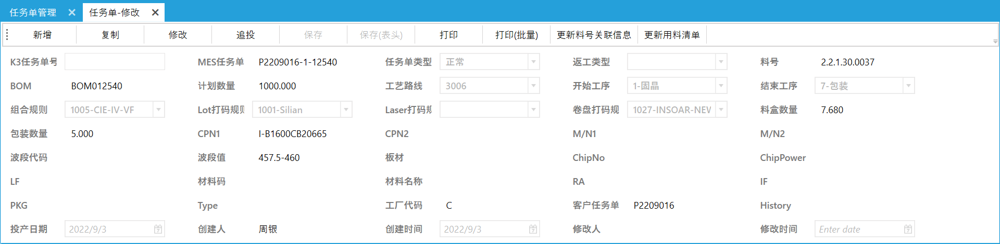

# 信息

四联封装安装路径 ：  10.0.0.60：9095

封装共享文件夹：	\ \10.0.0.80

mes系统 管理账号：admin 密码：majunjie

10.0.0.60服务器 用户名  Administrator  密码 $ilian@2021

# 发布流程：

1.

选择更新后的服务端HOST（更新过除WPF的任何项目）或者客户端WPF（只更新过WPF项目）右键发布


2.

win+R 输入 mstsc

连接10.0.0.60远程服务器

用户名  Administrator  密码 $ilian@2021

3.

打开  internet information service （iis）管理器

选择 客户端SL_FZ_MES UI 或者 后端SL_FZ_MES HOST 停止服务 浏览文件夹

4.

SL_FZ_MES UI 中 

- 覆盖 ApplicationFiles 中的四联封装MES_1_0_0_XXX  /  setup.exe / 四联封装MES.application 三个文件
- 注意ApplicationFiles 中的四联封装MES_1_0_0_XXX 版本号 = 服务器版本号 + 1

SL_FZ_MES HOST 中

- web.config文件不覆盖外 
- 不覆盖appsettings.json、appsettings.production.json、appsettings.Staging.json等三个文件 
- 或者 发布前 将ConnectionStrings中本地数据库连接 换成第二行四联封装数据库
- 其余全部覆盖


5.启动 客户端SL_FZ_MES UI 或者 后端SL_FZ_MES HOST 

# 记录

## Lextar标签修改WO

### 需求：


### 修改：

SL.MES.Application\AppServices\WorkOrders\WorkOrderAppService.cs

public string GetSmallLot(CreateUpdateWorkOrderDto input,bool isAddto=false)

```c#
case "LEXTAR":
                    #region Lextar Lot
                    string wo = input.WorkOrderDto.Number.Split('-')[0];
                    wo = wo.Substring(4, wo.Length - 4).PadLeft(3,'0');

                    lotno = "S02TM" + dt.Year.ToString().Substring(2, 2)
                                + ConvertMonth.GetShortMonth(dt.Month)
                                //+ input.WorkOrderDto.Number.Substring(4, 3) + "-"
                                //"S02TM" + input.WorkOrderDto.ProductDate.ToString().Substring(3,1) 
                                //+ ConvertMonth.GetShortMonth(input.WorkOrderDto.ProductDate.Month)
                                + wo + "-"
                                + input.WorkOrderDto.BC
                                + input.WorkOrderDto.WD
                                + input.WorkOrderDto.ChipNo
                                + input.WorkOrderDto.ChipPower
                                + (input.WorkOrderDto.ReWorkType.HasValue ? "R1" : "01");
                    //input.WorkOrderDto.CustomerNumber = lotno;
                    #endregion
                    break;
```

### 测试：

系统设置-打印设置	选择打印模板与打印机


新建任务单


新增分批


选择分批结果后 打印模板后 打印查看结果标签


## Insoar标签修改L/N、PKG ID 

### 需求：

参考盈硕的两种标签模板调试：（盈硕用“-0”，封装用“-1”区分）

模板一：L/N位置需要显示“-1”；S/C位置需要根据L/N的字符 将“-”隐藏，保留“1”

模板二：L/N位置需要显示“-1”；PKG位置需要根据L/N的字符将“-”隐藏，保留“1”


### 修改：

思路：

1、任务单上维护”客户任务单"字段，新建任务单时添加 “-1” ，标签打印会提取此字段信息。

2、已投产未变更的任务单，可以通过，修改“客户任务单”字段改变标签打印信息。已分批的标签需要重新分批。

代码：

1、SL.MES.UI.WPF \ Extensions\MESHelper \ PrintHelper.cs

- public void PrintReelInsoar3806NewNew(LotDto lotDto)


```c#
public void PrintReelInsoar3806NewNew(LotDto lotDto)
        {
            try
            {
                string qrstr;
                string FQty = decimal.Round(decimal.Parse(lotDto.Qty.ToString()) * 1000, 0).ToString();
                
                //1.提取客户任务单字段信息
                //string woString = lotDto.WorkOrderDto.Number.Split('-')[0];
                string woString = lotDto.WorkOrderDto.CustomerNumber;
                
                
                btFormat.SubStrings["MF_PN"].Value = lotDto.WorkOrderDto.PartNumberDto.Spec; 
                btFormat.SubStrings["MF_PN_TEXT"].Value = "P/N:" + lotDto.WorkOrderDto.PartNumberDto.Spec;
                
                //2.获取woString组成L/N打印信息
                btFormat.SubStrings["LN"].Value = woString;
                btFormat.SubStrings["LN_TEXT"].Value = "L/N:" + woString;
                
                btFormat.SubStrings["DATE"].Value = lotDto.CreationTime.Year.ToString()
                    + "-"
                    + lotDto.CreationTime.Month.ToString().PadLeft(2, '0')
                    + "-"
                    + lotDto.CreationTime.Day.ToString().PadLeft(2, '0');
                btFormat.SubStrings["DATE_TEXT"].Value = "DATE:" + lotDto.CreationTime.Year.ToString()
                    + "-"
                    + lotDto.CreationTime.Month.ToString().PadLeft(2, '0')
                    + "-"
                    + lotDto.CreationTime.Day.ToString().PadLeft(2, '0');
                btFormat.SubStrings["QTY"].Value = FQty;
                btFormat.SubStrings["QTY_TEXT"].Value = "Q'TY:" + FQty + "PCS";
                btFormat.SubStrings["SN"].Value = lotDto.CustomerBinCode;
                btFormat.SubStrings["SN_TEXT"].Value = lotDto.CustomerBinCode;
                btFormat.SubStrings["IV_TEXT"].Value = "IV:" + lotDto.SplitProBinDto.ParIvNumber + "(" + lotDto.SplitProBinDto.ParIvValue + ")";
                btFormat.SubStrings["CIE_TEXT"].Value = "CIE:" + lotDto.SplitProBinDto.ParCieNumber;
                btFormat.SubStrings["VF_TEXT"].Value = "VF:" + lotDto.SplitProBinDto.ParVfNumber + "(" + lotDto.SplitProBinDto.ParVfValue + ")";
                btFormat.SubStrings["BIN"].Value = lotDto.SplitProBinDto.BinCode;
                btFormat.SubStrings["BIN_TEXT"].Value = "BIN CODE:" + lotDto.SplitProBinDto.BinCode;
                btFormat.SubStrings["BINNO_TEXT"].Value = lotDto.SplitProBinDto.BinNo.ToString();
                btFormat.SubStrings["SC_TEXT"].Value = lotDto.LotNumber;
                btFormat.SubStrings["SC"].Value = lotDto.LotNumber;
                
                
			  //3.根据qrstr生成二维码
                qrstr = string.Format("CPN:;CNAME:;PN:{0};NAME:{1};QTY:{2};CAT:{3};HUE:{4};REF:{5};LOTNO:{6};REFERENCE:{7}",
                                        lotDto.WorkOrderDto.PartNumberDto.Spec,
                                        lotDto.WorkOrderDto.PartNumberDto.Spec,
                                        FQty,
                                        lotDto.ParIvNumber + "(" + lotDto.ParIvValue + ")",
                                        lotDto.ParCieNumber,
                                        lotDto.ParVfNumber + "(" + lotDto.ParVfValue + ")",
                                        woString,
                                        lotDto.LotNumber);
                btFormat.SubStrings["QR"].Value = qrstr;   
                
                
                btFormat.Print();
            }
            catch
            {
                RadWindowHelper.ShowErrorMessageBox("打印失败!");
            }
        }
```

- public void PrintReelInsoar4014NEW(LotDto lotDto) 如上修改

2、SL.MES.Application\AppServices\SplitRecords\SplitRecordAppService.cs

- async public override Task<SplitRecordDto> Create(SplitRecordDto input)


```c#
 case "INSOAR-NEWNEW":
                        #region REEL-INSOAR-NEWNEW
                       
                        //提取客户任务单字段信息，并删除 "-" 
                        //woString = input.LotDto.WorkOrderDto.Number.Substring(0,10);
                        woString = input.LotDto.WorkOrderDto.CustomerNumber.Replace("-", "");

                        string sc1 = woString
                            + dt.Year.ToString()
                            + dt.Month.ToString().PadLeft(2, '0')
                            + dt.Day.ToString().PadLeft(2, '0');
                        //+ lotDto.SerialNumber.ToString().PadLeft(3, '0');
                        serial = await _serialManager.GetNewSerialNumber("INSOAR-NEW", count, "d");
                        //serial = await _serialManager.GetNewSerialNumber(woString, count, "n");
                        serial.Number -= count;

                        ss = input.LotDto.WorkOrderDto.PartNumberDto.Spec.Split('-');
                        for (int x = 0; x < ss.Count(); x++)
                        {
                            lotNumber += ss[x];
                        }
                        lotNumber = lotNumber + woString + input.LotDto.SplitProBinDto.BinCode;


                        for (int i = 1; i <= count; i++)
                        {
                            serial.Number++;
                            var lotchild = ObjectMapper.Map<Lot>(input.LotDto);
                            //lotchild.ParentId = input.LotId;
                            lotchild.IsRoot = false;
                            lotchild.Id = 0;
                            lotchild.Qty = input.PackageQty;
                            lotchild.WorkOrder = null;
                            lotchild.SplitProBin = null;
                            lotchild.Parent = null;
                            lotchild.SerialNumber = serial.Number;
                            if (i == count && remainder > 0)
                            {
                                lotchild.Qty = lotchild.PlanQty = (decimal)(remainder * 0.001);
                            }
                            //lotchild.LotNumber = lotNumber;
                            lotchild.LotNumber = sc1 + serial.Number.ToString().PadLeft(3, '0');
                            lotchild.CustomerBinCode = lotNumber;
                            splitRecord.SplitLists.Add(new SplitList
                            {
                                Qty = lotchild.Qty,
                                //LotId = await _repositoryLot.InsertAndGetIdAsync(lotchild),
                                LotId = await _lotManager.UniqueValidateInsertAndGetIdAsync(lotchild)
                            });
                        }
                        #endregion
                        break;
```

- case "INSOAR4014NEW" 如上修改


### 测试：

新建任务单（开始工序选择分光，减少出入站操作）：



新建分光程序：


新增分光出站


根据出站记录中的分光条码进行分批后打印


选择分批结果 和 打印模板后 打印查看结果标签


## Lumens5630标签打印添加两个字段

### 需求：

将Lumens5630标签如下图中的Lumens7020标签一样添加 材料码（#F03-3 ）和 材料名称（HC 28 -> 26） 两个字段


### 修改:

SL.MES.UI.WPF\Extensions\MESHelper\PrintHelper.cs

```c#
public void PrintReelLumens5630(LotDto lotDto)
        {
            try
            {
                btFormat.SubStrings["PN"].Value=lotDto.WorkOrderDto.CPN1 + "-" + lotDto.SplitProBinDto.CustomerBinNo;
                btFormat.SubStrings["LotNo"].Value=lotDto.LotNumber.Split('%')[0];
                btFormat.SubStrings["VF"].Value=lotDto.SplitProBinDto.ParVfValue;
                btFormat.SubStrings["IV"].Value=lotDto.SplitProBinDto.ParIvValue;
                btFormat.SubStrings["CIE"].Value=lotDto.SplitProBinDto.ParCieNumber;
                btFormat.SubStrings["QTY"].Value = ((int)(lotDto.Qty * 1000)).ToString();
                btFormat.SubStrings["SN"].Value=lotDto.LotNumber.Split('%')[1].Split('$')[0];
                btFormat.SubStrings["BIN"].Value=lotDto.SplitProBinDto.CustomerBinNo;
                btFormat.SubStrings["BN"].Value=lotDto.LotNumber;
                //添加两个标签打印字段（名称不符合标准，但已有字段，直接使用，不做新增，）
                btFormat.SubStrings["TempNo"].Value = lotDto.WorkOrderDto.MaterialNo;
                btFormat.SubStrings["MaterialName"].Value = lotDto.WorkOrderDto.MaterialName;
                btFormat.Print();
            }
            catch
            {
                RadWindowHelper.ShowErrorMessageBox("打印失败!");
            }
        }
```

修改标签模板文件LUMENS_5630(NewNew).btw，添加两个文本，并与TempNo、MaterialName绑定


### 测试：

新建任务单，输入 材料码 与 材料名称 


分批记录中选择LUMENS_5630打印模板打印，结果如下


