# SSM 框架整合案例

## 项目简介

使用 SSM 框架搭建出一套简单的 CRUD 项目示例，主要涉及两张表：员工表和部门表，其中每个员工都对应一个部门。


### 主要实现的功能

1、分页查询所有员工信息并展示列表。

2、添加一条员工的信息。

3、新增数据需要校验：

- jQuery 前端校验用户名和邮箱是否合法。
- Ajax 请求校验用户名是否重复。
- JSR 303 后端校验用户名、邮箱是否合法以及用户名是否重复。

4、编辑修改某条员工的信息。

5、删除某条员工的信息，批量删除所选员工的信息。

6、RESTful 风格的URI。


### 涉及的技术

1、后端框架：SSM（Spring 5 + Spring MVC + MyBatis 3）+ Maven 3.6.3

2、MyBatis 分页插件：PageHelper

3、MyBatis 逆向工程：MyBatis Generator

4、数据库：MySQL 5.7 + Druid 数据库连接池

5、前端框架：BootStrap 5


### 最终效果图

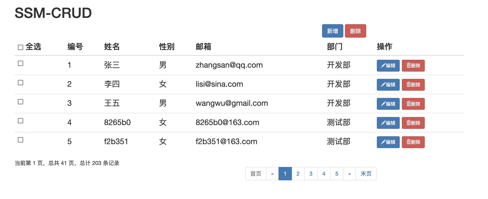

https://github.com/JyunkaiWang/ssm-crud


## 一、搭建环境

### 1、搭建框架、引入依赖和Tomcat

**（1）创建一个 Maven 工程：**

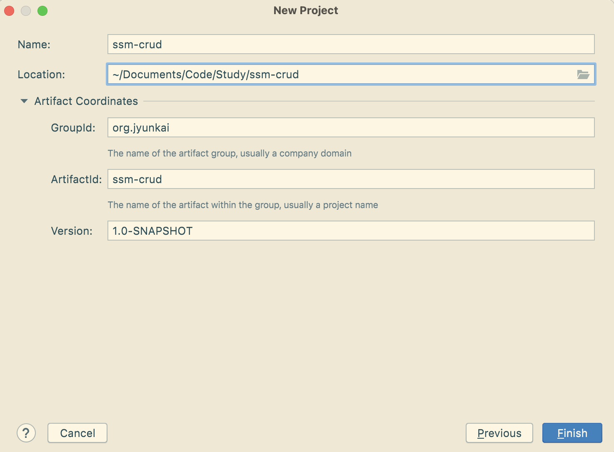


**（2）添加依赖，打包方式为 war：**

```xml
<?xml version="1.0" encoding="UTF-8"?>
<project xmlns="http://maven.apache.org/POM/4.0.0"
         xmlns:xsi="http://www.w3.org/2001/XMLSchema-instance"
         xsi:schemaLocation="http://maven.apache.org/POM/4.0.0
         http://maven.apache.org/xsd/maven-4.0.0.xsd">
    <modelVersion>4.0.0</modelVersion>

    <groupId>org.jyunkai</groupId>
    <artifactId>ssm-crud</artifactId>
    <version>1.0-SNAPSHOT</version>
    <packaging>war</packaging>

    <properties>
        <maven.compiler.source>8</maven.compiler.source>
        <maven.compiler.target>8</maven.compiler.target>
    </properties>

    <dependencies>
        <!--Spring：核心模块、Web模块、MVC模块、JDBC模块、事务模块、AspectJ模块、测试模块-->
        <dependency>
            <groupId>org.springframework</groupId>
            <artifactId>spring-webmvc</artifactId>
            <version>5.3.10</version>
        </dependency>
        <dependency>
            <groupId>org.springframework</groupId>
            <artifactId>spring-jdbc</artifactId>
            <version>5.3.10</version>
        </dependency>
        <dependency>
            <groupId>org.springframework</groupId>
            <artifactId>spring-aspects</artifactId>
            <version>5.3.10</version>
        </dependency>
        <dependency>
            <groupId>org.springframework</groupId>
            <artifactId>spring-test</artifactId>
            <version>5.3.10</version>
        </dependency>
        <!--MyBatis、MyBatis与Spring的整合、MyBatis生成器-->
        <dependency>
            <groupId>org.mybatis</groupId>
            <artifactId>mybatis</artifactId>
            <version>3.5.7</version>
        </dependency>
        <dependency>
            <groupId>org.mybatis</groupId>
            <artifactId>mybatis-spring</artifactId>
            <version>2.0.6</version>
        </dependency>
        <dependency>
            <groupId>org.mybatis.generator</groupId>
            <artifactId>mybatis-generator-core</artifactId>
            <version>1.4.0</version>
        </dependency>
        <!--MySQL驱动与Druid数据库连接池-->
        <dependency>
            <groupId>mysql</groupId>
            <artifactId>mysql-connector-java</artifactId>
            <version>8.0.25</version>
        </dependency>
        <dependency>
            <groupId>com.alibaba</groupId>
            <artifactId>druid</artifactId>
            <version>1.2.7</version>
        </dependency>
        <!--JSTL-->
        <dependency>
            <groupId>jstl</groupId>
            <artifactId>jstl</artifactId>
            <version>1.2</version>
        </dependency>
        <!--Servlet-->
        <dependency>
            <groupId>javax.servlet</groupId>
            <artifactId>javax.servlet-api</artifactId>
            <version>4.0.1</version>
            <scope>provided</scope>
        </dependency>
        <!--Junit 5-->
        <dependency>
            <groupId>org.junit.jupiter</groupId>
            <artifactId>junit-jupiter</artifactId>
            <version>5.8.1</version>
            <scope>test</scope>
        </dependency>
        <!--logback-->
        <dependency>
            <groupId>ch.qos.logback</groupId>
            <artifactId>logback-classic</artifactId>
            <version>1.2.6</version>
        </dependency>
        <!--slf4j-->
        <dependency>
            <groupId>org.slf4j</groupId>
            <artifactId>slf4j-api</artifactId>
            <version>1.7.32</version>
        </dependency>
        <!--jcl-slf4j适配包-->
        <dependency>
            <groupId>org.slf4j</groupId>
            <artifactId>jcl-over-slf4j</artifactId>
            <version>1.7.31</version>
        </dependency>
        <!--lombok：自动生成JavaBean的方法、构造器-->
        <dependency>
            <groupId>org.projectlombok</groupId>
            <artifactId>lombok</artifactId>
            <version>1.18.20</version>
        </dependency>
        <!--PageHelper：用于分页查询-->
        <dependency>
            <groupId>com.github.pagehelper</groupId>
            <artifactId>pagehelper</artifactId>
            <version>5.2.1</version>
        </dependency>
        <!--Jackson：处理JSON数据-->
        <dependency>
            <groupId>com.fasterxml.jackson.core</groupId>
            <artifactId>jackson-databind</artifactId>
            <version>2.12.5</version>
        </dependency>
        <!-- JSR 303 数据校验-->
        <dependency>
            <groupId>org.hibernate</groupId>
            <artifactId>hibernate-validator</artifactId>
            <version>7.0.1.Final</version>
        </dependency>

    </dependencies>
</project>
```


**（3）刷新 Maven 后，在 resources 目录下添加 webapp 目录和 web.xml 文件，并在 webapp 目录下创建一个 index.jsp 页面。**

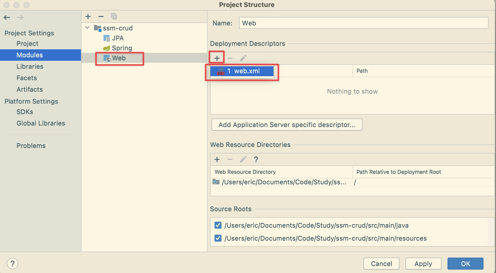


**（4）然后创建基本的包：**

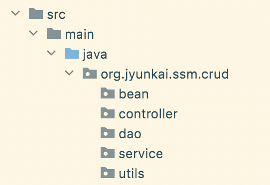


**（5）然后配置 Tomcat 9 服务器：**

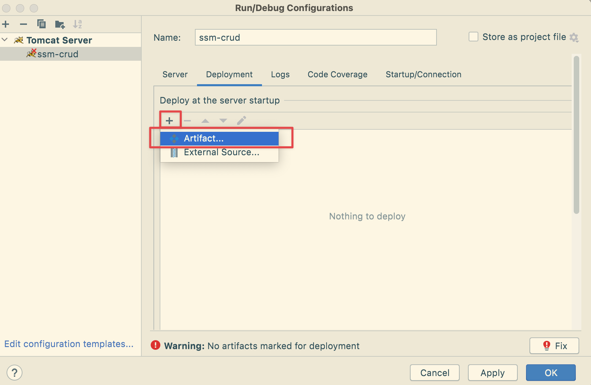

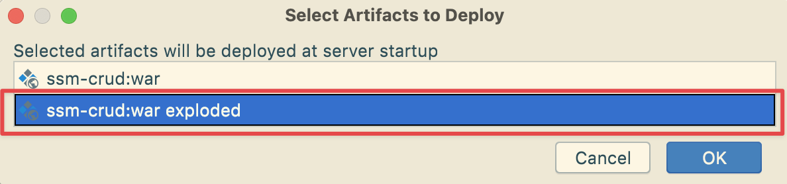

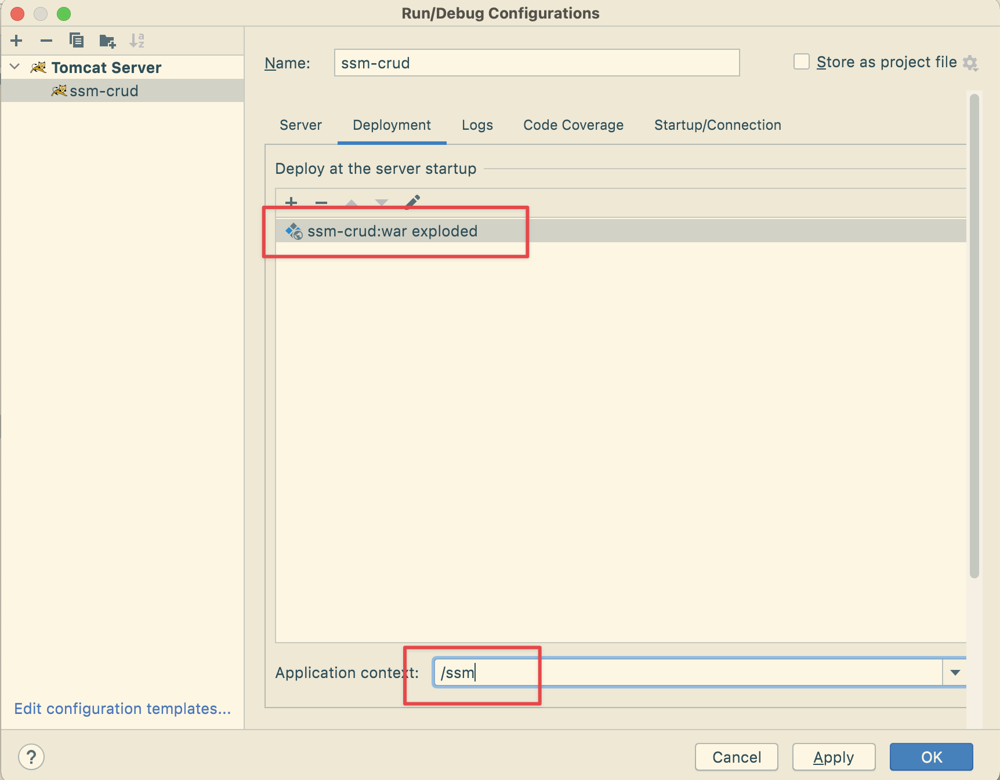

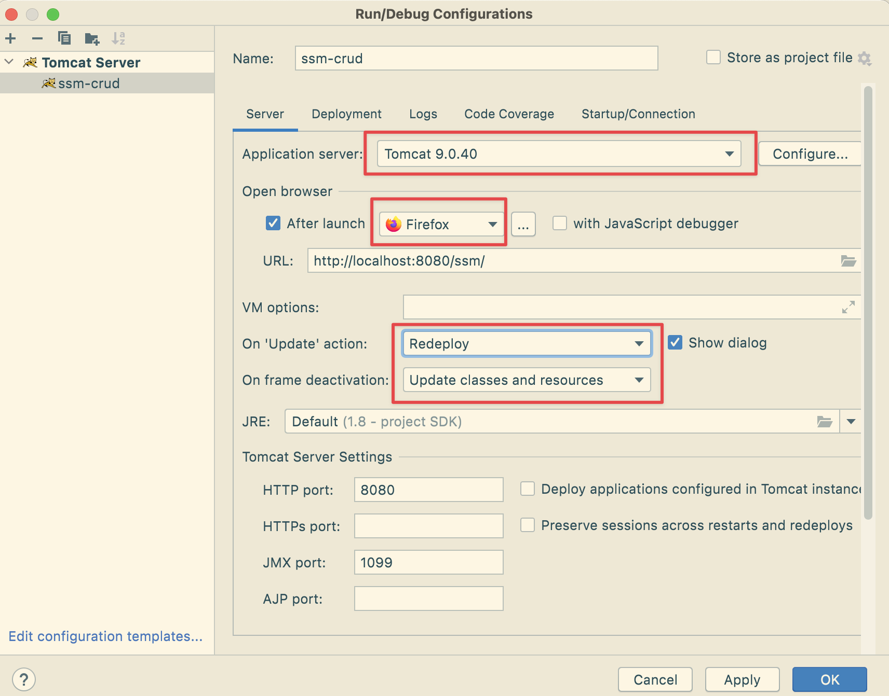


### 2、引入 BootStrap 前端框架

Bootstrap 官网：https://getbootstrap.com/，图标资源官网：https://icons.getbootstrap.com/

中文第3版Bootstrap的学习资料：https://v3.bootcss.com/getting-started/


虽然最新版 Bootstrap 已经到 5，但是本项目还是采用版本 3，此外还需要添加 jQuery，如下图所示：

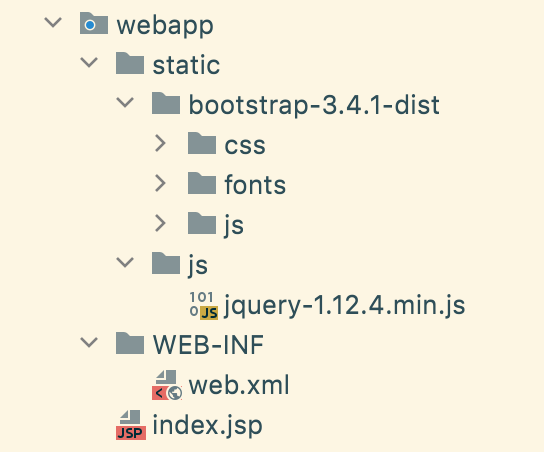


在 index.jsp 页面引入，注意 web 资源路径的问题！

```html
<%@ page contentType="text/html;charset=UTF-8" language="java" %>
<%@ taglib prefix="c" uri="http://java.sun.com/jsp/jstl/core" %>
<html>
<head>
    <meta charset="utf-8">
    <meta http-equiv="X-UA-Compatible" content="IE=edge">
    <meta name="viewport" content="width=device-width, initial-scale=1">
    <!-- 上述3个meta标签必须放在最前面，任何其他内容都必须跟随其后！ -->

    <!--
    web路径问题
    不以/开始的是相对路径，以当前资源的路径为基准，容易出现问题
    以/开始的是绝对路径，以服务器根路径为基准，推荐使用
    -->
    <% pageContext.setAttribute("APP_PATH", request.getContextPath()); %>

    <%--引入Bootstrap的CSS资源--%>
    <link href="${APP_PATH}/static/bootstrap-3.4.1-dist/css/bootstrap.min.css" rel="stylesheet"/>

    <title>首页</title>
</head>
<body>

<h1>Hello World</h1>

<!-- jQuery (Bootstrap 的所有 JavaScript 插件都依赖 jQuery，所以必须放在前边) -->
<script src="${APP_PATH}/static/js/jquery-1.12.4.min.js"></script>

<!-- 加载 Bootstrap 的所有 JavaScript 插件。你也可以根据需要只加载单个插件。 -->
<script src="${APP_PATH}/static/bootstrap-3.4.1-dist/js/bootstrap.min.js"></script>

</body>
</html>
```


### 3、配置 web.xml

```xml
<?xml version="1.0" encoding="UTF-8"?>
<web-app xmlns="http://xmlns.jcp.org/xml/ns/javaee"
         xmlns:xsi="http://www.w3.org/2001/XMLSchema-instance"
         xsi:schemaLocation="http://xmlns.jcp.org/xml/ns/javaee
         http://xmlns.jcp.org/xml/ns/javaee/web-app_4_0.xsd"
         version="4.0">

    <!--1、启动 Spring 容器-->
    <!--
    配置ContextLoaderListener, 加载Spring父容器 (父类的initWebApplicationContext()方法中)
    可以从ServletContext中根据 WebApplicationContext.ROOT_WEB_APPLICATION_CONTEXT_ATTRIBUTE 这个key来找到Spring容器
    -->
    <context-param>
        <!-- 指定Spring配置文件位置 -->
        <param-name>contextConfigLocation</param-name>
        <param-value>classpath:applicationContext.xml</param-value>
    </context-param>
    <!-- 该监听器将根据contextConfigLocation参数加载Spring配置文件, 初始化Spring应用上下文 -->
    <listener>
        <listener-class>org.springframework.web.context.ContextLoaderListener</listener-class>
    </listener>

    <!--2、配置 Spring MVC 的前端控制器，拦截所有请求-->
    <!--
       配置DispatcherServlet, 加载Spring MVC子容器 (父类的initWebApplicationContext()方法中)
       可以从ServletContext中根据 FrameworkServlet.SERVLET_CONTEXT_PREFIX+Servlet名称 作为key来找到Spring MVC容器
    -->
    <servlet>
        <servlet-name>DispatcherServlet</servlet-name>
        <servlet-class>org.springframework.web.servlet.DispatcherServlet</servlet-class>
        <init-param>
            <!-- 指定Spring MVC配置文件位置, 默认是 /WEB-INF/<servlet-name>-servlet.xml -->
            <param-name>contextConfigLocation</param-name>
            <param-value>classpath:spring-mvc.xml</param-value>
        </init-param>
        <!-- 随 Tomcat 一起启动 -->
        <load-on-startup>1</load-on-startup>
    </servlet>
    <servlet-mapping>
        <servlet-name>DispatcherServlet</servlet-name>
        <!-- / 接收所有请求, 除了jsp; /* 接收所有请求, 包括jsp -->
        <url-pattern>/</url-pattern>
    </servlet-mapping>

    <!--3、配置过滤器-->
    <!--配置字符编码过滤器，一定要放在所有过滤器之前，/* 表示拦截所有请求-->
    <!-- 一定要放在最前面! -->
    <filter>
        <filter-name>CharacterEncodingFilter</filter-name>
        <filter-class>org.springframework.web.filter.CharacterEncodingFilter</filter-class>
        <init-param>
            <param-name>encoding</param-name>
            <param-value>UTF-8</param-value>
        </init-param>
        <!-- 强制设置响应编码, 不强制设置请求编码(当请求中未指定编码时才设置) -->
        <init-param>
            <param-name>forceResponseEncoding</param-name>
            <param-value>true</param-value>
        </init-param>
    </filter>
    <filter-mapping>
        <filter-name>CharacterEncodingFilter</filter-name>
        <url-pattern>/*</url-pattern>
    </filter-mapping>

    <!-- 配置HTTP方法过滤器, 实现REST风格的增删改查 -->
    <!-- 该过滤器根据指定的请求参数(默认是"_method")来修改请求的类型 -->
    <filter>
        <filter-name>HiddenHttpMethodFilter</filter-name>
        <filter-class>org.springframework.web.filter.HiddenHttpMethodFilter</filter-class>
    </filter>
    <filter-mapping>
        <filter-name>HiddenHttpMethodFilter</filter-name>
        <url-pattern>/*</url-pattern>
    </filter-mapping>
    <filter>
      <filter-name>FormContentFilter</filter-name>
      <filter-class>org.springframework.web.filter.FormContentFilter</filter-class>
    </filter>
    <filter-mapping>
      <filter-name>FormContentFilter</filter-name>
      <url-pattern>/*</url-pattern>
    </filter-mapping>

</web-app>
```


### 4、配置 spring-mvc.xml

Spring MVC 的配置文件，主要包含网站跳转逻辑的控制、配置。

```xml
<?xml version="1.0" encoding="UTF-8"?>
<beans xmlns="http://www.springframework.org/schema/beans"
       xmlns:xsi="http://www.w3.org/2001/XMLSchema-instance"
       xmlns:context="http://www.springframework.org/schema/context"
       xmlns:mvc="http://www.springframework.org/schema/mvc"
       xsi:schemaLocation="http://www.springframework.org/schema/beans
       http://www.springframework.org/schema/beans/spring-beans.xsd
       http://www.springframework.org/schema/context
       https://www.springframework.org/schema/context/spring-context.xsd
       http://www.springframework.org/schema/mvc
       https://www.springframework.org/schema/mvc/spring-mvc.xsd">

    <!-- Spring MVC 的配置文件，主要包含网站跳转逻辑的控制、配置-->
    <context:component-scan base-package="org.jyunkai.ssm.crud.controller" use-default-filters="false">
        <!--只扫描控制器-->
        <context:include-filter type="annotation" expression="org.springframework.stereotype.Controller"/>
    </context:component-scan>

    <!-- 配置视图解析器 -->
    <bean id="viewResolver" class="org.springframework.web.servlet.view.InternalResourceViewResolver">
        <property name="prefix" value="/WEB-INF/views/"/>
        <property name="suffix" value=".jsp"/>
    </bean>

    <!--将 Spring MVC 不能处理的请求交给 tomcat 处理-->
    <mvc:default-servlet-handler/>

    <!-- 开启mvc注解驱动 -->
    <!--能支持 Spring MVC 更高级的一些功能，比如 JSR 303 校验、快捷的 Ajax 映射动态请求等-->
    <mvc:annotation-driven/>

</beans>
```


### 5、配置 applicationContext.xml

Spring 的配置文件，主要配置业务逻辑相关的内容：数据源、与MyBatis的整合、事务控制等。  


**（1）先创建一个 dbconfig.properties，用来保存数据库驱动的配置信息**

```properties
jdbc.driver=com.mysql.cj.jdbc.Driver
jdbc.url=jdbc:mysql://localhost:3306/ssm_crud?allowMultiQueries=true&serverTimezone=Asia/Shanghai
jdbc.username=root
jdbc.password=12345678
```


**（2）然后在 Spring 的配置文件中引入文件，并做其它配置：**

```xml
<?xml version="1.0" encoding="UTF-8"?>
<beans xmlns="http://www.springframework.org/schema/beans"
       xmlns:xsi="http://www.w3.org/2001/XMLSchema-instance"
       xmlns:context="http://www.springframework.org/schema/context"
       xmlns:aop="http://www.springframework.org/schema/aop"
       xmlns:tx="http://www.springframework.org/schema/tx"
       xsi:schemaLocation="http://www.springframework.org/schema/beans
       http://www.springframework.org/schema/beans/spring-beans.xsd
       http://www.springframework.org/schema/context
       https://www.springframework.org/schema/context/spring-context.xsd
       http://www.springframework.org/schema/aop
       https://www.springframework.org/schema/aop/spring-aop.xsd
       http://www.springframework.org/schema/tx
       http://www.springframework.org/schema/tx/spring-tx.xsd">

    <!--1、配置扫描包，不扫描controller-->
    <context:component-scan base-package="org.jyunkai.ssm.crud">
        <context:exclude-filter type="annotation" expression="org.springframework.stereotype.Controller"/>
    </context:component-scan>

    <!--2、数据源的配置-->
    <context:property-placeholder location="classpath:dbconfig.properties"/>
    <bean id="dataSource" class="com.alibaba.druid.pool.DruidDataSource">
        <property name="driverClassName" value="${jdbc.driver}"/>
        <property name="url" value="${jdbc.url}"/>
        <property name="username" value="${jdbc.username}"/>
        <property name="password" value="${jdbc.password}"/>
    </bean>

    <!--3、与 MyBatis 的整合配置-->
    <bean id="sqlSessionFactory" class="org.mybatis.spring.SqlSessionFactoryBean">
        <!--指定 MyBatis 全局配置文件的位置-->
        <property name="configLocation" value="classpath:mybatis-config.xml"/>
        <!--指定数据源-->
        <property name="dataSource" ref="dataSource"/>
        <property name="mapperLocations" value="classpath:mapper/*.xml"/>
    </bean>

    <!--配置扫描器，将 MyBatis 接口的实现加入到 IOC 容器中-->
    <bean class="org.mybatis.spring.mapper.MapperScannerConfigurer">
        <!--扫描所有的 DAO 接口的实现，加入到 IOC 容器中-->
        <property name="basePackage" value="org.jyunkai.ssm.crud.dao"/>
    </bean>

    <!--配置一个可以执行批量操作的 sqlSession-->
    <bean id="sqlSession" class="org.mybatis.spring.SqlSessionTemplate">
        <constructor-arg name="sqlSessionFactory" ref="sqlSessionFactory"/>
        <constructor-arg name="executorType" value="BATCH"/>
    </bean>

    <!--4、事务控制-->
    <bean id="transactionManager" class="org.springframework.jdbc.datasource.DataSourceTransactionManager">
        <!--控制住数据源-->
        <property name="dataSource" ref="dataSource"/>
    </bean>

    <!--开启基于注解的事务，使用 XML 配置形式的事务（比较主要的事务都用配置式）-->
    <aop:config>
        <!--切入点表达式-->
        <aop:pointcut id="txPoint" expression="execution(* com.atguigu.service..*(..))"/>
        <!--配置事务增强-->
        <aop:advisor advice-ref="txAdvice" pointcut-ref="txPoint"/>
    </aop:config>

    <!--配置事务增强，事务如何增强-->
    <tx:advice id="txAdvice">
        <tx:attributes>
            <!--
             * 代表所有方法都是事务方法
             get* 代表以get开始的所有方法
             -->
            <tx:method name="*"/>
            <tx:method name="get*" read-only="true"/>
        </tx:attributes>
    </tx:advice>

</beans>
```


### 6、配置 mybatis-config.xml

```xml
<?xml version="1.0" encoding="UTF-8" ?>
<!DOCTYPE configuration
        PUBLIC "-//mybatis.org//DTD Config 3.0//EN"
        "http://mybatis.org/dtd/mybatis-3-config.dtd">
<configuration>

    <settings>
        <!--可以返回自动生成主键-->
        <setting name="useGeneratedKeys" value="true"/>
        <!--驼峰命名映射-->
        <setting name="mapUnderscoreToCamelCase" value="true"/>
    </settings>

    <typeAliases>
        <!--给Java Bean起别名，默认是类名小写-->
        <package name="org.jyunkai.ssm.crud.bean"/>
    </typeAliases>

    <plugins>
        <plugin interceptor="com.github.pagehelper.PageInterceptor">
            <!--分页参数合理化  -->
            <property name="reasonable" value="true"/>
        </plugin>
    </plugins>

</configuration>
```


### 7、创建数据库表

```sql
CREATE TABLE `tbl_emp` (
  `emp_id` int(11) NOT NULL AUTO_INCREMENT,
  `emp_name` varchar(255) DEFAULT NULL,
  `gender` char(1) DEFAULT NULL,
  `email` varchar(255) DEFAULT NULL,
  `d_id` int(11) DEFAULT NULL,
  PRIMARY KEY (`emp_id`)
) ENGINE=InnoDB DEFAULT CHARSET=utf8;


CREATE TABLE `tbl_dept` (
  `dept_id` int(11) NOT NULL AUTO_INCREMENT,
  `dept_name` varchar(255) DEFAULT NULL,
  PRIMARY KEY (`dept_id`)
) ENGINE=InnoDB DEFAULT CHARSET=utf8;
```


### 8、MyBatis 逆向工程

**（1）创建 mbg.xml 文件**

```xml
<!DOCTYPE generatorConfiguration PUBLIC
        "-//mybatis.org//DTD MyBatis Generator Configuration 1.0//EN"
        "http://mybatis.org/dtd/mybatis-generator-config_1_0.dtd">

<generatorConfiguration>

    <!--targetRuntime设置生成的模式-->
    <context id="DB2Tables" targetRuntime="MyBatis3">

        <!--阻止注释的生成-->
        <commentGenerator>
            <property name="suppressAllComments" value="true"/>
        </commentGenerator>

        <!--配置数据库连接信息-->
        <jdbcConnection driverClass="com.mysql.cj.jdbc.Driver"
                        connectionURL="jdbc:mysql://localhost:3306/ssm_crud?useSSL=false"
                        userId="root"
                        password="12345678"/>

        <javaTypeResolver>
            <property name="forceBigDecimals" value="false"/>
        </javaTypeResolver>

        <!--指定 Java Bean 生成的位置-->
        <javaModelGenerator
                targetPackage="org.jyunkai.ssm.crud.bean"
                targetProject="src/main/java">
            <property name="enableSubPackages" value="true"/>
            <property name="trimStrings" value="true"/>
        </javaModelGenerator>

        <!--指定 SQL 映射文件生成的位置-->
        <sqlMapGenerator
                targetPackage="mapper"
                targetProject="src/main/resources">
            <property name="enableSubPackages" value="true"/>
        </sqlMapGenerator>

        <!--指定 mapper(dao) 接口生成的位置-->
        <javaClientGenerator type="XMLMAPPER"
                             targetPackage="org.jyunkai.ssm.crud.dao"
                             targetProject="src/main/java">
            <property name="enableSubPackages" value="true"/>
        </javaClientGenerator>

        <!--table 指定每个表的生成策略-->
        <table tableName="tbl_emp" domainObjectName="Employee"/>
        <table tableName="tbl_dept" domainObjectName="Department"/>

    </context>
</generatorConfiguration>
```


**（2）运行程序**

```java
public class MBGTest {
    public static void main(String[] args) throws Exception {
        List<String> warnings = new ArrayList<>();
        boolean overwrite = true;
        File configFile = new File("src/main/resources/mbg.xml");
        ConfigurationParser cp = new ConfigurationParser(warnings);
        Configuration config = cp.parseConfiguration(configFile);
        DefaultShellCallback callback = new DefaultShellCallback(overwrite);
        MyBatisGenerator myBatisGenerator = new MyBatisGenerator(config, callback, warnings);
        myBatisGenerator.generate(null);
    }
}
```


**（3）IDEA 配置数据库连接**

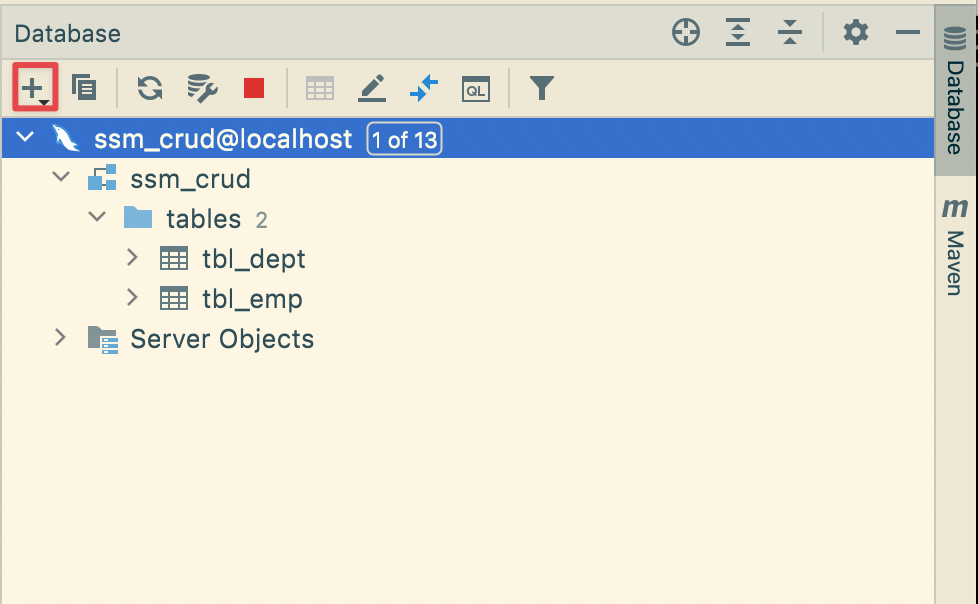


### 9、完善项目结构

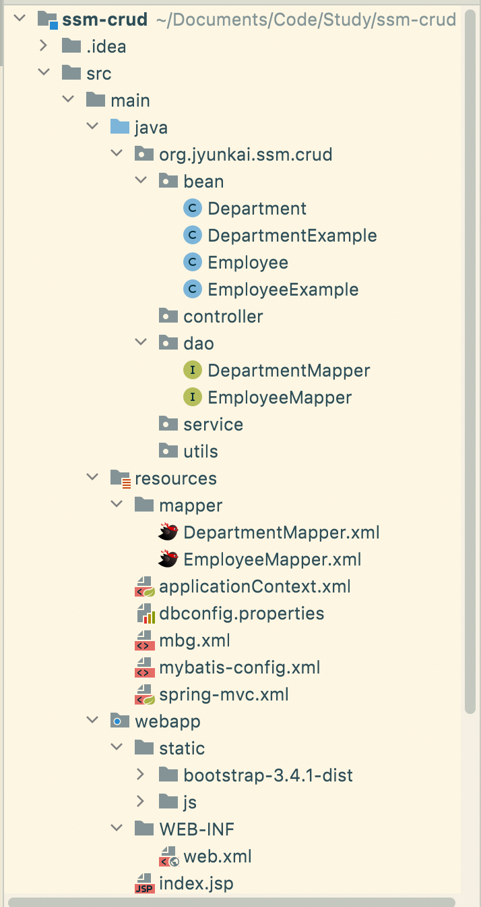


**修改 Employee 类，添加部门属性，使用 Lombok 的注解**

```java
@Data
@NoArgsConstructor
@AllArgsConstructor
public class Employee {
    private Integer empId;
    private String empName;
    private String gender;
    private String email;
    private Integer dId;
    
    //希望查询员工的同时，也查询部门信息
    private Department department;
    
    //为了给表插入数据，需要提供一个不带部门的构造器
    public Employee(Integer empId, String empName, String gender, String email, Integer dId) {
        this.empId = empId;
        this.empName = empName;
        this.gender = gender;
        this.email = email;
        this.dId = dId;
    }
}
```


**修改 Department 类，使用 Lombok 的注解**

```java
@Data
@NoArgsConstructor
@AllArgsConstructor
public class Department {
    private Integer deptId;
    private String deptName;
}
```


**修改 EmployeeMapper 接口，增加下面内容**

```java
public interface EmployeeMapper {
	......
        
    List<Employee> selectByExampleWithDept(EmployeeExample example);

    Employee selectByPrimaryKeyWithDept(Integer empId);
    
	......
}
```


**修改 EmployeeMapper.xml，增加下面内容**

```xml
  <!--新增的带有部门信息的返回结果集-->
  <resultMap id="WithDeptResultMap" type="org.jyunkai.ssm.crud.bean.Employee">
    <id column="emp_id" jdbcType="INTEGER" property="empId" />
    <result column="emp_name" jdbcType="VARCHAR" property="empName" />
    <result column="gender" jdbcType="CHAR" property="gender" />
    <result column="email" jdbcType="VARCHAR" property="email" />
    <result column="d_id" jdbcType="INTEGER" property="dId" />
    <association property="department" javaType="org.jyunkai.ssm.crud.bean.Department">
      <id column="dept_id" property="deptId"/>
      <result column="dept_name" property="deptName"/>
    </association>
  </resultMap>

	<!--带部门列的sql-->
  <sql id="WithDept_Column_List">
    e.emp_id, e.emp_name, e.gender, e.email, e.d_id, d.dept_id, d.dept_name
  </sql>

	<!--新增的带部门查询-->
  <select id="selectByExampleWithDept"
          parameterType="org.jyunkai.ssm.crud.bean.EmployeeExample"
          resultMap="WithDeptResultMap">
    select
    <if test="distinct">
      distinct
    </if>
    <include refid="WithDept_Column_List" />
    from tbl_emp e left join tbl_dept d on e.d_id=d.dept_id
    <if test="_parameter != null">
      <include refid="Example_Where_Clause" />
    </if>
    <if test="orderByClause != null">
      order by ${orderByClause}
    </if>
  </select>
  <select id="selectByPrimaryKeyWithDept"
          parameterType="java.lang.Integer"
          resultMap="WithDeptResultMap">
    select
    <include refid="WithDept_Column_List" />
    from tbl_emp e left join tbl_dept d on e.d_id=d.dept_id
    where emp_id = #{empId,jdbcType=INTEGER}
  </select>
```


### 10、Spring 整合 Junit 5 测试 Mapper 添加数据

```java
@SpringJUnitConfig(locations = "classpath:applicationContext.xml")
public class MapperTest {

    @Autowired
    DepartmentMapper departmentMapper;

    @Autowired
    EmployeeMapper employeeMapper;

    @Autowired
    SqlSession sqlSession;

    @Test
    public void testMapper() {
        //新增部门信息
        departmentMapper.insertSelective(new Department(null, "开发部"));
        departmentMapper.insertSelective(new Department(null, "测试部"));

        //插入一条员工数据
        employeeMapper.insertSelective(new Employee(null, "张三", "M", "zhangsan@qq.com", 1));
        employeeMapper.insertSelective(new Employee(null, "李四", "M", "lisi@163.com", 1));
        employeeMapper.insertSelective(new Employee(null, "王五", "M", "wangwu@sina.com", 1));

        //批量插入员工数据
        EmployeeMapper mapper = sqlSession.getMapper(EmployeeMapper.class);
        for (int i = 0; i < 100; i++) {
            String uid = UUID.randomUUID().toString().substring(0, 5) + i;
            mapper.insertSelective(new Employee(null, uid, "W", uid + "@gmail.com", 2));
        }
    }
}
```

## 二、查询数据

### 1、需要实现的功能

**（1）第一步，用 JSTL 实现（****URI：/emps****）：**

- 访问 index.jsp 页面。
- index.jsp 发送出查询员工列表的请求。
- EmployeeController 接收请求，查出员工的数据。
- 来到 list.jsp 页面进行展示。
- 使用 PageHelper 分页插件完成分页查询的功能。


**（2）第二步，用 Ajax 实现：**

- index.jsp 页面直接发送 Ajax 请求，进行员工分页数据的查询。
- 服务器将查出来的数据，通过 JSON 字符串的形式返回给浏览器。
- 浏览器收到 JSON 字符串后，用 JS 对JSON 解析，通过 DOM 增删改查页面。
- 返回 JSON，实现客户端的无关性。


### 2、Service

```java
public interface EmployeeService {
    List<Employee> getAll();
}
@Service
public class EmployeeServiceImpl implements EmployeeService {
    
    @Autowired
    EmployeeMapper employeeMapper;

    @Override
    public List<Employee> getAll() {
        return employeeMapper.selectByExampleWithDept(null);
    }
}
```


### 3、Controller

```java
@Controller
public class EmployeeController {
    
    @Autowired
    EmployeeService employeeService;

    @RequestMapping("/emps")
    public String getEmps(
            @RequestParam(value = "pn", defaultValue = "1") Integer pn,
            Model model) {
        PageHelper.startPage(pn, 5);
        List<Employee> emps = employeeService.getAll();
        PageInfo page = new PageInfo(emps, 5);
        model.addAttribute("pageInfo", page);

        return "list";
    }

}
```


### 4、Spring 整合 Junit 5 测试 MVC

```java
@WebAppConfiguration
@SpringJUnitConfig(locations = {"classpath:applicationContext.xml", "classpath:spring-mvc.xml"})
public class MVCTest {

    //传入MVC的IOC容器
    @Autowired
    WebApplicationContext context;

    //虚拟MVC请求，获取处理结果
    MockMvc mockMvc;

    @BeforeEach
    public void initMokcMvc() {
        mockMvc = MockMvcBuilders.webAppContextSetup(context).build();
    }

    @Test
    public void testPage() throws Exception {
        //模拟请求拿到返回值
        MvcResult result = mockMvc.perform(MockMvcRequestBuilders.get("/emps").param("pn", "1")).andReturn();
        //请求成功以后，请求域中会有pageInfo，可以取出来验证
        MockHttpServletRequest request = result.getRequest();
        PageInfo pi = (PageInfo) request.getAttribute("pageInfo");
        System.out.println("当前页码："+pi.getPageNum());
        System.out.println("总页码："+pi.getPages());
        System.out.println("总记录数："+pi.getTotal());
        System.out.println("在页面需要连续显示的页码");
        for (int i : pi.getNavigatepageNums()) {
            System.out.println(" " + i);
        }
        //获取员工数据
        List<Employee> list = pi.getList();
        for (Employee employee : list) {
            System.out.println("ID："+employee.getEmpId()+"==>Name:"+employee.getEmpName());
        }
    }

}
```

控制台输出：

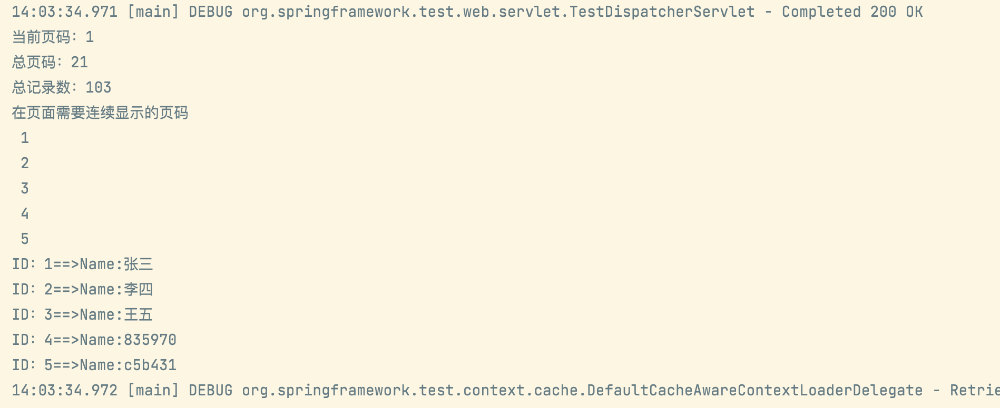

测试成功，可以编写页面了。


### 5、原始 list.jsp

```html
<%@ page contentType="text/html;charset=UTF-8" language="java" %>
<%@ taglib prefix="c" uri="http://java.sun.com/jsp/jstl/core" %>
<html>
<head>
    <meta charset="utf-8">
    <meta http-equiv="X-UA-Compatible" content="IE=edge">
    <meta name="viewport" content="width=device-width, initial-scale=1">
    <% pageContext.setAttribute("APP_PATH", request.getContextPath()); %>
    <link href="${APP_PATH}/static/bootstrap-3.4.1-dist/css/bootstrap.min.css" rel="stylesheet"/>
    <title>首页</title>
</head>
<body>
<div class="container">
    <!--标题-->
    <div class="row">
        <div class="col-md-12">
            <h1>SSM-CRUD</h1>
        </div>
    </div>

    <!-- 按钮 -->
    <div class="row">
        <div class="col-md-4 col-md-offset-8">
            <button class="btn btn-primary">新增</button>
            <button class="btn btn-danger">删除</button>
        </div>
    </div>

    <!-- 显示表格数据 -->
    <div class="row">
        <div class="col-md-12">
            <table class="table table-hover">
                <tr>
                    <th>编号</th>
                    <th>姓名</th>
                    <th>性别</th>
                    <th>邮箱</th>
                    <th>部门</th>
                    <th>操作</th>
                </tr>
                <c:forEach items="${pageInfo.list }" var="emp">
                    <tr>
                        <th>${emp.empId }</th>
                        <th>${emp.empName }</th>
                        <th>${emp.gender=="M"?"男":"女" }</th>
                        <th>${emp.email }</th>
                        <th>${emp.department.deptName }</th>
                        <th>
                            <button class="btn btn-primary btn-sm">
                                <span class="glyphicon glyphicon-pencil" aria-hidden="true"></span>编辑
                            </button>
                            <button class="btn btn-danger btn-sm">
                                <span class="glyphicon glyphicon-trash" aria-hidden="true"></span>删除
                            </button>
                        </th>
                    </tr>
                </c:forEach>
            </table>
        </div>
    </div>

    <!-- 显示分页信息 -->
    <div class="row">
        <!--分页文字信息  -->
        <div class="col-md-6">当前 ${pageInfo.pageNum}页,总${pageInfo.pages}页,总 ${pageInfo.total} 条记录
        </div>
        <!-- 分页条信息 -->
        <div class="col-md-6">
            <nav aria-label="Page navigation">
                <ul class="pagination">
                    <li>
                        <a href="${APP_PATH }/emps?pn=1">首页</a>
                    </li>
                    <c:if test="${pageInfo.hasPreviousPage }">
                        <li>
                            <a href="${APP_PATH }/emps?pn=${pageInfo.pageNum-1}" aria-label="Previous">
                                <span aria-hidden="true">&laquo;</span>
                            </a>
                        </li>
                    </c:if>
                    <c:forEach items="${pageInfo.navigatepageNums }" var="page_Num">
                        <c:if test="${page_Num == pageInfo.pageNum }">
                            <li class="active">
                                <a href="#">${page_Num }</a>
                            </li>
                        </c:if>
                        <c:if test="${page_Num != pageInfo.pageNum }">
                            <li>
                                <a href="${APP_PATH }/emps?pn=${page_Num }">${page_Num }</a>
                            </li>
                        </c:if>
                    </c:forEach>
                    <c:if test="${pageInfo.hasNextPage }">
                        <li>
                            <a href="${APP_PATH }/emps?pn=${pageInfo.pageNum+1 }" aria-label="Next">
                                <span aria-hidden="true">&raquo;</span>
                            </a>
                        </li>
                    </c:if>
                    <li><a href="${APP_PATH }/emps?pn=${pageInfo.pages}">末页</a></li>
                </ul>
            </nav>
        </div>
    </div>
</div>

<script src="${APP_PATH}/static/js/jquery-1.12.4.min.js"></script>
<script src="${APP_PATH}/static/bootstrap-3.4.1-dist/js/bootstrap.min.js"></script>
</body>
</html>
```


此外，还需修改 index.jsp，让它直接跳转 list.jsp 页面：

```html
<%@ page contentType="text/html;charset=UTF-8" language="java" %>
<jsp:forward page="/emps"/>
```


然后启动工程，直接来到员工列表页面，效果如下：

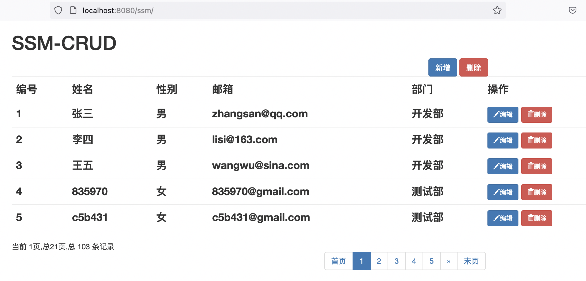


### 5、添加 Msg 类引入链式编程

```java
//通用的用来返回JSON数据的类
@Data
public class Msg {
    
    private int code;//状态码 100成功 200失败
    private String msg;//用户返回给浏览器的数据
    private Map<String, Object> data = new HashMap<>();

    public static Msg success() {
        Msg result = new Msg();
        result.setCode(100);
        result.setMsg("处理成功");
        return result;
    }

    public static Msg fail() {
        Msg result = new Msg();
        result.setCode(200);
        result.setMsg("处理失败");
        return result;
    }

    //链式编程
    public Msg add(String key, Object value) {
        this.getData().put(key, value);
        return this;
    }
}
```


### 6、修改 Controller

修改为使用 JSON 格式传输数据，需要 Jackson 的依赖。

```java
@Controller
public class EmployeeController {

    @Autowired
    EmployeeService employeeService;

    /**
     * 分页查询所有员工的数据
     */
    @RequestMapping("/emps")
    @ResponseBody
    public Msg getEmpsWithJson(
            @RequestParam(value = "pn", defaultValue = "1") Integer pn) {
        PageHelper.startPage(pn, 5);
        List<Employee> emps = employeeService.getAll();
        PageInfo pageInfo = new PageInfo(emps, 5);

        return Msg.success().add("pageInfo", pageInfo);
    }
}
```


### 7、修改 index.jsp 采用 Ajax 请求

```html
<%@ page contentType="text/html;charset=UTF-8" language="java" %>
<%@ taglib prefix="c" uri="http://java.sun.com/jsp/jstl/core" %>
<html>
<head>
    <meta charset="utf-8">
    <meta http-equiv="X-UA-Compatible" content="IE=edge">
    <meta name="viewport" content="width=device-width, initial-scale=1">
    <% pageContext.setAttribute("APP_PATH", request.getContextPath()); %>
    <link href="${APP_PATH}/static/bootstrap-3.4.1-dist/css/bootstrap.min.css" rel="stylesheet"/>
    <title>首页</title>
</head>
<body>
<div class="container">
    <!--标题-->
    <div class="row">
        <div class="col-md-12">
            <h1>SSM-CRUD</h1>
        </div>
    </div>

    <!-- 添加与删除员工的按钮 -->
    <div class="row">
        <div class="col-md-4 col-md-offset-8">
            <button class="btn btn-primary" id="emp_add_modal_btn">新增</button>
            <button class="btn btn-danger" id="emp_delete_all_btn">删除</button>
        </div>
    </div>

    <!-- 显示表格数据 -->
    <div class="row">
        <div class="col-md-12">
            <table class="table table-hover" id="emps_table">
                <thead>
                <tr>
                    <th>
                        <input type="checkbox" id="check_all"/> 全选
                    </th>
                    <th>编号</th>
                    <th>姓名</th>
                    <th>性别</th>
                    <th>邮箱</th>
                    <th>部门</th>
                    <th>操作</th>
                </tr>
                </thead>
                <tbody>
                </tbody>
            </table>
        </div>
    </div>

    <!-- 显示分页信息 -->
    <div class="row">
        <!--分页文字信息 -->
        <div class="col-md-6" id="page_info_area"></div>
        <!-- 分页条信息 -->
        <div class="col-md-6" id="page_nav_area"></div>
    </div>
</div>

<script src="${APP_PATH}/static/js/jquery-1.12.4.min.js"></script>
<script src="${APP_PATH}/static/bootstrap-3.4.1-dist/js/bootstrap.min.js"></script>
<script type="text/javascript">
  
    /**
     * 定义全局变量，用来保存总页数，当前页数
     */
    let totalPages, currentPage;
  
    /**
     * 页面加载完成以后直接去首页
     */
    $(function () {
        //去首页
        to_page(1);
    });

    /**
     * 发送Ajax请求，跳转页面
     */
    function to_page(pn) {
        $.ajax({
            url: "${APP_PATH}/emps",
            data: "pn=" + pn,
            type: "GET",
            success: function (result) {
                //1、解析并显示员工的数据
                build_emps_table(result);
                //2、解析并显示分页信息
                build_page_info(result);
                //3、解析并显示分页条
                build_page_nav(result);
            }
        });
    }

    /**
     * 显示员工数据表
     */
    function build_emps_table(result) {
        //先清空表格之前的数据
        $("#emps_table tbody").empty();
        //然后添加数据
        let emps = result.data.pageInfo.list;
        $.each(emps, function (index, item) {
            let checkBoxTd = $("<td><input type='checkbox' class='check_item'/></td>");
            let empIdTd = $("<td></td>").append(item.empId);
            let empNameTd = $("<td></td>").append(item.empName);
            let genderTd = $("<td></td>").append(item.gender == 'M' ? "男" : "女");
            let emailTd = $("<td></td>").append(item.email);
            let deptNameTd = $("<td></td>").append(item.department.deptName);
            let editBtn = $("<button></button>").addClass("btn btn-primary btn-sm edit_btn")
                .append($("<span></span>").addClass("glyphicon glyphicon-pencil")).append("编辑");
          	editBtn.attr("edit-id", item.empId);
            let delBtn = $("<button></button>").addClass("btn btn-danger btn-sm delete_btn")
                .append($("<span></span>").addClass("glyphicon glyphicon-trash")).append("删除");
          	delBtn.attr("del-id", item.empId);
            let btnTd = $("<td></td>").append(editBtn).append(" ").append(delBtn);
            //append方法执行完成以后还是会返回原来的元素
            $("<tr></tr>").append(checkBoxTd).append(empIdTd).append(empNameTd).append(genderTd).append(emailTd)
                .append(deptNameTd).append(btnTd).appendTo("#emps_table tbody");
        });
    }

    /**
     * 解析显示分页信息
     */
    function build_page_info(result) {
        //首先清空之前的数据
        $("#page_info_area").empty();
        //然后添加数据
        $("#page_info_area").append("当前第 " + result.data.pageInfo.pageNum + " 页，总共 "
            + result.data.pageInfo.pages + " 页，总计 " + result.data.pageInfo.total + " 条记录");
      	totalPages = result.data.pageInfo.pages;
        currentPage = result.data.pageInfo.pageNum;
    }

    /**
     * 解析显示分页条
     */
    function build_page_nav(result) {
        //先清空分页条数据
        $("#page_nav_area").empty();
        //添加首页和前一页
        let ul = $("<ul></ul>").addClass("pagination");
        let firstPageLi = $("<li></li>").append($("<a></a>").append("首页").attr("href", "#"));
        let prePageLi = $("<li></li>").append($("<a></a>").append("&laquo;"));
        //如果已经是首页，则禁用首页和前一页
        if (result.data.pageInfo.hasPreviousPage == false) {
            firstPageLi.addClass("disabled");
            prePageLi.addClass("disabled");
        } else {
            //为元素添加翻页点击事件
            firstPageLi.click(function () {
                to_page(1);
            });
            prePageLi.click(function () {
                to_page(result.data.pageInfo.pageNum - 1)
            });
        }
        ul.append(firstPageLi).append(prePageLi);
        //添加页码提示
        $.each(result.data.pageInfo.navigatepageNums, function (index, item) {
            let numLi = $("<li></li>").append($("<a></a>").append(item));
            if (result.data.pageInfo.pageNum == item) {
                numLi.addClass("active");
            }
            //绑定单击事件，去指定页
            numLi.click(function () {
                to_page(item);
            });
            ul.append(numLi);
        });
        //添加下一页和末页
        let nextPageLi = $("<li></li>").append($("<a></a>").append("&raquo;"));
        let lastPageLi = $("<li></li>").append($("<a></a>").append("末页").attr("href", "#"));
        //如果已经是末页，则禁用下一页和末页
        if (result.data.pageInfo.hasNextPage == false) {
            nextPageLi.addClass("disabled");
            lastPageLi.addClass("disabled");
        } else {
            //为元素添加翻页点击事件
            nextPageLi.click(function () {
                to_page(result.data.pageInfo.pageNum + 1);
            });
            lastPageLi.click(function () {
                to_page(result.data.pageInfo.pages);
            });
        }
        ul.append(nextPageLi).append(lastPageLi);
        let navEle = $("<nav></nav>").append(ul);
        navEle.appendTo("#page_nav_area");
    }
</script>
</body>
</html>
```


### 8、效果

启动服务，直接显示首页：

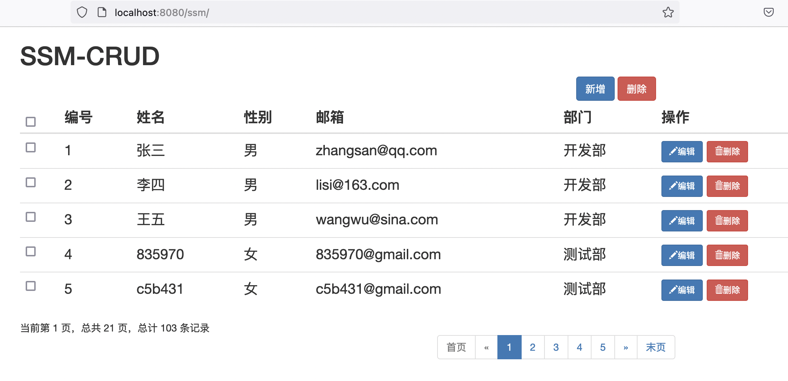


## 三、新增数据

### 1、需要实现的功能

- 在 index.jsp 页面点击“新增”弹出对话框
- 去数据库中查询部门列表，显示在对话框内
- 对用户输入的数据进行校验

- - jQuery 前端校验格式
    - Ajax 校验用户名是否重复
    - 后端校验（JSR 303）

- 保存用户数据


**URI 设计**

- `/emp/{id}`，`GET` 请求，查询员工数据
- `/emp`，`POST` 请求，保存员工数据
- `/emp/{id}`，`PUT` 请求，修改员工数据
- `/emp/{id}`，`DELETE` 请求，删除员工数据


### 2、Service

```java
public interface DepartmentService {
    List<Department> getDepts();
}
@Service
public class DepartmentServiceImpl implements DepartmentService {
    @Autowired
    DepartmentMapper departmentMapper;

    @Override
    public List<Department> getDepts() {
        return departmentMapper.selectByExample(null);
    }
}
public interface EmployeeService {
    ......

    void saveEmp(Employee employee);

    Boolean checkUser(String empName);
}
@Service
public class EmployeeServiceImpl implements EmployeeService {
    @Autowired
    EmployeeMapper employeeMapper;

    @Override
    public List<Employee> getAll() {
        return employeeMapper.selectByExampleWithDept(null);
    }

    @Override
    public void saveEmp(Employee employee) {
        employeeMapper.insertSelective(employee);
    }

    @Override
    public Boolean checkUser(String empName) {
        EmployeeExample example = new EmployeeExample();
        EmployeeExample.Criteria criteria = example.createCriteria();
        criteria.andEmpNameEqualTo(empName);
        long count = employeeMapper.countByExample(example);
        return count == 0;//返回true，代表当前用户名可用
    }
}
```


### 3、Controller

```java
@Controller
public class DepartmentController {

    @Autowired
    DepartmentService departmentService;

    /**
     * 返回所有的部门信息
     */
    @RequestMapping("/depts")
    @ResponseBody
    public Msg getDepts() {
        List<Department> list = departmentService.getDepts();
        return Msg.success().add("depts", list);
    }
}
@Controller
public class EmployeeController {

    @Autowired
    EmployeeService employeeService;

    /**
     * 校验用户名是否可用
     */
    @GetMapping("/checkUser")
    @ResponseBody
    public Msg checkUser(@RequestParam("empName") String empName) {
        //1、先判断用户名是否合法
        String regEx = "(^[a-zA-Z0-9_-]{6,16}$)|(^[\\u2E80-\\u9FFF]{2,5})";
        if (!empName.matches(regEx)) {
            return Msg.fail().add("va_msg", "用户名必须是2-5位中文或者6-16位英文和数字的组合");
        }
        //2、然后判断用户名是否已经存在
        if (employeeService.checkUser(empName)) {
            return Msg.success();
        }
        return Msg.fail().add("va_msg", "用户名不可用");
    }


    /**
     * JSR 303 校验，保存新增用户数据
     */
    @PostMapping(value = "/emp")
    @ResponseBody
    public Msg saveEmp(@Valid Employee employee, BindingResult result) {
        if (result.hasErrors()) {
            //校验失败，在模态框中显示错误信息
            Map<String, Object> map = new HashMap<>();
            for (FieldError error : result.getFieldErrors()) {
                map.put(error.getField(), error.getDefaultMessage());
            }
            return Msg.fail().add("errorFields", map);
        }
        employeeService.saveEmp(employee);
        return Msg.success();
    }
    
    ......

}
```


### 4、修改 index.jsp

在 body 部分添加如下内容：

```html
<!-- 新增员工信息的模态框 -->
<div class="modal fade" id="empAddModal" tabindex="-1" role="dialog" aria-labelledby="myModalLabel">
    <div class="modal-dialog" role="document">
        <div class="modal-content">
            <div class="modal-header">
                <button type="button" class="close" data-dismiss="modal" aria-label="Close"><span aria-hidden="true">&times;</span>
                </button>
                <h4 class="modal-title" id="myModalLabel">添加员工</h4>
            </div>
            <div class="modal-body">
                <form class="form-horizontal">
                    <div class="form-group">
                        <label class="col-sm-2 control-label">姓名</label>
                        <div class="col-sm-10">
                            <input type="text" name="empName" class="form-control" id="empName_add_input"
                                   placeholder="xxx">
                            <span class="help-block"></span>
                        </div>
                    </div>
                    <div class="form-group">
                        <label class="col-sm-2 control-label">性别</label>
                        <div class="col-sm-10">
                            <label class="radio-inline">
                                <input type="radio" name="gender" id="gender1_add_input" value="M" checked="checked"> 男
                            </label>
                            <label class="radio-inline">
                                <input type="radio" name="gender" id="gender2_add_input" value="W"> 女
                            </label>
                        </div>
                    </div>
                    <div class="form-group">
                        <label class="col-sm-2 control-label">邮箱</label>
                        <div class="col-sm-10">
                            <input type="text" name="email" class="form-control" id="email_add_input"
                                   placeholder="xxx@xxx.com">
                            <span class="help-block"></span>
                        </div>
                    </div>
                    <div class="form-group">
                        <label class="col-sm-2 control-label">部门</label>
                        <div class="col-sm-4">
                            <!--传送部门id即可-->
                            <select class="form-control" name="dId" id="dept_add_select"></select>
                        </div>
                    </div>
                </form>
            </div>
            <div class="modal-footer">
                <button type="button" class="btn btn-default" data-dismiss="modal">关闭</button>
                <button type="button" class="btn btn-primary" id="emp_save_btn">保存</button>
            </div>
        </div>
    </div>
</div>
```

js 部分添加如下内容：

```html
<script type="text/javascript">
  
  ......

    /**
     * 重置表单的内容和样式
     */
    function reset_form(ele) {
        //拿到DOM对象，调用reset方法，清空内容
        $(ele)[0].reset();
        //清空样式
        $(ele).find("*").removeClass("has-error has-success");
        $(ele).find(".help-block").text("");
    }

    /**
     * 点击新增按钮，弹出模态框
     */
    $("#emp_add_modal_btn").click(function () {
        //1、先调用方法重置表单
        reset_form("#empAddModal form");
        //2、再调用方法查部门信息
        getDepts("#dept_add_select");
        //3、弹出模态框
        $("#empAddModal").modal({
            //点击背景不会消失
            backdrop: "static"
        })
    });

    /**
     * 发送 Ajax 请求，查处部门信息，显示在下拉列表中
     */
    function getDepts(ele) {
      	//先清空下拉列表的值，再发送请求
        $(ele).empty();
        $.ajax({
            url: "${APP_PATH}/depts",
            type: "GET",
            success: function (result) {
                $.each(result.data.depts, function () {
                    let optionEle = $("<option></option>").append(this.deptName).attr("value", this.deptId);
                    optionEle.appendTo(ele);
                });
            }
        })
    }

    /**
     * 显示校验结果的提示信息
     */
    function show_validate_msg(ele, status, msg) {
        //清除当前元素的校验状态
        $(ele).parent().removeClass("has-success has-error");
        $(ele).next("span").text("");
        if ("success" == status) {
            $(ele).parent().addClass("has-success");
            $(ele).next("span").text(msg);
        } else if ("error" == status) {
            $(ele).parent().addClass("has-error");
            $(ele).next("span").text(msg);
        }
    }

    /**
     * 前端 jQuery 校验表单数据是否合法（使用正则表达式）
     */
    function validate_add_form() {
        //1、校验姓名
        let empName = $("#empName_add_input").val();
        let regName = /(^[a-zA-Z0-9_-]{6,16}$)|(^[\u2E80-\u9FFF]{2,5})/;
        if (!regName.test(empName)) {
            show_validate_msg("#empName_add_input", "error", "用户名必须是2-5位中文或者6-16位英文和数字的组合");
            return false;
        } else {
            show_validate_msg("#empName_add_input", "success", "");
        }
        //2、校验邮箱
        let email = $("#email_add_input").val();
        let regEmail = /^([a-z0-9_\.-]+)@([\da-z\.-]+)\.([a-z\.]{2,6})$/;
        if (!regEmail.test(email)) {
            show_validate_msg("#email_add_input", "error", "邮箱格式不正确");
            return false;
        } else {
            show_validate_msg("#email_add_input", "success", "");
        }
        return true;
    }

    /**
     * 校验用户名是否重复
     */
    $("#empName_add_input").change(function () {
        $.ajax({
            url: "${APP_PATH}/checkUser",
            data: "empName=" + this.value,
            type: "GET",
            success: function (result) {
                if (result.code == 100) {
                    show_validate_msg("#empName_add_input", "success", "用户名可用");
                    $("#emp_save_btn").attr("ajax-va", "success");
                } else {
                    show_validate_msg("#empName_add_input", "error", result.data.va_msg);
                    $("#emp_save_btn").attr("ajax-va", "error");
                }
            }
        })
    });

    /**
     * 新增用户数据，点击保存按钮
     */
    $("#emp_save_btn").click(function () {
        //1、前端 jQuery 校验数据格式
        if (!validate_add_form()) {
            return false;
        }
        //2、校验用户名是否可用
        if ($(this).attr("ajax-va") == "error") {
            return false;
        }
        //3、发送 Ajax POST 请求保存新增员工信息
        $.ajax({
            url: "${APP_PATH}/emp",
            type: "POST",
            data: $("#empAddModal form").serialize(),
            success: function (result) {
                if (result.code == 100) {
                    //保存成功，关闭模态框，来到最后一页
                    $("#empAddModal").modal('hide');
                    to_page(totalPages + 1);
                } else {
                    //显示失败信息，有哪个字段的错误信息就显示哪个字段的；
                    if (undefined != result.data.errorFields.email) {
                        //显示邮箱错误信息
                        show_validate_msg("#email_add_input", "error", result.data.errorFields.email);
                    }
                    if (undefined != result.data.errorFields.empName) {
                        //显示员工名字的错误信息
                        show_validate_msg("#empName_add_input", "error", result.data.errorFields.empName);
                    }
                }
            }
        });
    });
</script>
```


### 5、效果

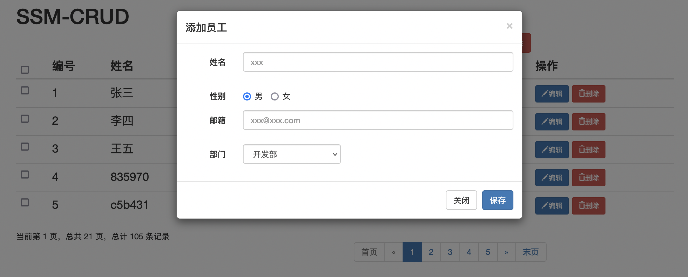


## 四、修改数据

### 1、需要实现的功能

- 点击编辑按钮，弹出用户修改的模态框。
- 模态框可以回显用户的信息。
- 点击更新，完成修改操作。


### 2、Service

```java
public interface EmployeeService {
    ......

    Employee getEmp(Integer empId);

    void updateEmp(Employee employee);
}
@Service
public class EmployeeServiceImpl implements EmployeeService {
    @Autowired
    EmployeeMapper employeeMapper;
	
    ......

    @Override
    public Employee getEmp(Integer empId) {
        return employeeMapper.selectByPrimaryKey(empId);
    }

    @Override
    public void updateEmp(Employee employee) {
        employeeMapper.updateByPrimaryKeySelective(employee);
    }
}
```


### 3、Controller

```java
@Controller
public class EmployeeController {

    @Autowired
    EmployeeService employeeService;

    /**
     * 修改员工信息
     */
    @PutMapping("/emp/{empId}")
    @ResponseBody
    public Msg updateEmp(Employee employee) {
        employeeService.updateEmp(employee);
        return Msg.success();
    }

    /**
     * 查询某用户信息
     */
    @GetMapping("/emp/{empId}")
    @ResponseBody
    public Msg getEmp(@PathVariable("empId") Integer empId) {
        Employee employee = employeeService.getEmp(empId);
        return Msg.success().add("emp", employee);
    }
    
	......
        
}
```


### 4、修改 index.jsp

在 body 中添加如下内容：

```html
<!--修改员工信息的模态框-->
<div class="modal fade" id="empUpdateModal" tabindex="-1" role="dialog" aria-labelledby="myModalLabel">
    <div class="modal-dialog" role="document">
        <div class="modal-content">
            <div class="modal-header">
                <button type="button" class="close" data-dismiss="modal" aria-label="Close"><span aria-hidden="true">&times;</span>
                </button>
                <h4 class="modal-title">修改员工</h4>
            </div>
            <div class="modal-body">
                <form class="form-horizontal">
                    <div class="form-group">
                        <label class="col-sm-2 control-label">姓名</label>
                        <div class="col-sm-10">
                            <p class="form-control-static" id="empName_update_static"></p>
                            <span class="help-block"></span>
                        </div>
                    </div>
                    <div class="form-group">
                        <label class="col-sm-2 control-label">性别</label>
                        <div class="col-sm-10">
                            <label class="radio-inline">
                                <input type="radio" name="gender" id="gender1_update_input" value="M" checked="checked">
                                男
                            </label>
                            <label class="radio-inline">
                                <input type="radio" name="gender" id="gender2_update_input" value="W"> 女
                            </label>
                        </div>
                    </div>
                    <div class="form-group">
                        <label class="col-sm-2 control-label">邮箱</label>
                        <div class="col-sm-10">
                            <input type="text" name="email" class="form-control" id="email_update_input"
                                   placeholder="xxx@xxx.com">
                            <span class="help-block"></span>
                        </div>
                    </div>
                    <div class="form-group">
                        <label class="col-sm-2 control-label">部门</label>
                        <div class="col-sm-4">
                            <!--传送部门id即可-->
                            <select class="form-control" name="dId" id="dept_update_select"></select>
                        </div>
                    </div>
                </form>
            </div>
            <div class="modal-footer">
                <button type="button" class="btn btn-default" data-dismiss="modal">关闭</button>
                <button type="button" class="btn btn-primary" id="emp_update_btn">更新</button>
            </div>
        </div>
    </div>
</div>
```

js 部分添加下面的代码：

```html
<script type="text/javascript">
  
  	......

    /**
     * 根据id查询员工信息，用于数据回显
     */
    function getEmp(id) {
        $.ajax({
            url: "${APP_PATH}/emp/" + id,
            type: "GET",
            success: function (result) {
                let empData = result.data.emp;
                $("#empName_update_static").text(empData.empName);
                $("#email_update_input").val(empData.email);
                $("#empUpdateModal input[name=gender]").val([empData.gender]);
                $("#dept_update_select").val([empData.dId]);
            }
        })
    }

    /**
     * 点击编辑按钮，回显数据，弹出模态框
     */
    $(document).on("click", ".edit_btn", function () {
        //1、查询部门和员工的信息，回显
        getDepts("#dept_update_select");
        getEmp($(this).attr("edit-id"));
        //2、把员工的id传递给模态框的更新按钮
        $("#emp_update_btn").attr("edit-id", $(this).attr("edit-id"));
        //2、弹出模态框
        $("#empUpdateModal").modal({
            backdrop: "static"
        })
    });

    /**
     * 点击更新按钮，更新用户信息
     */
    $("#emp_update_btn").click(function () {
        //1、校验邮箱是否合法
        let email = $("#email_update_input").val();
        let regEmail = /^([a-z0-9_\.-]+)@([\da-z\.-]+)\.([a-z\.]{2,6})$/;
        if (!regEmail.test(email)) {
            show_validate_msg("#email_update_input", "error", "邮箱格式不正确");
            return false;
        } else {
            show_validate_msg("#email_update_input", "success", "");
        }
        //2、发送 Ajax 请求更新员工信息
        $.ajax({
            url: "${APP_PATH}/emp/" + $(this).attr("edit-id"),
            type: "PUT",
            data: $("#empUpdateModal form").serialize(),
            success: function (result) {
                //关闭对话框，回到本页面
                $("#empUpdateModal").modal('hide');
                to_page(currentPage);
            }
        });
    });

</script>
```


### 5、效果

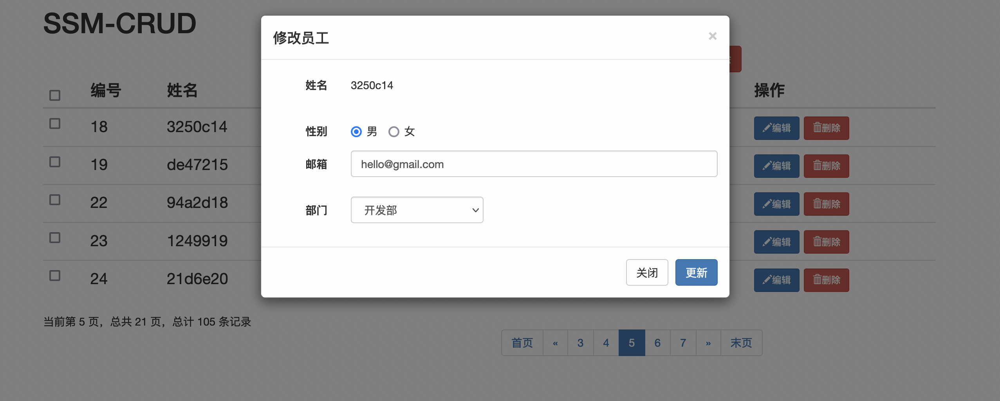


## 五、删除数据

### 1、需要实现的功能

- 单个删除，点击某条用户的删除按钮，弹出提示框，点击确定即可删除

- - URI：`/emp/{id}`，`DELETE` 请求

- 批量删除：


### 2、Service

```html
public interface EmployeeService {

    ......

    void deleteEmpById(Integer empId);

    void deleteBatch(List<Integer> ids);
}
@Service
public class EmployeeServiceImpl implements EmployeeService {
    @Autowired
    EmployeeMapper employeeMapper;

    ......

    @Override
    public void deleteEmpById(Integer empId) {
        employeeMapper.deleteByPrimaryKey(empId);
    }

    @Override
    public void deleteBatch(List<Integer> ids) {
        EmployeeExample example = new EmployeeExample();
        EmployeeExample.Criteria criteria = example.createCriteria();
        criteria.andEmpIdIn(ids);
        employeeMapper.deleteByExample(example);
    }
}
```


### 3、Controller

```html
@Controller
public class EmployeeController {

    @Autowired
    EmployeeService employeeService;

    /**
     * 单个删除与批量删除二合一
     */
    @DeleteMapping("/emp/{ids}")
    @ResponseBody
    public Msg deleteEmpById(@PathVariable("ids") String ids) {
        if (ids.contains("-")) {
            String[] strIds = ids.split("-");
            //组装ids数组
            List<Integer> del_ids = new ArrayList<>();
            for (String strId : strIds) {
                del_ids.add(Integer.parseInt(strId));
            }
            employeeService.deleteBatch(del_ids);
        } else {
            Integer empId = Integer.parseInt(ids);
            employeeService.deleteEmpById(empId);
        }
        return Msg.success();
    }
    
    ......
}
```


### 4、修改 index.jsp

在 js 部分添加下面代码：

```html
<script type="text/javascript">
  
		......

    /**
     * 点击单个删除按钮，弹出提示框
     */
    $(document).on("click", ".delete_btn", function () {
        //1、弹出提示框
        let empName = $(this).parents("tr").find("td:eq(2)").text();
        if (confirm("确认删除【 " + empName + " 】吗？")) {
            //确认，发送 Ajax 请求删除即可
            $.ajax({
                url: "${APP_PATH}/emp/" + $(this).attr("del-id"),
                type: "DELETE",
                success: function (result) {
                    alert(result.msg);
                    to_page(currentPage);
                }
            })
        }
    });

    /**
     * 全选，全不选按钮
     */
    $("#check_all").click(function () {
        //dom 原生的属性用 prop 获取，自定义的属性用 attr 获取
        $(".check_item").prop("checked", $(this).prop("checked"));
    });

    /**
     * 全选效果联动
     */
    $(document).on("click", ".check_item", function () {
        let flag = $(".check_item:checked").length == $(".check_item").length;
        $("#check_all").prop("checked", flag);
    });

    /**
     * 点击全部删除按钮，实现批量删除功能
     */
    $("#emp_delete_all_btn").click(function () {
        let empNames = "";
        let del_idstr = "";
        $.each($(".check_item:checked"), function () {
            empNames += $(this).parents("tr").find("td:eq(2)").text() + ",";
            //组装员工id字符串
            del_idstr += $(this).parents("tr").find("td:eq(1)").text() + "-";
        });
        //去除empNames多余的","
        empNames = empNames.substring(0, empNames.length - 1);
        //去除删除的id多余的"-"
        del_idstr = del_idstr.substring(0, del_idstr.length - 1);
        if (confirm("确认删除【" + empNames + "】吗？")) {
            //发送 ajax 请求删除
            $.ajax({
                url: "${APP_PATH}/emp/" + del_idstr,
                type: "DELETE",
                success: function (result) {
                    alert(result.msg);
                    //回到当前页面
                    to_page(currentPage);
                }
            });
        }
    });

</script>
```


### 5、效果

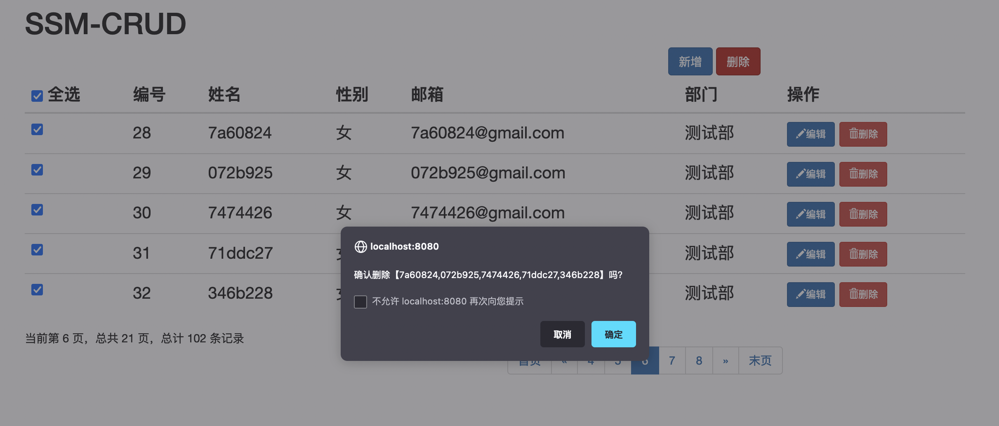


## 项目总结


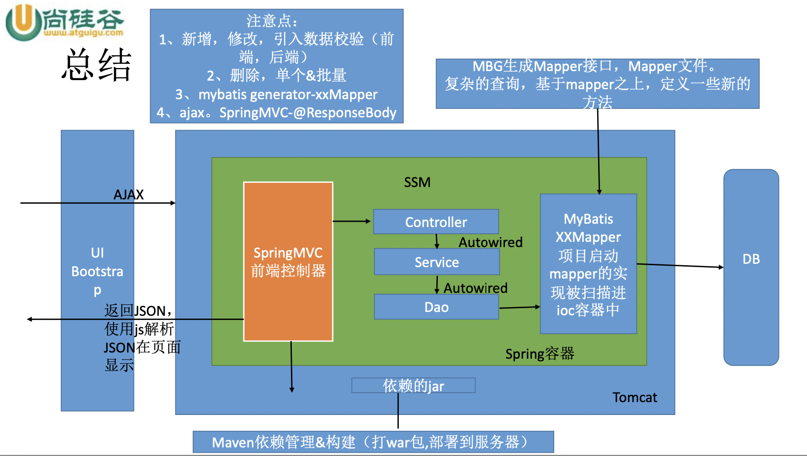