# Spring5框架概述

1、Spring是轻量级的开源的JavaEE框架

2、Spring可以解决企业应用开发的复杂性

3、Spring有两个核心部分：

​	（1）IOC：控制反转，把创建对象过程交给Spring进行管理

​	（2）Aop：面向切面，不修改源代码进行功能增强

4、Spring 特点

1. 方便解耦，简化开发
2. Aop编程支持
3. 方便程序测试
4. 方便和其他框架进行整合
5. 方便进行事务操作
6. 降低API 开发难度

## Spring5模块：

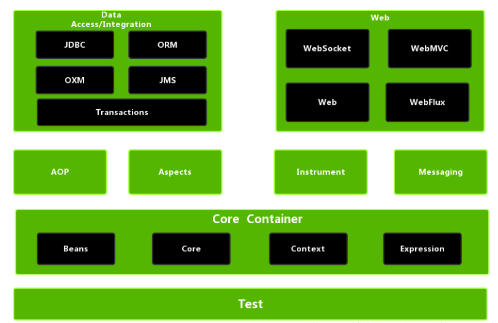

### 1. Data Access/Integration（数据访问／集成）

数据访问／集成层包括 JDBC、ORM、OXM、JMS 和 Transactions 模块，具体介绍如下。

- JDBC 模块：提供了一个 JBDC 的样例模板，使用这些模板能消除传统冗长的 JDBC 编码还有必须的事务控制，而且能享受到 Spring 管理事务的好处。
- ORM 模块：提供与流行的“对象-关系”映射框架无缝集成的 API，包括 JPA、JDO、Hibernate 和 MyBatis 等。而且还可以使用 Spring 事务管理，无需额外控制事务。
- OXM 模块：提供了一个支持 Object /XML 映射的抽象层实现，如 JAXB、Castor、XMLBeans、JiBX 和 XStream。将 Java 对象映射成 XML 数据，或者将XML 数据映射成 Java 对象。
- JMS 模块：指 Java 消息服务，提供一套 “消息生产者、消息消费者”模板用于更加简单的使用 JMS，JMS 用于用于在两个应用程序之间，或分布式系统中发送消息，进行异步通信。
- Transactions 事务模块：支持编程和声明式事务管理。

### 2. Web 模块

Spring 的 Web 层包括 Web、Servlet、WebSocket 和 Portlet 组件，具体介绍如下。

- Web 模块：提供了基本的 Web 开发集成特性，例如多文件上传功能、使用的 Servlet 监听器的 IOC 容器初始化以及 Web 应用上下文。
- Servlet 模块：提供了一个 Spring MVC Web 框架实现。Spring MVC 框架提供了基于注解的请求资源注入、更简单的数据绑定、数据验证等及一套非常易用的 JSP 标签，完全无缝与 Spring 其他技术协作。
- WebSocket 模块：提供了简单的接口，用户只要实现响应的接口就可以快速的搭建 WebSocket Server，从而实现双向通讯。
- Portlet 模块：提供了在 Portlet 环境中使用 MVC 实现，类似 Web-Servlet 模块的功能。

### 3. Core Container（Spring 的核心容器）

Spring 的核心容器是其他模块建立的基础，由 Beans 模块、Core 核心模块、Context 上下文模块和 SpEL 表达式语言模块组成，没有这些核心容器，也不可能有 AOP、Web 等上层的功能。具体介绍如下。

- Beans 模块：提供了框架的基础部分，包括控制反转和依赖注入。
- Core 核心模块：封装了 Spring 框架的底层部分，包括资源访问、类型转换及一些常用工具类。
- Context 上下文模块：建立在 Core 和 Beans 模块的基础之上，集成 Beans 模块功能并添加资源绑定、数据验证、国际化、Java EE 支持、容器生命周期、事件传播等。ApplicationContext 接口是上下文模块的焦点。
- SpEL 模块：提供了强大的表达式语言支持，支持访问和修改属性值，方法调用，支持访问及修改数组、容器和索引器，命名变量，支持算数和逻辑运算，支持从 Spring 容器获取 Bean，它也支持列表投影、选择和一般的列表聚合等。

### 4. AOP、Aspects、Instrumentation 和 Messaging

在 Core Container 之上是 AOP、Aspects 等模块，具体介绍如下：

- AOP 模块：提供了面向切面编程实现，提供比如日志记录、权限控制、性能统计等通用功能和业务逻辑分离的技术，并且能动态的把这些功能添加到需要的代码中，这样各司其职，降低业务逻辑和通用功能的耦合。
- Aspects 模块：提供与 AspectJ 的集成，是一个功能强大且成熟的面向切面编程（AOP）框架。
- Instrumentation 模块：提供了类工具的支持和类加载器的实现，可以在特定的应用服务器中使用。
- messaging 模块：Spring 4.0 以后新增了消息（Spring-messaging）模块，该模块提供了对消息传递体系结构和协议的支持。

### 5. Test 模块

Test 模块：Spring 支持 Junit 和 TestNG 测试框架，而且还额外提供了一些基于 Spring 的测试功能，比如在测试 Web 框架时，模拟 Http 请求的功能。

## Spring5 入门案例

**1**、下载 Spring5

（1） 使用 Spring 最新稳定版本 5.2.6

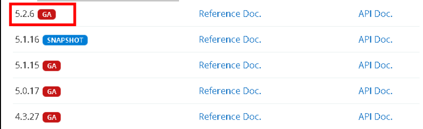

（2）下载地址

https://repo.spring.io/release/org/springframework/spring/

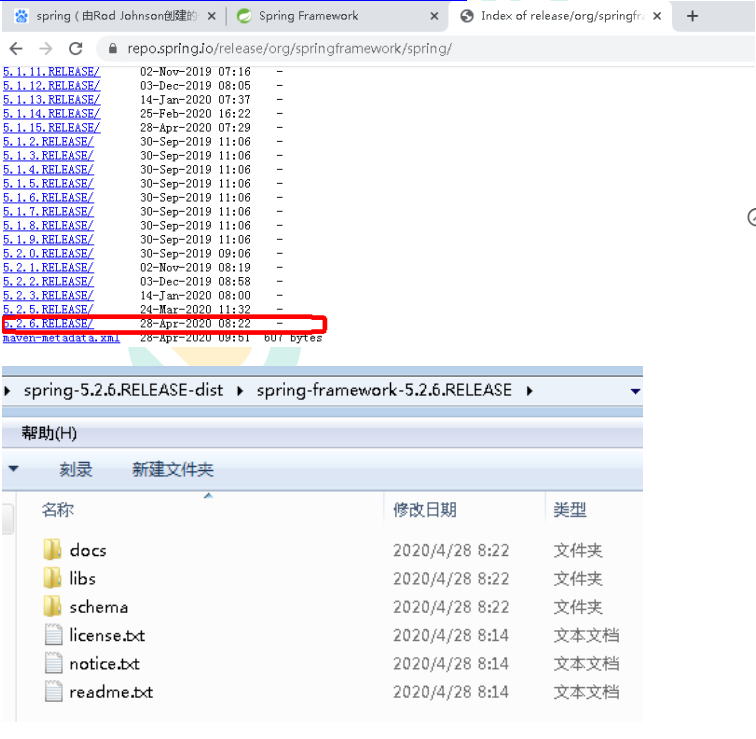

**2**、打开 **idea** 工具，创建普通 **Java** 工程

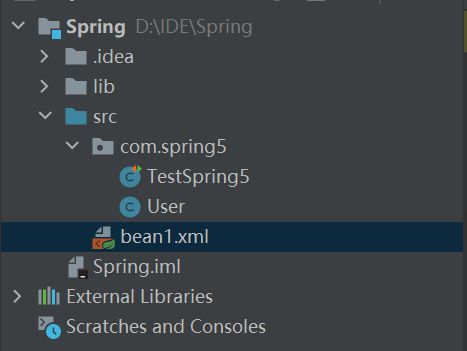

**3**、导入 **Spring5** 相关 **jar** 包

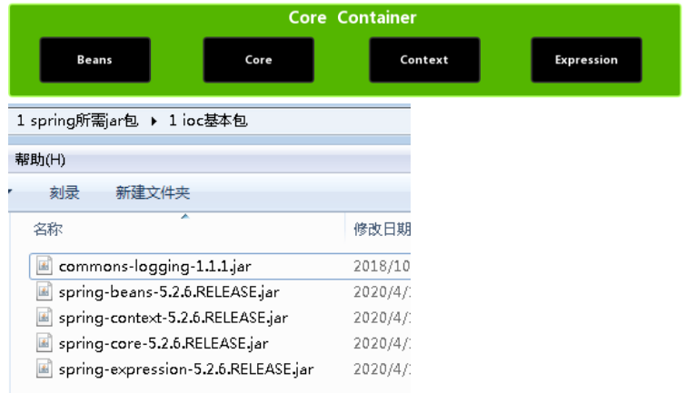

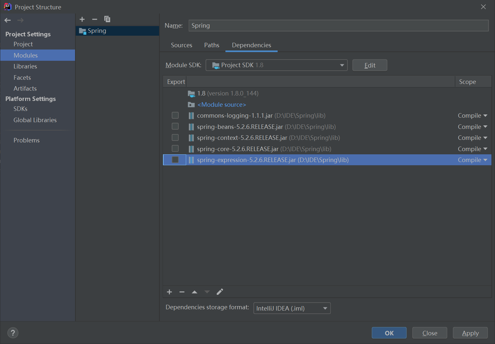

**4**、创建普通类，在这个类创建普通方法

```java
public class User { 
    public void add() { 
        System.out.println("add....."); 
    } 
}
```

 **5**、创建 Spring 配置文件bean1.xml，在配置文件配置创建的对象 

```xml
<?xml version="1.0" encoding="UTF-8"?> 
<beans xmlns="http://www.springframework.org/schema/beans" 
       xmlns:xsi="http://www.w3.org/2001/XMLSchema-instance" 
       xsi:schemaLocation="http://www.springframework.org/schema/beans http://www.springframework.org/schema/beans/spring-beans.xsd"> 
    <!--配置 User 对象创建--> 
    <bean id="user" class="com.spring5.User"></bean> //
</beans> 
```

 **6**、进行测试代码Test1编写

```java
@Test 
public void testAdd() { 
    //1 加载 spring 配置文件 
    ApplicationContext context = 
            new ClassPathXmlApplicationContext("bean1.xml"); 
    //2 获取配置创建的对象 
    User user = context.getBean("user", User.class); 
    System.out.println(user); 
    user.add(); 
}
```

#  IOC容器

IOC概念：

​		控制反转（Inversion of Control，缩写为IoC），是面向对象编程中的一种设计原则，可以用来减低计算机代码之间的耦合度。其中最常见的方式叫做依赖注入（Dependency Injection，简称DI），还有一种方式叫“依赖查找”（Dependency Lookup）。通过控制反转，对象在被创建的时候，由一个调控系统内所有对象的外界实体将其所依赖的对象的引用传递给它。也可以说，依赖被注入到对象中。

​		即把对象创建和对象之间的调用过程，交给 Spring 进行管理。

## IOC底层原理

### IOC过程：

​		xml、工厂类、反射

第一步xml配置文件，配置创建的对象,进一步降低耦合度
		<bean id="dao"class="com.at guigu.UserDao"> < /bean>

第二步有service类和dao类，创建工厂类

```java
class UserDao{
    add(){...}
}

class UserService{
    execute(){
       UserDao dao = UserFactory.getDao();
        dao.add;
    }
}

public class UserFactory {
    public static User getDao(){
        //1xml解析
        String classValue = "class属性值";
        //2通过反射创建对象
        Class clazz = Class.forName(classValue);
        
        UserService service = clazz.newInstance();
        return service;
        //return (User)clazz.newInstance();
    }
}
```

### IOC接口：

1、IOC思想基于IOC容器完成，IOC容器底层就是对象工厂

2、Spring 提供IOC容器实现两种方式：（两个接口）：

​		（1）BeanFactory:IOC容器基本实现，是Spring内部的使用接口，不提供开发人员进行使用
加载配置文件时候不会创建对象，在获取对象（使用）才去创建对象

​		（2）ApplicationContext:BeanFactory接口的子接口，提供更多更强大的功能，一般由开发人员进行使用
加载配置文件时候就会把在配置文件对象进行创建

3、ApplicationContext 接口实现类（File 文件路径，绝对路径   Class类路径，相对路径）

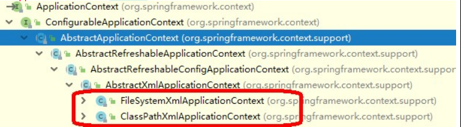

## Bean管理：

指Spring 创建对象 和 Spirng 注入属性

Bean 管理操作有两种方式

（1） 基于 xml 配置文件方式实现

（2） 基于注解方式实现

### 基于XML

#### 基于XML方式创建对象：

（1） 在 spring 配置文件中，使用 bean 标签，标签里面添加对应属性，就可以实现对象创建

```xml
<bean id="user" class="com.spring5.User"></bean>
```

（2） 在 bean 标签有很多属性，常用的属性：

- id属性

    id属性用来唯一标识<bean>标签，不能包含特殊符号，是<bean>标签中的最基本属性。

- class属性

    用来表示类全路径（包类路径）

- scope属性

    默认情况下，如果不设置scope属性，那么默认为singleton，即单实例模式，也就是说对于同一个Bean，多次调用getBean方法返回的都是同一个Bean对象。

- name属性

    除了例子中给出的三个属性外，<bean>标签还有一个name属性比较常见，功能和id是一样的，设置<bean>标签的别名，id属性值不能有特殊符号，但是name可以包含特殊符号。

- factory-method属性

    factory-method工厂方法属性，通过该属性，我们可以调用一个指定的静态工厂方法，创建bean实例。

    ```java
    public class BeanAttribute {
    	public static void main(String[] args) {
    		ApplicationContext act = new ClassPathXmlApplicationContext("BeanAttribute.xml");
    		User user = (User) act.getBean("userFactory");
    		System.out.println(user);
    	}	
    	/**
    	 * 静态工厂方法生成user对象
    	 * @return
    	 */
    	public static User createUser() {
    		return new User();
    	}
    }
    
    <bean id="userFactory" class="lzgsea.factory.BeanAttribute" factory-method="createUser"></bean>
    //上述代码就相当于
    //User user = BeanAttribute.createUser();
    ```

- factory-bean属性

    调用UserFactory类的静态createUser方法创建名为user的对象,放入容器

    factory-bean就是生成bean的工厂对象，factory-bean属性和factory-method属性一起使用，首先要创建生成bean的工厂类和方法。
    
    ```java
    //生产user对象的工程方法
    public class UserFactory {	
    	public User createUser() {
    		return new User();
    	}
    }
    
    //在Spring首先在XML配置中配置UserFactory类和User类：
    <bean id="userFactory" class="lzgsea.factory.UserFactory"></bean>
    <bean id="user" factory-bean="userFactory" factory-method="createUser"></bean>
        
    //然后getBean获取User对象
    ApplicationContext act = new ClassPathXmlApplicationContext("BeanAttribute.xml");
    User user = (User) act.getBean("user");
    System.out.println(user);
    ```
    
- scope 属性

    表示bean的作用范围，scope有4个值：

    singleton：表示整个IOC容器共享一个Bean，也就是说每次说每次通过getBean获取的bean都是同一个。

    prototype：每次对该bean请求（将其注入到另一个bean中，或者以程序的方式调用容器的getBean()方法）时都会创建一个新的bean实例。

    request：每次HTTP请求将会生成各自的bean实例

    session：每次会话请求对应一个bean实例

（3）基于XML创建对象时候，默认是执行无参数构造方法完成对象创建

#### 基于XML方式注入属性：

```java
//1.使用 set 方法进行注入
//（1）创建类，定义属性和对应的 set 方法
public class Book { 
    //创建属性 
    private String bname; 
    private String bauthor; 
    //创建属性对应的 set 方法 
    public void setBname(String bname) { 
        this.bname = bname; 
    } 
    public void setBauthor(String bauthor) { 
        this.bauthor = bauthor; 
    } 
} 

//（2）在 spring 配置文件配置对象创建，配置属性注入
<!--2 set 方法注入属性--> 
<bean id="book" class="com.atguigu.spring5.Book"> 
    <!--使用 property 完成属性注入 
        name：类里面属性名称 
        value：向属性注入的值 
    --> 
    <property name="bname" value="易筋经"></property> 
    <property name="bauthor" value="达摩老祖"></property> 
</bean> 
    
//2.使用有参数构造进行注入
//（1）创建类，定义属性，创建属性对应有参数构造方法
    public class Orders { 
    //属性 
    private String oname; 
    private String address; 
    //有参数构造 
    public Orders(String oname,String address) { 
        this.oname = oname; 
        this.address = address; 
    } 
} 
//（2）在 spring 配置文件中进行配置
<!--3 有参数构造注入属性--> 
<bean id="orders" class="com.atguigu.spring5.Orders"> 
    <!--使用 constructor-arg 完成属性注入 
        name：类里面属性名称 
        value：向属性注入的值
        index: 类中的属性索引值
    -->
    <constructor-arg name="oname" value="电脑"></constructor-arg> 
    <constructor-arg index="0" value="电脑"></constructor-arg> 
    <constructor-arg name="address" value="China"></constructor-arg> 
</bean>
```

#### 基于XML方式注入其他类型属性：

1.字面量：

```xml
（1）null 值

<property name="address"> 
    <null/> 
</property> 

（2）属性值包含特殊符号
     
    1 把<>进行转义 &lt; &gt; 
<property name="address" value="&lt;&lt;南京&gt;&gt;" ></property>
    
    2 把带特殊符号内容写到<![CDATA[   ]]> 
<property name="address"> 
    <value><![CDATA[<<南京>>]]></value> 
</property> 
```

2.外部 bean：

（1）创建两个类 service 类和 dao 类,在 service 调用 dao 里面的方法

```java
public class UserService { 
    //创建 UserDao 类型属性，生成 set 方法 
    private UserDao userDao; 
    public void setUserDao(UserDao userDao) { 
        this.userDao = userDao; 
    } 
    public void add() { 
        System.out.println("service add........"); 
        userDao.update(); 
    } 
}   
```

（2）在 spring 配置文件中进行配置

```xml
    <bean id="userService" class="com.service.UserService">
        <!--注入 userDao 对象
            name 属性：类里面属性名称
            ref 属性：创建userDao 注入对象的 bean标签id值
        -->
        <property name="userDao" ref="userDao"></property>
    </bean>
    <bean id="userDao" class="com.dao.UserDao"></bean> 
```

3.内部bean：

```java
//（1）一对多关系：部门和员工
//一个部门有多个员工，一个员工属于一个部门部门是一，员工是多
//在实体类之间表示一对多关系，员工表示所属部门，使用对象类型属性进行表示

//部门类 
public class Dept { 
    private String dname; 
    public void setDname(String dname) { 
        this.dname = dname; 
    }
}
//员工类 
public class Emp { 
    private String ename; 
    private String gender; 
    //员工属于某一个部门，使用对象形式表示 
    private Dept dept; 
    public void setDept(Dept dept) { 
        this.dept = dept; 
    } 
    public void setEname(String ename) { 
        this.ename = ename; 
    } 
    public void setGender(String gender) { 
        this.gender = gender; 
    }
    public void add(){
        System.out.println(ename+","+gender+","+dept);
    }
    
} 

```

（3）在 spring 配置文件中进行配置 

```xml
<!--内部 bean--> 
<bean id="emp" class="com.bean.Emp"> 
    <!--设置两个普通属性--> 
    <property name="ename" value="lucy"></property> 
    <property name="gender" value="女"></property> 
    <!--设置对象类型属性--> 
    <property name="dept"> 
        <bean id="dept" class="com.bean.Dept"> 
            <property name="dname" value="安保部"></property> 
        </bean> 
    </property> 
</bean>
```

4.级联赋值：

当两个bean 关联时 从一个bean 给 另一个bean 赋值

```xml
//（1）第一种写法 
<!--级联赋值--> 
<bean id="emp" class="com.bean.Emp"> 
    <!--设置两个普通属性--> 
    <property name="ename" value="lucy"></property> 
    <property name="gender" value="女"></property> 
    <!--级联赋值--> 
    <property name="dept" ref="dept"></property> 
</bean> 
<bean id="dept" class="com.bean.Dept"> 
    <property name="dname" value="财务部"></property> 
</bean> 
    
//第二种写法
//生成dept的get方法
	public Dept getDept() { 
        return dept; 
    }

<bean id="emp" class="com.spring5.bean.Emp"> 
    <!--设置两个普通属性--> 
    <property name="ename" value="lucy"></property>
     <property name="gender" value="女"></property> 
    <!--级联赋值--> 
    <property name="dept" ref="dept"></property> 
    <property name="dept.dname" value="技术部"></property> 
</bean>
<bean id="dept" class="com.bean.Dept"></bean>
```

5.集合属性：

5.1 注入数组类型属性、List 集合类型属性、 Map 集合类型属性

（1）创建类，定义数组、list、map、set 类型属性，生成对应 set 方法

```java
public class Stu { 
	//1 数组类型属性 
    private String[] courses; 
    //2 list 集合类型属性 
    private List<String> list; 
    //3 map 集合类型属性 
    private Map<String,String> maps; 
    //4 set 集合类型属性 
    private Set<String> sets; 
 
    public void setSets(Set<String> sets) { 
        this.sets = sets; 
    } 
    public void setCourses(String[] courses) { 
        this.courses = courses; 
    } 
    public void setList(List<String> list) { 
        this.list = list; 
    } 
    public void setMaps(Map<String, String> maps) { 
        this.maps = maps; 
    }
}
```

（2）在 spring 配置文件进行配置

```xml
<!--1 集合类型属性注入--> 
<bean id="stu" class="com.collectiontype.Stu"> 
    <!--数组类型属性注入--> 
    <property name="courses"> 
        <array> 
            <value>java 课程</value> 
            <value>数据库课程</value> 
        </array> 
    </property> 
    <!--list 类型属性注入--> 
    <property name="list"> 
        <list>
    		<value>张三</value>
    		<value>小三</value> 
        </list> 
    </property> 
    <!--map 类型属性注入--> 
    <property name="maps"> 
        <map> 
            <entry key="JAVA" value="java"></entry> 
            <entry key="PHP" value="php"></entry> 
        </map> 
    </property> 
    <!--set 类型属性注入--> 
    <property name="sets"> 
        <set> 
            <value>MySQL</value> 
            <value>Redis</value> 
        </set> 
    </property> 
</bean>
```

5.2 在集合里面设置对象类型值

```xml
public class Course { 
    private String cname; 
    public void setCname(String cname) { 
        this.cname = cname; 
    }
}
<!--创建多个 course 对象--> 
<bean id="course1" class="com.collectiontype.Course"> 
    <property name="cname" value="Spring5 框架"></property> 
</bean> 
<bean id="course2" class="com.collectiontype.Course"> 
    <property name="cname" value="MyBatis 框架"></property> 
</bean> 
<!--list 集合类型注入对象--> 
<property name="courseList"> 
    <list> 
        <ref bean="course1"></ref> 
        <ref bean="course2"></ref> 
    </list> 
</property>
```

5.3把集合注入部分提取出来

```xml
public class Book { 
    private List<String> list; 
    public void setList(List<String> list) { 
        this.list = list; 
    }
}    
//（1）在 spring 配置文件中引入名称空间 util
<?xml version="1.0" encoding="UTF-8"?> 
<beans xmlns="http://www.springframework.org/schema/beans" 
       xmlns:xsi="http://www.w3.org/2001/XMLSchema-instance"
           
       xmlns:p="http://www.springframework.org/schema/p" 
       xmlns:util="http://www.springframework.org/schema/util" 
       xsi:schemaLocation="http://www.springframework.org/schema/beans http://www.springframework.org/schema/beans/spring-beans.xsd 
                           http://www.springframework.org/schema/util http://www.springframework.org/schema/util/spring-util.xsd"> 
 
//（2）使用 util 标签完成 list 集合注入提取
<!--1 提取 list 集合类型属性注入--> 
<util:list id="bookList">
    <value>易筋经</value> 
    <value>九阴真经</value> 
    <value>九阳神功</value> 
</util:list> 
<!--2 提取 list 集合类型属性注入使用--> 
<bean id="book" class="com.collectiontype.Book"> 
    <property name="list" ref="bookList"></property> 
</bean>
```

#### xml 自动装配

根据指定装配规则（属性名称或者属性类型），Spring  自动将匹配的属性值进行注入

```xml
public class Emp{
    private Dept dept;
    public void setDept(Dept dept){
        this.dept=dept;
    }
}
public class Dept(){}


<!--实现自动装配 
    bean 标签属性autowire，配置自动装配 
    autowire 属性常用两个值： 
        byName 根据属性名称注入 ，注入值 bean 的 id 值和类属性名称一样 
        byType 根据属性类型注入 ，相同类型的bean不能定义多个
--> 
（1）根据属性名称自动注入
<bean id="emp" class="com.atguigu.spring5.autowire.Emp" autowire="byName"> 
    <!--<property name="dept" ref="dept"></property>
-->
    </bean> 
<bean id="dept" class="com.atguigu.spring5.autowire.Dept"></bean> 

（2）根据属性类型自动注入
<bean id="emp" class="com.atguigu.spring5.autowire.Emp" autowire="byType"> 
    <!--<property name="dept" ref="dept"></property>
-->
	</bean> 
<bean id="dept" class="com.atguigu.spring5.autowire.Dept"></bean>    
<!--<bean id="dept1" class="com.atguigu.spring5.autowire.Dept"></bean>
-->
```

#### FactoryBean

**Spring** 有两种类型 **bean**，一种普通 **bean**，另外一种工厂 **bean**（**FactoryBean**） 

普通 **bean**：在配置文件中定义 **bean** 类型就是返回类型

工厂 **bean**：在配置文件定义 **bean** 类型可以和返回类型不一样

```java
//工厂bean
//第一步 创建类，让这个类作为工厂 bean，实现接口 FactoryBean
public class MyBean implements FactoryBean<Course> { 
    //第二步 实现接口里面的方法，在实现的方法中定义返回的 bean 类型
    @Override 
    public Course getObject() throws Exception { 
        Course course = new Course(); 
        course.setCname("abc"); 
        return course; 
    } 
    @Override 
    public Class<?> getObjectType() { 
        return null; 
    } 
    @Override 
    public boolean isSingleton() { 
        return false; 
    } 
} 

//bean3.xml
<bean id="myBean" class="com.atguigu.spring5.factorybean.MyBean"> 
</bean> 

@Test 
public void test3() { 
    ApplicationContext context = 
            new ClassPathXmlApplicationContext("bean3.xml"); 
    Course course = context.getBean("myBean", Course.class); 
    System.out.println(course); 
} 
```

#### bean作用域

1、在 Spring 里面，设置创建 bean 实例是单实例还是多实例

2、在 Spring 里面，默认情况下，bean 是单实例对象

3、如何设置单实例还是多实例

（1） 在 spring 配置文件 bean 标签里面有属性（scope）用于设置单实例还是多实例

（2） scope 属性值：表示bean的作用范围，scope有4个值

​	singleton：表示整个IOC容器共享一个Bean，也就是说每次说每次通过getBean获取的bean都是同一个。

​	prototype：每次对该bean请求（将其注入到另一个bean中，或者以程序的方式调用容器的getBean()方法）时都会创建	一个新的bean实例。

​	request：每次HTTP请求将会生成各自的bean实例

​	session：每次会话请求对应一个bean实例

（3）singleton 和 prototype 区别：

1. singleton 单实例，prototype 多实例
2. 设置 scope 值是 singleton 时候，加载 spring 配置文件时候就会创建单实例对象
3. 设置 scope 值是 prototype 时候，在调用getBean 方法时候创建多实例对象

#### bean生命周期

1、生命周期：从对象创建到对象销毁的过程

2、bean 生命周期

1. 通过构造器创建 bean 实例（默认无参数构造）
2. 为 bean 的属性设置值和对其他 bean 引用（调用 set 方法）
3. 调用 bean 的初始化的方法（需要进行配置初始化的方法）
4. bean 可以使用了（对象获取到了）
5. 当容器关闭时候，调用 bean 的销毁的方法（需要进行配置销毁的方法）

3、演示 bean 生命周期

```java
public class Orders { 
    //无参数构造 
    public Orders() { 
        System.out.println("第一步 执行无参数构造创建 bean 实例"); 
    } 
    private String oname; 
    public void setOname(String oname) { 
        this.oname = oname; 
        System.out.println("第二步 调用 set 方法设置属性值"); 
    } 
    //创建执行的初始化的方法 
    public void initMethod() { 
        System.out.println("第三步 执行初始化的方法"); 
    } 
    //创建执行的销毁的方法 
    public void destroyMethod() { 
        System.out.println("第五步 执行销毁的方法"); 
    } 
} 

//bean4.xml
<bean id="orders" class="com.atguigu.spring5.bean.Orders" init-method="initMethod" destroy-method="destroyMethod"> 
    <property name="oname" value="手机"></property> 
</bean> 

    
    @Test 
    public void testBean3() { 
//    ApplicationContext context = 
//        new ClassPathXmlApplicationContext("bean4.xml"); 
        ClassPathXmlApplicationContext context = 
                new ClassPathXmlApplicationContext("bean4.xml");
    
        Orders orders = context.getBean("orders", Orders.class); 
        System.out.println("第四步 获取创建 bean 实例对象"); 
    
        System.out.println(orders); 
        //手动让 bean 实例销毁 调用 destroyMethod 方法
    
    //((ClassPathXmlApplicationContext) context).close(); //强转子类ClassPathXmlApplicationContext
        context.close(); 
    } 
```

4、bean 的后置处理器，bean 生命周期有七步
（1）通过构造器创建 bean 实例（无参数构造）

（2）为 bean 的属性设置值和对其他 bean 引用（调用 set 方法）

（3）把 bean 实例传递 bean 后置处理器的方法 postProcessBeforeInitialization 

（4）调用 bean 的初始化的方法（需要进行配置初始化的方法）

（5）把 bean 实例传递 bean 后置处理器的方法 postProcessAfterInitialization

（6）bean 可以使用了（对象获取到了）

（7）当容器关闭时候，调用 bean 的销毁的方法（需要进行配置销毁的方法）

5、演示添加后置处理器效果

```java
//（1）创建类，实现接口 BeanPostProcessor，创建后置处理器
public class MyBeanPost implements BeanPostProcessor { 
    @Override 
    public Object postProcessBeforeInitialization(Object bean, String beanName) throws BeansException { 
        System.out.println("在初始化之前执行的方法"); 
        return bean; 
    } 
    @Override 
    public Object postProcessAfterInitialization(Object bean, String beanName) throws BeansException { 
        System.out.println("在初始化之后执行的方法"); 
        return bean; 
    } 
}

//（2）在bean4.xml配置后置处理器
<!--配置后置处理器--> 
<bean id="myBeanPost" class="com.atguigu.spring5.bean.MyBeanPost"></bean> 
```

#### 引入外部属性文件

1、直接配置数据库信息

 配置德鲁伊连接池，引入德鲁伊连接池依赖 jar 包

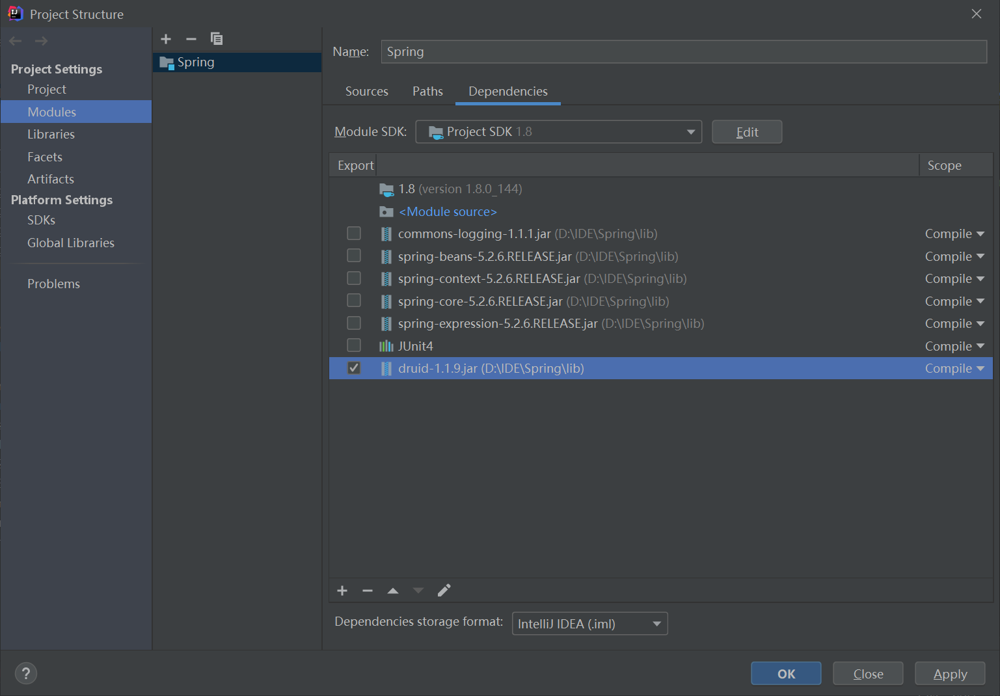

```xml
<!--直接配置连接池-->
<!--实现自动装配 
    driverClassName 数据库驱动名称
    url 数据库地址 
    username 连接用户名
    password 连接密码
--> 
<bean id="dataSource" class="com.alibaba.druid.pool.DruidDataSource"> 
    <property name="driverClassName" value="com.mysql.jdbc.Driver"></property> 
    <property name="url" value="jdbc:mysql://localhost:3306/userDb"></property> 
    <property name="username" value="root"></property> 
    <property name="password" value="root"></property> 
</bean> 
```

2、引入外部属性文件配置数据库连接池

```xml
//（1） 创建外部属性文件，properties 格式文件，写数据库信息
prop.driverClass=com.mysql.jdbc.Driver
prop.ur1=jdbc:mysq1://localhost:3306/userDb
prop.userName=root
prop.password=rood
    
//（2）把外部 properties 属性文件引入到 spring 配置文件中
//引入 context 名称空间
<beans xmlns="http://www.springframework.org/schema/beans" 
       xmlns:xsi="http://www.w3.org/2001/XMLSchema-instance" 
       xmlns:p="http://www.springframework.org/schema/p" 
       xmlns:util="http://www.springframework.org/schema/util" 
       xmlns:context="http://www.springframework.org/schema/context" 
       xsi:schemaLocation="http://www.springframework.org/schema/beans http://www.springframework.org/schema/beans/spring-beans.xsd 
                           http://www.springframework.org/schema/util http://www.springframework.org/schema/util/spring-util.xsd 
                           http://www.springframework.org/schema/context http://www.springframework.org/schema/context/spring-context.xsd">

//在 spring 配置文件使用标签引入外部属性文件
<!--引入外部属性文件--> 
<context:property-placeholder location="classpath:jdbc.properties"/> 
<!--配置连接池--> 
<bean id="dataSource" class="com.alibaba.druid.pool.DruidDataSource"> 
    <property name="driverClassName" value="${prop.driverClass}"></property> 
    <property name="url" value="${prop.url}"></property> 
    <property name="username" value="${prop.userName}"></property> 
    <property name="password" value="${prop.password}"></property> 
</bean>
```


### 基于注解

1、什么是注解
（1）注解是代码特殊标记，格式：@注解名称(属性名称=属性值,  属性名称=属性值..)
（2）使用注解，注解作用在类上面，方法上面，属性上面
（3）使用注解目的：简化 xml 配置

2、Spring 针对 Bean 管理中创建对象提供注解

四个注解功能是一样的，都可以用来创建bean 实例	

（1）@Component (普通)
（2）@Service （建议用在义务逻辑层或Service层）
（3）@Controller （建议Web层）
（4）@Repository （建议Dao层）

#### 基于注解方式实现对象创建

第一步 引入依赖


第二步 开启组件扫描

```xml
<beans xmlns="http://www.springframework.org/schema/beans"
       xmlns:xsi="http://www.w3.org/2001/XMLSchema-instance"
       xmlns:p="http://www.springframework.org/schema/p"
       xmlns:context="http://www.springframework.org/schema/context"
       xsi:schemaLocation="http://www.springframework.org/schema/beans http://www.springframework.org/schema/beans/spring-beans.xsd
                           http://www.springframework.org/schema/context http://www.springframework.org/schema/context/spring-context.xsd">
<!--开启组件扫描 
  1 如果扫描多个包，多个包使用逗号隔开 
  2 扫描包上层目录 
--> 
<context:component-scan base-package="com.atguigu.dao,com.atguigu.service"></context:component-scan>
<context:component-scan base-package="com.atguigu"></context:component-scan>
</beans>    
```

 第三步 创建类，在类上面添加创建对象注解

```java
//在注解里面 value 属性值可以省略不写， 
//默认值是类名称，首字母小写 
//UserService -- userService 
@Component(value = "userService") //<bean id="userService" class=".."/>
public class UserService { 
    public void add() { 
        System.out.println("service add.	"); 
    } 
} 
```

第四步 开启组件扫描细节配置

```xml
<beans xmlns="http://www.springframework.org/schema/beans"
       xmlns:xsi="http://www.w3.org/2001/XMLSchema-instance"
       xmlns:p="http://www.springframework.org/schema/p"
       xmlns:context="http://www.springframework.org/schema/context"
       xsi:schemaLocation="http://www.springframework.org/schema/beans http://www.springframework.org/schema/beans/spring-beans.xsd
                           http://www.springframework.org/schema/context http://www.springframework.org/schema/context/spring-context.xsd">
!--开启组件扫描 
  扫描包上层目录 
--> 
	<context:component-scan base-package="com.atguigu"></context:component-scan>
	
<!--示例 1 
    use-default-filters="false" 表示现在不使用默认filter（扫描全部包），自己配置 filter 
    context:include-filter ，设置扫描哪些内容，只扫描Controller注解 
--> 
<context:component-scan base-package="com.atguigu" use-default-filters="false"> 
    <context:include-filter type="annotation" 
                            expression="org.springframework.stereotype.Controller"/> 
</context:component-scan> 
 
<!--示例 2 
    下面配置扫描包所有内容 
    context:exclude-filter： 设置哪些内容不进行扫描 
--> 
<context:component-scan base-package="com.atguigu"> 
    <context:exclude-filter type="annotation" 
                            expression="org.springframework.stereotype.Controller"/> 
</context:component-scan>
</beans>   
```

#### 基于注解方式实现属性注入

（1）@Autowired：根据属性类型进行自动装配

第一步 把 service 和 dao 对象创建，在 service 和 dao 类添加创建对象注解

```java
public interface UserDao{
    public void add();
}


@Repository
public class UserDaoImpl implements UserDao{
    @Override
    public void add(){
        System.out.println("dao add ..");
    }
}

```

第二步 在 service 注入 dao 对象，在 service 类添加 dao 类型属性，在属性上面使用注解

```java
@Service 
public class UserService { 
    //定义 dao 类型属性 
    //不需要添加 set 方法 
    //添加注入属性注解 
    @Autowired 
    private UserDao userDao; 
    
	public void add() { 
    System.out.println("service add.	"); 
    userDao.add(); 
}    
```
（2）@Qualifier：根据名称进行注入

这个@Qualifier 注解的使用，和@Autowired 一起使用

```java
//定义 dao 类型属性 
//不需要添加 set 方法
//添加注入属性注解 

@Autowired //根据类型进行注入 
@Qualifier(value = "userDaoImpl1") //根据名称进行注入
private UserDao userDao;
```

（3） @Resource：可以根据类型注入，可以根据名称注入

位于javax扩展包中，不在Spring包中，不建议使用

```java
@Resource //根据类型进行注入 
@Resource(name = "userDaoImpl1") //根据名称进行注入
private UserDao userDao; 
```

（4） @Value：注入普通类型属性

```java
@Value(value = "abc") 
private String name; 
```

#### 完全注解开发

实际中，该部分基于Spring boot完成

```java
（1）创建配置类，替代xml 配置文件@Configuration 
    //作为配置类，替代 xml 配置文件
    @ComponentScan(basePackages = {"com.atguigu"}) //开启组件扫描
    public class SpringConfig {
} 
 
（2）编写测试类@Test 
public void testService2() { 
    //加载配置类 
    ApplicationContext context 
            = new AnnotationConfigApplicationContext(SpringConfig.class); 
    UserService userService = context.getBean("userService", UserService.class); 
    System.out.println(userService); 
    userService.add(); 
}
```

# Aop

AOP：AOP为Aspect Oriented Programming的缩写，意为：面向切面编程，通过预编译方式和运行期间动态代理实现程序功能的统一维护的一种技术。AOP是OOP的延续，是软件开发中的一个热点，也是Spring框架中的一个重要内容，是函数式编程的一种衍生范型。利用AOP可以对业务逻辑的各个部分进行隔离，从而使得业务逻辑各部分之间的耦合度降低，提高程序的可重用性，同时提高了开发的效率。

可以通过预编译方式和运行其动态代理实现在不修改源代码的情况下给程序动态统一添加某种特定功能的一种技术。AOP实际是GoF设计模式的延续，设计模式孜孜不倦追求的是调用者和被调用者之间的解耦,提高代码的灵活性和可扩展性，AOP可以说也是这种目标的一种实现。

## 底层原理：

AOP 底层使用动态代理，有两种情况动态代理：

第一种 有接口情况，使用 JDK 动态代理。

创建接口实现类代理对象，增强类的方法

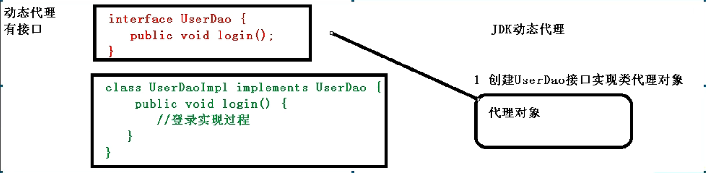

第二种 没有接口情况，使用 CGLIB 动态代理。

创建子类的代理对象，增强类的方法

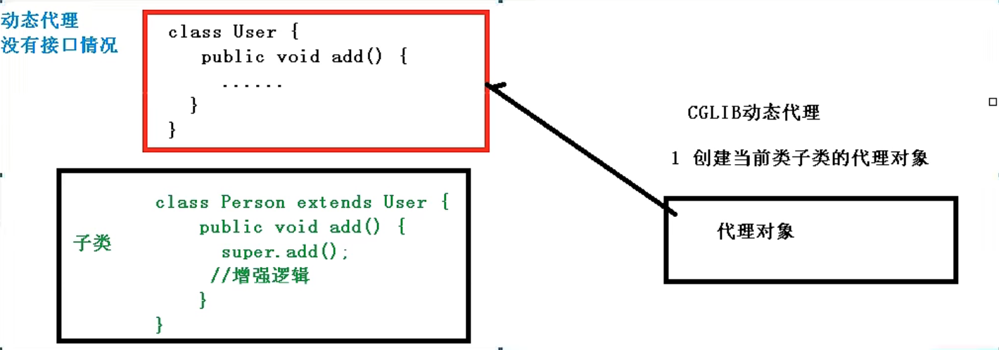

JDK动态代理

使用 JDK 动态代理，使用 Proxy 类里面的方法创建代理对象

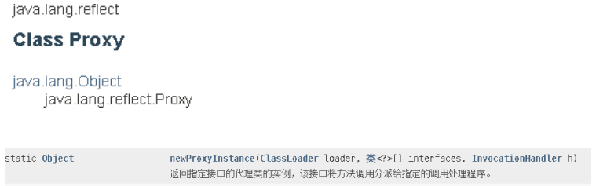

方法有三个参数： 

第一个参数，ClassLoader  loader，类加载器

第二个参数，类<>[ ]  interfaces，增强方法所在的类，这个类实现的接口，支持多个接口

第三个参数，InvacationHandler   h，实现这个接口 InvocationHandler，创建代理对象，写增强的部分

编写 JDK 动态代理代码：

```java
（1）创建接口，定义方法
public interface UserDao { 
    public int add(int a,int b); 
    public String update(String id); 
} 

（2）创建接口实现类，实现方法
public class UserDaoImpl implements UserDao { 
    @Override 
    public int add(int a, int b) { 
        return a+b; 
    } 
    @Override 
    public String update(String id) { 
        return id; 
    } 
} 

（3）使用 Proxy 类创建接口代理对象
public class JDKProxy { 
    public static void main(String[] args) { 
        Class[] interfaces = {UserDao.class};//实现了UserDao接口的实现类路径数组        
        
        //InvocationHandler()的匿名内部类
//    Proxy.newProxyInstance(JDKProxy.class.getClassLoader(), interfaces, new InvocationHandler() { 
//     @Override 
//     public Object invoke(Object proxy, Method method, Object[] args) throws Throwable { 
//        return null; 
//     } 
//    });
        
        UserDaoImpl userDao = new UserDaoImpl(); 
        UserDao dao = (UserDao)Proxy.newProxyInstance(JDKProxy.class.getClassLoader(), interfaces, new UserDaoProxy(userDao));
        int result = dao.add(1, 2); 
        System.out.println("result:"+result); 
    } 
} 
 
//创建代理对象代码 
class UserDaoProxy implements InvocationHandler { 
    //1 把创建的是谁的代理对象，把谁传递过来 
    //有参数构造传递 
    private Object obj; 
    public UserDaoProxy(Object obj) { 
        this.obj = obj; 
    } 
    //增强的逻辑 
    @Override 
    public Object invoke(Object proxy, Method method, Object[] args) throws Throwable { 
        //方法之前 
        System.out.println("方法之前执行	"+method.getName()+" :传递的参数"+ Arrays.toString(args)); 
        //被增强的方法执行 
        Object res = method.invoke(obj, args); 
        //方法之后 
        System.out.println("方法之后执行	"+obj); 
        return res; 
    } 
}         
```

术语：

1、连接点
类里面哪些方法可以被增强，这些方法称为连接点

2、切入点
实际被真正增强的方法，称为切入点

3、通知（增强）
（1）实际增强的逻辑部分称为通知（增强）

（2）通知有多钟类型
前置通知、后置通知、环绕通知、异常通知、最终通知

4 、切面

把通知应用到切入点的过程

## Aop操作

Spring 框架一般都是基于 AspectJ 实现 AOP 操作。

AspectJ 不是 Spring 组成部分，是独立 AOP 框架，一般把 AspectJ 和 Spirng 框架一起使用，进行 AOP 操作。

方式： 1.基于 xml 配置文件实现    2.基于注解方式实现（更方便）

### 切入点表达式：

（1） 切入点表达式作用：知道对哪个类里面的哪个方法进行增强

（2） 语法结构： execution([权限修饰符] [返回类型] [类全路径] [方法名称] ([参数列表])  )

对 com.atguigu.dao.BookDao 类里面的 add 进行增强：

execution(* com.atguigu.dao.BookDao.add(..))

对 com.atguigu.dao.BookDao 类里面的所有的方法进行增强：

execution(* com.atguigu.dao.BookDao.* (..))

对 com.atguigu.dao 包里面所有类，类里面所有方法进行增强：

execution(* com.atguigu.dao.*.* (..))

在项目工程里面引入 AOP 相关依赖：

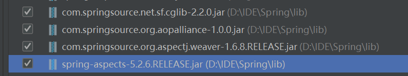

### AspectJ 注解

```java
1、创建类，在类里面定义方法
//被增强的类
public class User { 
    public void add() { 
        System.out.println("add.	"); 
    } 
} 

2、创建增强类（编写增强逻辑）
在增强类里面，创建方法，让不同方法代表不同通知类型
//增强的类 
public class UserProxy { 
    public void before() {//前置通知方法 
        System.out.println("before.	"); 
    } 
} 

3、进行通知的配置
（1）在 spring 配置文件中，开启注解扫描
<?xml version="1.0" encoding="UTF-8"?> 
<beans xmlns="http://www.springframework.org/schema/beans" 
       xmlns:xsi="http://www.w3.org/2001/XMLSchema-instance" 
       xmlns:context="http://www.springframework.org/schema/context" 
       xmlns:aop="http://www.springframework.org/schema/aop" 
       xsi:schemaLocation="http://www.springframework.org/schema/beans http://www.springframework.org/schema/beans/spring-beans.xsd 
                        http://www.springframework.org/schema/context http://www.springframework.org/schema/context/spring-context.xsd 
                        http://www.springframework.org/schema/aop http://www.springframework.org/schema/aop/spring-aop.xsd"> 
    <!-- 开启注解扫描	> 
    <context:component-scan base- package="com.atguigu.spring5.aopanno"></context:component-scan>
    
</beans>

（2）使用注解创建 User 和 UserProxy 对象
@Component
public class User{}

@Component
public class UserProxy{}

（3）在增强类上面添加注解 @Aspect
@Component 
@Aspect //表示生成代理对象
    public class UserProxy {} 

（4）在 spring 配置文件中开启生成代理对象
<!-- 开启 Aspect 生成代理对象--> 
<aop:aspectj-autoproxy></aop:aspectj-autoproxy>
```

4、配置不同类型的通知

```java
在增强类的里面，在作为通知方法上面添加通知类型注解，使用切入点表达式配置
//增强的类 
@Component 
@Aspect //生成代理对象
    public class UserProxy { 
    //前置通知 
    @Before(value = "execution(* com.atguigu.spring5.aopanno.User.add(..))") 
    public void before() { 
        System.out.println("before.	"); 
    } 
    //后置通知（返回通知），返回值之后执行，有异常不执行
    @AfterReturning(value = "execution(* com.atguigu.spring5.aopanno.User.add(..))") 
    public void afterReturning() { 
        System.out.println("afterReturning	"); 
    } 
    //最终通知，方法之后执行，有异常依然执行
    @After(value = "execution(* com.atguigu.spring5.aopanno.User.add(..))") 
    public void after() { 
        System.out.println("after.	"); 
    } 
    //异常通知 
    @AfterThrowing(value = "execution(* com.atguigu.spring5.aopanno.User.add(..))") 
    public void afterThrowing() { 
        System.out.println("afterThrowing.	"); 
    } 
    //环绕通知 
    @Around(value = "execution(* com.atguigu.spring5.aopanno.User.add(..))") 
    public void around(ProceedingJoinPoint proceedingJoinPoint) throws Throwable { 
        System.out.println("环绕之前	"); 
        //执行被增强的方法
        proceedingJoinPoint.proceed(); 
        System.out.println("环绕之后	"); 
    } 
}
```

异常执行：

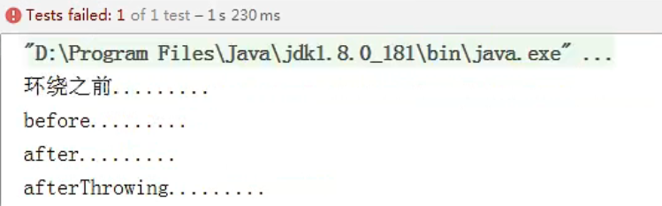

正常执行：

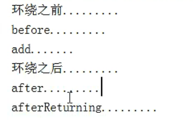

5、相同的切入点抽取

```java
//相同切入点抽取 
@Pointcut(value = "execution(* com.atguigu.spring5.aopanno.User.add(..))")
public void pointdemo() { 
} 
//举例前置通知 
@Before(value = "pointdemo()") 
public void before() { 
    System.out.println("before.	"); 
}
```

6、有多个增强类多同一个方法进行增强，设置增强类优先级

在增强类上面添加注解 @Order(数字类型值)，数字类型值越小优先级越高

```java
@Component 
@Aspect @Order(1) 
public class PersonProxy{} 
```

7、完全使用注解开发

```java
创建配置类，不需要创建 xml 配置文件
@Configuration 
@ComponentScan(basePackages = {"com.atguigu"}) 
@EnableAspectJAutoProxy(proxyTargetClass = true)
public class ConfigAop {} 
```

### AspectJ 配置文件

1、创建两个类，增强类和被增强类，创建方法

```java
public class Book(){
	public void buy(){
        System.out.println("buy....");
    } 
}

public class BookProxy(){
	public void before(){
        System.out.println("before....");
    } 
}
```

2、在 spring 配置文件中创建两个类对象

```xml
<!--创建对象--> 
<bean id="book" class="com.atguigu.spring5.aopxml.Book"></bean> 
<bean id="bookProxy" class="com.atguigu.spring5.aopxml.BookProxy"></bean> 
```

3、在 spring 配置文件中配置切入点

```xml
<!--配置 aop 增强--> 
<aop:config> 
    <!--切入点--> 
    <aop:pointcut id="p" expression="execution(* com.atguigu.spring5.aopxml.Book.buy(参数))"/> 
    <!--配置切面--> 
    <aop:aspect ref="bookProxy"> 
        <!--增强作用在具体的方法上,before/around/...--> 
        <aop:before method="before" pointcut-ref="p"/>
    </aop:aspect> 
</aop:config> 
```

# JdbcTemplate

Spring 框架对 JDBC 进行封装，使用 JdbcTemplate 方便实现对数据库操作

## 准备工作

（1） 引入相关 jar 包

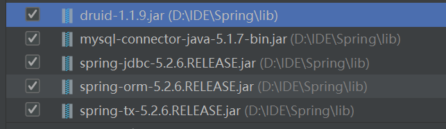

（2） 在 spring 配置文件配置数据库连接池

```xml
<!-- 数据库连接池 --> 
<bean id="dataSource" class="com.alibaba.druid.pool.DruidDataSource" 
      destroy-method="close"> 
    <property name="url" value="jdbc:mysql:///user_db" /> 
    <property name="username" value="root" /> 
    <property name="password" value="root" /> 
    <property name="driverClassName" value="com.mysql.jdbc.Driver" /> 
</bean> 
```

（3）配置 JdbcTemplate 对象，注入 DataSource

```java
<!-- JdbcTemplate 对象 --> 
<bean id="jdbcTemplate" class="org.springframework.jdbc.core.JdbcTemplate"> 
    <!--注入 dataSource--> 
    <property name="dataSource" ref="dataSource"></property> 
</bean>
<!-- 组件扫描 --> 
<context:component-scan base-package="spring"></context:component-scan> 
```

（4） 创建 service 类，创建 dao 类，在 dao 注入 jdbcTemplate 对象

```java
//Service类 
@Service 
public class BookService { 
    //注入 dao 
    @Autowired 
    private BookDao bookDao; 
}

//dao类
@Repository 
public class BookDaoImpl implements BookDao { 
    //注入 JdbcTemplate 
    @Autowired 
    private JdbcTemplate jdbcTemplate; 
}
```

## 操作数据库

### 添加、修改和删除

1、对应数据库创建实体类Book

```java
public class Book {
    private String userId;
    private String username;
    private String ustatus;

    public String getUserId() {
        return userId;
    }
    public void setUserId(String userId) {
        this.userId = userId;
    }
    public String getUsername() {
        return username;
    }
    public void setUsername(String username) {
        this.username = username;
    }
    public String getUstatus() {
        return ustatus;
    }
    public void setUstatus(String ustatus) {
        this.ustatus = ustatus;
    }
}
```

2、编写 service 和 dao

```java
public interface BookDao {
    void add(Book book);
    void updateBook(Book book);
    void delete(String id);
}


@Service(value = "bookService")
public class BookService {
    //注入 dao
    @Autowired
    private BookDao bookDao;

    public void addBook(Book book) {
        bookDao.add(book);
    }
    public void updateBook(Book book){
        bookDao.update(book);
    }
    public void deleteBook(String id){
        bookDao.delete(id);
    }
}
```

（1） 在 dao 进行数据库添加操作

（2） 调用 JdbcTemplate 对象里面 update 方法实现操作

jdbcTemplate.update(String sql, Object... args);有两个参数 

第一个参数：sql 语句 

第二个参数：可变参数，设置 sql 语句值 

```java
@Repository
public class BookDaoImpl implements BookDao {
    //注入 JdbcTemplate
    @Autowired
    private JdbcTemplate jdbcTemplate;
 	//添加
    @Override
    public void add(Book book) {
        //1 创建 sql 语句
        String sql = "insert into t_book values(?,?,?)";
        //2 调用方法实现
        Object[] args = {book.getUserId(), book.getUsername(), book.getUstatus()};
        int update = jdbcTemplate.update(sql,args);
        System.out.println(update);
    }
    //修改
    @Override
    public void updateBook(Book book) {
        String sql = "update t_book set username=?,ustatus=? where user_id=?";
        Object[] args = {book.getUsername(), book.getUstatus(),book.getUserId()};
        int update = jdbcTemplate.update(sql, args);
        System.out.println(update);
    }
    //删除
    @Override
    public void delete(String id) {
        String sql = "delete from t_book where user_id=?";
        int update = jdbcTemplate.update(sql, id);
        System.out.println(update);
    }
}
```

3、测试类

```java
@Test 
public void testJdbcTemplate() { 
    ApplicationContext context = 
            new ClassPathXmlApplicationContext("bean1.xml"); 
    BookService bookService = context.getBean("bookService", BookService.class);
    Book book = new Book(); 
    //添加
    book.setUserId("1"); 
    book.setUsername("java"); 
    book.setUstatus("a"); 
    bookService.addBook(book);
    //修改
    book.setUserId("1"); 
    book.setUsername("javaSE"); 
    book.setUstatus("b"); 
    bookService.updateBook(book);
    //删除
    bookService.deleteBook("1");
}
```

### 查询

返回值：

查询表里面有多少条记录，返回是某个值，使用 JdbcTemplate 实现查询返回某个值代码

queryForObject(String sql,Class〈T〉 requiredType)有两个参数 

第一个参数：sql 语句 

第二个参数：返回类型.Class 

```java
//查询表记录数 
@Override 
public int selectCount() {
    String sql = "select count(*) from t_book"; 
    Integer count = jdbcTemplate.queryForObject(sql, Integer.class); 
    return count; 
} 
```

返回对象：

查询图书详情，JdbcTemplate实现查询返回对象

queryForObject(String sql, RowMapper〈T> rowlapper, Object..… args)有三个参数 

第一个参数：sql 语句 

第二个参数：RowMapper 是接口，针对返回不同类型数据，使用这个接口里面实现类完成数据封装 

第三个参数：sql 语句中？的值 

```java
//查询返回对象 
@Override 
public Book findBookInfo(String id) { 
    String sql = "select * from t_book where user_id=?"; 
    //调用方法 
    Book book = jdbcTemplate.queryForObject(sql, new BeanPropertyRowMapper<Book>(Book.class), id); 
    return book; 
}
```

返回集合：

查询图书列表分页，调用 JdbcTemplate 方法实现查询返回集合

query(String sql, Rowlapper<T> rowlapper, Object... args) 

第一个参数：sql 语句 

第二个参数：RowMapper 是接口，针对返回不同类型数据，使用这个接口里面实现类完成数据封装 

```java
//查询返回集合 
@Override 
public List<Book> findAllBook() { 
    String sql = "select * from t_book"; 
    //调用方法 
    List<Book> bookList = jdbcTemplate.query(sql, new BeanPropertyRowMapper<Book>(Book.class)); 
    return bookList; 
} 
```

### 批量操作

操作表里面多条记录，JdbcTemplate实现批量添加操作

batchUpdate(String sql, List<Object[]> batchArgs)有两个参数

第一个参数：sql 语句 

第二个参数：List 集合，添加多条记录数据 

```java
//批量添加
@Override 
public void batchAddBook(List<Object[]> batchArgs) { 
    String sql = "insert into t_book values(?,?,?)"; 
    int[] ints = jdbcTemplate.batchUpdate(sql, batchArgs); 
    System.out.println(Arrays.toString(ints)); 
} 
//批量添加测试 
List<Object[]> batchArgs = new ArrayList<>(); 
Object[] o1 = {"3","java","a"}; 
Object[] o2 = {"4","c++","b"}; 
Object[] o3 = {"5","MySQL","c"};
batchArgs.add(o1);
batchArgs.add(o2);
batchArgs.add(o3); 
bookService.batchAdd(batchArgs);


//批量修改
@Override 
public void batchUpdateBook(List<Object[]> batchArgs) { 
    String sql = "update t_book set username=?,ustatus=? where user_id=?"; 
    int[] ints = jdbcTemplate.batchUpdate(sql, batchArgs); 
    System.out.println(Arrays.toString(ints)); 
} 
//批量修改 
List<Object[]> batchArgs = new ArrayList<>(); Object[] o1 = {"java0909","a3","3"}; 
Object[] o2 = {"c++1010","b4","4"}; 
Object[] o3 = {"MySQL1111","c5","5"}; 
batchArgs.add(o1); 
batchArgs.add(o2); 
batchArgs.add(o3); 
bookService.batchUpdate(batchArgs); 


//批量删除
@Override 
public void batchDeleteBook(List<Object[]> batchArgs) { 
    String sql = "delete from t_book where user_id=?"; 
    int[] ints = jdbcTemplate.batchUpdate(sql, batchArgs); 
    System.out.println(Arrays.toString(ints)); 
} 
//批量删除 
List<Object[]> batchArgs = new ArrayList<>();
Object[] o1 = {"3"}; 
Object[] o2 = {"4"}; 
batchArgs.add(o1); 
batchArgs.add(o2); 
bookService.batchDelete(batchArgs);
```

# 事务

一荣俱荣，一损俱损。很多复杂的操作我们可以把它看成一个整体，要么同时成功，要么同时失败。

事务的四个特征ACID:

- 原子性（Atomic)：表示组成一个事务的多个数据库的操作的不可分割的单元，只有所有的操作成功才算成功，整个事务提交，其中任何一个操作失败了，那么都会导致整个所有操作失败，事务就会回滚。
- 一致性（Consistentcy）:事务操作成功后，数据库所处的状态和业务规则保持一致。如果A账户给B账户汇100，A账户要减去100，B加100，两个账户的总额是不变的。
- 隔离性（islation）：在多个用户对数据库的操作相同的数据的时候，并发时，不同的事务有自己的数据空间，事务与事务之间不受干扰（不是绝对的）。干扰程度受数据库或者操作事务的隔离级别来决定，隔离级别越高，干扰就会越低，数据的一致性越好，并发就越差。否则反之。
- 持久性（Druability）:一旦事务提交成功，数据就被持久化到数据库，不可以回滚。

## 典型入门场景

银行转账：

\* lucy 转账 100 元 给 mary

\* lucy 少 100，mary 多 100

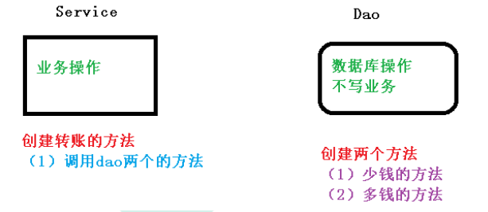

1、创建数据库表，添加记录

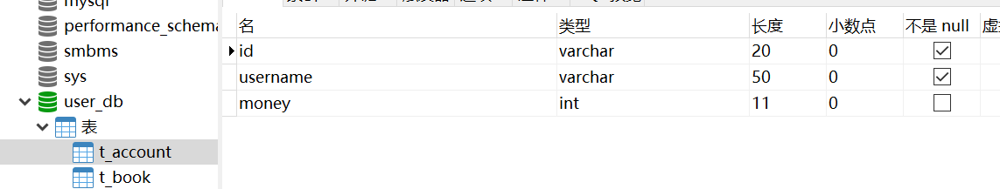

2、创建 service，搭建 dao，完成对象创建和注入关系

```java
//service 注入 dao，在 dao 注入 JdbcTemplate，在 JdbcTemplate 注入 DataSource
@Service 
public class UserService { 
    //注入 dao 
    @Autowired 
    private UserDao userDao; 
} @Repository 
public class UserDaoImpl implements UserDao { 
    @Autowired
    private JdbcTemplate jdbcTemplate; 
} 

```

3、在 dao 创建两个方法：多钱和少钱的方法，在 service 创建方法（转账的方法）

```java
@Repository 
public class UserDaoImpl implements UserDao { 
 
    @Autowired 
    private JdbcTemplate jdbcTemplate; 
 
    //lucy 转账 100 给mary 
    //少钱 
    @Override 
    public void reduceMoney() { 
        String sql = "update t_account set money=money-? where username=?"; 
        jdbcTemplate.update(sql,100,"lucy"); 
    } 
 
    //多钱 
    @Override 
    public void addMoney() { 
        String sql = "update t_account set money=money+? where username=?"; 
        jdbcTemplate.update(sql,100,"mary"); 
    } 
} 

@Service 
public class UserService { 
    //注入 dao 
    @Autowired 
    private UserDao userDao; 
 
    //转账的方法 
    public void accountMoney() { 
        //lucy 少 100 
        userDao.reduceMoney(); 
	    //模拟异常,执行后lucy-100=900, mary仍然是1000
        int i = 10/0;
        //mary 多 100 
        userDao.addMoney(); 
    } 
}
```

4、如果代码执行过程中出现异常，使用事务进行解决

事务操作过程：

```java
//转账的方法 
    public void accountMoney() { 
        try{
            //第一步 开启事务
            //第二步 进行业务操作
            
            //lucy 少 100 
        	userDao.reduceMoney();
            //模拟异常
            int i = 10/0;
        	//mary 多 100 
        	userDao.addMoney();            
            //第三步 没有发生异常，提交事务
        }catch(Exception e){
            //第四步 发生异常，事务回滚
        }
    } 
```

## 事务管理

1、事务添加到 JavaEE 三层结构里面 Service 层（业务逻辑层）

2、在 Spring 进行事务管理操作有两种方式：编程式事务管理和声明式事务管理（使用）

3、声明式事务管理

（1） 基于注解方式（使用）

（2） 基于 xml 配置文件方式

4、在 Spring 进行声明式事务管理，底层使用 AOP 原理

5、Spring 事务管理 API提供一个接口，代表事务管理器，这个接口针对不同的框架提供不同的实现类

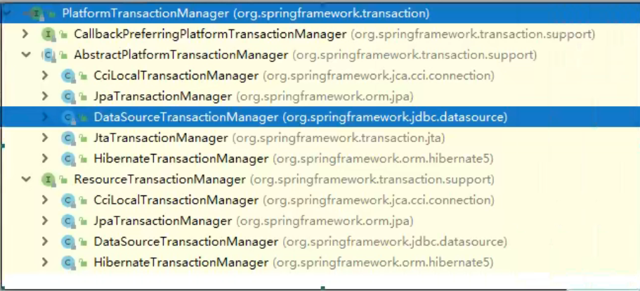

JDBC DataSource事物管理器：org.springframework.jdbc.datasource.DataSourceTransactionManager

Hibernate的事务管理器：org.springframework.orm.hibernate.HibernateTransactionManager

JDO的事务管理器：org.springframework.orm.jdo.JdoTransactionManager

JTA事务管理器：org.springframework.transaction.jta.JtaTransactionManager

OJB事务管理器：org.springframework.orm.ojb.PersistenceBrokerTransactionManager

JPA EntityManagerFactory：JpaTransactionManager

分布式2PC资源：JtaTrasactionManager

Weblogic：WeblogicJtaTransactionManager

OC4J：OC4JJtaTransactionManager

WebSphere：WebSphereUowTransactionManager

## 注解声明式事务管理

1.在 spring 配置文件配置事务管理器

2.在 spring 配置文件开启事务注解、引入名称空间 tx、开启事务注解

```xml
<?xml version="1.0" encoding="UTF-8"?>
<beans xmlns="http://www.springframework.org/schema/beans"
       xmlns:xsi="http://www.w3.org/2001/XMLSchema-instance"
       xmlns:p="http://www.springframework.org/schema/p"
       xmlns:context="http://www.springframework.org/schema/context"
       xmlns:aop="http://www.springframework.org/schema/aop"
       xmlns:tx="http://www.springframework.org/schema/tx"
       xsi:schemaLocation="http://www.springframework.org/schema/beans http://www.springframework.org/schema/beans/spring-beans.xsd
                           http://www.springframework.org/schema/context http://www.springframework.org/schema/context/spring-context.xsd
                           http://www.springframework.org/schema/aop http://www.springframework.org/schema/aop/spring-aop.xsd
                           http://www.springframework.org/schema/tx http://www.springframework.org/schema/tx/spring-tx.xsd">
    <!-- 数据库连接池 -->
    <bean id="dataSource" class="com.alibaba.druid.pool.DruidDataSource"
          destroy-method="close">
        <property name="url" value="jdbc:mysql:///user_db" />
        <property name="username" value="root" />
        <property name="password" value="root" />
        <property name="driverClassName" value="com.mysql.jdbc.Driver" />

    </bean>
        
    <!-- JdbcTemplate 对象 -->
    <bean id="jdbcTemplate" class="org.springframework.jdbc.core.JdbcTemplate">
        <!--注入 dataSource-->
        <property name="dataSource" ref="dataSource"></property>
    </bean>
        
    <!-- 组件扫描 -->
    <context:component-scan base-package="spring"></context:component-scan>

    <!--创建事务管理器-->
    <bean id="transactionManager" class="org.springframework.jdbc.datasource.DataSourceTransactionManager">
        <!--注入数据源-->
        <property name="dataSource" ref="dataSource"></property>
    </bean>
        
    <!--开启事务注解-->
    <tx:annotation-driven transaction-manager="transactionManager"></tx:annotation-driven>
</beans>
```

3.在 service类上面（或者 service 类里面方法上面）添加事务注解@Transactional。

（1）可以添加到类上面，也可以添加方法上面

（2） 如果把这个注解添加类上面，这个类里面所有的方法都添加事务

（3） 如果把这个注解添加方法上面，为这个方法添加事务

参数配置：

在 service 类上面添加注解@Transactional，在这个注解里面可以配置事务相关参数

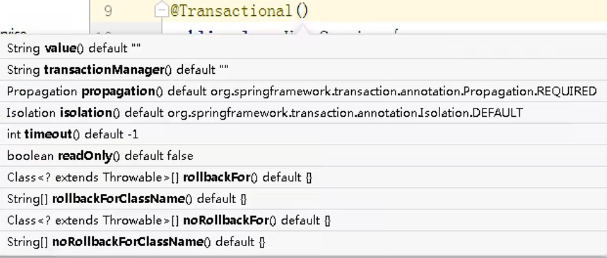

1、propagation：事务传播行为

多事务方法之间直接进行调用，这个过程中事务是如何进行管理的

事务的传播行为可以由传播属性指定。Spring定义了7种类传播行为。

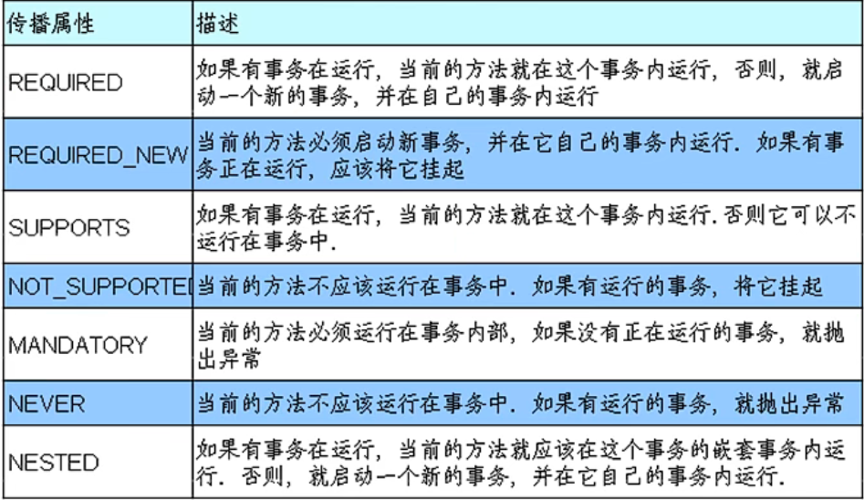

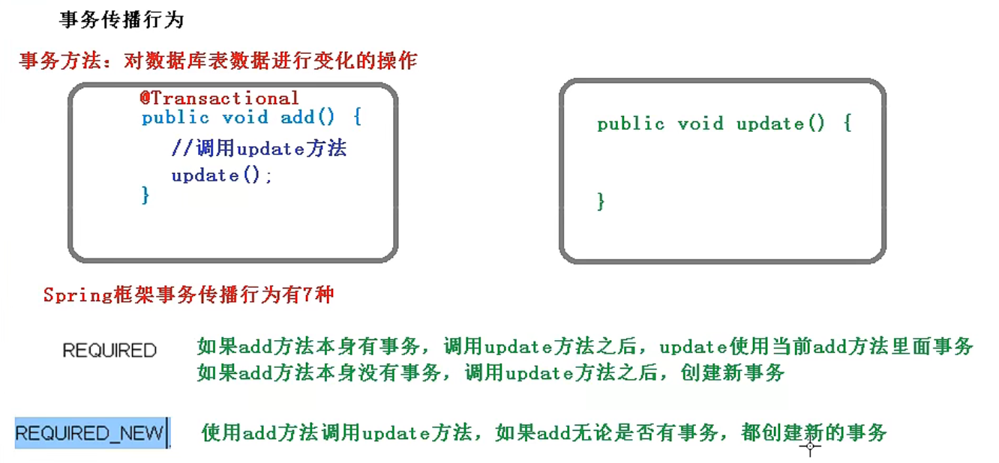

```java
@Transactional(propagation = Propagation.REQUIRED)
```

2、ioslation：事务隔离级别

事务有特性称为隔离性，多事务操作之间不会产生影响。不考虑隔离性会产生很多问题

有三个读问题：脏读、不可重复读、虚（幻）读

​		脏读：一个未提交事务读取到另一个未提交事务的数据

​		不可重复读：一个未提交事务读取到另一提交事务修改数据

​		虚读：一个未提交事务读取到另一提交事务添加数据

解决：通过设置事务隔离级别，解决读问题

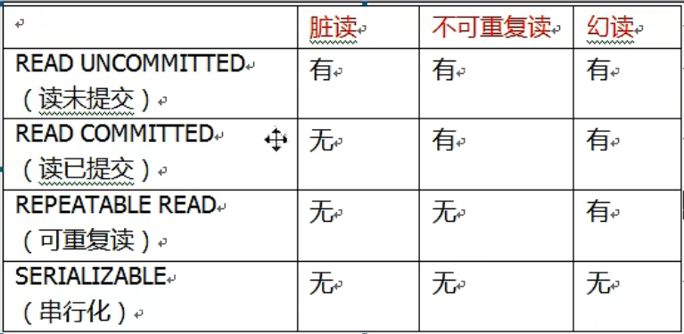

```java
@Transactional(propagation = Propagation.REQUIRED,isolation = Isolation.REPEATABLE_READ)
```

3、timeout：超时时间 

（1）事务需要在一定时间内进行提交，如果不提交进行回滚

（2）默认值是 -1 ，设置时间以秒单位进行计算

```java
@Transactional(timeout = 10)
```

4、readOnly：是否只读

（1）读：查询操作，写：添加修改删除操作

（2）readOnly 默认值 false，表示可以查询，可以添加修改删除操作

（3）设置 readOnly 值是 true，设置成 true 之后，只能查询

```java
@Transactional(readOnly = true)
```

5、rollbackFor：回滚

设置出现哪些异常进行事务回滚

```java
@Transactional(rollbackFor = UnexpectedRollbackException.class)
```

6、noRollbackFor：不回滚

设置出现哪些异常不进行事务回滚

```java
@Transactional(noRollbackFor= UnexpectedRollbackException.class)
```

## XML 声明式事务管理

```xml
<!--1 创建事务管理器--> 
<bean id="transactionManager" class="org.springframework.jdbc.datasource.DataSourceTransactionManager"> 
    <!--注入数据源--> 
    <property name="dataSource" ref="dataSource"></property> 
</bean> 
 
<!--2 配置通知--> 
<tx:advice id="txadvice"> 
    <!--配置事务参数--> 
    <tx:attributes> 
        <!--指定哪种规则的方法上面添加事务--> 
        <tx:method name="accountMoney" propagation="REQUIRED"/>
        <!--指定所有名字有account...的方法上面添加事务-->      
        <tx:method name="account*"/> 
    </tx:attributes> 
</tx:advice> 
 
<!--3 配置切入点和切面--> 
<aop:config> 
    <!--配置切入点，UserService的所有方法--> 
    <aop:pointcut id="pt" expression="execution(* com.atguigu.spring5.service.UserService.*(..))"/> 
    <!--配置切面--> 
    <aop:advisor advice-ref="txadvice" pointcut-ref="pt"/> 
</aop:config> 
```

## 完全注解声明式事务管理

创建配置类，使用配置类替代 xml 配置文件

```java
@Configuration //配置类 
@ComponentScan(basePackages = "com.atguigu") //组件扫描
@EnableTransactionManagement //开启事务 
public class TxConfig { 
    //创建数据库连接池 
    @Bean 
    public DruidDataSource getDruidDataSource() { 
        DruidDataSource dataSource = new DruidDataSource(); 
        dataSource.setDriverClassName("com.mysql.jdbc.Driver"); 
        dataSource.setUrl("jdbc:mysql:///user_db"); 
        dataSource.setUsername("root"); 
        dataSource.setPassword("root"); 
        return dataSource; 
    } 
    //创建 JdbcTemplate 对象 
    @Bean 
    public JdbcTemplate getJdbcTemplate(DataSource dataSource) { 
        //到 ioc 容器中根据类型找到dataSource 
        JdbcTemplate jdbcTemplate = new JdbcTemplate(); 
        //注入 dataSource 
        jdbcTemplate.setDataSource(dataSource);
        return jdbcTemplate; 
    } 
    //创建事务管理器 
    @Bean 
    public DataSourceTransactionManager getDataSourceTransactionManager(DataSource dataSource) { 
        DataSourceTransactionManager transactionManager = new DataSourceTransactionManager(); 
        transactionManager.setDataSource(dataSource); 
        return transactionManager; 
    } 
}
```

# Spring5 框架新功能

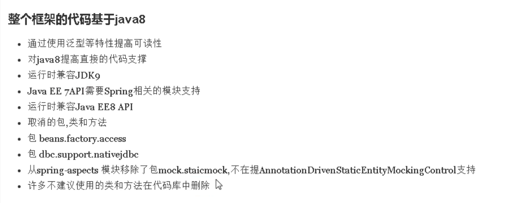

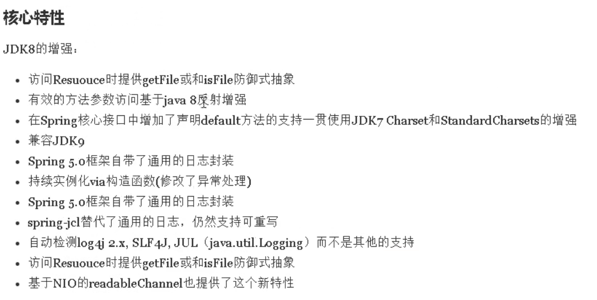

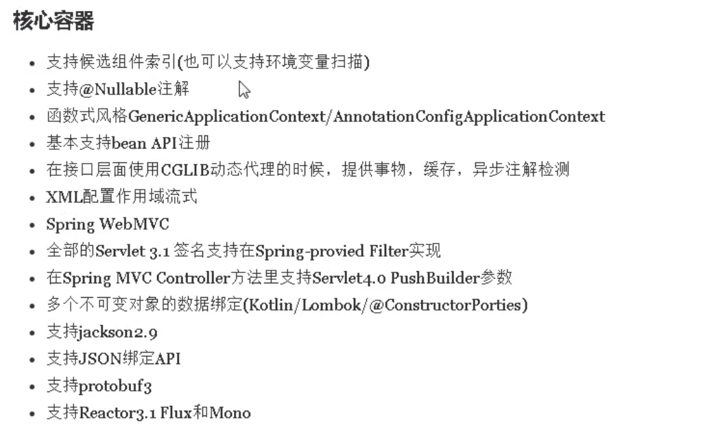

## 整合日志框架

Spring 5.0 框架自带了通用的日志封装，Spring5 已经移除 Log4jConfigListener，官方建议使用 Log4j2 。

Spring5 框架整合 Log4j2 ：

第一步引入jar 包：

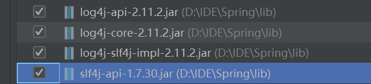

第二步 创建 log4j2.xml 配置文件：

```xml
<?xml version="1.0" encoding="UTF-8"?> 
<!--日志级别以及优先级排序: OFF > FATAL > ERROR > WARN > INFO > DEBUG > TRACE > ALL --> 
<!--Configuration 后面的 status 用于设置 log4j2 自身内部的信息输出，可以不设置， 当设置成trace 时，可以看到log4j2 内部各种详细输出--> 
<configuration status="INFO"> 
    <!--先定义所有的 appender--> 
    <appenders> 
        <!--输出日志信息到控制台--> 
        <console name="Console" target="SYSTEM_OUT"> 
            <!--控制日志输出的格式--> 
            <PatternLayout pattern="%d{yyyy-MM-dd HH:mm:ss.SSS} [%t] %- 5level %logger{36} - %msg%n"/> 
        </console> 
    </appenders> 
    <!--然后定义 logger，只有定义 logger 并引入的 appender，appender 才会生效--> 
    <!--root：用于指定项目的根日志，如果没有单独指定 Logger，则会使用 root 作为默认的日志输出--> 
    <loggers> 
        <root level="info"> 
            <appender-ref ref="Console"/> 
        </root>
    </loggers> 
</configuration> 
```

## @Nullable 注解

Spring5 框架核心容器支持@Nullable 注解

（1）@Nullable 注解可以使用在方法上面，属性上面，参数上面，表示方法返回可以为空，属性值可以为空，参数值可以为空

（2）注解用在方法上面，方法返回值可以为空

（3） 注解使用在方法参数里面，方法参数可以为空

（4）注解使用在属性上面，属性值可以为空

## 函数式风格

Spring5 核心容器支持函数式风格 GenericApplicationContext，lambda表达式

```java
//函数式风格创建对象，交给 spring 进行管理 
@Test 
public void testGenericApplicationContext() { 
    //1 创建 GenericApplicationContext 对象 
    GenericApplicationContext context = new GenericApplicationContext(); 
    //2 调用 context 的方法对象注册 
    context.refresh(); 
    context.registerBean("user1",User.class,() -> new User()); 
    //3 获取在 spring 注册的对象 
    User user = (User)context.getBean("user1");
    
    //注册的对象没有默认值，通过类的全路径获取
    //context.registerBean(User.class,() -> new User());
    // User user = (User)context.getBean("com.atguigu.spring5.test.User"); 
    
    System.out.println(user); 
}
```

##  JUnit

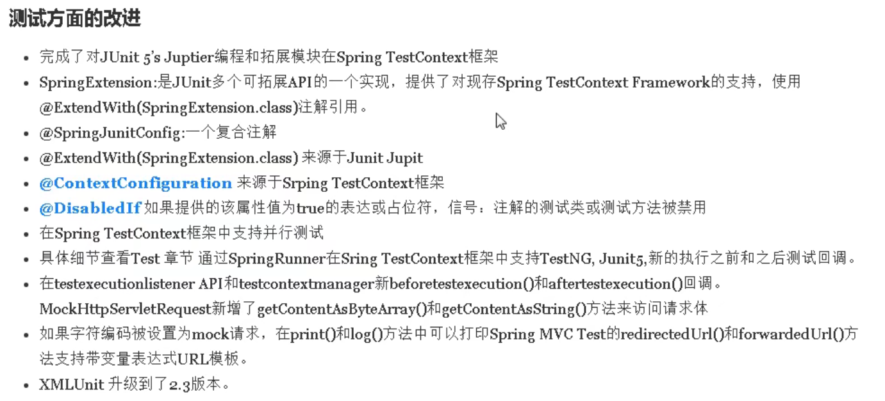

整合 JUnit4：

第一步 引入 Spring 相关针对测试依赖


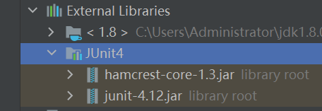

第二步 创建测试类，使用注解方式完成

```java
@RunWith(SpringJUnit4ClassRunner.class) //单元测试框架
@ContextConfiguration("classpath:bean1.xml") //加载配置文件
public class JTest4 { 
    @Autowired 
    private UserService userService; 
    @Test 
    public void test1() { 
        userService.accountMoney(); 
    } 
}
```

整合JUnit5：

第一步 引入 JUnit5 的 jar 包

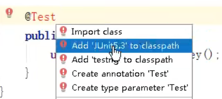

第二步 创建测试类，使用注解完成

```java
@ExtendWith(SpringExtension.class) 
@ContextConfiguration("classpath:bean1.xml") 
public class JTest5 { 
    @Autowired 
    private UserService userService; 
    @Test 
    public void test1() { 
        userService.accountMoney(); 
    } 
} 
//使用一个复合注解替代上面两个注解完成整合：
@SpringJUnitConfig(locations = "classpath:bean1.xml") 
public class JTest5 { 
    @Autowired 
    private UserService userService; 
    @Test 
    public void test1() { 
        userService.accountMoney(); 
    } 
} 
```

## Webflux

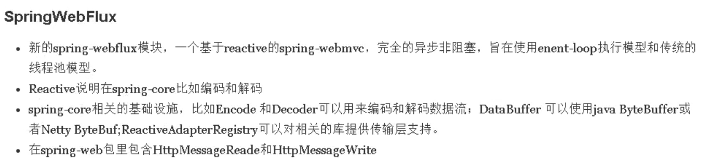

（1）是 Spring5 添加新的模块，用于 web 开发的，功能和 SpringMVC 类似的，Webflux 使用当前一种比较流程响应式编程出现的框架。

（2）使用传统 web 框架，比如 SpringMVC，这些基于 Servlet 容器，Webflux 是一种异步非阻塞的框架，异步非阻塞的框架在 Servlet3.1 以后才支持，核心是基于 Reactor 的相关 API 实现的。

异步非阻塞：

异步和同步针对调用者，调用者发送请求，如果等着对方回应之后才去做其他事情就是同步，如果发送请求之后不等着对方回应就去做其他事情就是异步

阻塞和非阻塞针对被调用者，被调用者受到请求之后，做完请求任务之后才给出反馈就是阻塞，受到请求之后马上给出反馈然后再去做事情就是非阻塞

Webflux 特点：

第一 非阻塞式：在有限资源下，提高系统吞吐量和伸缩性，以 Reactor 为基础实现响应式编程

第二 函数式编程：Spring5 框架基于 java8，Webflux 使用 Java8 函数式编程方式实现路由请求

与 SpringMVC比较：

第一 两个框架都可以使用注解方式，都运行在 Tomet 等容器中

第二 SpringMVC 采用命令式编程，Webflux 采用异步响应式编程

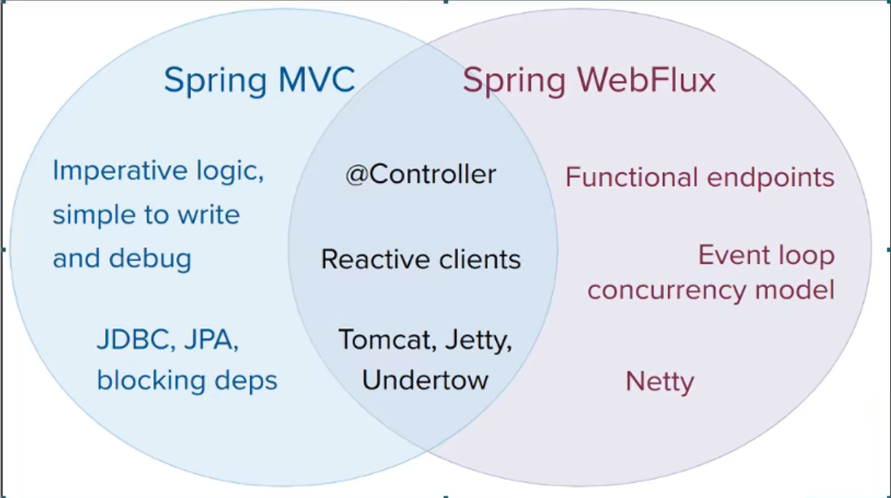

### 响应式编程：

响应式编程是一种面向数据流和变化传播的编程范式。这意味着可以在编程语言中很方便地表达静态或动态的数据流，而相关的计算模型会自动将变化的值通过数据流进行传播。电子表格程序就是响应式编程的一个例子。单元格可以包含字面值或类似"=B1+C1"的公 式，而包含公式的单元格的值会依据其他单元格的值的变化而变化。

java实现：

新建Spring Boot项目

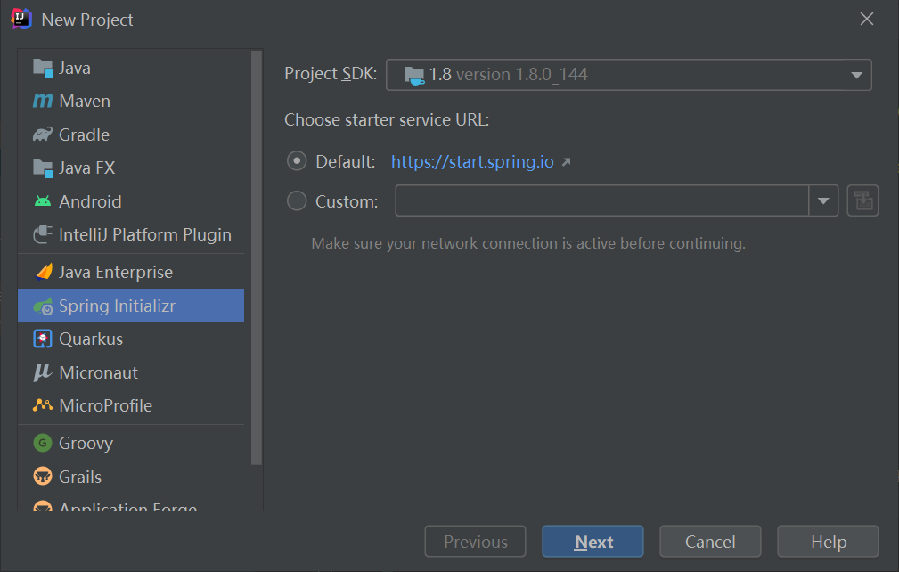

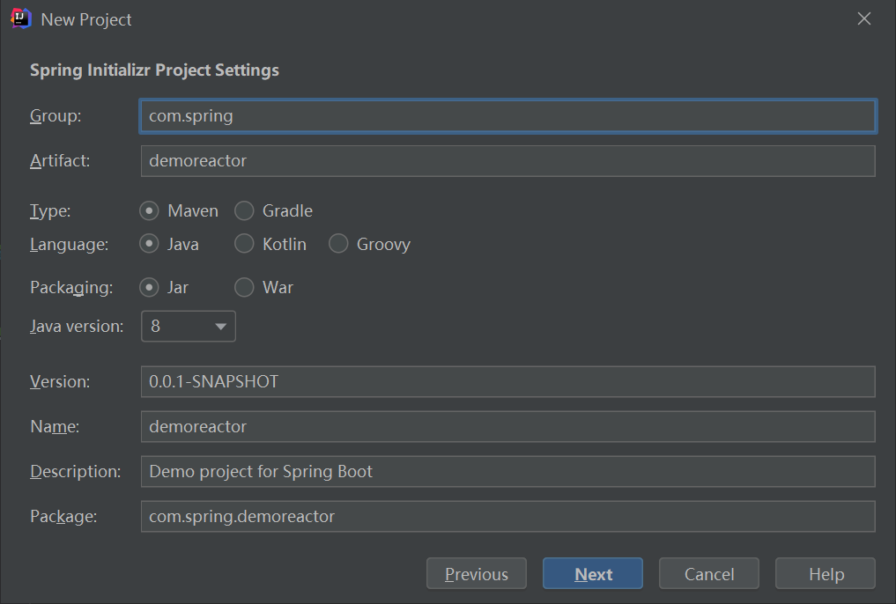

提供的观察者模式两个类 Observer 和 Observable

```java
//Java8 及其之前版本:
public class ObserverDemo extends Observable { 
 
    public static void main(String[] args) { 
        ObserverDemo observer = new ObserverDemo(); 
        //添加观察者 
        observer.addObserver((o,arg)->{ 
            System.out.println("发生变化"); 
        }); 
        observer.addObserver((o,arg)->{ 
            System.out.println("手动被观察者通知，准备改变"); 
        }); 
        observer.setChanged(); //数据变化 
        observer.notifyObservers(); //通知 
    } 
} 
```

Reactor 实现:

（1）响应式编程操作中，Reactor 是满足 Reactive 规范框架
（2）Reactor 有两个核心类，Mono 和 Flux，这两个类实现接口 Publisher，提供丰富操作符。Flux 对象实现发布者，返回 N 个元素；Mono 实现发布者，返回 0 或者 1 个元素
（3）Flux 和 Mono 都是数据流的发布者，使用 Flux 和 Mono 都可以发出三种数据信号： 元素值，错误信号，完成信号。错误信号和完成信号都代表终止信号，终止信号用于告诉订阅者数据流结束了，错误信号终止数据流同时把错误信息传递给订阅者。 

三种信号特点：

- 错误信号和完成信号都是终止信号，不能共存的
- 如果没有发送任何元素值，而是直接发送错误或者完成信号，表示是空数据流
-  如果没有错误信号，没有完成信号，表示是无限数据流

代码演示Flux 和 Mono：

```java
//第一步 引入依赖pom.xml
<dependency> 
    <groupId>io.projectreactor</groupId> 
    <artifactId>reactor-core</artifactId> 
    <version>3.1.5.RELEASE</version> 
</dependency> 

//第二步 编程代码
public static void main(String[] args) { 
    //just 方法直接声明 
    Flux.just(1,2,3,4); 
    Mono.just(1); 
    //其他的方法 
    Integer[] array = {1,2,3,4}; 
    Flux.fromArray(array); 
     
    List<Integer> list = Arrays.asList(array); 
    Flux.fromIterable(list); 
 
    Stream<Integer> stream = list.stream(); 
    Flux.fromStream(stream);     
    
    //调用 just 或者其他方法只是声明数据流，数据流并没有发出，只有调用订阅方法subscribe之后才会触发数据流，不订阅什么都不会发生的
    Flux.just(1,2,3,4).subscribe(Ssytem.out::print); 
    Mono.just(1).subscribe(Ssytem.out::print); 
} 
```

操作符：

对数据流进行一道道操作，成为操作符。

map， 元素映射为新元素

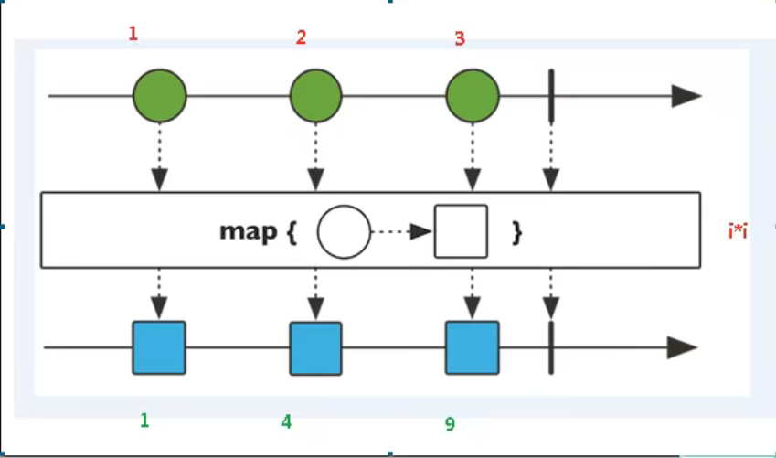

flatMap， 元素映射为流，把每个元素转换流，把转换之后多个流合并大的流。 

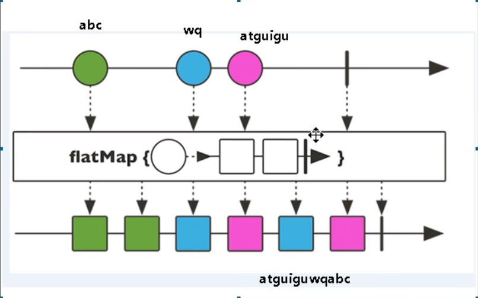

### 执行流程和核心API

SpringWebflux 基于 Reactor，默认使用容器是 Netty，Netty 是高性能的 NIO 框架，异步非阻塞的框架

（1）Netty：

BIO阻塞：

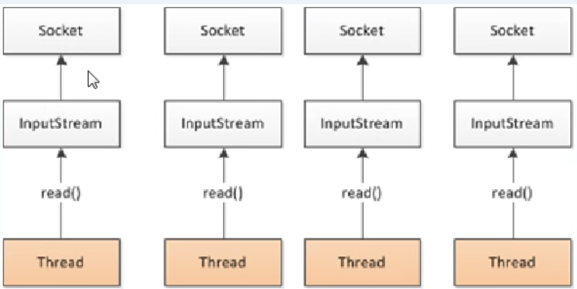

NIO非阻塞：

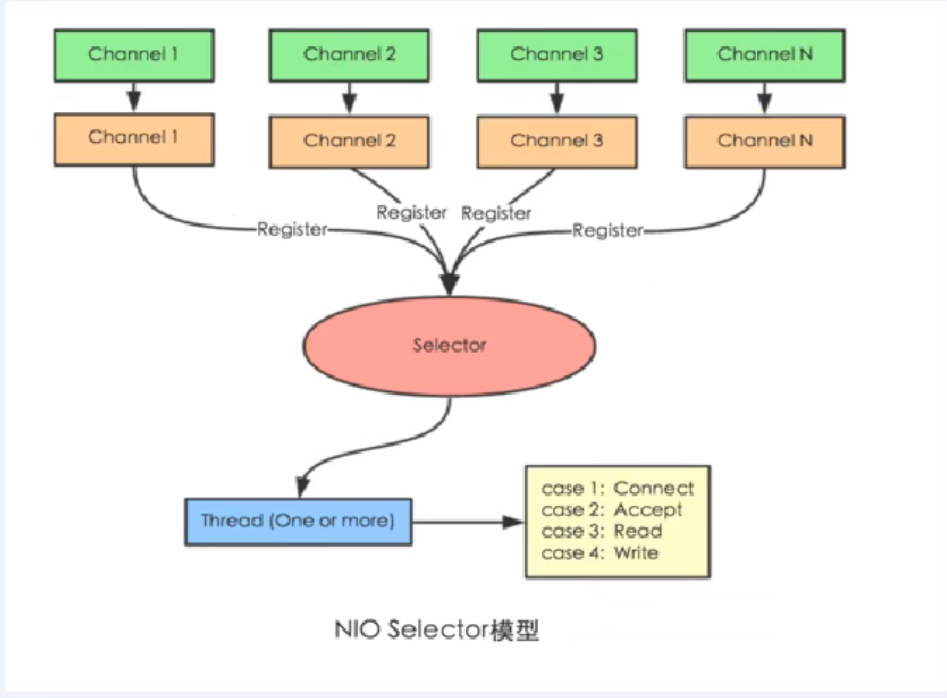

（2）SpringWebflux执行过程和 SpringMVC 相似，SpringWebflux 核心控制器 DispatchHandler，实现接口 WebHandler

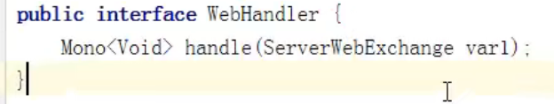

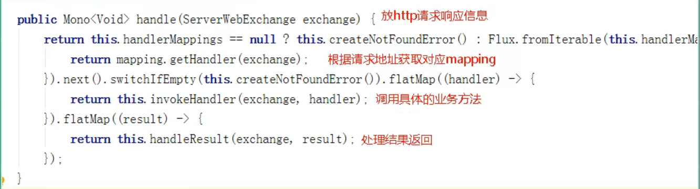

（3）SpringWebflux 里面

DispatcherHandler：负责请求的处理

HandlerMapping：请求查询到处理的方法

HandlerAdapter：真正负责请求处理

HandlerResultHandler：响应结果处理

### 基于注解编程模型

SpringWebflux 实现方式有两种：注解编程模型和函数式编程模型

使用注解编程模型方式，和之前 SpringMVC 使用相似的，只需要把相关依赖配置到项目中，SpringBoot 自动配置相关运行容器，默认情况下使用 Netty 服务器。

SpringMVC 方式实现，同步阻塞的方式，基于 SpringMVC+Servlet+Tomcat 

SpringWebflux 方式实现，异步非阻塞方式，基于 SpringWebflux+Reactor+Netty

1、创建 SpringBoot 工程，引入 Webflux 依赖：

```xml
	    <dependency>
            <groupId>org.springframework.boot</groupId>
            <artifactId>spring-boot-starter-webflux</artifactId>
        </dependency>
```

2、 配置启动端口号

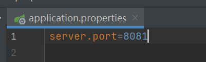

3、创建包和相关类

```java
//实体类：
public class User {
    private String name;
    private String gender;
    private Integer age;
    public User(){}
    public User(String name, String gender, Integer age) {
        this.name = name;
        this.gender = gender;
        this.age = age;
    }
	.....
}
//创建接口定义操作的方法
//用户操作接口 
public interface UserService { 
    //根据 id 查询用户 
    Mono<User> getUserById(int id); 
    //查询所有用户 
    Flux<User> getAllUser(); 
    //添加用户 
    Mono<Void> saveUserInfo(Mono<User> user); 
} 

//接口实现类 
public class UserServiceImpl implements UserService { 
    //创建 map 集合存储数据 
    private final Map<Integer,User> users = new HashMap<>(); 
    public UserServiceImpl() { 
        this.users.put(1,new User("lucy","nan",20)); 
        this.users.put(2,new User("mary","nv",30)); 
        this.users.put(3,new User("jack","nv",50)); 
    } 
    //根据 id 查询 
    @Override 
    public Mono<User> getUserById(int id) { 
        return Mono.justOrEmpty(this.users.get(id)); 
    } 
    //查询多个用户 
    @Override 
    public Flux<User> getAllUser() { 
        return Flux.fromIterable(this.users.values()); 
    }
    //添加用户 
    @Override 
    public Mono<Void> saveUserInfo(Mono<User> userMono) { 
        return userMono.doOnNext(person -> { 
            //向 map 集合里面放值 
            int id = users.size()+1; 
            users.put(id,person); 
        }).thenEmpty(Mono.empty()); 
    } 
} 

//创建 controller
@RestController 
public class UserController { 
    //注入 service 
    @Autowired 
    private UserService userService; 
    //id 查询 
    @GetMapping("/user/{id}") 
    public Mono<User> geetUserId(@PathVariable int id) { 
        return userService.getUserById(id); 
    } 
    //查询所有 
    @GetMapping("/user") 
    public Flux<User> getUsers() { 
        return userService.getAllUser(); 
    } 
    //添加 
    @PostMapping("/saveuser") 
    public Mono<Void> saveUser(@RequestBody User user) { 
        Mono<User> userMono = Mono.just(user); 
        return userService.saveUserInfo(userMono); 
    } 
} 
```

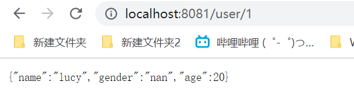

### 基于函数式编程模型

（1）在使用函数式编程模型操作时候，需要自己初始化服务器

（2）核心接口：RouterFunction（实现路由功能，请求转发 给对应的 handler）和 HandlerFunction（处理请求生成响应

的函数）。

核心任务：定义两个函数式接口的实现并且启动需要的服务器。

（ 3 ） SpringWebflux 请 求 和 响 应不再 是 ServletRequest 和 ServletResponse ，而是ServerRequest 和 ServerResponse。

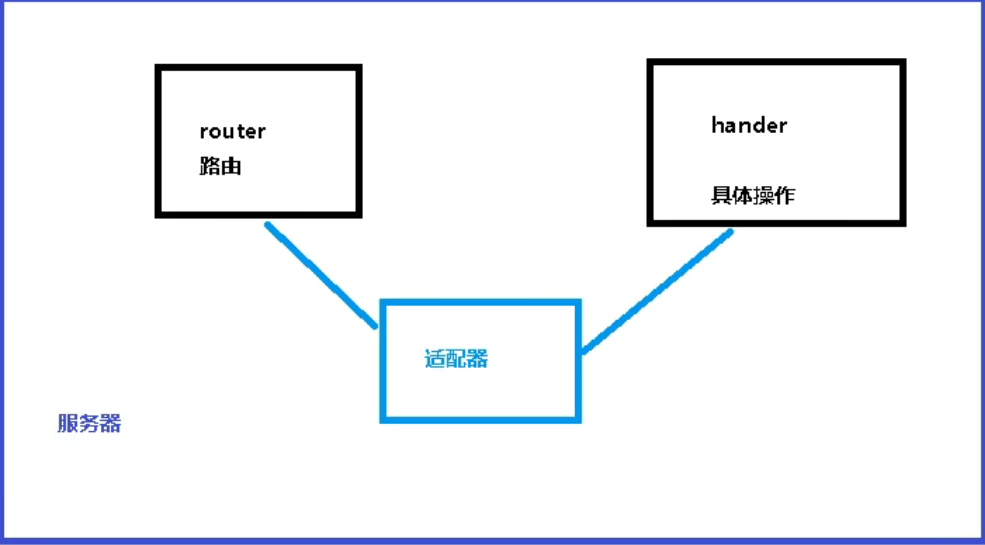

1、把注解编程模型工程复制一份 ，保留 entity 和 service 内容

2、创建 Handler（具体实现方法）

```java
public class UserHandler { 
    private final UserService userService; 
    public UserHandler(UserService userService) { 
        this.userService = userService; 
    } 
    //根据 id 查询 
    public Mono<ServerResponse> getUserById(ServerRequest request) { 
        //获取 id 值 
       int userId = Integer.valueOf(request.pathVariable("id")); 
       //空值处理 
        Mono<ServerResponse> notFound = ServerResponse.notFound().build(); 
       //调用 service 方法得到数据 
        Mono<User> userMono = this.userService.getUserById(userId);
 //把 userMono 进行转换返回 
        //使用 Reactor 操作符 flatMap 
        return 
                userMono.flatMap(person->ServerResponse.ok().contentType(MediaType.APPLICATION_JSON)
.body(fromObject(person))).switchIfEmpty(notFound); 
    } 
    //查询所有
    public Mono<ServerResponse> getAllUsers(ServerRequest request) {
        //调用 service 得到结果
        Flux<User> users = this.userService.getAllUser();
        return ServerResponse.ok().contentType(MediaType.APPLICATION_JSON).body(users,User.class);
    }
    //添加 
    public Mono<ServerResponse> saveUser(ServerRequest request) { 
        //得到 user 对象 
        Mono<User> userMono = request.bodyToMono(User.class); 
        return ServerResponse.ok().build(this.userService.saveUserInfo(userMono)); 
    }  
} 
```

3、初始化服务器，编写 Router

```java
//1 创建 Router 路由 
public RouterFunction<ServerResponse> routingFunction() { 
    //创建 hanler 对象 
    UserService userService = new UserServiceImpl(); 
    UserHandler handler = new UserHandler(userService); 
    //设置路由 
    return RouterFunctions.route( 
            
GET("/users/{id}").and(accept(APPLICATION_JSON)),handler::getUserById) 
            .andRoute(GET("/users").and(accept(APPLICATION_JSON)),handler::get AllUsers); 
}

//2 创建服务器完成适配 
public void createReactorServer() { 
    //路由和 handler 适配 
    RouterFunction<ServerResponse> route = routingFunction(); 
    HttpHandler httpHandler = toHttpHandler(route); 
    ReactorHttpHandlerAdapter adapter = new ReactorHttpHandlerAdapter(httpHandler); 
    //创建服务器 
    HttpServer httpServer = HttpServer.create(); 
    httpServer.handle(adapter).bindNow(); 
} 

//最终调用 
public static void main(String[] args) throws Exception{ 
    Server server = new Server(); 
    server.createReactorServer(); 
    System.out.println("enter to exit"); 
    System.in.read(); 
} 
```

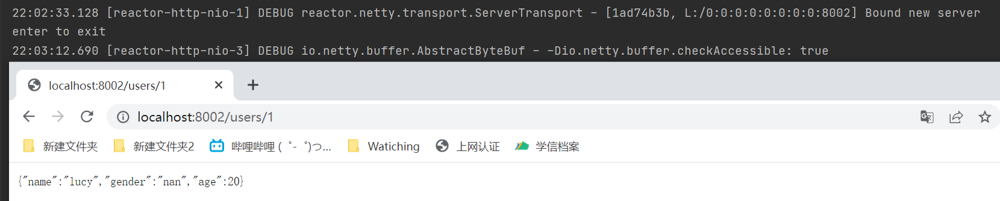

4、使用 WebClient 调用

```java
public class Client {
    public static void main(String[] args) {
        //调用服务器地址
        WebClient webClient = WebClient.create("http://127.0.0.1:5794");
        //根据 id 查询
        String id = "1";
        User userresult = webClient.get().uri("/users/{id}", id).accept(MediaType.APPLICATION_JSON).retrieve().bodyToMono(User.class).block();
        System.out.println(userresult.getName());
        //查询所有
        Flux<User> results = webClient.get().uri("/users")
            .accept(MediaType.APPLICATION_JSON).retrieve().bodyToFlux(User.class);
        results.map(stu -> stu.getName()).buffer().doOnNext(System.out::println).blockFirst();
    }
}
```
