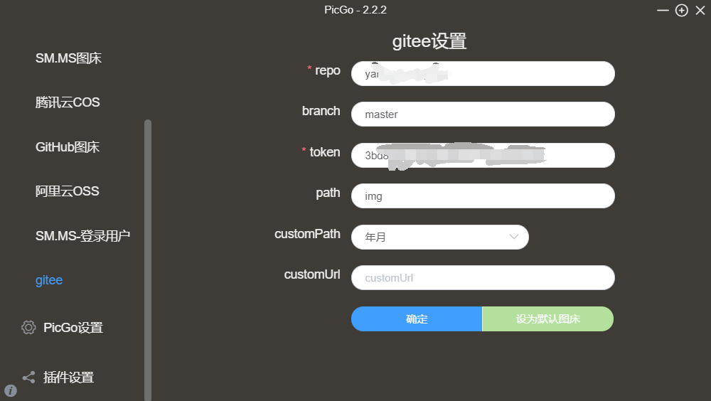
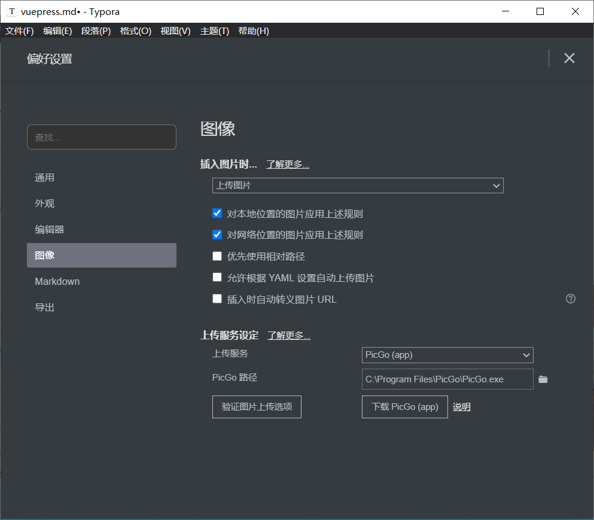
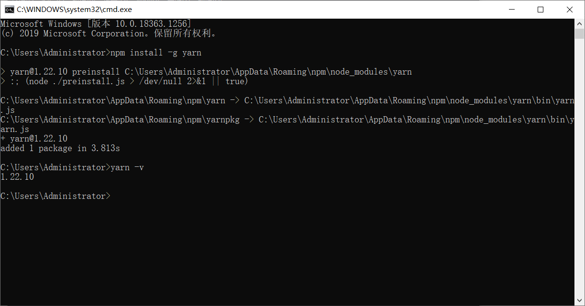
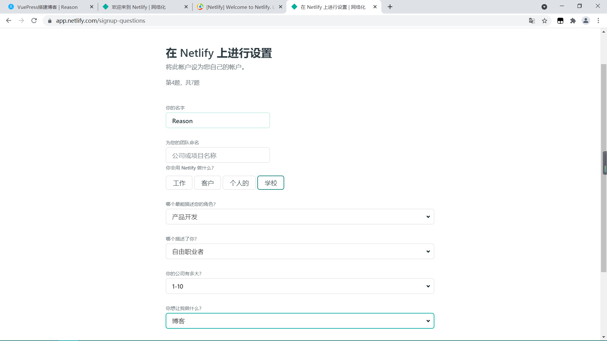
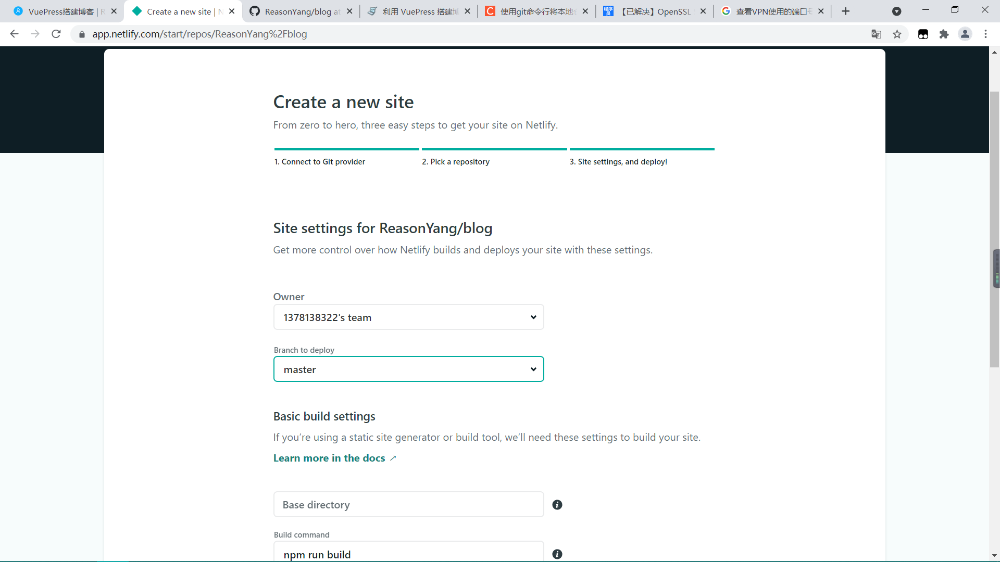
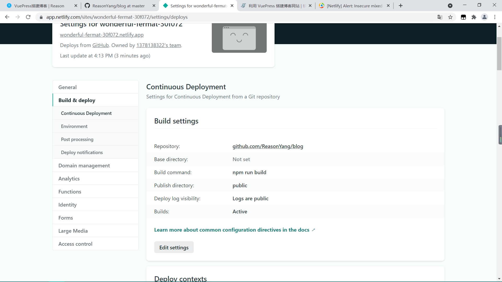
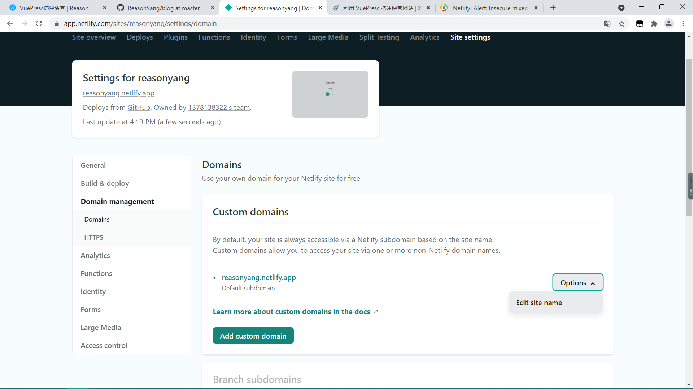

# Typora设置图床，方便访问图片资源。

### 下载PicGo和Typora

https://pan.baidu.com/s/1GHy-0xOs1scEXEPF6Bqkuw 提取码: dagf

PicGo客户端下载地址：https://github.com/Molunerfinn/PicGo 

### 配置自己的仓库

https://gitee.com/在码云中创建自己的账号,创建自己的仓库，注意:一定要选择公开的,默认创建master分支，不然我们访问不到我们的仓库

创建自己的个人令牌

在设置中选择私人令牌,创建自己的令牌,用于我们通过令牌访问我们的仓库

然后会生成一个私人令牌,很重要,找个地方保存起来，之后的配置需要用到.

### 配置PicGo

第一步:下载插件github-uploader,也可以选择gitee插件

第二步插件配置

repo 你的仓库名 注意格式 账号名/仓库名，可以直接复制你的网址。

token 粘贴刚才生成的token私人令牌

其他设置如图即可



在Typora中配置为粘贴时自动上传图片,这样就可以插入图片自动上传了。



# 利用VuePress搭建博客网站

## 1.安装VuePress

### 1.下载安装 [Node.js (opens new window)](https://nodejs.org/)和 [Yarn (opens new window)](https://yarnpkg.com/latest.msi)。

1.安装Node.js

打开链接下载安装包默认安装即可。

2.安装Yarn

cmd命令行输入 npm install -g yarn



### 2.安装 VuePress

查看yarn安装位置进入

```
where yarn
```

快速上手：请确保你的 Node.js 版本 >= 8。

全局安装：

如果你只是想尝试一下 VuePress，你可以全局安装它：

```
# 安装 vuepress：
yarn global add vuepress # 或者：npm install -g vuepress

#更新 vuepress：
yarn global upgrade vuepress

#检查版本：
在C:\Users\Administrator\AppData\Local\Yarn\bin目录下
vuepress --version

# 新建一个 markdown 文件
echo '# Hello VuePress!' > README.md

# 开始写作
vuepress dev .

# 构建静态文件
vuepress build .
```

现有项目：

如果你想在一个现有项目中使用 VuePress，同时想要在该项目中管理文档，则应该将 VuePress 安装为本地依赖。作为本地依赖安装让你可以使用持续集成工具，或者一些其他服务（比如 Netlify）来帮助你在每次提交代码时自动部署。

```
#将 VuePress 作为一个本地依赖安装
yarn add -D vuepress # 或者：npm install -D vuepress

#新建一个 docs 文件夹
mkdir docs

#新建一个 markdown 文件
echo '# Hello VuePress!' > docs/README.md

#开始写作
npx vuepress dev docs

#浏览器打开http://localhost:8080

```

注意如果你的现有项目依赖了 webpack 3.x，推荐使用 Yarn 而不是 npm 来安装 VuePress。因为在这种情形下，npm 会生成错误的依赖树。

接着，在 package.json 里加一些脚本（注意代码格式，逗号等）:

```
{
  "scripts": {
    "docs:dev": "vuepress dev docs",
    "docs:build": "vuepress build docs"
  }
}
```


```
然后就可以开始写作了:
yarn docs:dev # 或者：npm run docs:dev

生成静态的 HTML 文件，运行：
yarn docs:build # 或者：npm run docs:build
```

默认情况下，文件将会被生成在 .vuepress/dist，当然，你也可以通过 .vuepress/config.js 中的 dest 字段来修改，生成的文件可以部署到任意的静态文件服务器上，参考 部署 来了解更多。

## 2.搭建 Blog 平台

1.主题：

一个 VuePress 主题应该负责整个网站的布局和交互细节。在 VuePress 中，目前自带了一个默认的主题（正是你现在所看到的），它是为技术文档而设计的。同时，默认主题提供了一些选项，让你可以去自定义导航栏（navbar）、 侧边栏（sidebar）和 首页（homepage） 等，详情请参见 [默认主题](https://www.vuepress.cn/theme/default-theme-config.html) 。

2.自定义主题

如果你想开发一个自定义主题，可以参考 [自定义主题](https://www.vuepress.cn/theme/)。如果不想自己开发，可以参考下一项。

yarn目录下建立目录结构如下

```
vuepress
├─── docs
│   ├── README.md
│   └── .vuepress
│       ├── public
│       └── config.js
└── package.json
```

基本`config.js`配置文件，可以根据自己的喜好修改

```
// docs/.vuepress/config.js
module.exports = {
    title:"我的博客",   // HTML的title
    description:"博客",   // 描述
    keywords:"博客",  // 关键字
    head:[   // 配置头部
        [
            ['link', {rel:'icon', href:"/icon.png"}],
            ['meta', {'name':'viewport', content:"width=device-width, initial-scale=1.0, maximum-scale=1.0, user-scalable=0;"}]
        ]
    ],
    markdown: {
        lineNumbers: true,  // 代码显示行号
    }, 
    dest:"./outer",    // 设置打包路径
    lastUpdated: 'Last Updated',
    themeConfig:{
        nav: require('./nav'),   // 引入导航栏
        sidebar:require('./sidebar'),  // 引入侧边栏
    },
    ...
}

```

将导航栏和侧边栏从基本配置config中分离出来，方便修改

```
//  docs/.vuepress/sidebar.js 侧边栏
module.exports = {
    "/api/front/2019/": require('../.vuepress/frontbar/2019'),  // 继续分类
    "/api/front/2020/": require('../.vuepress/frontbar/2020'),
    "/api/end/2019/": require('../.vuepress/endbar/2019'),
    "/api/learn/koa/": require('../.vuepress/learnbar/koabar'),
    "/api/learn/express/": require('../.vuepress/learnbar/expressbar'),
    "/api/learn/java/": require('../.vuepress/learnbar/javabar'),
    "/api/learn/es6/": require('../.vuepress/learnbar/es6bar'),
    "/api/learn/vue/": require('../.vuepress/learnbar/vuebar'),
}

//   docs/.vuepress/nav.js 导航栏
module.exports = [
    {"text":"首页", "link":"/"},
    {
		"text":"技术API",
        "ariLabel":"技术API",
        "items":[
            {"text":"koa",    "link":"/api/learn/koa/"},
            {"text":"vue",    "link":"/api/learn/vue/"},
            {"text":"es6",    "link":"/api/learn/es6/"},
            {"text":"java",   "link":"/api/learn/java/"},
            {"text":"express","link":"/api/learn/express/"},
        ]
	  },
	  {
        "text":"日常博客",
        "ariLabel":"日常博客",
        "items":[
            {"text":"前端","link":"/api/front/"},
            {"text":"后端","link":"/api/end/"},
            {"text":"其他","link":"/api/orther/1.md"},
        ]
      },
    {text:"关于博客", link:"/api/builog/"},
    {text:"关于作者", link:"/api/author/"},
    {
        text:"其他小站",
        ariLabel:"其他小站", 
        items:[
            {text:"掘金", link:'https://juejin.im/user/5d1079ab6fb9a07ed4410cc0'},
            {text:"SegmentFault", link:'https://segmentfault.com/u/98kk'},
            {text:"CSDN", link:'https://blog.csdn.net/weixin_43374176'},
        ]
    },
    {
        text:"联系",
        ariLabel:"联系",
        items:[
            {text:"邮箱", link:"mailto:wsm_1105@163.com", target:"_blank"},
            {text:"其他", link:"/api/contact/"}
        ]
    },
    {text:"GitHub", link:"http://github.com/1046224544"}
]
```

自定义主题完成后

3.安装`vuepress-theme-reco`主题

如果你不想自定义主题，可以直接安装vuepress官方主题例如`vuepress-theme-reco`

```shell
# 安装主题
yarn global add @vuepress-reco/theme-cli

# 升级主题
#yarn global upgrade @vuepress-reco/theme-cli

# 进入到主题的安装目录并初始化（需要回答一些问题，最后一个选择： blog）
#初始化可能因为移动网络问题无法连接git，建议改换电信网络或者某些手段解决
yarn theme-cli init my-blog

# 安装
cd my-blog
yarn install

# 【可选步骤】升级
#yarn upgrade
```

```shell
# 打开本地服务
# 或者: vuepress dev docs
yarn dev

# 编译生成静态网页
yarn build
```

如果编译生成静态网页时，发生类似下面的错误：

```text
Module not found: Error: Can't resolve 'vue-class-component' in ...
```

这是因为某些依赖关系不满足所致，可参照错误提示，运行如下命令来添加相关依赖：

```shell
yarn add -D vue-class-component
yarn add -D vue
```

再次尝试编译生成静态网页，或是打开本地服务。应该一切正常才可以进行下一步。

打开本地服务后，VuePress 的开发环境可通过浏览器访问 http://localhost:8080/。

这将生成一个博客网站模板“my-blog”，其中“docs”文件夹里面是主要的源文件，包括配置和博客文章的 Markdown 文件。我们可以在此基础上，进行修改和定制。

初始化主题后修改美化主题。根据你的喜好，修改配置，美化你的博客。

我的项目名称为my-blog，

my-blog\ 目录下REANME.md文件修改你的主页信息。

my-blog\ .vuepress 目录下修改博客网页配置文件config.js。

my-blog\ .vuepress \public 目录下存放你的博客需要使用的图片

my-blog\public 目录下存放你的标签图片（头像 符号 标志等）

my-blog\public\assets\img 目录下 存放一个你喜欢的博客主背景图片

4.提交到GitHub。

本地开发满意后，在 GitHub （也可以是 GitLab等类似的版本控制托管服务）中建立一个代码库，将本地代码提交到代码库中。

建立本地 git 仓库，cd 到你的本地项目根目录下，执行 git init 命令

```
cd 本地工程根目录
git init
```

第2步：将本地项目工作区的所有文件添加到暂存区。小数点 “.” ，意为添加文件夹下的所有文件；也可以将 “.” 换成具体的文件名，如果想添加项目中的指定文件，那就把 “.” 改为指定文件名即可

```
git add .
```

第3步：将暂存区的文件提交到本地仓库

```
git commit -m "注释说明"
```

第4步：在 github 或者 gitlab 上创建新的repository，本文基于 github 操作，gitlab 类似，不做详述。

然后复制一下远程仓库的https地址。

第5步：将本地代码仓库关联到 github 上

```
git remote add origin 远程仓库的https地址
```

如果在这一步时如果出现错误：
fatal:remote origin already exists
那就先输入

```
git remote rm origin
```

再输入

```
 git remote add origin 远程仓库的https地址
```

第6步：将代码由本地仓库上传到 github 远程仓库，依次执行下列语句

*6-1、* 获取远程库与本地同步合并（如果远程库不为空必须做这一步，否则后面的提交会失败）：

```
git pull --rebase origin master  //不加这句可能报错，原因是 github 中的 README.md 文件不在本地仓库中
//可以通过该命令进行代码合并
```

*6-2、* 把当前分支 master 推送到远程，执行此命令后有可能会让输入用户名、密码，或是直接请求授权：

```
git push -u origin master
```

在使用git命令进行push和pull时，出现如下报错：

```bash
fatal: unable to access 'https://github.com/wxler/test.git/': OpenSSL SSL_connect: Connection was reset in connection to github.com:443
```

### 方案一

在git bash命令行中依次输入以下命令：

```bash
git config --global http.sslBackend "openssl"
git config --global http.sslCAInfo "C:\Program Files\Git\mingw64\ssl\cert.pem"
```

注意上面第二个命令，路径要换成git安装的路径。

### 方案二

如果你使用了神秘手段，很可能是因为DL的问题，这时候设置一下http.proxy就可以了。
比如我用的VPN是shadow，先查看当前DL使用的端口号，我的端口号是7890。

在git bash命令行中输入以下命令即可：

```bash
git config --global http.proxy 127.0.0.1:7890
git config --global https.proxy 127.0.0.1:7890
```

如果你之前git中已经设置过上述配置，则使用如下命令取消再进行配置即可：

```bash
git config --global --unset http.proxy
git config --global --unset https.proxy
```

### 方案三

可能你的VNP代理服务器节点有问题，有时候更换一个结点就好了，

或是打开一个新的git bash终端，可能是与当前git的会话有关。

至此，操作成功！

## 3.发布到 Netlify

发布到 [Netlify.com (opens new window)](https://www.netlify.com/)，只需要简单几步：

（可能因为移动网络问题无法连接git，建议改换电信网络或者某些手段解决）

1. 注册 Netlify 的账号并登录，需要提供一个电子邮件。自行回答问题，最后一项选择博客。

    

2. 点击构建，选择你创建的Github的仓库（上传了本地开发项目文件的）

    

3. 项目设置里面填入 GitHub 代码库的链接，填写构建的命令和输出文件夹。

   按“Deploy site”按钮，耐心等候5分钟左右时间，让构建流程正常结束。

   

   构建成功后，设置定制的域名。

   

   例如这里，我设置了定制的域名"reasonyang"，于是可以这样访问此博客网站： 

   [https://reasonyang.netlify.app/]: https://reasonyang.netlify.app

   

   4.【可选】每次提交到 GitHub，Netlify 将自动构建并发布网站。为了了解构建状态，在首页（README.md）中添加一个“status badge”。

   


# 小结

本文简明扼要地给出了基于 VuePress 搭建个人博客网站的全过程，但是有些技术细节可能没有提及，读者在自行搭建时也可能会遇到一些五花八门的bug，不过读者应该也是技术人员，相信您也习以为常，有能力自行探索或调整，新手人员面向baidu、google编程，至此希望本文对您有所帮助。
