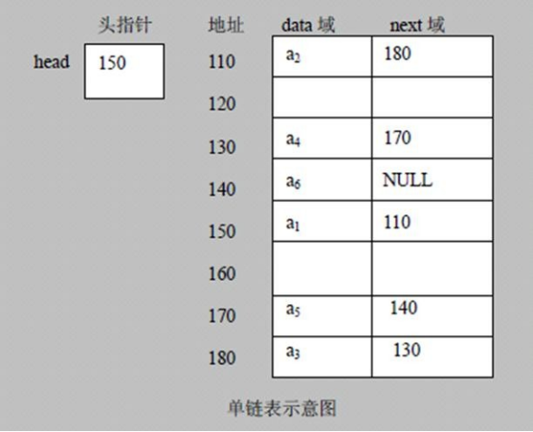
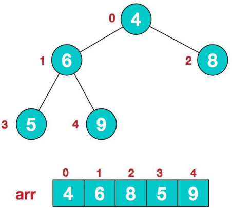
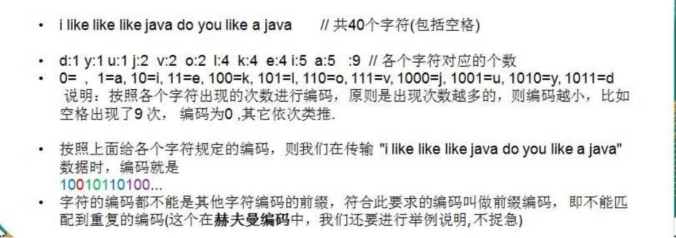
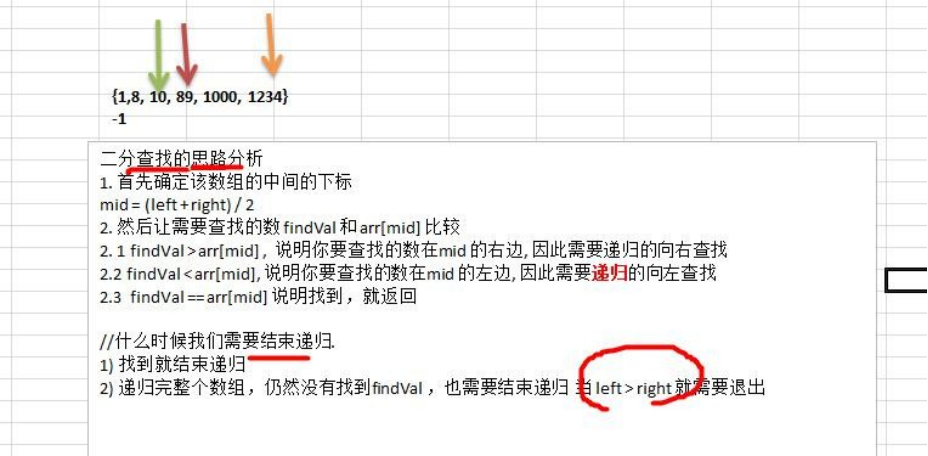

# 数据结构

数据结构包括：线性结构和非线性结构。

线性结构：

1)线性结构作为最常用的数据结构，其特点是数据元素之间存在一对一的线性关系

2)线性结构有两种不同的存储结构，即顺序存储结构(数组)和链式存储结构(链表)。顺序存储的线性表称为顺序表，顺序表

中的存储元素是连续的

3)链式存储的线性表称为链表，链表中的存储元素不一定是连续的，元素节点中存放数据元素以及相邻元素的地址信息

4)线性结构常见的有：数组、队列、链表和栈


非线性结构：

非线性结构包括：二维数组，多维数组，广义表，树结构，图结构


## 稀疏数组

当一个数组中大部分元素为０，或者为同一个值的数组时，可以使用稀疏数组来保存该数组。

稀疏数组的处理方法是:

1) 记录数组一共有几行几列，有多少个不同的值

2) 把具有不同值的元素的行列及值记录在一个小规模的数组中，从而缩小程序的规模


代码实现：

```java
public class SparseArray {
    public static void main(String[] args) {
        // 创建一个原始的二维数组 11 * 11
        // 0: 表示没有棋子， 1 表示 黑子 2 表示蓝子
        int chessArr1[][] = new int[11][11];
        chessArr1[1][2] = 1;
        chessArr1[2][3] = 2;
        chessArr1[4][5] = 2;
        // 输出原始的二维数组
        System.out.println("原始的二维数组~~");
        for (int[] row : chessArr1) {
            for (int data : row) {
                System.out.printf("%d\t", data);
            }
            System.out.println();
        }
        // 将二维数组 转 稀疏数组的思路
        // 1. 先遍历二维数组 得到非 0 数据的个数
        int sum = 0;
        for (int i = 0; i < 11; i++) {
            for (int j = 0; j < 11; j++) {
                if (chessArr1[i][j] != 0) {
                    sum++;
                }
            }
        }
        // 2. 创建对应的稀疏数组
        int sparseArr[][] = new int[sum + 1][3];
        // 给稀疏数组第一行赋值
        sparseArr[0][0] = 11;
        sparseArr[0][1] = 11;
        sparseArr[0][2] = sum;
        // 遍历二维数组，将非 0 的值存放到 sparseArr 中
        int count = 0; //count 用于记录是第几个非 0 数据
        for (int i = 0; i < 11; i++) {
            for (int j = 0; j < 11; j++) {
                if (chessArr1[i][j] != 0) {
                    count++;
                    sparseArr[count][0] = i;
                    sparseArr[count][1] = j;
                    sparseArr[count][2] = chessArr1[i][j];
                }
            }
        }
        // 输出稀疏数组的形式
        System.out.println("得到稀疏数组为~~~~");
        for (int i = 0; i < sparseArr.length; i++) {
            System.out.printf("%d\t%d\t%d\t\n", sparseArr[i][0], sparseArr[i][1], sparseArr[i][2]);
        }

        //将稀疏数组 --》 恢复成 原始的二维数组
        //1. 先读取稀疏数组的第一行，根据第一行的数据，创建原始的二维数组
        int chessArr2[][] = new int[sparseArr[0][0]][sparseArr[0][1]];
        //2. 在读取稀疏数组后几行的数据(从第二行开始)，并赋给 原始的二维数组 即可
        for (int i = 1; i < sparseArr.length; i++) {
            chessArr2[sparseArr[i][0]][sparseArr[i][1]] = sparseArr[i][2];
        }
        // 输出恢复后的二维数组
        System.out.println("恢复后的二维数组");
        for (int[] row : chessArr2) {
            for (int data : row) {
                System.out.printf("%d\t", data);
            }
            System.out.println();
        }
    }
}
```

## 队列

1) 队列是一个有序列表，可以用数组或是链表来实现。

2) 遵循先入先出的原则。即：先存入队列的数据，要先取出。后存入的要后取出

### 数组模拟队列思路

 队列本身是有序列表，若使用数组的结构来存储队列的数据，则队列数组的声明如下图，其中 maxSize 是该队列的最大容量。

因为队列的输出、输入是分别从前后端来处理，因此需要两个变量 front 及 rear 分别记录队列前后端的下标，

front 会随着数据输出而改变，而 rear 则是随着数据输入而改变


使用数组模拟队列-编写一个 ArrayQueue 类：

当我们将数据存入队列时称为”addQueue”，addQueue 的处理需要有两个步骤：思路分析

1) 将尾指针往后移：rear+1 , 当 front == rear 【空】

2) 若尾指针 rear  小于队列的最大下标 maxSize-1，则将数据存入 rear 所指的数组元素中，否则无法存入数据。

当rear	== maxSize - 1 [队列满]

```java
class ArrayQueue {
    private int maxSize; // 表示数组的最大容量
    private int front; // 队列头
    private int rear; // 队列尾
    private int[] arr; // 该数据用于存放数据, 模拟队列

    // 创建队列的构造器
    public ArrayQueue(int arrMaxSize) {
        maxSize = arrMaxSize;
        arr = new int[maxSize];
        front = -1; // 指向队列头部，分析出 front 是指向队列头的前一个位置. 
        rear = -1; // 指向队列尾，指向队列尾的数据(即就是队列最后一个数据)
    }

    // 判断队列是否满
    public boolean isFull() {
        return rear == maxSize - 1;

    }

    // 判断队列是否为空
    public boolean isEmpty() {
        return rear == front;
    }

    // 添加数据到队列
    public void addQueue(int n) {
        // 判断队列是否满
        if (isFull()) {
            System.out.println("队列满，不能加入数据~");
            return;
        }
        rear++; // rear 后移
        arr[rear] = n;
    }

    // 获取队列的数据, 出队列
    public int getQueue() {
        // 判断队列是否空
        if (isEmpty()) {
        // 通过抛出异常
            throw new RuntimeException("队列空，不能取数据");
        }
        front++; // front 后移

        return arr[front];

    }

    // 显示队列的所有数据
    public void showQueue() {
        // 遍历
        if (isEmpty()) {
            System.out.println("队列空的，没有数据~~");
            return;
        }
        for (int i = 0; i < arr.length; i++) {
            System.out.printf("arr[%d]=%d\n", i, arr[i]);
        }
    }

    // 显示队列的头数据， 注意不是取出数据
    public int headQueue() {
        // 判断
        if (isEmpty()) {
            throw new RuntimeException("队列空的，没有数据~~");
        }
        return arr[front + 1];
    }
}
```

测试：

```java
import java.util.Scanner;
public class ArrayQueueDemo {
    public static void main(String[] args) {
        // 创建一个队列
        ArrayQueue queue = new ArrayQueue(3);
        char key = ' '; //接收用户输入
        Scanner scanner = new Scanner(System.in);
        boolean loop = true;
        //输出一个菜单
        while (loop) {
            System.out.println("s(show): 显示队列");
            System.out.println("e(exit): 退出程序");
            System.out.println("a(add): 添加数据到队列");
            System.out.println("g(get): 从队列取出数据");
            System.out.println("h(head): 查看队列头的数据");
            key = scanner.next().charAt(0);//接收一个字符
            switch (key) {
                case 's':
                    queue.showQueue();
                    break;
                case 'a':
                    System.out.println("输出一个数");
                    int value = scanner.nextInt();

                    queue.addQueue(value);
                    break;
                case 'g': //取出数据
                    try {
                        int res = queue.getQueue();
                        System.out.printf("取出的数据是%d\n", res);
                    } catch (Exception e) {
                        System.out.println(e.getMessage());
                    }
                    break;
                case 'h': //查看队列头的数据
                    try {
                        int res = queue.headQueue();
                        System.out.printf("队列头的数据是%d\n", res);
                    } catch (Exception e) {
                        System.out.println(e.getMessage());
                    }
                    break;
                case 'e':
                    scanner.close();
                    loop = false;
                    break;
                default:
                    break;
            }
        }
        System.out.println("程序退出~~");
    }
}
```

###  数组模拟环形队列

对前面的数组模拟队列的优化，充分利用数组. 因此将数组看做是一个环形的。(通过取模的方式来实现即可)

1) 尾索引的下一个为头索引时表示队列满，即将队列容量空出一个作为约定,

2) 这个在做判断队列满的时候需要注意  队列满 (rear + 1) % maxSize == front    队列空： rear == front 

3) 分析示意图:

    

```java
class ArrayQueue {
    private int maxSize; // 表示数组的最大容量
    private int front; // 队列头，默认值为0
    private int rear; // 队列尾，默认值为0
    private int[] arr; // 该数据用于存放数据, 模拟队列

    // 创建队列的构造器
    public ArrayQueue(int arrMaxSize) {
        maxSize = arrMaxSize;
        arr = new int[maxSize];
    }

    // 判断队列是否满
    public boolean isFull() {
        return (rear + 1) % maxSize == front;
    }

    // 判断队列是否为空
    public boolean isEmpty() {
        return rear == front;
    }

    // 添加数据到队列
    public void addQueue(int n) {
        // 判断队列是否满
        if (isFull()) {
            System.out.println("队列满，不能加入数据~");
            return;
        }
        arr[rear] = n;
        rear =  (rear + 1) % maxSize; // rear后移 即 rear取模
    }

    // 获取队列的数据, 出队列
    public int getQueue() {
        // 判断队列是否空
        if (isEmpty()) {
        // 通过抛出异常
            throw new RuntimeException("队列空，不能取数据");
        }
        int value = arr[front];//通过临时变量保存值取出
        front = (front+1) % maxSize;// front后移 即 front取模
        return value;
    }

    // 显示队列的所有数据
    public void showQueue() {
        // 遍历
        if (isEmpty()) {
            System.out.println("队列空的，没有数据~~");
            return;
        }
        //从front开始遍历
        for (int i = front; i < front + size() ; i++) { 
            System.out.printf("arr[%d]=%d\n", i % maxSize, arr[i % maxSize]);
    	}
    }
        
    // 求出当前队列有效数据的个数
    public int size() {
    	return (rear + maxSize - front) % maxSize;
    }

    // 显示队列的头数据， 注意不是取出数据
    public int headQueue() {
        // 判断
        if (isEmpty()) {
            throw new RuntimeException("队列空的，没有数据~~");
        }
        return arr[front];
    }
}
```

## 链表

1) 链表是以节点的方式来存储,是链式存储

2) 每个节点包含 data 域， next 域：指向下一个节点.

3) 链表的各个节点不一定是连续存储.

4) 链表分带头节点的链表和没有头节点的链表，根据实际的需求来确定

链表是有序的列表，在内存中是存储如下



单链表(带头结点) 逻辑结构示意图如下


### 单链表的应用实例

带 head 头的单向链表实现 –水浒英雄排行榜管理完成对英雄人物的增删改查操作

1.添加节点

(一)在添加英雄时，直接添加到链表的尾部，思路分析图：


（二）在添加英雄时，根据排名将英雄插入到指定位置，思路分析图：


2.修改节点

​	(1) 先找到该节点，通过遍历

​	(2) temp.name = newHeroNode.name ; temp.nickname= newHeroNode.nickname

3.删除节点

思路分析的示意图:


代码实现：

定义 HeroNode ， 每个 HeroNode 对象就是一个节点

```java
class HeroNode {
    public int no;
    public String name;
    public String nickname;
    public HeroNode next; //指向下一个节点

    public HeroNode(int no, String name, String nickname) {
        this.no = no;
        this.name = name;
        this.nickname = nickname;
    }

    @Override
    public String toString() {
        return "HeroNode [no=" + no + ", name=" + name + ", nickname=" + nickname + "]";
    }
}
```

定义 SingleLinkedList 管理我们的英雄

```java
class SingleLinkedList {
    //先初始化一个头节点, 头节点不要动, 不存放具体的数据
    private HeroNode head = new HeroNode(0, "", "");
    
    public HeroNode getHead() {
        return head;
    }

    //添加节点到单向链表
    /*
        思路，当不考虑编号顺序时
        1. 找到当前链表的最后节点
        2. 将最后这个节点的 next 指向 新的节点
    */
    public void add(HeroNode heroNode) {
        //因为 head 节点不能动，因此我们需要一个辅助节点temp遍历链表，找到最后的节点
        HeroNode temp = head;
        while (true) {
            if (temp.next == null) {
                break;
            }
            temp = temp.next;
        }
        //当退出 while 循环时，temp 就指向了链表的最后，将最后这个节点的 next 指向 新的节点
        temp.next = heroNode;
    }


    //第二种方式添加英雄
    public void addByOrder(HeroNode heroNode) {
        //因为头节点不能动，因此我们仍然通过一个辅助指针(变量)来帮助找到添加的位置,temp位于添加位置的前一个节点
        HeroNode temp = head;
        boolean flag = false; //flag标志添加的节点的编号是否存在，默认为 false
        while (true) {
            if (temp.next == null) {//temp在链表的最后
                break;
            }
            if (temp.next.no > heroNode.no) { //找到添加的位置
                break;
            } else if (temp.next.no == heroNode.no) {//说明希望添加的 heroNode 的编号已然存在
                flag = true;
                break;
            }
            temp = temp.next; //后移，遍历当前链表
        }
        //判断 flag 的值
        if (flag) { //不能添加，说明编号存在
            System.out.printf("准备插入的英雄的编号 %d 已经存在了, 不能加入\n", heroNode.no);
        } else {//插入到链表中, temp 的后面
            heroNode.next = temp.next;
            temp.next = heroNode;
        }
    }


    //修改节点的信息
    // 根据 newHeroNode 的 no 来查找修改的节点
    public void update(HeroNode newHeroNode) {
        //判断是否空
        if (head.next == null) {
            System.out.println("链表为空~");
            return;
        }
        // 定义辅助变量
        HeroNode temp = head.next;
        boolean flag = false;
        while (true) {
            if (temp == null) {//已经遍历完链表
                break;
            }
            if (temp.no == newHeroNode.no) {//找到修改的节点
                flag = true;
                break;
            }
            temp = temp.next;
        }
        //根据 flag 判断是否修改节点
        if (flag) {
            temp.name = newHeroNode.name;
            temp.nickname = newHeroNode.nickname;
        } else {
            System.out.printf("没有找到 编号 %d 的节点，不能修改\n", newHeroNode.no);
        }
    }


    //删除节点
    /*
        思路
        1. head 不能动，因此我们需要一个 temp 辅助节点找到待删除节点的前一个节点
        2. temp.next.no 和需要删除的节点的 no 比较
    */
    public void del(int no) {
        HeroNode temp = head;
        boolean flag = false;
        while (true) {
            if (temp.next == null) { //已经到链表的最后
                break;
            }
            if (temp.next.no == no) {//找到的待删除节点的前一个节点temp
                flag = true;
                break;
            }
            temp = temp.next; //temp 后移，遍历链表
        }
        //根据 flag 判断是否删除节点
        if (flag) {
            temp.next = temp.next.next;
        } else {
            System.out.printf("要删除的 %d 节点不存在\n", no);
        }
    }


    //显示链表[遍历]
    public void list() {
        //判断链表是否为空
        if (head.next == null) {
            System.out.println("链表为空");
            return;
        }
        //因为头节点，不能动，因此我们需要一个辅助变量来遍历
        HeroNode temp = head.next;
        while (true) {
        //判断是否到链表最后
            if (temp == null) {
                break;
            }
        //输出当前节点的信息
            System.out.println(temp);
        //将 temp 后移
            temp = temp.next;
        }
    }
}
```

测试：

```java
public class SingleLinkedListDemo {
    public static void main(String[] args) {
        //创建节点
        HeroNode hero1 = new HeroNode(1, "宋江", "及时雨");
        HeroNode hero2 = new HeroNode(2, "卢俊义", "玉麒麟");
        HeroNode hero3 = new HeroNode(3, "吴用", "智多星");
        HeroNode hero4 = new HeroNode(4, "林冲", "豹子头");
        
        //创建链表
        SingleLinkedList singleLinkedList = new SingleLinkedList();
        //第一种添加
        //	singleLinkedList.add(hero1);
        //	singleLinkedList.add(hero4);
        //	singleLinkedList.add(hero2);
        //	singleLinkedList.add(hero3);


        //第二种添加
        singleLinkedList.addByOrder(hero1);
        singleLinkedList.addByOrder(hero4);
        singleLinkedList.addByOrder(hero2);
        singleLinkedList.addByOrder(hero3);

        //显示
        singleLinkedList.list();

        //测试修改节点
        HeroNode newHeroNode = new HeroNode(2, "小卢", "玉麒麟~~");
        singleLinkedList.update(newHeroNode);
        System.out.println("修改后的链表情况~~");
        singleLinkedList.list();

        //删除一个节点
        singleLinkedList.del(1); singleLinkedList.del(4);
        System.out.println("删除后的链表情况~~");
        singleLinkedList.list();
    }
}
```

### 单链表面试题

#### 1.求单链表中有效节点的个数

```java
/**
     * @param head 链表的头节点
     * @return 返回的就是有效节点的个数
     */
    public static int getLength(HeroNode head) {
        if (head.next == null) { //空链表
            return 0;
        }
        int length = 0;
	//定义一个辅助的变量, 这里我们没有统计头节点
        HeroNode cur = head.next;
        while (cur != null) {
            length++;
            cur = cur.next; //遍历
        }
        return length;
    }
```

#### 2.查找单链表中的倒数第 k 个结点

```java
/**
        思路
        1. 编写一个方法，接收 head 节点，同时接收一个 index
        2. index 表示是倒数第 index 个节点
        3. 先把链表从头到尾遍历，得到链表的总的长度 getLength
        4. 得到 size 后，我们从链表的第一个开始遍历 (size-index)个，就可以得到
        5. 如果找到了，则返回该节点，否则返回 null
    */
    public static HeroNode findLastIndexNode(HeroNode head, int index) {
        //判断如果链表为空，返回 null
        if (head.next == null) {
            return null;
        }
        //第一次遍历得到链表的长度(节点个数)
        int size = getLength(head);
        //第二次遍历	size-index 位置，就是我们倒数的第 K 个节点
        if (index <= 0 || index > size) {
            return null;
        }
        HeroNode cur = head.next;
        for (int i = 0; i < size - index; i++) {
            cur = cur.next;
        }
        return cur;
    }
```

#### 3.单链表的反转


```java
/**
     * 1.先定义一个节点reverseHead=new HeroNode（）；
     * 2.从头到尾遍历原来的链表，每遍历一个节点，就将其取出，并放在新的链表reverseHead的最前端.
     * 3.原来的链表的head.next=reverseHead.next
    */

    public static void reversetList(HeroNode head) {
        //如果当前链表为空，或者只有一个节点，无需反转，直接返回
        if (head.next == null || head.next.next == null) {
            return;
        }
        //定义一个辅助的指针遍历原来的链表
        HeroNode cur = head.next;
        HeroNode next = null;// 临时变量，指向当前节点[cur]的下一个节点
        HeroNode reverseHead = new HeroNode(0, "", "");
        //遍历原来的链表，每遍历一个节点，就将其取出，并放在新的链表 reverseHead 的最前端
        while (cur != null) {
            next = cur.next;//先暂时保存当前节点的下一个节点
            cur.next = reverseHead.next;//将 cur 的next域指向新的链表的最前端
            reverseHead.next = cur; //将 新的链表的头节点指向cur
            cur = next;//让 cur指针 后移
        }
        //将 head.next 指向 reverseHead.next , 实现单链表的反转
        head.next = reverseHead.next;
    }
```

#### 4.单链表的反向遍历

方式1：

先将单链表进行反转操作，然后再遍历即可，但是会破坏原来的单链表的结构，不建议

方式2：

可以利用栈这个数据结构，将各个节点压入到栈中，然后利用栈的 **先进后出** 的特点，就实现了逆序打印的效果.

```java
public static void reversePrint(HeroNode head) { 
    if(head.next == null) {
		return;//空链表，不能打印
	}
    HeroNode cur = head.next;
    //创建一个栈，将各个节点压入栈
    Stack<HeroNode> stack = new Stack<HeroNode>(); 
	//将链表的所有节点压入栈
    while(cur != null) {
        stack.push(cur);
        cur = cur.next;
    }
	//将栈中的节点进行打印,即pop出栈操作
    while (stack.size() > 0) {
    	System.out.println(stack.pop());
    }
}
```

#### 5.合并两个有序的单链表，合并之后的链表依然有序

```java
public static void twoLinkedList(HeroNode head1, HeroNode head2, HeroNode newhead) {
        // 如果两个链表均为空，则无需合并，直接返回
        if(head1.next == null && head2.next == null) {
            return;
        }
        // 如果1个链表为空，则将另一个不为空的链表中的节点直接连接到链表3
        if(head1.next == null) {
            newhead.next = head2.next;
        }if(head2.next == null) {
            newhead.next = head1.next;
        }

        else {
            // 定义一个辅助的指针（变量），帮助我们遍历链表1和2
            HeroNode cur1 = head1.next;
            HeroNode cur2 = head2.next;
            HeroNode next = null;
            // 遍历链表2，将其节点按顺序连接至链表1
            while(cur2 != null) {
                // 链表1遍历完毕后，可以直接将链表2剩下的节点连接至链表1的末尾
                if(cur1.next == null) {
                    cur1.next = cur2;
                    break;
                }
                // 将链表2中第一个小于cur1编号的节点插入链表1
                if(cur2.no <= cur1.next.no) {
                    next = cur2.next;  // 先暂时保存链表2中当前节点的下一个节点
                    cur2.next = cur1.next;  // 将cur2的下一个节点指向cur1的下一个节点
                    cur1.next = cur2;  // 将cur2连接到链表1上
                    cur2 = next;  // 让cur2后移
                }
                cur1 = cur1.next; //cur1后移
            }
            newhead.next = head1.next;
        }
    }
```

### 双向链表应用实例

管理单向链表的缺点分析:

1) 单向链表，查找的方向只能是一个方向，而双向链表可以向前或者向后查找。

2) 单向链表不能自我删除，需要靠辅助节点 ，而双向链表，则可以自我删除，所以前面我们单链表删除时节点，总是找到 temp,temp 是待删除节点的前一个节点

双向链表如何完成遍历，添加，修改和删除：


1) 遍历 方法 和 单链表一样，只是可以向前，也可以向后查找

2) 添加 (默认添加到双向链表的最后)

    1) 先找到双向链表的最后这个节点

    2) temp.next = newHeroNode

    3) newHeroNode.pre = temp;

3) 修改 思路和 原来的单向链表一样.

4) 删除

​	(1) 因为是双向链表，因此，我们可以实现自我删除某个节点

​	(2) 直接找到要删除的这个节点，比如 temp

​	(3) temp.pre.next = temp.next

​	(4) temp.next.pre = temp.pre;

```java
class HeroNode2 {
    public int no;
    public String name;
    public String nickname;
    public HeroNode2 next; // 指向下一个节点, 默认为 null
    public HeroNode2 pre;// 指向前一个节点, 默认为 null

    // 构造器
    public HeroNode2(int no, String name, String nickname) {
        this.no = no;
        this.name = name;
        this.nickname = nickname;
    }

    // 为了显示方法，我们重新 toString @Override
    public String toString() {
        return "HeroNode [no=" + no + ", name=" + name + ", nickname=" + nickname + "]";
    }
}
```

```java
class DoubleLinkedList {

    // 先初始化一个头节点, 头节点不要动, 不存放具体的数据
    private HeroNode2 head = new HeroNode2(0, "", "");

    // 返回头节点
    public HeroNode2 getHead() {
        return head;
    }

    // 正向遍历双向链表的方法
    public void list1() {
        // 判断链表是否为空
        if (head.next == null) {
            System.out.println("链表为空");
            return;
        }
        HeroNode2 temp = head.next;
        while (true) {
            if (temp == null) {
                break;
            }
            System.out.println(temp);
            temp = temp.next;
        }
    }

    // 反向遍历双向链表的方法
    public void list2() {
        if (head.next == null) {
            return;//空链表，不能打印
        }
        HeroNode2 cur = head.next;
        //创建一个栈，将各个节点压入栈
        Stack<HeroNode2> stack = new Stack<HeroNode2>();
        //将链表的所有节点压入栈
        while (cur != null) {
            stack.push(cur);
            cur = cur.next;
        }
        //将栈中的节点进行打印,即pop出栈操作
        while (stack.size() > 0) {
            System.out.println(stack.pop());
        }
    }

    // 反向遍历双向链表的方法
    public void list3() {
        if (head.next == null) {
            return;//空链表，不能打印
        }
        HeroNode2 temp = head;
        //遍历到最后一个节点
        while (true) {
            if (temp.next == null) {
                break;
            }
            temp = temp.next;
        }
        //反向遍历输出
        while (true) {
            System.out.println(temp);
            if (temp.pre == head) {
                break;
            }
            temp = temp.pre;
        }
    }


    /**
     * 添加 (默认添加到双向链表的最后)
     * 1) 先找到双向链表的最后这个节点
     * 2) temp.next = newHeroNode
     * 3) newHeroNode.pre = temp;
     */
    public void add(HeroNode2 heroNode) {
        HeroNode2 temp = head;
        while (true) {
            if (temp.next == null) {
                break;
            }
            temp = temp.next;
        }
        temp.next = heroNode;
        heroNode.pre = temp;
    }


    // 修改一个节点的内容, 可以看到双向链表的节点内容修改和单向链表一样
    public void update(HeroNode2 newHeroNode) {
        if (head.next == null) {
            System.out.println("链表为空~");
            return;
        }
        HeroNode2 temp = head.next;
        boolean flag = false;
        while (true) {
            if (temp == null) {
                break;
            }
            if (temp.no == newHeroNode.no) {
                flag = true;
                break;
            }

            temp = temp.next;
        }
        // 根据 flag 判断是否找到要修改的节点
        if (flag) {
            temp.name = newHeroNode.name;
            temp.nickname = newHeroNode.nickname;
        } else { // 没有找到
            System.out.printf("没有找到 编号 %d 的节点，不能修改\n", newHeroNode.no);
        }
    }


    /**
     * (1) 因为是双向链表，因此，我们可以实现自我删除某个节点
     * (2) 直接找到要删除的这个节点，比如 temp
     * (3) temp.pre.next = temp.next
     * (4) temp.next.pre = temp.pre;
     */
    public void del(int no) {
        if (head.next == null) {
            System.out.println("链表为空，无法删除");
            return;
        }
        HeroNode2 temp = head.next;
        // 辅助变量(指针)
        boolean flag = false; // 标志是否找到待删除节点
        while (true) {
            if (temp == null) {
                break;
            }
            if (temp.no == no) {// 找到的待删除节点的节点 temp
                flag = true;
                break;
            }
            temp = temp.next; // temp 后移，遍历
        }

        if (flag) {
            temp.pre.next = temp.next;
            // 如果是最后一个节点，就不需要执行下面这句话，否则出现空指针
            if (temp.next != null) {
                temp.next.pre = temp.pre;
            }
        } else {
            System.out.printf("要删除的 %d 节点不存在\n", no);
        }
    }
}
```

测试：

```java
public static void main(String[] args) {
        // 先创建节点
        HeroNode2 hero1 = new HeroNode2(1, "宋江", "及时雨");
        HeroNode2 hero2 = new HeroNode2(2, "卢俊义", "玉麒麟");
        HeroNode2 hero3 = new HeroNode2(3, "吴用", "智多星");
        HeroNode2 hero4 = new HeroNode2(4, "林冲", "豹子头");
        // 创建一个双向链表
        DoubleLinkedList doubleLinkedList = new DoubleLinkedList();
        doubleLinkedList.add(hero1);
        doubleLinkedList.add(hero2);
        doubleLinkedList.add(hero3);
        doubleLinkedList.add(hero4);

		//正向遍历
        doubleLinkedList.list1();
    	//反向遍历
        doubleLinkedList.list2();
        doubleLinkedList.list3();

        // 修改
        HeroNode2 newHeroNode = new HeroNode2(4, "公孙胜", "入云龙");
        doubleLinkedList.update(newHeroNode);
        System.out.println("修改后的链表情况");
        doubleLinkedList.list1();

        // 删除
        doubleLinkedList.del(3);
        System.out.println("删除后的链表情况~~");
        doubleLinkedList.list1();
    }
```

### 单向环形链表


Josephu(约瑟夫、约瑟夫环) 问题

Josephu 问题为：设编号为 1，2，… n 的 n 个人围坐一圈，约定编号为 k（1<=k<=n）的人从 1 开始报数，数到 m 的那个人出列，它的下一位又从 1 开始报数，数到 m 的那个人又出列，依次类推，直到所有人出列为止，由此产生一个出队编号的序列。

提示：用一个不带头结点的循环链表来处理 Josephu 问题：先构成一个有 n 个结点的单循环链表，然后由 k 结点起从 1 开始计数，计到 m 时，对应结点从链表中删除，然后再从被删除结点的下一个结点又从 1 开始计数，直到最后一个结点从链表中删除算法结束。

创建环形链表：


定义节点

```java
class Node {
    private int no;// 编号
    private Node next; // 指向下一个节点,默认 null

    public Node(int no) {
        this.no = no;
    }

    public int getNo() {
        return no;
    }

    public void setNo(int no) {
        this.no = no;
    }

    public Node getNext() {
        return next;
    }

    public void setNext(Node next) {
        this.next = next;
    }
}
```

定义单向环形链表

```java
class CircleSingleLinkedList {
    // 创建一个 first 节点,当前没有编号
    private Node first = null;


    // 添加节点，构建成一个环形的链表
    public void addNode(int nums) {
        // nums 做一个数据校验
        if (nums < 1) {
            System.out.println("nums 的值不正确");
            return;
        }
        // 使用 for 来创建环形链表
        Node curNode = null;
        for (int i = 1; i <= nums; i++) {
            // 根据编号，创建节点
            Node node = new Node(i);
            if (i == 1) { // 第一个节点比较特殊
                first = node;
                first.setNext(first);
                curNode = first;
            } else {
                curNode.setNext(node);//添加节点
                node.setNext(first);// 头尾相连构成环
                curNode = node;// 让 curNode后移,指向最后的节点
            }
        }
    }


    // 遍历当前的环形链表
    public void showNode() {
        if (first == null) {
            System.out.println("没有任何节点~~");
            return;
        }
        Node curNode = first;
        while (true) {
            System.out.printf("节点的编号 %d \n", curNode.getNo());
            if (curNode.getNext() == first) {// 说明已经遍历完毕
                break;
            }
            curNode = curNode.getNext(); // curNode 后移
        }
    }
}
```

Josephu(约瑟夫、约瑟夫环) 问题


```java
// 根据用户的输入，计算出节点出圈的顺序
    /**
     * @param startNo  表示从第几个小孩开始数数
     * @param countNum 表示数几下
     * @param nums     表示最初有多少小孩在圈中
     */
    public void countNode(int startNo, int countNum, int nums) {
        // 先对数据进行校验
        if (first == null || startNo < 1 || startNo > nums) {
            System.out.println("参数输入有误， 请重新输入");
            return;
        }
        // 创建一个辅助指针(变量) helper,指向环形链表最后的节点
        Node helper = first;
        while (true) {
            if (helper.getNext() == first) {
                break;
            }
            helper = helper.getNext();
        }

        //先让 first 和 helper 移动 k-1次，移动到开始报数的位置k
        for (int j = 0; j < startNo - 1; j++) {
            first = first.getNext();
            helper = helper.getNext();
        }
        
        //让 first 和 helper 指针同时 的移动m-1次, 然后进行出圈操作
        while (true) {
            if (helper == first) { //最后圈中剩下一个节点
                break;
            }
            //让 first 和 helper 指针同时 的移动countNum - 1
            for (int j = 0; j < countNum - 1; j++) {
                first = first.getNext();
                helper = helper.getNext();
            }
            //这时 first 指向的节点，就是要出圈的节点
            System.out.printf("节点%d 出圈\n", first.getNo());
            //这时将 first 指向的节点出圈
            first = first.getNext();
            helper.setNext(first);
        }
        System.out.printf("最后留在圈中的节点编号%d \n", first.getNo());
    }
```

测试：

```java
public static void main(String[] args) {
        CircleSingleLinkedList circleSingleLinkedList = new CircleSingleLinkedList();
        circleSingleLinkedList.addNode(125);// 加入 125 个小孩节点
        circleSingleLinkedList.showNode();
        circleSingleLinkedList.countNode(10, 20, 125); // 2->4->1->5->3
    }
```

## 栈

1) 栈的英文为(stack)

2) 栈是一个先入后出(FILO-First In Last Out)的有序列表。

3) 栈(stack)是限制线性表中元素的插入和删除只能在线性表的同一端进行的一种特殊线性表。允许插入和删除的一端，为变化的一端，称为栈顶(Top)，另一端为固定的一端，称为栈底(Bottom)。

4) 根据栈的定义可知，最先放入栈中元素在栈底，最后放入的元素在栈顶，而删除元素刚好相反，最后放入的元素最先删除，最先放入的元素最后删除

图解方式说明出栈(pop)和入栈(push)的概念


栈的应用场景：

1) 子程序的调用：在跳往子程序前，会先将下个指令的地址存到堆栈中，直到子程序执行完后再将地址取出，以回到原来的程序中。

2) 处理递归调用：和子程序的调用类似，只是除了储存下一个指令的地址外，也将参数、区域变量等数据存入堆栈中。

3) 表达式的转换[中缀表达式转后缀表达式]与求值(实际解决)。

4) 二叉树的遍历。

5) 图形的深度优先(depth 一 first)搜索法。

### 用数组模拟栈的使用


定义一个 ArrayStack 表示栈

```java
class ArrayStack {
    private int maxSize; // 栈的大小
    private int[] stack; // 数组，数组模拟栈，数据就放在该数组
    private int top = -1;// top 表示栈顶，初始化为-1

    //构造器
    public ArrayStack(int maxSize) {
        this.maxSize = maxSize;
        stack = new int[this.maxSize];
    }

    //栈满
    public boolean isFull() {
        return top == maxSize - 1;
    }

    //栈空
    public boolean isEmpty() {
        return top == -1;
    }

    //入栈-push
    public void push(int value) {
        if (isFull()) {
            System.out.println("栈满");
            return;
        }
        top++;
        stack[top] = value;
    }

    //出栈-pop, 将栈顶的数据返回
    public int pop() {
        if (isEmpty()) {
            throw new RuntimeException("栈空，没有数据~");
        }
        int value = stack[top];
        top--;
        return value;
    }

    //显示栈的情况[遍历栈]， 遍历时，需要从栈顶开始显示数据
    public void list() {
        if (isEmpty()) {
            System.out.println("栈空，没有数据~~");
            return;
        }
        //需要从栈顶开始显示数据
        for (int i = top; i >= 0; i--) {
            System.out.printf("stack[%d]=%d\n", i, stack[i]);
        }
    }
}
```

测试：

```java
public static void main(String[] args) {
        //测试一下 ArrayStack 是否正确
        //先创建一个 ArrayStack 对象->表示栈
        ArrayStack stack = new ArrayStack(4);
        String key = "";
        boolean loop = true; //控制是否退出菜单
        Scanner scanner = new Scanner(System.in);
        while (loop) {
            System.out.println("show: 表示显示栈");
            System.out.println("exit: 退出程序");
            System.out.println("push: 表示添加数据到栈(入栈)");
            System.out.println("pop: 表示从栈取出数据(出栈)");
            System.out.println("请输入你的选择");
            key = scanner.next();
            switch (key) {
                case "show":
                    stack.list();
                    break;
                case "push":
                    System.out.println("请输入一个数");
                    int value = scanner.nextInt();
                    stack.push(value);
                    break;
                case "pop":
                    try {
                        int res = stack.pop();
                        System.out.printf("出栈的数据是 %d\n", res);
                    } catch (Exception e) {
                        System.out.println(e.getMessage());
                    }
                    break;
                case "exit":
                    scanner.close();
                    loop = false;
                    break;
                default:
                    break;
            }
        }
        System.out.println("程序退出~~~");
    }
```

### 栈实现综合计算器（中缀表达式）


栈中添加方法：

```java
class ArrayStack2 {
    private int maxSize; // 栈的大小
    private int[] stack; // 数组，数组模拟栈，数据就放在该数组
    private int top = -1;// top 表示栈顶，初始化为-1

    //构造器
    public ArrayStack2(int maxSize) {
        this.maxSize = maxSize;
        stack = new int[this.maxSize];
    }

    //栈满
    public boolean isFull() {
        return top == maxSize - 1;
    }

    //栈空
    public boolean isEmpty() {
        return top == -1;
    }

    //入栈-push
    public void push(int value) {
        if (isFull()) {
            System.out.println("栈满");
            return;
        }
        top++;
        stack[top] = value;
    }

    //出栈-pop, 将栈顶的数据返回
    public int pop() {
        if (isEmpty()) {
            throw new RuntimeException("栈空，没有数据~");
        }
        int value = stack[top];
        top--;
        return value;
    }

    //显示栈的情况[遍历栈]， 遍历时，需要从栈顶开始显示数据
    public void list() {
        if (isEmpty()) {
            System.out.println("栈空，没有数据~~");
            return;
        }
        //需要从栈顶开始显示数据
        for (int i = top; i >= 0; i--) {
            System.out.printf("stack[%d]=%d\n", i, stack[i]);
        }
    }


    //返回当前栈顶的值
    public int peek() {
        return stack[top];
    }

    //返回运算符的优先级，优先级是程序员来确定, 优先级使用数字表示
    //数字越大，则优先级就越高.
    public int priority(int oper) {
        if (oper == '*' || oper == '/') {
            return 1;
        } else if (oper == '+' || oper == '-') {
            return 0;
        } else {
            return -1; // 假定目前的表达式只有 +, - , * , /
        }
    }

    //判断是不是一个运算符
    public boolean isOper(char val) {
        return val == '+' || val == '-' || val == '*' || val == '/';
    }

    //计算方法
    public int cal(int num1, int num2, int oper) {
        int res = 0; // res 用于存放计算的结果
        switch (oper) {
            case '+':
                res = num1 + num2;
                break;
            case '-':
                res = num2 - num1;// 注意顺序
                break;
            case '*':
                res = num1 * num2;
                break;
            case '/':
                res = num2 / num1;
                break;
            default:
                break;
        }
        return res;
    }

}
```

实现计算器：

```java
public class Calculator {
    public static void main(String[] args) {
        String expression = "7*2*2-5+10-5+3-4";
        //创建数栈和符号栈
        ArrayStack2 numStack = new ArrayStack2(10);
        ArrayStack2 operStack = new ArrayStack2(10);
        //定义需要的相关变量
        int index = 0;//扫描
        int num1 = 0;
        int num2 = 0;
        int oper = 0;
        int res = 0;
        char ch = ' '; //将每次扫描得到 char 保存到 ch
        String keepNum = ""; //用于拼接 多位数

        while (true) {
            //依次得到 expression 的每一个字符
            ch = expression.substring(index, index + 1).charAt(0);
            // ch是运算符
            if (operStack.isOper(ch)) {
                //判断当前的符号栈是否为空
                if (!operStack.isEmpty()) {
                    /**
                        如果当前的操作符的优先级小于或者等于栈中的操作符,就需要从数栈中 pop 出两个数,
                        从符号栈中 pop 出一个符号，进行运算，
                        将得到结果的入数栈，然后将当前的操作符ch入符号栈
                    */
                    if (operStack.priority(ch) <= operStack.priority(operStack.peek())) {
                        num1 = numStack.pop();
                        num2 = numStack.pop();
                        oper = operStack.pop();
                        res = numStack.cal(num1, num2, oper);
                        numStack.push(res);
                        operStack.push(ch);
                    } else {
                        //如果当前的操作符的优先级大于栈中的操作符， 就直接入符号栈
                        operStack.push(ch);
                    }

                } else {
                    //如果符号栈为空ch直接入符号栈
                    operStack.push(ch);
                }

            } else {
                /**
                ch是数时的分析思路
                1. 当处理数时，不能发现是一个数就立即入栈，因为他可能是多位数
                2. 在处理数，需要向 expression 的表达式的 index 后再看一位,如果是数就继续扫描，如果是符号才入栈
                3. 因此我们需要定义一个变量 字符串，用于拼接处理多位数
                */
                keepNum += ch;
                //如果 ch 已经是 expression 的最后一位，就直接入栈
                if (index == expression.length() - 1) {
                    numStack.push(Integer.parseInt(keepNum));
                } else {
                    //判断下一个字符是不是数字,如果是运算符，则入栈。
                    if (operStack.isOper(expression.substring(index + 1, index + 2).charAt(0))) {
                        //将字符转化为int再入栈
                        numStack.push(Integer.parseInt(keepNum));
                        //keepNum 清空
                        keepNum = "";
                    }
                }
            }
            index++;
            //是否扫描到expression 最后
            if (index >= expression.length()) {
                break;
            }
        }
        //当表达式扫描完毕，就顺序的从 数栈和符号栈中 pop 出相应的数和符号，并计算.
        while (true) {
            //如果符号栈为空，则计算到最后的结果, 数栈中只有一个数字即为计算结果
            if (operStack.isEmpty()) {
                break;
            }
            num1 = numStack.pop();
            num2 = numStack.pop();
            oper = operStack.pop();
            res = numStack.cal(num1, num2, oper);
            numStack.push(res);
        }

        //将数栈最后的数pop，输出结果
        int res2 = numStack.pop();
        System.out.printf("表达式 %s = %d", expression, res2);
    }
}
```

### 逆波兰计算器（后缀表达式）

中缀表达式转成后缀表达式

步骤：

1) 初始化两个栈：运算符栈 s1 和储存中间结果的栈 s2；

2) 从左至右扫描中缀表达式；

3) 遇到操作数时，将其压 s2；

4) 遇到运算符时，比较其与 s1 栈顶运算符的优先级：

​		如果 s1 为空，或栈顶运算符为左括号“(”，则直接将此运算符入栈；

​		s1不为空，若优先级比栈顶运算符的高，也将运算符压入 s1；

​		s1不为空，若优先级比栈顶运算符的低，将 s1 栈顶的运算符弹出并压入到 s2 中，再次与 s1 中新的栈顶运算符相比较；

5) 遇到括号时：

​		(1) 如果是左括号“(”，则直接压入 s1

​		(2) 如果是右括号“)”，则依次弹出 s1 栈顶的运算符，并压入 s2，直到遇到左括号为止，此时将这一对括号丢弃

6) 重复步骤 2 至 5，直到表达式的最右边

7) 将 s1 中剩余的运算符依次弹出并压入 s2
8) 依次弹出 s2 中的元素并输出，结果的逆序即为中缀表达式对应的后缀表达式


即 ArrayList [1,+,(,(,2,+,3,), * ,4,),-,5]   =》 ArrayList [1,2,3,+,4, * ,+,5,–]

```java
//方法：将 中缀表达式转成对应的 List
    public static List<String> toInfixExpressionList(String s) {
        List<String> ls = new ArrayList<String>();
        int i = 0; //指针，用于遍历中缀表达式字符串
        String str; // 对多位数的拼接
        char c;
        do {
            //'0'[48]->'9'[57]
            if ((c = s.charAt(i)) < 48 || (c = s.charAt(i)) > 57) {
                ls.add("" + c);
                i++;
            } else {
                str = "";
                while (i < s.length() && (c = s.charAt(i)) >= 48 && (c = s.charAt(i)) <= 57) {
                    str += c;
                    i++;
                }
                ls.add(str);
            }
        } while (i < s.length());

        return ls;
    }


    //方法：将得到的中缀表达式对应的 List => 后缀表达式对应的 List
    public static List<String> parseSuffixExpreesionList(List<String> ls) {
        /**定义两个栈
        因为 s2 这个栈，在整个转换过程中，没有 pop 操作，而且后面我们还需要逆序输出
        因此比较麻烦，这里我们就不用 Stack<String> 直接使用 List<String> s2*/
        Stack<String> s1 = new Stack<String>(); // 符号栈
        List<String> s2 = new ArrayList<String>(); // 储存中间结果
        //遍历 ls
        for (String item : ls) {
            //如果是一个数，加入 s2
            if (item.matches("\\d+")) {
                s2.add(item);
            } else if (item.equals("(")) {//如果是左括号“(”，则直接压入 s1
                s1.push(item);
            } else if (item.equals(")")) { //如果是右括号“)”，则依次弹出 s1 栈顶的运算符，并压入 s2，直到遇到左括号为止
                while (!s1.peek().equals("(")) {
                    s2.add(s1.pop());
                }
                //将 ( 弹出s1栈，将这一对括号丢弃
                s1.pop();
            } else {
                //当 item 的优先级小于等于 s1 栈顶运算符, 将 s1 栈顶的运算符弹出并加入到 s2 中，再次与 s1 中新的栈顶运算符相比较
                //Stack.peek()查看栈顶元素
                while (s1.size() != 0 && Operation.getValue(s1.peek()) >= Operation.getValue(item)) {
                    s2.add(s1.pop());
                }
                s1.push(item);
            }
        }
        //将 s1 中剩余的运算符依次弹出并加入 s2
        while (s1.size() != 0) {
            s2.add(s1.pop());
        }
        return s2; //注意因为是存放到 List, 因此按顺序输出就是对应的后缀表达式对应的 List
    }
```


```java
package com.stack;

import java.util.ArrayList;
import java.util.List;
import java.util.Stack;

public class PolandNotation {
    public static void main(String[] args) {
        //先定义给逆波兰表达式,为了方便，逆波兰表达式的数字和符号使用空格隔开
        // 4 * 5 - 8 + 60 + 8 / 2 => 4 5 * 8 - 60 + 8 2 / +
        String suffixExpression = "4 5 * 8 - 60 + 8 2 / +"; // 76

        //1. 先将 "3 4 + 5 × 6 - " => 放到 ArrayList 中
        //2. 将 ArrayList 传递给一个方法，遍历 ArrayList 配合栈 完成计算
        List<String> list = getListString(suffixExpression);
        System.out.println("rpnList=" + list);
        int res = calculate(list);
        System.out.println("计算的结果是=" + res);
    }

    //将一个逆波兰表达式， 依次将数据和运算符 放入到 ArrayList 中
    public static List<String> getListString(String suffixExpression) {
        //将 suffixExpression 分割
        String[] split = suffixExpression.split(" ");
        List<String> list = new ArrayList<String>();
        for (String ele : split) {
            list.add(ele);
        }
        return list;
    }

    //完成对逆波兰表达式的运算
    public static int calculate(List<String> ls) {
        Stack<String> stack = new Stack<String>();
        // 遍历 list
        for (String item : ls) {
            // 使用正则表达式取出多位数
            if (item.matches("\\d+")) {
                stack.push(item);
            } else {// 计算后将结果入栈
                int num2 = Integer.parseInt(stack.pop());
                int num1 = Integer.parseInt(stack.pop());
                int res = 0;
                if (item.equals("+")) {
                    res = num1 + num2;
                } else if (item.equals("-")) {
                    res = num1 - num2;
                } else if (item.equals("*")) {
                    res = num1 * num2;
                } else if (item.equals("/")) {
                    res = num1 / num2;
                } else {
                    throw new RuntimeException("运算符有误");
                }
                stack.push("" + res);
            }
        }
        //最后留在 stack 中的是最后结果
        return Integer.parseInt(stack.pop());
    }
}
```

### 前缀表达式

中缀表达式转化成前缀表达式：

1.利用两个栈S1，S2：其中S1存放操作符，S2存放操作数

2.从右往左遍历中缀表达式，如果遇到数字，则放入S2中，如果遇到操作符，则放入S1中。

3.在放操作符时：

​	如果栈为空或栈顶元素为 ），则直接压栈。

​	如果待压栈的操作符比栈顶操作符优先级高或者相等，则直接压栈，

​	否则将S1中的栈顶元素出栈，并压入S2中，再接着比较S1栈顶元素的优先级。

4.遇到括号时：

​	如果是 ），也直接压栈;

​	如果遇到（，则依次弹出S1栈顶的运算符，并压入S2，直到遇到右括号为止，此时将这一对括号丢弃。

5.最后将S1中剩余的运算符依次弹出并压入S2，顺序输出S2（从栈顶到栈底）便得到了前缀表达式。

例子：中缀表达式（A+(B-C/D) *E）对应的前缀表达式是（+A *-B/CDE）对应的后缀表达式为（ABCD/-E*+）。


### 完整版的逆波兰计算器

功能包括：

1. 支持 + - * / ( )
2. 多位数，支持小数
3. 兼容处理, 过滤任何空白字符，包括空格、制表符、换页符

```java
package com.stack;


import java.util.ArrayList;
import java.util.Collections;
import java.util.List;
import java.util.Stack;
import java.util.regex.Pattern;


public class ReversePolishMultiCalc {


    /**
     * 匹配 + - * / ( ) 运算符
     */
    static final String SYMBOL = "\\+|-|\\*|/|\\(|\\)";

    static final String LEFT = "(";
    static final String RIGHT = ")";
    static final String ADD = "+";
    static final String MINUS = "-";
    static final String TIMES = "*";
    static final String DIVISION = "/";

    /**
     * 加減 + -
     */

    static final int LEVEL_01 = 1;
    /**
     * 乘除 * /
     */

    static final int LEVEL_02 = 2;
    /**
     * 括号
     */

    static final int LEVEL_HIGH = Integer.MAX_VALUE;


    static Stack<String> stack = new Stack<>();
    static List<String> data = Collections.synchronizedList(new ArrayList<String>());


    /**
     * 去除所有空白符
     *
     * @param s
     * @return
     */
    public static String replaceAllBlank(String s) {
        // \\s+ 匹配任何空白字符，包括空格、制表符、换页符等等, 等价于[ \f\n\r\t\v]
        return s.replaceAll("\\s+", "");
    }


    /**
     * 判断是不是数字 int double long float
     *
     * @param s
     * @return
     */
    public static boolean isNumber(String s) {
        Pattern pattern = Pattern.compile("^[-\\+]?[.\\d]*$");
        return pattern.matcher(s).matches();
    }


    /**
     * 判断是不是运算符
     *
     * @param s
     * @return
     */
    public static boolean isSymbol(String s) {
        return s.matches(SYMBOL);
    }


    /**
     * 匹配运算等级
     *
     * @param s
     * @return
     */
    public static int calcLevel(String s) {
        if ("+".equals(s) || "-".equals(s)) {
            return LEVEL_01;
        } else if ("*".equals(s) || "/".equals(s)) {
            return LEVEL_02;
        }
        return LEVEL_HIGH;
    }


    /**
     * 匹配
     *
     * @param s
     * @throws Exception
     */
    public static List<String> doMatch(String s) throws Exception {
        if (s == null || "".equals(s.trim())) throw new RuntimeException("data is empty");
        if (!isNumber(s.charAt(0) + "")) throw new RuntimeException("data illeagle,start not with a number");

        s = replaceAllBlank(s);

        String each;
        int start = 0;

        for (int i = 0; i < s.length(); i++) {
            if (isSymbol(s.charAt(i) + "")) {
                each = s.charAt(i) + "";
                //栈为空，(操作符，或者 操作符优先级大于栈顶优先级 && 操作符优先级不是( )的优先级 及是 ) 不能直接入栈
                if (stack.isEmpty() || LEFT.equals(each)
                        || ((calcLevel(each) > calcLevel(stack.peek())) && calcLevel(each) < LEVEL_HIGH)) {
                    stack.push(each);
                } else if (!stack.isEmpty() && calcLevel(each) <= calcLevel(stack.peek())) {
                    //栈非空，操作符优先级小于等于栈顶优先级时出栈入列，直到栈为空，或者遇到了(，最后操作符入栈
                    while (!stack.isEmpty() && calcLevel(each) <= calcLevel(stack.peek())) {
                        if (calcLevel(stack.peek()) == LEVEL_HIGH) {
                            break;
                        }
                        data.add(stack.pop());
                    }
                    stack.push(each);
                } else if (RIGHT.equals(each)) {
                    // ) 操作符，依次出栈入列直到空栈或者遇到了第一个)操作符，此时)出栈
                    while (!stack.isEmpty() && LEVEL_HIGH >= calcLevel(stack.peek())) {
                        if (LEVEL_HIGH == calcLevel(stack.peek())) {
                            stack.pop();
                            break;
                        }
                        data.add(stack.pop());
                    }
                }
                start = i;    //前一个运算符的位置
            } else if (i == s.length() - 1 || isSymbol(s.charAt(i + 1) + "")) {
                each = start == 0 ? s.substring(start, i + 1) : s.substring(start + 1, i + 1);
                if (isNumber(each)) {
                    data.add(each);
                    continue;
                }
                throw new RuntimeException("data not match number");
            }
        }
        //如果栈里还有元素，此时元素需要依次出栈入列，可以想象栈里剩下栈顶为/，栈底为+，应该依次出栈入列，可以直接翻转整个 stack 添加到队列
        Collections.reverse(stack);
        data.addAll(new ArrayList<>(stack));

        System.out.println(data);
        return data;
    }


    /**
     * 算出结果
     *
     * @param list
     * @return
     */
    public static Double doCalc(List<String> list) {
        Double d = 0d;
        if (list == null || list.isEmpty()) {
            return null;
        }
        if (list.size() == 1) {
            System.out.println(list);
            d = Double.valueOf(list.get(0));
            return d;
        }

        ArrayList<String> list1 = new ArrayList<>();
        for (int i = 0; i < list.size(); i++) {
            list1.add(list.get(i));
            if (isSymbol(list.get(i))) {
                Double d1 = doTheMath(list.get(i - 2), list.get(i - 1), list.get(i));
                list1.remove(i);
                list1.remove(i - 1);
                list1.set(i - 2, d1 + "");
                list1.addAll(list.subList(i + 1, list.size()));
                break;
            }
        }

        doCalc(list1);
        return d;
    }


    /**
     * 运算
     *
     * @param s1
     * @param s2
     * @param symbol
     * @return
     */
    public static Double doTheMath(String s1, String s2, String symbol) {
        Double result;
        switch (symbol) {
            case ADD:
                result = Double.valueOf(s1) + Double.valueOf(s2);
                break;
            case MINUS:
                result = Double.valueOf(s1) - Double.valueOf(s2);
                break;
            case TIMES:
                result = Double.valueOf(s1) * Double.valueOf(s2);
                break;
            case DIVISION:
                result = Double.valueOf(s1) / Double.valueOf(s2);
                break;
            default:
                result = null;
        }
        return result;
    }


    public static void main(String[] args) {
//String math = "9+(3-1)*3+10/2";
        String math = "12.8 + (2 - 3.55)*4+10/5.0";
        try {
            doCalc(doMatch(math));
        } catch (Exception e) {
            e.printStackTrace();
        }
    }


}
```

## 哈希表

​	散列表（Hash table，也叫哈希表），是根据关键码值(Key value)而直接进行访问的数据结构。也就是说，它通过把关键码值映射到表中一个位置来访问记录，以加快查找的速度。这个映射函数叫做散列函数，存放记录的数组叫做散列表。


使用哈希表(散列)将员工的信息加入(id,性别,年龄,名字,住址..),当输入该员工的 id 时, 要求查找到该员工的 所有信息.

添加时，保证按照 id 从低到高插入 [课后思考：如果 **id** 不是从低到高插入，但要求各条链表仍是从低到高，怎么解决?]

使用链表来实现哈希表, 该链表不带表头[即:  链表的第一个结点就存放雇员信息]

思路分析示意图：


员工类

```java
public class Emp {
    public int  id ;
    public String name;
    public Emp next;

    public Emp(int id, String name) {
        this.id = id;
        this.name = name;
    }
}
```

创建 EmpLinkedList ,表示链表

```java
class EmpLinkedList {
    //头指针，执行第一个 Emp,因此我们这个链表的 head 是直接指向第一个 Emp
    private Emp head;

    //假定当添加雇员时id是自增长,将该雇员直接加入到本链表的最后
    public void add(Emp emp) {
        if (head == null) {
            head = emp;
            return;
        }

        Emp curEmp = head;
        while (true) {
            if (curEmp.next == null) {
                break;
            }
            curEmp = curEmp.next;
        }
        curEmp.next = emp;
    }

    //遍历链表的雇员信息
    public void list(int no) {
        if (head == null) {
            System.out.println("第 " + (no + 1) + " 链表为空");
            return;
        }
        System.out.print("第 " + (no + 1) + " 链表的信息为");
        Emp curEmp = head;
        while (true) {
            System.out.printf(" => id=%d name=%s\t", curEmp.id, curEmp.name);
            if (curEmp.next == null) {
                break;
            }
            curEmp = curEmp.next;
        }
        System.out.println();
    }


    //根据 id 查找雇员
    public Emp findEmpById(int id) {
        if (head == null) {
            System.out.println("链表为空");
            return null;
        }
        Emp curEmp = head;
        while (true) {
            if (curEmp.id == id) {
                break;
            }
            if (curEmp.next == null) {//说明遍历当前链表没有找到该雇员
                curEmp = null;
                break;
            }
            curEmp = curEmp.next;
        }
        return curEmp;
    }
}
```

创建 HashTab 管理多条链表

```java
class HashTab {
    private EmpLinkedList[] empLinkedListArray;
    private int size; //表示有多少条链表

    //构造器
    public HashTab(int size) {
        this.size = size;
        //初始化 empLinkedListArray
        empLinkedListArray = new EmpLinkedList[size];
        //分别初始化每个链表
        for (int i = 0; i < size; i++) {
            empLinkedListArray[i] = new EmpLinkedList();
        }
    }


    //根据员工的 id ,根据散列函数得到该员工应当添加到哪条链表,将 emp 添加到对应的链表中
    public void add(Emp emp) {
        int empLinkedListNO = hashFun(emp.id);
        empLinkedListArray[empLinkedListNO].add(emp);
    }

    //遍历所有的链表,遍历 hashtab
    public void list() {
        for (int i = 0; i < size; i++) {
            empLinkedListArray[i].list(i);
        }
    }

    //根据输入的 id,查找雇员
    public void findEmpById(int id) {
        //使用散列函数确定到哪条链表查找
        int empLinkedListNO = hashFun(id);
        Emp emp = empLinkedListArray[empLinkedListNO].findEmpById(id);
        if (emp != null) {
            System.out.printf("在第%d 条链表中找到 雇员 id = %d\n", (empLinkedListNO + 1), id);
        } else {
            System.out.println("在哈希表中，没有找到该雇员~");
        }
    }

    //编写散列函数, 使用一个简单取模法
    public int hashFun(int id) {
        return id % size;
    }
}
```

测试

```java
public class Test {
    public static void main(String[] args) {
        //创建哈希表
        HashTab hashTab = new HashTab(7);
        
        //写一个简单的菜单
        String key = "";
        Scanner scanner = new Scanner(System.in);
        while (true) {
            System.out.println("add:	添加雇员");
            System.out.println("list: 显示雇员");
            System.out.println("find: 查找雇员");
            System.out.println("exit: 退出系统");

            key = scanner.next();
            switch (key) {
                case "add":
                    System.out.println("输入 id");
                    int id = scanner.nextInt();
                    System.out.println("输入名字");
                    String name = scanner.next();
                    //创建 雇员
                    Emp emp = new Emp(id, name);
                    hashTab.add(emp);
                    break;
                case "list":
                    hashTab.list();
                    break;
                case "find":
                    System.out.println("请输入要查找的 id");
                    id = scanner.nextInt();
                    hashTab.findEmpById(id);
                    break;
                case "exit":
                    scanner.close();
                    System.exit(0);
                default:
                    break;
            }
        }
    }
}
```

## 树

### 数组、链表、树存储方式的分析：

一、数组存储方式的分析

优点：通过下标方式访问元素，速度快。对于有序数组，还可使用二分查找提高检索速度。

缺点：如果要检索具体某个值，或者插入值**(**按一定顺序**)**会整体移动，效率较低


二、链式存储方式的分析：

优点：在一定程度上对数组存储方式有优化(比如：插入一个数值节点，只需要将插入节点，链接到链表中即可，删除效率也很好)。

缺点：在进行检索时，效率仍然较低，比如(检索某个值，需要从头节点开始遍历) 


三、树存储方式的分析

能提高数据存储，读取的效率	

比如利用 二叉排序树(Binary Sort Tree)，既可以保证数据的检索速度，同时也可以保证数据的插入，删除，修改的速度


### 树结构的基础部分

#### 树的常用术语

1、结点：数据元素以及指向子树的分支。

2、根节点：非空树中无前驱结点的结点，称之为根节点。（仅有一个）

3、结点的度(Degree)：结点的子树个数

4、树的度：树的所有结点中最大的度数

5、叶节点(Leaf)：度为0的结点

6、父节点(Parent)：有子树的结点，是其子树的根结点的父节点

7、子结点(Child)：若A结点是B结点的父结点，则B称为A的子结点；子结点也称为孩子节点

8、兄弟节点(Sibling)：具有同一父结点的各结点彼此是兄弟结点

9、路径和长度：从结点n1到nk的路径为一个结点序列n1,n2,…,nk,ni是ni+1的父结点。路径所包含边的个数为路径的长度

10、结点的层次(Level)：规定根结点在1层，其它任一结点的层数是父结点的层数+1

11、树的深度(Depth)：树中所有结点中的最大层次就是这棵树的最大深度

12、森林：由m（m>0）棵互不相交的树的集合称为森林

树的示意图：


#### 二叉树的概念：

1) 树有很多种，每个节点最多只能有两个子节点的一种形式称为二叉树。

2) 二叉树的子节点分为左节点和右节点

    

3) 如果该二叉树的所有叶子节点都在最后一层，并且结点总数= 2^n -1 , n 为层数，则我们称为满二叉树。

    

4) 完全⼆叉树是由满⼆叉树⽽引出来的。对于深度为K 的，有n个结点的⼆叉树，当且仅当其每⼀个结点都与深度为K的满⼆叉树中编号从1⾄n的结点⼀⼀对应时称之为完全⼆叉树。 要注意的是满⼆叉树是⼀种特殊的完全⼆叉树。

    

#### 二叉树遍历

使用前序，中序和后序对下面的二叉树进行遍历.

1) 前序遍历: 先输出父节点，再遍历左子树和右子树
2) 中序遍历: 先遍历左子树，再输出父节点，再遍历右子树
3) 后序遍历: 先遍历左子树，再遍历右子树，最后输出父节点


先创建 HeroNode 结点

```java
class HeroNode {
    private int no;
    private String name;
    private HeroNode left;
    private HeroNode right;

    //前序遍历
    public void preOrder() {
        System.out.println(this);
        if (this.left != null) {
            this.left.preOrder();
        }
        if (this.right != null) {
            this.right.preOrder();

        }
    }

    //中序遍历
    public void infixOrder() {
        if (this.left != null) {
            this.left.infixOrder();
        }
        System.out.println(this);
        if (this.right != null) {
            this.right.infixOrder();
        }
    }

    //后序遍历
    public void postOrder() {
        if (this.left != null) {
            this.left.postOrder();
        }
        if (this.right != null) {
            this.right.postOrder();
        }
        System.out.println(this);
    }

    @Override
    public String toString() {
        return "HeroNode{" +
                "no=" + no +
                ", name='" + name + '\'' +
                '}';
    }

    public HeroNode(int no, String name) {
        this.no = no;
        this.name = name;
    }

    public int getNo() {
        return no;
    }

    public void setNo(int no) {
        this.no = no;
    }

    public String getName() {
        return name;
    }

    public void setName(String name) {
        this.name = name;
    }

    public HeroNode getLeft() {
        return left;
    }

    public void setLeft(HeroNode left) {
        this.left = left;
    }

    public HeroNode getRight() {
        return right;
    }

    public void setRight(HeroNode right) {
        this.right = right;
    }
}
```

定义 BinaryTree 二叉树

```java
class BinaryTree {
    private HeroNode root;

    public void setRoot(HeroNode root) {
        this.root = root;
    }

    //前序遍历
    public void preOrder() {
        if (this.root != null) {
            this.root.preOrder();
        } else {
            System.out.println("二叉树为空，无法遍历");
        }
    }
    
    //中序遍历
    public void infixOrder() {
        if (this.root != null) {
            this.root.infixOrder();
        } else {
            System.out.println("二叉树为空，无法遍历");
        }
    }

    //后序遍历
    public void postOrder() {
        if (this.root != null) {
            this.root.postOrder();
        } else {
            System.out.println("二叉树为空，无法遍历");
        }
    }
}
```

测试

```java
public static void main(String[] args) {
        //先需要创建一颗二叉树
        BinaryTree binaryTree = new BinaryTree();
        //创建需要的结点
        HeroNode root = new HeroNode(1, "宋江");
        HeroNode node2 = new HeroNode(2, "吴用");
        HeroNode node3 = new HeroNode(3, "卢俊义");
        HeroNode node4 = new HeroNode(4, "林冲");
        HeroNode node5 = new HeroNode(5, "关胜");

        //手动创建该二叉树
        root.setLeft(node2);
        root.setRight(node3);
        node3.setRight(node4);
        node3.setLeft(node5);
        binaryTree.setRoot(root);

        //测试
        System.out.println("前序遍历"); // 1,2,3,5,4
        binaryTree.preOrder();

        System.out.println("中序遍历");
        binaryTree.infixOrder(); // 2,1,5,3,4

        System.out.println("后序遍历");
        binaryTree.postOrder(); // 2,5,4,3,1
        
    }
```

#### 查找指定节点

分别使用三种查找方式，查找 heroNO = 5 的节点


在 BinaryTree 类增加方法

```java
class HeroNode {
    /**前序遍历查找
     * @param no 查找 no
     * @return 如果找到就返回该 Node ,如果没有找到返回 null
     */
    public HeroNode preOrderSearch(int no) {
        //当前结点
        if (this.no == no) {
            return this;
        }

        //左递归前序查找
        HeroNode resNode = null;
        if (this.left != null) {
            resNode = this.left.preOrderSearch(no);
        }
        if (resNode != null) {
            return resNode;
        }

        //右递归前序查找
        if (this.right != null) {
            resNode = this.right.preOrderSearch(no);
        }
        return resNode;
    }


    //中序遍历查找
    public HeroNode infixOrderSearch(int no) {
        HeroNode resNode = null;
        //左递归中序查找
        if (this.left != null) {
            resNode = this.left.infixOrderSearch(no);
        }
        if (resNode != null) {
            return resNode;
        }
        //当前结点
        if (this.no == no) {
            return this;
        }
        //右递归中序查找
        if (this.right != null) {
            resNode = this.right.infixOrderSearch(no);
        }
        return resNode;
    }


    //后序遍历查找
    public HeroNode postOrderSearch(int no) {
        //左递归后序查找
        HeroNode resNode = null;
        if (this.left != null) {
            resNode = this.left.postOrderSearch(no);
        }
        if (resNode != null) {
            return resNode;
        }

        //右递归后序查找
        if (this.right != null) {
            resNode = this.right.postOrderSearch(no);
        }
        if (resNode != null) {
            return resNode;
        }
        //当前结点
        if (this.no == no) {
            return this;
        }
        return resNode;
    }
}
```

HeroNode类增加方法递归查找结点

```java
class BinaryTree {
	//前序遍历查找
    public HeroNode preOrderSearch(int no) {
        if (root != null) {
            return root.preOrderSearch(no);
        } else {
            return null;
        }
    }

    //中序遍历查找
    public HeroNode infixOrderSearch(int no) {
        if (root != null) {
            return root.infixOrderSearch(no);
        } else {
            return null;
        }
    }

    //后序遍历查找
    public HeroNode postOrderSearch(int no) {
        if (root != null) {
            return this.root.postOrderSearch(no);
        } else {
            return null;
        }
    }
}
```

测试：

```java
	public static void main(String[] args) {
		//前序遍历的次数 ：4,（比较no时才叫进入前序遍历）
        System.out.println("前序遍历方式~~~");
        HeroNode resNode = binaryTree.preOrderSearch(5);
        if (resNode != null) {
            System.out.printf("找到了，信息为 no=%d name=%s", resNode.getNo(), resNode.getName());
        } else {
            System.out.printf("没有找到 no = %d  的英雄", 5);
        }
        
        //中序遍历 3 次
        System.out.println("中序遍历方式~~~");
        HeroNode resNode = binaryTree.infixOrderSearch(5);
        if (resNode != null) {
            System.out.printf("找到了，信息为 no=%d name=%s", resNode.getNo(), resNode.getName());
        } else {
            System.out.printf("没有找到 no = %d  的英雄", 5);
        }

        //后序遍历查找的次数2 次
        System.out.println("后序遍历方式~~~");
        HeroNode resNode = binaryTree.postOrderSearch(5);
        if (resNode != null) {
            System.out.printf("找到了，信息为 no=%d name=%s", resNode.getNo(), resNode.getName());
        } else {
            System.out.printf("没有找到 no = %d  的英雄", 5);
        }
	}
```

#### 删除节点

1) 如果删除的节点是叶子节点，则删除该节点

2) 如果删除的节点是非叶子节点，则删除该子树

3) 如果要删除的节点是非叶子节点，现在我们不希望将该非叶子节点为根节点的子树删除，

    需要指定规则, 假如规定如下:

    1) 如果该非叶子节点 A 只有一个子节点 B，则子节点 B 替代节点 A
    2) 如果该非叶子节点 A 有左子节点 B 和右子节点 C，则让左子节点 B 替代节点 A。
    3) 讲解 二叉排序树时，在讲解具体的删除方法


在 BinaryTree 类增加方法

```java
	//删除结点
    public void delNode(int no) {
        if (root != null) {
            //如果只有一个 root 结点, 这里立即判断 root 是不是就是要删除结点
            if (root.getNo() == no) {
                root = null;
            } else {
            //进入递归删除
                root.delNode(no);
            }
        } else {
            System.out.println("空树，不能删除~");
        }
    }

```

HeroNode类增加方法递归删除结点

```java
	public void delNode(int no) {
        //2. 如果当前结点的左子结点不为空，并且左子结点 就是要删除结点，就将 this.left = null; 并且结束递归删除
        if (this.left != null && this.left.no == no) {
            this.left = null;
            return;
        }
        //3.如果当前结点的右子结点不为空，并且右子结点 就是要删除结点，就将 this.right= null ;并且结束递归删除
        if (this.right != null && this.right.no == no) {
            this.right = null;
            return;
        }
        //4.向左子树进行递归删除
        if (this.left != null) {
            this.left.delNode(no);
        }
        //5.向右子树进行递归删除
        if (this.right != null) {
            this.right.delNode(no);
        }
    }
```

### 顺序存储二叉树

从数据存储来看，数组存储方式和树的存储方式可以相互转换，即数组可以转换成树，树也可以转换成数组

顺序存储二叉树的特点:

1) n : 表示二叉树中的元素在数组中的下标(如图所示)
2) 顺序二叉树通常只考虑完全二叉树
3) 第 n 个元素的左子节点为	2 * n + 1
4) 第 n 个元素的右子节点为	2 * n + 2
5) 第 n 个元素的父节点为	(n-1) / 2


要求:

1) 右图的二叉树的结点，要求以数组的方式来存放 arr : [1, 2, 3, 4, 5, 6, 6]
2) 要求在遍历数组 arr 时，仍然可以以前序遍历，中序遍历和后序遍历的方式完成结点的遍历

```java
class ArrBinaryTree {
    //存储数据结点的数组
    private int[] arr;

    public ArrBinaryTree(int[] arr) {
        this.arr = arr;
    }
    
    //重载 preOrder
	public void preOrder() {
        this.preOrder(0);
	}
    
    //编写一个方法，完成顺序存储二叉树的前序遍历
    /**
     * @param index 数组的下标
     */
    public void preOrder(int index) {
        //如果数组为空，或者 arr.length = 0
        if (arr == null || arr.length == 0) {
            System.out.println("数组为空，不能按照二叉树的前序遍历");
        }
        //当前元素
        System.out.println(arr[index]);
        //向左递归遍历
        if ((index * 2 + 1) < arr.length) {
            preOrder(2 * index + 1);
        }
        //向右递归遍历
        if ((index * 2 + 2) < arr.length) {
            preOrder(2 * index + 2);
        }
    }
}

public class ArrBinaryTreeDemo {
    public static void main(String[] args) {
        int[] arr = {1, 2, 3, 4, 5, 6, 7};
        //创建一个 ArrBinaryTree
        ArrBinaryTree arrBinaryTree = new ArrBinaryTree(arr);
        arrBinaryTree.preOrder(); // 1,2,4,5,3,6,7
    }
}
```

### 线索化二叉树

1) n 个结点的二叉链表中含有n+1【公式 2n-(n-1)=n+1】 个空指针域。利用二叉链表中的空指针域，存放指向该结点在某种遍历次序下的前驱和后继结点的指针（这种附加的指针称为"线索"）

2) 这种加上了线索的二叉链表称为线索链表，相应的二叉树称为线索二叉树(Threaded BinaryTree)。根据线索性质的不同，线索二叉树可分为前序线索二叉树、中序线索二叉树和后序线索二叉树三种

3) 一个结点的前一个结点，称为前驱结点

4) 一个结点的后一个结点，称为后继结点


当线索化二叉树后，Node 节点的 属性 left  和 right  ，有如下情况:

1. left 指向的是左子树，也可能是指向的前驱节点. 比如①节点 left 指向的左子树,而 ⑩ 节点的 left 指向的就是前驱节点.
2. right 指向的是右子树，也可能是指向后继节点，比如①节点 right 指向的是右子树,而⑩节点的right 指向的是后继节点

HeroNode类实现线索

```java
//说明
    //1. 如果 leftType == 0 表示指向的是左子树, 如果 1 则表示指向前驱结点
    //2. 如果 rightType == 0 表示指向是右子树, 如果 1 表示指向后继结点
    private int leftType;
    private int rightType;

    public int getLeftType() {
        return leftType;
    }

    public void setLeftType(int leftType) {
        this.leftType = leftType;
    }

    public int getRightType() {
        return rightType;
    }

    public void setRightType(int rightType) {
        this.rightType = rightType;
    }
```

BinaryTree类实现线索化功能的

```java
	//创建指向当前结点的前驱结点的指针
    // 在递归进行线索化时，pre 总是保留遍历的前一个结点
    private HeroNode pre = null;

	//重载threadedNodes 方法
    public void threadedNodes() {
        this.threadedNodes(root);
    }

    /**编写对二叉树进行中序线索化的方法
     * @param node 就是当前需要线索化的结点
     */
    public void threadedNodes(HeroNode node) {
        if (node == null) {
            return;
        }
        //(一)先线索化左子树
        threadedNodes(node.getLeft());
        //(二)线索化当前结点
        //让当前结点的左指针指向前驱结点
        if (node.getLeft() == null) {
            node.setLeft(pre);
            node.setLeftType(1);
        }
        //让前驱结点的右指针指向当前结点
        if (pre != null && pre.getRight() == null) {
            pre.setRight(node);
            pre.setRightType(1);
        }
        //pre后移，让当前结点是下一个结点的前驱结点
        pre = node;
        //(三)在线索化右子树
        threadedNodes(node.getRight());
    }
```

​	因为线索化后，各个结点指向有变化，因此原来的遍历方式不能使用，这时需要使用新的方式遍历线索化二叉树，各个节点可以通过线型方式遍历，因此无需使用递归方式，这样也提高了遍历的效率。 遍历的次序应当和中序遍历保持一致。

```java
 	//遍历线索化二叉树的方法
    public void threadedList() {
        //定义一个变量，存储当前遍历的结点，从 root 开始
        HeroNode node = root;
        while (node != null) {
        //循环的找到 leftType == 1 的结点，第一个找到就是 8 结点
        //后面随着遍历而变化,因为当 leftType==1 时，说明该结点是按照线索化处理后的有效结点
            while (node.getLeftType() == 0) {
                node = node.getLeft();
            }
            //打印当前这个结点
            System.out.println(node);
            //如果当前结点的右指针指向的是后继结点,就一直输出
            while (node.getRightType() == 1) {
                node = node.getRight();
                System.out.println(node);
            }
            //node后移
            node = node.getRight();
        }
    }
```

测试：

```java

public class ThreadedBinaryTreeDemo {
    public static void main(String[] args) {
        //创建结点
        HeroNode root = new HeroNode(1, "tom");
        HeroNode node2 = new HeroNode(3, "jack");
        HeroNode node3 = new HeroNode(6, "smith");
        HeroNode node4 = new HeroNode(8, "mary");
        HeroNode node5 = new HeroNode(10, "king");
        HeroNode node6 = new HeroNode(14, "dim");

        //手动创建二叉树
        root.setLeft(node2);
        root.setRight(node3);
        node2.setLeft(node4);
        node2.setRight(node5);
        node3.setLeft(node6);

        //测试中序线索化
        BinaryTree threadedBinaryTree = new BinaryTree();
        threadedBinaryTree.setRoot(root);
        threadedBinaryTree.threadedNodes();

        //测试: 以 10 号节点测试
        HeroNode leftNode = node5.getLeft();
        HeroNode rightNode = node5.getRight();
        System.out.println("10 号结点的前驱结点是 =" + leftNode); //3
        System.out.println("10 号结点的后继结点是=" + rightNode); //1
        
        //遍历线索化二叉树后
        System.out.println("使用线索化的方式遍历 线索化二叉树"); 
        threadedBinaryTree.threadedList(); // 8, 3, 10, 1, 14, 6
    }
}
```

### 树结构实际应用

#### 堆排序

堆排序的基本介绍

1) 堆排序是利用堆这种数据结构而设计的一种排序算法，堆排序是一种选择排序，它的最坏，最好，平均时间复杂度均为 O(nlogn)，它也是不稳定排序。
2) 堆是具有以下性质的完全二叉树：每个结点的值都大于或等于其左右孩子结点的值，称为大顶堆, 注意 : 没有要求结点的左孩子的值和右孩子的值的大小关系。
3) 每个结点的值都小于或等于其左右孩子结点的值，称为小顶堆
4) 一般升序采用大顶堆，降序采用小顶堆。

堆排序的基本思路：

1). 将无序序列构建成一个堆，根据升序降序需求选择大顶堆或小顶堆;

2). 将堆顶元素与末尾元素交换，将最大元素"沉"到数组末端;

3). 重新调整结构，使其满足堆定义，然后继续交换堆顶元素与当前末尾元素，反复执行调整+交换步骤，直到整个序列有序。

堆排序的步骤：

步骤一 

构造初始堆。将给定无序序列构造成一个大顶堆（一般升序采用大顶堆，降序采用小顶堆)。原始的数组 [4, 6, 8, 5, 9]

1）假设给定无序序列结构如下



2). 此时我们从最后一个非叶子结点开始（叶结点自然不用调整，第一个非叶子结点arr.length/2-1=5/2-1=1，也就是下面的 6 结点），从左至右，从下至上进行调整。


3）找到第二个非叶节点 4，由于[4,9,8]中 9 元素最大，4 和 9 交换。


4）这时，交换导致了子根[4,5,6]结构混乱，继续调整，[4,5,6]中 6 最大，交换 4 和 6。


此时，我们就将一个无序序列构造成了一个大顶堆。

步骤二 

将堆顶元素与末尾元素进行交换，使末尾元素最大。然后继续调整堆，再将堆顶元素与末尾元素交换，得到第二大元素。如此反复进行交换、重建、交换。

1）将堆顶元素 9 和末尾元素 4 进行交换


2）重新调整结构，使其继续满足堆定义


3）再将堆顶元素 8 与末尾元素 5 进行交换，得到第二大元素 8.


4）后续过程，继续进行调整，交换，如此反复进行，最终使得整个序列有序


```java
	/**
     * 功能： 完成 将 以 i 对应的非叶子结点的树调整成大顶堆
     * @param arr    待调整的数组
     * @param i      表示非叶子结点在数组中索引
     * @param lenght 表示对多少个元素继续调整， length 是在逐渐的减少
     */
    public static void adjustHeap(int arr[], int i, int lenght) {
        int temp = arr[i];
        //k = i * 2 + 1 k 是 i 结点的左子结点
        for (int k = i * 2 + 1; k < lenght; k = k * 2 + 1) {
            //左子节点小于右子节点
            if (k + 1 < lenght && arr[k] < arr[k + 1]) {
                k++;
            }
            //子节点大于父节点
            if (arr[k] > temp) {
                arr[i] = arr[k];
                i = k; //i指向 k,继续循环比较
            } else {
                break;
            }
        }
        arr[i] = temp;
    }

	//编写一个堆排序的方法
    public static void heapSort(int arr[]) {
        int temp = 0;
        //步骤一:将无序序列构建成一个堆，根据升序降序需求选择大顶堆或小顶堆
        for (int i = arr.length / 2 - 1; i >= 0; i--) {
            adjustHeap(arr, i, arr.length);
        }

        //步骤二:将堆顶元素与末尾元素进行交换，使末尾元素最大。然后继续调整堆，再将堆顶元素与末尾元素交换，得到第二大元素。如此反复进行交换、重建、交换。
        for (int j = arr.length - 1; j > 0; j--) {
            temp = arr[j];
            arr[j] = arr[0];
            arr[0] = temp;
            adjustHeap(arr, 0, j);
        }
    }
	
```

#### 赫夫曼树

定义：

1) 给定 n 个权值作为 n 个叶子结点，构造一棵二叉树，若该树的带权路径长度(wpl)达到最小，称这样的二叉树为最优二叉树，也称为哈夫曼树(Huffman Tree), 还有的书翻译为霍夫曼树。

2) 赫夫曼树是带权路径长度最短的树，权值较大的结点离根较近

几个重要概念：

1) 路径和路径长度：在一棵树中，从一个结点往下可以达到的孩子或孙子结点之间的通路，称为路径。通路中分支的数目称为路径长度。若规定根结点的层数为 1，则从根结点到第 L 层结点的路径长度为 L-1

2) 结点的权及带权路径长度：若将树中结点赋给一个有着某种含义的数值，则这个数值称为该结点的权。结点的带权路径长度为：从根结点到该结点之间的路径长度与该结点的权的乘积

3) 树的带权路径长度：树的带权路径长度规定为所有叶子结点的带权路径长度之和，记为 WPL(weighted path length) ,权值越大的结点离根结点越近的二叉树才是最优二叉树。

4) WPL 最小的就是赫夫曼树

    

创建赫夫曼树：

1) 从小到大进行排序, 将每一个数据，每个数据都是一个节点 ， 每个节点可以看成是一颗最简单的二叉树
2) 取出根节点权值最小的两颗二叉树
3) 组成一颗新的二叉树, 该新的二叉树的根节点的权值是前面两颗二叉树根节点权值的和
4) 再将这颗新的二叉树，以根节点的权值大小 再次排序， 不断重复 1-2-3-4 的步骤，直到数列中，所有的数据都被处理，就得到一颗赫夫曼树


创建结点类 Node 实现 Comparable 接口重写compareTo方法支持排序

```java
class Node implements Comparable<Node> {
    int value;
    Node left;
    Node right;

    //前序遍历
    public void preOrder() {
        System.out.println(this);
        if (this.left != null) {

            this.left.preOrder();
        }
        if (this.right != null) {
            this.right.preOrder();
        }
    }

    public Node(int value) {
        this.value = value;
    }

    @Override
    public String toString() {
        return "Node [value=" + value + "]";
    }

    @Override
    public int compareTo(Node o) {
		// 表示从小到大排序，升序	
        return this.value - o.value;
        // 表示从大到小排序，降序	
        //return o.value - this.value;
    }
}
```

 创建赫夫曼树

```java
	/**
     * @param arr 需要创建成哈夫曼树的数组
     * @return 创建好后的赫夫曼树的 root 结点
     */
    public static Node createHuffmanTree(int[] arr) {
        /* (1)
         1. 遍历 arr 数组
         2. 将 arr 的每个元素构成成一个 Node
         3. 将 Node 放入到 ArrayList 中
         */
        List<Node> nodes = new ArrayList<Node>();
        for (int value : arr) {
            nodes.add(new Node(value));
        }

        while (nodes.size() > 1) {
            //(1)排序 从小到大
            Collections.sort(nodes);

            //(2)取出根节点权值最小的两颗二叉树
            Node leftNode = nodes.get(0);
            Node rightNode = nodes.get(1);

            //(3)构建一颗新的二叉树
            Node parent = new Node(leftNode.value + rightNode.value);
            parent.left = leftNode;
            parent.right = rightNode;

            //(4)从 ArrayList 删除处理过的二叉树
            nodes.remove(leftNode);
            nodes.remove(rightNode);

            //(5)将 parent 加入到 nodes
            nodes.add(parent);
        }
        //返回哈夫曼树的 root 结点
        return nodes.get(0);
    }
```

#### 赫夫曼编码

1) 赫夫曼编码也翻译为哈夫曼编码(Huffman Coding)，又称霍夫曼编码，是一种编码方式, 属于一种程序算法
2) 赫夫曼编码是赫哈夫曼树在电讯通信中的经典的应用之一。
3) 赫夫曼编码广泛地用于数据文件压缩。其压缩率通常在 20%～90%之间
4) 赫夫曼码是可变字长编码(VLC)的一种。Huffman 于 1952 年提出一种编码方法，称之为最佳编码

Ø 通信领域中信息的处理方式 1-定长编码


Ø 通信领域中信息的处理方式 2-变长编码



通信领域中信息的处理方式 3-赫夫曼编码

传输的字符串 i like like like java do you like a java

d:1 y:1 u:1 j:2	v:2	o:2	l:4	k:4	e:4 i:5	a:5	空格:9	// 各个字符对应的个数

步骤如下：

1. 按照上面字符出现的次数构建一颗赫夫曼树, 次数作为权值

    

2. 根据赫夫曼树，给各个字符,规定编码 (前缀编码)， 向左的路径为 0 向右的路径为 1，此编码满足前缀编码, 即字符的编码都不能是其他字符编码的前缀。不会造成匹配的多义性，赫夫曼编码是无损处理方案 。

    o: 1000	u: 10010	d: 100110	y: 100111	i: 101

    a : 110	k: 1110	e: 1111	j: 0000	v: 0001	l: 001	空格：01

3. 按照上面的赫夫曼编码，我们的"i like like like java do you like a java"字符串对应的编码为

    10101001101111011110100110111101111010011011110111101000011000011100110011110000110 01111000100100100110111101111011100100001100001110	

4. 长度为133。原来长度是 359 , 压缩了 (359-133) / 359 = 62.9%

5. 注意：这个赫夫曼树根据排序方法不同，也可能不太一样，这样对应的赫夫曼编码也不完全一样，但是 **wpl** 是一样的，都是最小的, 最后生成的赫夫曼编码的长度是一样。

    比如: 如果我们让每次生成的新的二叉树总是排在权值相同的二叉树的最后一个或者第一个

代码实现步骤 ：

一、创建 "i like like like java do you like a java" 对应的赫夫曼树

（1）创建 Node,数据和权值

```java
class Node implements Comparable<Node> {
    Byte data; // 存放数据(字符)本身，比如'a' => 97 	' ' => 32
    int weight; //权值,  表示字符出现的次数
    Node left;
    Node right;

    public Node(Byte data, int weight) {
        this.data = data;
        this.weight = weight;
    }

    @Override
    public int compareTo(Node o) {
        // 从小到大排序
        return this.weight - o.weight;
    }

    public String toString() {
        return "Node [data = " + data + " weight=" + weight + "]";
    }
    //前序遍历
    public void preOrder() {
        System.out.println(this);
        if (this.left != null) {
            this.left.preOrder();
        }
        if (this.right != null) {
            this.right.preOrder();
        }
    }
}

```

（2）接收字节数组返回List

```java
/**
 * @param bytes 接收字节数组
 * @return 返回List形式 [Node[date=97 ,weight = 5], Node[date=32 ,weight=9]],
 */
private static List<Node> getNodes(byte[] bytes) {
    //遍历 bytes , 统计每一个byte 出现的次数->map[key,value]
    Map<Byte, Integer> counts = new HashMap<>();
    for (byte b : bytes) {
        Integer count = counts.get(b);
        if (count == null) {
            counts.put(b, 1);
        } else {
            counts.put(b, count + 1);
        }
    }
    //把每一个键值对转成一个 Node 对象，并加入到 nodes 集合
    ArrayList<Node> nodes = new ArrayList<Node>();
    for (Map.Entry<Byte, Integer> entry : counts.entrySet()) {
        nodes.add(new Node(entry.getKey(), entry.getValue()));
    }
    return nodes;
}
```

（3）通过 List 创建对应的赫夫曼树

```java
	private static Node createHuffmanTree(List<Node> nodes) {
        while (nodes.size() > 1) {
            //排序, 从小到大
            Collections.sort(nodes);
            //取出最小的两颗二叉树
            Node leftNode = nodes.get(0);
            Node rightNode = nodes.get(1);

            //创建一颗新的二叉树,它的根节点 没有 data, 只有权值
            Node parent = new Node(null, leftNode.weight + rightNode.weight);
            parent.left = leftNode;
            parent.right = rightNode;

            //将已经处理的两颗二叉树从 nodes 删除
            nodes.remove(leftNode);
            nodes.remove(rightNode);
            //将新的二叉树，加入到 nodes
            nodes.add(parent);
        }
        //返回nodes最后的结点，就是赫夫曼树的根结点
        return nodes.get(0);
    }
```

（4）前序遍历的方法

```java
    private static void preOrder(Node root) {
        if (root != null) {
            root.preOrder();
        } else {
            System.out.println("赫夫曼树为空");
        }
    }
```

二、生成赫夫曼编码表

```java
	/*
     * 1.生成赫夫曼树对应的赫夫曼编码，将赫夫曼编码表存放在 Map<Byte,String> 形式
     * 生成的赫夫曼编码表{32=01, 97=100, 100=11000, 117=11001, 101=1110, 118=11011,105=101,121=11010,106=0010,107=1111,108=000,111=0011}
     */
    static Map<Byte, String> huffmanCodes = new HashMap<Byte, String>();

    //2. 在生成赫夫曼编码表示，需要去拼接路径, 定义一个 StringBuilder 存储某个叶子结点的路径
    static StringBuilder stringBuilder = new StringBuilder();
    //为了调用方便，我们重载 getCodes
    private static Map<Byte, String> getCodes(Node root) {
        if (root == null) {
            return null;
        }
        //处理 root 的左子树
        getCodes(root.left, "0", stringBuilder);
        //处理 root 的右子树
        getCodes(root.right, "1", stringBuilder);
        return huffmanCodes;
    }
    /**
     * 功能：将传入的 node 结点的所有叶子结点的赫夫曼编码得到，并放入到 huffmanCodes 集合
     * @param node          传入结点
     * @param code          路径： 左子结点是 0, 右子结点 1
     * @param stringBuilder 用于拼接路径
     */
    private static void getCodes(Node node, String code, StringBuilder stringBuilder) {
        StringBuilder stringBuilder2 = new StringBuilder(stringBuilder);
        //将 code拼接到stringBuilder2
        stringBuilder2.append(code);
        if (node != null) {
            if (node.data == null) { //非叶子结点
                //向左递归
                getCodes(node.left, "0", stringBuilder2);
                //向右递归
                getCodes(node.right, "1", stringBuilder2);
            } else { //说明是一个叶子结点就表示找到某个叶子结点的最后
                huffmanCodes.put(node.data, stringBuilder2.toString());
            }
        }
    }
```

三、将字符串对应的 byte[] 数组，通过生成的赫夫曼编码表，返回一个赫夫曼编码压缩后的byte[]

```
举例： 
String content = "i like like like java do you like a java"; 
byte[] contentBytes = content.getBytes();返回的是字符串
* "101010001011111111001000101111111100100010111111110010010100110111000
* 1110000011011101000111100101000101111111100110001001010011011100"
* 即 8位对应一个byte,放入到对应的 byte[] huffmanCodeBytes 
* huffmanCodeBytes[0] =10101000(补码) =>10101000 - 1 => 10100111( 反码)=> 11011000(原码)= -88 ]
```

```java
//将字符串对应的 byte[] 数组，通过生成的赫夫曼编码表，返回一个赫夫曼编码压缩后的byte[]
    /**
     * @param bytes 原始的字符串对应的 byte[]
     * @param huffmanCodes 生成的赫夫曼编码表 map
     * @return 返回赫夫曼编码处理后的 byte[]
     */
    private static byte[] zip(byte[] bytes, Map<Byte, String> huffmanCodes) {
        //利用 huffmanCodes 将bytes转成赫夫曼编码对应的字符串
        StringBuilder stringBuilder = new StringBuilder();
        for (byte b : bytes) {
            stringBuilder.append(huffmanCodes.get(b));
        }
        //将字符串转成赫夫曼编码压缩后的byte[]
        //统计返回byte[]huffmanCodeBytes 长度
        //等价于int len = (stringBuilder.length() + 7) / 8;
        int len;
        if (stringBuilder.length() % 8 == 0) {
            len = stringBuilder.length() / 8;
        } else {
            len = stringBuilder.length() / 8 + 1;
        }

        //创建 存储压缩后的byte数组
        byte[] huffmanCodeBytes = new byte[len];
        int index = 0;
        for (int i = 0; i < stringBuilder.length(); i += 8) {
            String strByte;
            if (i + 8 > stringBuilder.length()) {//不够8位，取到最后
                strByte = stringBuilder.substring(i);
            } else {
                strByte = stringBuilder.substring(i, i + 8);

            }
            //将2进制的strByte 转成一个 byte,放入到 huffmanCodeBytes
            huffmanCodeBytes[index] = (byte) Integer.parseInt(strByte, 2);
            index++;
        }
        return huffmanCodeBytes;
    }
```

四、方法封装

```java
	/**
     * @param bytes 原始的字符串对应的字节数组
     * @return 是经过 赫夫曼编码处理后的字节数组(压缩后的数组)
     */
    private static byte[] huffmanZip(byte[] bytes) {
        List<Node> nodes = getNodes(bytes);
        //根据 nodes 创建赫夫曼树
        Node huffmanTreeRoot = createHuffmanTree(nodes);
        //根据赫夫曼树生成对应的赫夫曼编码表
        Map<Byte, String> huffmanCodes = getCodes(huffmanTreeRoot);
        //根据生成的赫夫曼编码，压缩得到压缩后的赫夫曼编码字节数组
        byte[] huffmanCodeBytes = zip(bytes, huffmanCodes);
        return huffmanCodeBytes;
    }
```

五、数据解压(使用赫夫曼编码解码)

```java
	static int zeroCount;
	/**
     * @param huffmanCodes 赫夫曼编码表 map
     * @param huffmanBytes 赫夫曼编码得到的字节数组
     * @return 就是原来的字符串对应的数组
     */
    private static byte[] decode(Map<Byte, String> huffmanCodes, byte[] huffmanBytes) {
        //先得到 huffmanBytes 对应的 二进制的字符串，形式 1010100010111...
        StringBuilder stringBuilder = new StringBuilder();

        //将 byte 数组转成二进制的字符串
        for (int i = 0; i < huffmanBytes.length; i++) {
            byte b = huffmanBytes[i];
            if (i + 8 >= stringBuilder.length()) {
                String strByte = stringBuilder.substring(i);
                // 如果最后一次是00110010、0110等情况，需要记录前面有多少个0
                for (int j = 0; j < strByte.length(); j++) {
                    if (strByte.length() == 1) {
                        break;
                    }
                    if (strByte.charAt(j) == '0') {
                        zeroCount++;
                    } else {
                        break;
                    }
                }
            }

            //判断是不是最后一个字节
            boolean flag = (i == huffmanBytes.length - 1);
            stringBuilder.append(byteToBitString(!flag, b));
        }

        //把赫夫曼编码表进行调换，方便反向查询 a->100 100->a
        Map<String, Byte> map = new HashMap<String, Byte>();
        for (Map.Entry<Byte, String> entry : huffmanCodes.entrySet()) {
            map.put(entry.getValue(), entry.getKey());
        }

        //创建集合，存放 byte
        List<Byte> list = new ArrayList<>();
        for (int i = 0; i < stringBuilder.length();) {
            int count = 1;
            boolean flag = true;
            Byte b = null;
            while (flag) {
                //i 不动，让 count 移动，直到匹配到一个字符
                String key = stringBuilder.substring(i, i + count);
                b = map.get(key);
                //是否匹配到
                if (b == null) {
                    count++;
                } else {
                    flag = false;
                }
            }
            list.add(b);
            i += count;//i直接移动到count位置
        }
        //把 list 中的字符放入到 byte[] 并返回
        byte b[] = new byte[list.size()];
        for (int i = 0; i < b.length; i++) {
            b[i] = list.get(i);
        }
        return b;
    }

    /**
     * 将一个 byte 转成一个二进制的字符串
     * @param b    传入的 byte
     * @param flag 标志是否需要补高位
     *             如果是 true ，表示需要补高位，如果是 false 表示不补, 如果是最后一个字节，无需补高位
     * @return 是该 b 对应的二进制的字符串，（注意是按补码返回）
     */
    private static String byteToBitString(boolean flag, byte b) {
        int temp = b;
        //如果是正数，需要补高位
        if (flag) {
            //按位或256	1 0000 0000	| 0000 0001 => 1 0000 0001
            temp |= 256;
        }
        //返回的是 temp 对应的二进制的补码
        String str = Integer.toBinaryString(temp);
        if (str.length() > 8) {
            return str.substring(str.length() - 8);
        } else {
            for (int i = 0; i < zeroCount; i++) {
                str = "0" + str;
            }
            return str;
        }
    }
```

六、文件压缩和解压

```java
	/**文件压缩方法
     * @param srcFile 待压缩的文件的全路径
     * @param dstFile 压缩后的文件目录
     */
    public static void zipFile(String srcFile, String dstFile) {
        
        //创建输出流
        OutputStream os = null;
        ObjectOutputStream oos = null;

        //创建文件的输入流
        FileInputStream is = null;
        try {
            //创建文件的输入流
            is = new FileInputStream(srcFile);
            //创建一个和源文件大小一样的 byte[]
            byte[] b = new byte[is.available()];
            //读取文件
            is.read(b);
            //直接对源文件压缩
            byte[] huffmanBytes = huffmanZip(b);
            //创建文件的输出流, 存放压缩文件
            os = new FileOutputStream(dstFile);
            //创建一个和文件输出流关联的对象输出流
            oos = new ObjectOutputStream(os);
            //把赫夫曼编码后的字节数组写入压缩文件
            oos.writeObject(huffmanBytes);
            //把赫夫曼编码写入压缩文件
            oos.writeObject(huffmanCodes);
        } catch (Exception e) {
            // TODO: handle exception
            System.out.println(e.getMessage());
        } finally {

            try {
                is.close();
                oos.close();
                os.close();
            } catch (Exception e) {
                // TODO: handle exception
                System.out.println(e.getMessage());
            }
        }

    }
	
    /**解压文件方法
     * @param zipFile 待解压的文件
     * @param dstFile 解压后文件的路径
     */
    public static void unZipFile(String zipFile, String dstFile) {
        //定义文件输入流
        InputStream is = null;
        //定义一个对象输入流
        ObjectInputStream ois = null;
        //定义文件的输出流
        OutputStream os = null;
        try {
            //创建文件输入流
            is = new FileInputStream(zipFile);
            //创建一个和输入流is关联的对象输入流
            ois = new ObjectInputStream(is);
            //读取压缩后的byte数组huffmanBytes
            byte[] huffmanBytes = (byte[]) ois.readObject();
            //读取赫夫曼编码表
            Map<Byte, String> huffmanCodes = (Map<Byte, String>) ois.readObject();
            //解码
            byte[] bytes = decode(huffmanCodes, huffmanBytes);
            //将 bytes 数组写入到目标文件
            os = new FileOutputStream(dstFile);
            //写入数据到 dstFile 文件
            os.write(bytes);
        } catch (
                Exception e) {
            // TODO: handle exception
            System.out.println(e.getMessage());
        } finally {
            try {
                os.close();
                ois.close();
                is.close();
            } catch (Exception e2) {
            // TODO: handle exception
                System.out.println(e2.getMessage());
            }
        }
    }
```

注意事项：

1) 如果文件本身就是经过压缩处理的，那么使用赫夫曼编码再压缩效率不会有明显变化, 比如视频,ppt 等等文件

2) 赫夫曼编码是按字节来处理的，因此可以处理所有的文件(二进制文件、文本文件)

3) 如果一个文件中的内容，重复的数据不多，压缩效果也不会很明显.

#### 二叉排序树

​	二叉排序树：BST: (Binary Sort(Search) Tree), 对于二叉排序树的任何一个非叶子节点，要求左子节点的值比当前节点的值小，右子节点的值比当前节点的值大。如果有相同的值，可以将该节点放在左子节点或右子节点。


二叉排序树创建和遍历：

创建Node节点

```java
class Node {
    int value;
    Node left;
    Node right;

    public Node(int value) {
        this.value = value;
    }
    
	@Override
    public String toString() {
        return "Node [value=" + value + "]";

    }

    //添加结点
    //递归的形式添加结点，注意需要满足二叉排序树的要求
    public void add(Node node) {
        if (node == null) {
            return;
        }
        //判断传入的结点的值，和当前子树的根结点的值关系
        if (node.value < this.value) {
            //如果当前结点的左子结点为null
            if (this.left == null) {
                this.left = node;
            } else {
            //不为空，递归的向左子树添加
                this.left.add(node);
            }
        } else {
            if (this.right == null) {
                this.right = node;
            } else {
                //递归的向右子树添加
                this.right.add(node);
            }
        }
    }

    //中序遍历
    public void infixOrder() {
        if (this.left != null) {
            this.left.infixOrder();
        }
        System.out.println(this);
        if (this.right != null) {
            this.right.infixOrder();
        }
    }
}
```

创建二叉排序树

```java
class BinarySortTree {
    private Node root;

    public Node getRoot() {
        return root;
    }

    //添加结点的方法
    public void add(Node node) {
        if (root == null) {
            root = node;
        } else {
            root.add(node);
        }
    }

    //中序遍历
    public void infixOrder() {
        if (root != null) {
            root.infixOrder();
        } else {
            System.out.println("二叉排序树为空，不能遍历");
        }
    }
}
```

二叉排序树的删除：

二叉排序树的删除情况比较复杂，有下面三种情况需要考虑

1. 删除叶子节点 (比如：2, 5, 9, 12)
2. 删除只有一颗子树的节点 (比如：1)
3. 删除有两颗子树的节点. (比如：7, 3，10 )

第一种情况:删除叶子节点 (比如：2, 5, 9, 12)

思路：

找到要删除的结点targetNode直接删除，置为null

​	(1) 确定 targetNode 是父结点 parent 的左子结点 还是右子结点

​	(2)左子结点 parent.left = null，右子结点 parent.right = null;

第二种情况: 删除只有一颗子树的节点 比如 1

思路：

找到要删除的结点targetNode，用 targetNode 的子节点覆盖targetNode 

​	(1) 如果 targetNode 有左子结点

​		如果 targetNode 是 parent  的左子结点，parent.left = targetNode.left;

​		如果 targetNode 是 parent 的右子结点，parent.right = targetNode.left;

​	(2) 如果 targetNode 有右子结点

​		如果 targetNode 是 parent 的左子结点，parent.left = targetNode.right;

​		如果 targetNode 是 parent 的右子结点，parent.right = targetNode.right

第三种情况:： 删除有两颗子树的节点. (比如：7, 3，10 )

思路：

用 targetNode 的子树中与 targetNode 的 值 最接近的子节点覆盖targetNode

​	(1) 从 targetNode 的右子树找到最小的结点（或者左子树最大的结点）

​	(2) 用一个临时变量，将 最小结点的值保存 temp = 11，删除该最小结点

​	(3) 将临时变量赋值给targetNode结点，targetNode.value = temp

代码实现：

Node中添加方法

```java
	//查找要删除的结点
    /**
     * @param value 希望删除的结点的值
     * @return 如果找到返回该结点，否则返回 null
     */
    public Node search(int value) {
         //找到该结点
        if (value == this.value) {
            return this;
        } else if (value < this.value) {
            //向左子树递归查找
            if (this.left == null) {
                return null;
            }
            return this.left.search(value);
        } else { 
            //向右子树递归查找
            if (this.right == null) {
                return null;

            }
            return this.right.search(value);
        }
    }

    //查找要删除结点的父结点
    /**
     * @param value 要找到的结点的值
     * @return 返回的是要删除的结点的父结点，如果没有就返回 null
     */
    public Node searchParent(int value) {
        //找到该结点
        if ((this.left != null && this.left.value == value) ||
                (this.right != null && this.right.value == value)) {
            return this;
        } else {
            if (value < this.value && this.left != null) {
                //向左子树递归查找
                return this.left.searchParent(value); 
            } else if (value >= this.value && this.right != null) {
                 //向右子树递归查找
                return this.right.searchParent(value); 
            } else {
                return null;
            }
        }
    }
```

BinarySortTree中添加方法

```java
	//查找要删除的结点
    public Node search(int value) {
        if (root == null) {
            return null;
        } else {
            return root.search(value);
        }
    }

    //查找父结点
    public Node searchParent(int value) {
        if (root == null) {
            return null;
        } else {
            return root.searchParent(value);
        }
    }


    /**返回 以 node 为根结点的二叉排序树的最小结点的值，删除 node为根结点的二叉排序树的最小结点
     *@param node 传入的结点(当做二叉排序树的根结点)
     *@return 返回的 以 node 为根结点的二叉排序树的最小结点的值
     */
    public int delRightTreeMin(Node node) {
        Node target = node;
        while (target.left != null) {
            target = target.left;
        }
        //删除最小结点
        delNode(target.value);
        return target.value;
    }


    //删除结点
    public void delNode(int value) {
        if (root == null) {
            return;
        } else {
            Node targetNode = search(value);

            if (targetNode == null) {
                return;
            }
            if (root.left == null && root.right == null) {
                root = null;
                return;
            }

            Node parent = searchParent(value);

            //第一种:如果要删除的结点是叶子结点
            if (targetNode.left == null && targetNode.right == null) {
                if (parent.left != null && parent.left.value == value) {
                    parent.left = null;
                } else if (parent.right != null && parent.right.value == value) {
                    parent.right = null;
                }
            } else if (targetNode.left != null && targetNode.right != null) {
            //第三种情况:删除有两颗子树的节点
                int minVal = delRightTreeMin(targetNode.right);
                targetNode.value = minVal;
            } else {
            //第二种情况:删除只有一颗子树的结点
                if (targetNode.left != null) {
                    //如果要删除的结点有左子结点
                    if (parent != null) {
                        if (parent.left.value == value) {
                            parent.left = targetNode.left;
                        } else {
                            parent.right = targetNode.left;
                        }
                    } else {
                        root = targetNode.left;
                    }
                } else {
                    //如果要删除的结点有右子结点
                    if (parent != null) {
                        if (parent.left.value == value) {
                            parent.left = targetNode.right;
                        } else {
                            parent.right = targetNode.right;
                        }
                    } else {
                        root = targetNode.right;
                    }
                }
            }
        }
    }
```

#### 平衡二叉树(AVL 树)

1) 平衡二叉树也叫平衡二叉搜索树（Self-balancing binary search tree）又被称为 AVL 树， 可以保证查询效率较高。

2) 具有以下特点：

    它是一 棵空树或它的左右两个子树的高度差的绝对值不超过 1。

    并且左右两个子树都是一棵平衡二叉树。平衡二叉树的常用实现方法有红黑树、AVL、替罪羊树、Treap、伸展树等。

创建平衡二叉树：

Node中添加方法

```java
	// 返回左子树的高度
    public int leftHeight() {
        if (left == null) {
            return 0;
        }
        return left.height();
    }

    // 返回右子树的高度
    public int rightHeight() {
        if (right == null) {
            return 0;
        }
        return right.height();
    }

	// 返回 以该结点为根结点的树的高度
    public int height() {
        return Math.max(left == null ? 0 : left.height(), right == null ? 0 : right.height()) + 1;
    }
```

一、单旋转(左旋转)


Node中添加左旋转方法

```java
	    private void leftRotate() {
        //创建新的结点，以当前根结点的值
        Node newNode = new Node(value);
        //把新的结点的左子树设置成当前结点的左子树
        newNode.left = left;
        //把新的结点的右子树设置成带你过去结点的右子树的左子树
        newNode.right = right.left;
        //把当前结点的值替换成右子结点的值
        value = right.value;
        //把当前结点的右子树设置成当前结点右子树的右子树
        right = right.right;
        //把当前结点的左子树(左子结点)设置成新的结点
        left = newNode;
    }
```

二、单旋转（右旋转）


Node中添加右旋转方法

```java
    private void rightRotate() {
        Node newNode = new Node(value);
        newNode.right = right;
        newNode.left = left.right;
        value = left.value;
        left = left.left;
        right = newNode;
    }
```

三、双旋转


当添加完一个结点后，如果 (左子树的高度 - 右子树的高度) > 1, 进行右旋转时：

1. 发现它的左子树的右子树高度大于它的左子树的左子树的高度
2. 先对当前结点的左结点(左子树)->左旋转
3. 再对当前结点进行右旋转

Node中修改add方法，添加完一个结点后判断子树高度

```java
	//添加结点
    //递归的形式添加结点，注意需要满足二叉排序树的要求
    public void add(Node node) {
        if (node == null) {
            return;
        }
        //判断传入的结点的值，和当前子树的根结点的值关系
        if (node.value < this.value) {
            //如果当前结点的左子结点为null
            if (this.left == null) {
                this.left = node;
            } else {
                //不为空，递归的向左子树添加
                this.left.add(node);
            }
        } else {
            if (this.right == null) {
                this.right = node;
            } else {
                //递归的向右子树添加
                this.right.add(node);
            }
        }


        //当添加完一个结点后，如果: (右子树的高度-左子树的高度) > 1 , 左旋转
        if (rightHeight() - leftHeight() > 1) {
            //如果它的右子树的左子树的高度大于它的右子树的右子树的高度
            if (right != null && right.leftHeight() > right.rightHeight()) {
                //先对当前结点的右节点(右子树)->右旋转
                right.rightRotate();
                //然后在对当前结点进行左旋转
                leftRotate();
            } else {
                //直接进行左旋转即可
                leftRotate();
            }
            return;
        }

        //当添加完一个结点后，如果 (左子树的高度 - 右子树的高度) > 1, 右旋转
        if (leftHeight() -rightHeight() > 1) {
            //如果它的左子树的右子树高度大于它的左子树的左子树的高度
            if (left != null && left.rightHeight() > left.leftHeight()) {
                //先对当前结点的左结点(左子树)->左旋转
                left.leftRotate();
                //再对当前结点进行右旋转
                rightRotate();
            } else {
                //直接进行右旋转即可
                rightRotate();
            }
        }
    }
```

#### 红黑树


### 多路查找树

二叉树的操作效率较高，但是也存在问题。二叉树需要加载到内存，如果二叉树的节点很多(比如 1 亿)， 就存在如下问题:

问题 1：在构建二叉树时，需要多次进行 i/o 操作(海量数据存在数据库或文件中)，节点海量，构建二叉树时，速度有影响

问题 2：节点海量，也会造成二叉树的高度很大，会降低操作速度.

#### 多叉树：

​	在二叉树中，每个节点有数据项，最多有两个子节点。如果允许每个节点可以有更多的数据项和更多的子节点， 就是多叉树（multiway tree），多叉树通过重新组织节点，减少树的高度，能对二叉树进行优化。

2-3 树：


2-3 树是最简单的 B 树结构, 具有如下特点:

1) 2-3 树的所有叶子节点都在同一层.(只要是 B 树都满足这个条件)
2) 有两个子节点的节点叫二节点，二节点要么没有子节点，要么有两个子节点.
3) 有三个子节点的节点叫三节点，三节点要么没有子节点，要么有三个子节点.
4) 2-3 树是由二节点和三节点构成的树。


插入规则:

1) 2-3 树的所有叶子节点都在同一层.(只要是 B 树都满足这个条件)
2) 有两个子节点的节点叫二节点，二节点要么没有子节点，要么有两个子节点.
3) 有三个子节点的节点叫三节点，三节点要么没有子节点，要么有三个子节点
4) 当按照规则插入一个数到某个节点时，不能满足上面三个要求，就需要拆，先向上拆，如果上层满，则拆本层， 拆后仍然需要满足上面 3 个条件。
5) 对于三节点的子树的值大小仍然遵守(BST 二叉排序树)的规则

2-3-4 树：


#### B树：

B 树通过重新组织节点，降低树的高度，并且减少 i/o 读写次数来提升效率。

1) 如图 B 树通过重新组织节点， 降低了树的高度.
2) 文件系统及数据库系统的设计者利用了磁盘预读原理，将一个节点的大小设为等于一个页(页得大小通常为 4k)， 这样每个节点只需要一次 I/O 就可以完全载入
3) 将树的度M 设置为 1024，在 600 亿个元素中最多只需要 4 次 I/O 操作就可以读取到想要的元素, B 树(B+)广泛应用于文件存储系统以及数据库系统中


​	前面已经介绍了 2-3 树和 2-3-4 树，他们就是 B 树(英语：B-tree 也写成 B-树)，这里我们再做一个说明，我们在学习 Mysql 时，经常听到说某种类型的索引是基于 B 树或者 B+树的，如图:


1) B 树的阶：节点的最多子节点个数。比如 2-3 树的阶是 3，2-3-4 树的阶是 4
2) B-树的搜索，从根结点开始，对结点内的关键字（有序）序列进行二分查找，如果命中则结束，否则进入查询关键字所属范围的儿子结点；重复，直到所对应的儿子指针为空，或已经是叶子结点
3) 关键字集合分布在整颗树中, 即叶子节点和非叶子节点都存放数据.
4) 搜索有可能在非叶子结点结束
5) 其搜索性能等价于在关键字全集内做一次二分查找

B+树：

B+树是 B 树的变体，也是一种多路搜索树


1) B+树的搜索与 B 树也基本相同，区别是 B+树只有达到叶子结点才命中（B 树可以在非叶子结点命中），其性能也等价于在关键字全集做一次二分查找
2) 所有关键字都出现在叶子结点的链表中（即数据只能在叶子节点【也叫稠密索引】），且链表中的关键字(数据) 恰好是有序的。
3) 不可能在非叶子结点命中
4) 非叶子结点相当于是叶子结点的索引（稀疏索引），叶子结点相当于是存储（关键字）数据的数据层
5) 更适合文件索引系统
6) B 树和 B+树各有自己的应用场景，不能说 B+树完全比 B 树好，反之亦然.

B*树：

B*树是 B+树的变体，在 B+树的非根和非叶子结点再增加指向兄弟的指针


1) B * 树定义了非叶子结点关键字个数至少为(2/3) * M，即块的最低使用率为 2/3，而 B+树的块的最低使用率为的1/2。
2) B*树分配新结点的概率比 B+树要低，空间使用率更高

## 图

​	线性表局限于一个直接前驱和一个直接后继的关系，树也只能有一个直接前驱也就是父节点。当我们需要表示多对多的关系时， 这里我们就用到了图

​	图是一种数据结构，其中结点可以具有零个或多个相邻元素。两个结点之间的连接称为边。 结点也可以称为顶点。


### 图的常用概念：

1. 图由结点的有穷集合V和边的集合E组成。为了与树形结构区别，在图结构中常将结点称为顶点，边是顶点的有序偶对。若两个顶点之间存在一条边，则表示这两个顶点具有相邻关系。

2. 有向图每条边都有方向，无向图每条边都没有方向。

    

3. 弧：在有向图中通常将边称为弧，含箭头的一端称为弧头，另一端称弧尾，记作<vi,vj>，他表示从顶点vi到顶点vj有一条边。

4. 顶点的度、入度、出度：在无向图中，边记为(vi,vj)，它等价于在有向图中存在<vi,vj>和<vi,vi>两条边。与顶点v相关的边的条数为顶点的度。在有向图中，指向顶点v的边的条数称为顶点v的入度，由顶点v发出的边的条数称为顶点v的出度。

5. 有向完全图：有向图中有n个结点，则最多有n(n-1)条边(任意两个顶点都有两条边相连)，将具有n(n-1）条边的有向图称为有向完全图。

6. 无向完全图：无向图中有n个结点，则最多具有n(n-1）/2条边(任意两个顶点之间都有一条边)，将具有n(n-1)/2条边的无向图称为无向完全图

    

7. 路径和路径长度：在一个图中，路径为相邻顶点序偶所构成的序列。路径长度指路径上边的数目。

8. 简单路径：序列中定点不重复出现的路径称为简单路径。

9. 回路：若一条路径中第一个顶点和最后一个顶点相同，则这条路径是一条回路。

10. 连通、连通图和连通分量：在无向图中，如果从顶点vi到vj有路径，则称vi和vj连通。如果中任意两个顶点都连通则称该图为连通图；否则，图中的极大连通子图称为连通分量。

11. 强连通图和强连通分量：

    ​	在有向图中，如果从顶点vi到vj有路径，则称vi和vj连通的。如果对于每一对顶点vi和vj，从vi到vj和从vj到vi都有路径，则称该图为强连通图；否则，将其中的极大强连通子图称为强连通分量。

    ​	从一个顶点开始作为一个子图，逐个添加和这个子图有边相连的顶点，直到所有相连的顶点都被纳入图中，所生成的子图就是一个极大连通子图

12. 权和网：图中每一条边都可以附有一个对应的数，这种与边相关的数称为权。权可以表示从一个顶点到另一个顶点的距离或花费的代价。边上带有权的图称为带权图，也称为网。

    

### 图的表示方式：

图的表示方式有两种：二维数组表示（邻接矩阵）；链表表示（邻接表）

邻接矩阵：

​	邻接矩阵是表示图形中顶点之间相邻关系的矩阵，对于 n 个顶点的图而言，矩阵的 row 和 col 表示的是1到n个点。


邻接表

1) 邻接矩阵需要为每个顶点都分配 n 个边的空间，其实有很多边都是不存在,会造成空间的一定损失.

2) 邻接表的实现只关心存在的边，不关心不存在的边。因此没有空间浪费，邻接表由数组+链表组成


### 创建图：

(1) 存储顶点 String	使用 ArrayList (2) 保存矩阵 int[][] edges


```java
public class Graph {
    private ArrayList<String> vertexList; //存储顶点集合
    private int[][] edges; //存储图对应的邻结矩阵
    private int numOfEdges; //表示边的数目

    public Graph(int n) {
        edges = new int[n][n];
        vertexList = new ArrayList<String>(n);
        numOfEdges = 0;
    }

    //图中常用的方法
    //返回结点的个数
    public int getNumOfVertex() {
        return vertexList.size();
    }

    //显示图对应的矩阵
    public void showGraph() {
        for (int[] link : edges) {
            System.err.println(Arrays.toString(link));
        }
    }

    //得到边的数目
    public int getNumOfEdges() {
        return numOfEdges;
    }

    //返回结点 i(下标)对应的数据 0->"A" 1->"B" 2->"C"
    public String getValueByIndex(int i) {
        return vertexList.get(i);

    }

    //返回 v1 和 v2 的权值
    public int getWeight(int v1, int v2) {
        return edges[v1][v2];
    }

    //插入结点
    public void insertVertex(String vertex) {
        vertexList.add(vertex);
    }

    //添加边
    /**
     * *@param v1 表示点的下标即使第几个顶点	"A"-"B" "A"->0 "B"->1
     * *@param v2 第二个顶点对应的下标
     * *@param weight 表示
     */
    public void insertEdge(int v1, int v2, int weight) {
        edges[v1][v2] = weight;
        edges[v2][v1] = weight;
        numOfEdges++;
    }
}
```

测试：

```java
public static void main(String[] args) {
        //创建顶点
        String Vertexs[] = {"A", "B", "C", "D", "E"};
        //创建图对象
        int n = 5;//结点的个数
        Graph graph = new Graph(n);
        //循环的添加顶点
        for (String vertex : Vertexs) {
            graph.insertVertex(vertex);
        }
        //添加边 A-B A-C B-C B-D B-E
        graph.insertEdge(0, 1, 1);
        graph.insertEdge(0, 2, 1);
        graph.insertEdge(1, 2, 1);
        graph.insertEdge(1, 3, 1);
        graph.insertEdge(1, 4, 1);
    	//显示邻结矩阵
        graph.showGraph();
}
```

### 图的深度优先遍历

图的深度优先搜索(Depth First Search) ：

1) 深度优先遍历，从初始访问结点出发，初始访问结点可能有多个邻接结点，深度优先遍历的策略就是首先访问第一个邻接结点，然后再以这个被访问的邻接结点作为初始结点，访问它的第一个邻接结点， 可以这样理解： 每次都在访问完当前结点后首先访问当前结点的第一个邻接结点。

2) 这样的访问策略是优先往纵向挖掘深入，而不是对一个结点的所有邻接结点进行横向访问。

3) 深度优先搜索是一个递归的过程

算法步骤

1) 访问初始结点 v，并标记结点 v 为已访问。

2) 查找结点 v 的第一个邻接结点 w。

3) 若 w 存在，则继续执行 4，如果 w 不存在，则回到第 1 步，将从 v 的下一个结点继续。

4) 若 w 未被访问，对 w 进行深度优先遍历递归（即把 w 当做另一个 v，然后进行步骤 123）。

    查找结点 v 的 w 邻接结点的下一个邻接结点，转到步骤 3

Graph中添加方法

```java
	private boolean[] isVisited;//记录某个结点是否被访问
    
	//得到第一个邻接结点的下标w
    /**
     * @param index
     * @return 如果存在就返回对应的下标，否则返回-1
     */
    public int getFirstNeighbor(int index) {
        for (int j = 0; j < vertexList.size(); j++) {
            if (edges[index][j] > 0) {
                return j;
            }
        }
        return -1;
    }
	//根据前一个邻接结点的下标来获取下一个邻接结点
    /**
     * *@param v1 表示第几个顶点的下标
     * *@param v2 第一个邻接结点的下标
     */
    public int getNextNeighbor(int v1, int v2) {
        for (int j = v2 + 1; j < vertexList.size(); j++) {
            if (edges[v1][j] > 0) {
                return j;
            }
        }
        return -1;
    }
```

深度优先遍历算法

```java
	//遍历所有结点，并进行dfs
    public void dfs() {
        isVisited = new boolean[vertexList.size()];
        //遍历所有的结点
        for (int i = 0; i < getNumOfVertex(); i++) {
            if (!isVisited[i]) {
                dfs(isVisited, i);
            }
        }
    }

    //对一个结点进行深度优先遍历算法
    private void dfs(boolean[] isVisited, int i) {
        //访问该结点,输出
        System.out.print(getValueByIndex(i) + "->"); 
        //将结点设置为已经访问
        isVisited[i] = true;
        //查找结点 i 的第一个邻接结点 w
        int w = getFirstNeighbor(i);
        while (w != -1) {
            //w 结点未被访问
            if (!isVisited[w]) {
                dfs(isVisited, w);
            }
            //w 结点已经被访问过
            w = getNextNeighbor(i, w);
        }
    }
```

### 图的广度优先遍历

​	图的广度优先搜索(Broad First Search) 。类似于一个分层搜索的过程，广度优先遍历需要使用一个队列以保持访问过的结点的顺序，以便按这个顺序来访问这些结点的邻接结点

算法步骤：

1) 访问初始结点 v 并标记结点 v 为已访问。

2) 结点 v 入队列

3) 当队列非空时，继续执行，否则v节点遍历结束。

4) 出队列，取得队头结点 u。

5) 查找结点 u 的第一个邻接结点 w。

6) 若结点 u 的邻接结点 w 不存在，则转到步骤 3；否则循环执行以下步骤：

​		6.1 若结点 w 尚未被访问，则访问结点 w 并标记为已访问。结点 w 入队列

​		6.2 若结点 w 已经被访问，查找结点 u 的继 w 邻接结点后的下一个邻接结点 w，转到步骤 6。

```java
	//遍历所有的结点，都进行广度优先搜索
    public void bfs() {
        isVisited = new boolean[vertexList.size()];
        for (int i = 0; i < getNumOfVertex(); i++) {
            if (!isVisited[i]) {
                bfs(isVisited, i);
            }
        }
    }

    //对一个结点进行广度优先遍历的方法
    private void bfs(boolean[] isVisited, int i) {
        int u; // 表示队列的头结点对应下标
        int w; // 邻接结点 w
        LinkedList queue = new LinkedList();//队列，记录结点访问的顺序

        //访问结点，输出结点信息
        System.out.print(getValueByIndex(i) + "=>");
        //标记为已访问
        isVisited[i] = true;
        //将结点加入队列
        queue.addLast(i);

        while (!queue.isEmpty()) {
            //取出队列的头结点下标
            u = (Integer) queue.removeFirst();
            //得到头结点的第一个邻接结点w
            w = getFirstNeighbor(u);
            while (w != -1) {
                //w 结点未被访问
                if (!isVisited[w]) {
                    System.out.print(getValueByIndex(w) + "=>");
                    isVisited[w] = true;
                    queue.addLast(w);
                }
                //w 结点已经被访问过
                w = getNextNeighbor(u, w);
            }
        }
    }
```

测试：


```java
public static void main(String[] args) {
    int n = 8;
    String Vertexs[] = {"1", "2", "3", "4", "5", "6", "7", "8"};
    Graph graph = new Graph(n);
    //循环的添加顶点
    for (String vertex : Vertexs) {
        graph.insertVertex(vertex);
    }
    //边的关系
    graph.insertEdge(0, 1, 1);
    graph.insertEdge(0, 2, 1);
    graph.insertEdge(1, 3, 1);
    graph.insertEdge(1, 4, 1);
    graph.insertEdge(3, 7, 1);
    graph.insertEdge(4, 7, 1);
    graph.insertEdge(2, 5, 1);
    graph.insertEdge(2, 6, 1);
    graph.insertEdge(5, 6, 1);

    //显示邻结矩阵
    graph.showGraph();

    //测试遍历
    System.out.println("深度遍历");
    graph.dfs(); //[1->2->4->8->5->3->6->7]
    System.out.println();
    System.out.println("广度优先!");
    graph.bfs(); //[1->2->3->4->5->6->7->8]
}
```

# 算法

## 算法的时间复杂度：

### 一、度量一个程序(算法)执行时间的两种方法

1. 事后统计的方法：

    想对设计的算法的运行性能进行评测，需要实际运行该程序；

    所得时间的统计量依赖于计算机的硬件、软件等环境因素, 这种方式，要在同一台计算机的相同状态下运行，才能比较那个算法速度更快。

2. 事前估算的方法：

    通过分析某个算法的时间复杂度来判断哪个算法更优.

### 二、时间频度：

​	一个算法花费的时间与算法中语句的执行次数成正比例，哪个算法中语句执行次数多，它花费时间就多。一个算法中的语句执行次数称为语句频度或时间频度。记为 T(n)。

```
如：
计算 1~100 所有数字之和，有以下两种方式：
	第一种方式：
		int total = 0;
		for (int i = 1; i <= 100; i++) {
  		  total += i;
		}
	其时间频度 T(n) = n+1 （当 i = 101 时，for 循环还会进行一次判断，所以为 n+1）
	
	第二种方式：
		int total = 0;
		total = (1 + 100) * 100 / 2;
	其时间频度 T(n) = 1
```

随着程序规模的增大，时间频度有以下三个特点：

1. 忽略常数项
2. 忽略低次项
3. 忽略系数 （n^k (k>=3)不适用）

随着程序规模 n 的增大，T(n) = 2n+30 与 T(n) = 2n 的执行曲线无线接近，常数项 30 可以忽略不计。


随着程序规模 n 的增大，T(n) = 2n²+3n+20 与 T(n) = 2n² 的执行曲线基本重合，低次项 3n+20 可以忽略不计。


随着程序规模 n 的增大，T(n) = 3n²+2n 与 T(n) = 5n²+7n 的执行曲线基本重合，系数 3 和 5 可以忽略不计。
但是 T(n) = n³+5n 与 T(n) = 6n³+4n 执行曲线分离，所以忽略系数不适用于 n^k(k>=3) 的情况。


### 三、时间复杂度：

 1. 一般情况下，算法中的基本操作语句的重复执行次数是问题规模 **n** 的某个函数，用 T(n)表示

    若有某个辅助函数 f(n)，使得当 n 趋近于无穷大时，T(n) / f(n) 的极限值为不等于零的常数，则称 f(n)是 T(n)的同数量级函数。记作 **T(n)=**Ｏ**(** **f(n)** **)**，称Ｏ( f(n) ) 为算法的渐进时间复杂度，简称时间复杂度。

2) T(n) 不同，但时间复杂度可能相同。 如：T(n)=n²+7n+6 与 T(n)=3n²+2n+2 它们的 T(n) 不同，但时间复杂度相同，都为 **O(n**²**)**。

3) 计算时间复杂度的方法：

    - 用常数 1 代替运行时间中的所有加法常数 T(n)=n²+7n+6	=> T(n)=n²+7n+1

    - 修改后的运行次数函数中，只保留最高阶项 T(n)=n²+7n+1 => T(n) = n²
    - 去除最高阶项的系数 T(n) = n² => T(n) = n² => O(n²)

### 四、常见的时间复杂度：

常数阶 O(1)、对数阶 O(log2n)、线性阶 O(n)、线性对数阶 O(nlog2n)

方阶 O(n^2)、立方阶 O(n^3)、k 次方阶 O(n^k)、指数阶 O(2^n)

常见的时间复杂度对应的图:


常见的算法时间复杂度由小到大依次为：Ο(1)＜Ο(log2n)＜Ο(n)＜Ο(nlog2n)＜Ο(n2)＜Ο(n3)＜ Ο(nk)  ＜ Ο(2n) ，随着问题规模 n 的不断增大，上述时间复杂度不断增大，算法的执行效率越低。从图中可见，我们应该尽可能避免使用指数阶的算法

（1）常数阶 O(1)


（2）对数阶 O(log2n)


（3） 线性阶 O(n)


（4）线性对数阶 O(nlogN)


（5）平方阶 O(n²)，立方阶 O(n³)、K 次方阶 O(n^k)参考上面的 O(n²) 去理解就好了，O(n³)相当于三层 n 循环


### 五、平均时间复杂度和最坏时间复杂度

平均时间复杂度是指所有可能的输入实例均以等概率出现的情况下，该算法的运行时间。

最坏情况下的时间复杂度称最坏时间复杂度。一般讨论的时间复杂度均是最坏情况下的时间复杂度。这样做的原因是：最坏情况下的时间复杂度是算法在任何输入实例上运行时间的界限，这就保证了算法的运行时间不会比最坏情况更长。

平均时间复杂度和最坏时间复杂度是否一致，和算法有关(如图:


### 算法的空间复杂度

1) 类似于时间复杂度的讨论，一个算法的空间复杂度(Space Complexity)定义为该算法所耗费的存储空间，它也是问题规模 n 的函数。

2) 空间复杂度(Space Complexity)是对一个算法在运行过程中临时占用存储空间大小的量度。有的算法需要占用的临时工作单元数与解决问题的规模 n 有关，它随着 n 的增大而增大，当 n 较大时，将占用较多的存储单元，例如快速排序和归并排序算法**,** 基数排序就属于这种情况

3) 在做算法分析时，主要讨论的是时间复杂度。从用户使用体验上看，更看重的程序执行的速度。一些缓存产品(redis, memcache)和算法(基数排序)本质就是用空间换时间.

## 递归

递归就是方法自己调用自己,每次调用时传入不同的变量

调用机制：


递归用于解决什么样的问题：

1) 各种数学问题如: 8 皇后问题 ,  汉诺塔,  阶乘问题,  迷宫问题,  球和篮子的问题(google 编程大赛)

2) 各种算法中也会使用到递归，比如快排，归并排序，二分查找，分治算法等.
3) 用栈解决的问题 转化为用递归解决 代码比较简洁

递归需要遵守的重要规则

1) 执行一个方法时，就创建一个新的受保护的独立空间(栈空间)

2) 方法的局部变量是独立的，不会相互影响, 比如 n 变量

3) 如果方法中使用的是引用类型变量(比如数组)，就会共享该引用类型的数据.

4) 递归必须向退出递归的条件逼近，否则就是无限递归,出现 StackOverflowError，死龟了:)

5) 当一个方法执行完毕，或者遇到 return，就会返回，遵守谁调用，就将结果返回给谁，同时当方法执行完毕或者返回时，该方法也就执行完毕

### 迷宫问题


```java
package com.recursion;

public class MiGong {
    public static void main(String[] args) {
        // 先创建一个二维数组，模拟迷宫地图
        int[][] map = new int[8][7];
        for (int i = 0; i < 7; i++) {
            map[0][i] = 1;
            map[7][i] = 1;
        }
        // 设置墙
        for (int i = 0; i < 8; i++) {
            map[i][0] = 1;
            map[i][6] = 1;
        }
        //设置挡板
        map[3][1] = 1;
        map[3][2] = 1;


        // 输出地图
        System.out.println("地图的情况");
        for (int i = 0; i < 8; i++) {
            for (int j = 0; j < 7; j++) {
                System.out.print(map[i][j] + " ");
            }
            System.out.println();
        }

        //使用递归回溯找路
        setWay(map, 1, 1);
        setWay2(map, 1, 1);

        //输出新的地图
        System.out.println("小球走过，并标识过的 地图的情况");
        for (int i = 0; i < 8; i++) {
            for (int j = 0; j < 7; j++) {
                System.out.print(map[i][j] + " ");
            }
            System.out.println();
        }
    }


    /**
     使用递归回溯来给小球找路说明
     1. map  表示地图
     2. i,j  表示从地图的哪个位置开始出发 (1,1)
     3. 如果小球能到 map[6][5] 位置，则说明通路找到.
     4. 约定： 当 map[i][j] 为 0 表示该点没有走过; 1表示墙; 2表示通路可以走; 3表示该点已经走过，但是走不通
     5. 在走迷宫时，需要确定一个策略(方法) 下->右->上->左 ,  如果该点走不通，再回溯
     */
    public static boolean setWay(int[][] map, int i, int j) {
        if (map[6][5] == 2) { //走出迷宫
            return true;
        } else {
            if (map[i][j] == 0) { //如果当前这个点还没有走过
                //按照策略 下->右->上->左
                map[i][j] = 2; // 假定该点可以走通.
                if (setWay(map, i + 1, j)) {//向下
                    return true;
                } else if (setWay(map, i, j + 1)) { //向右
                    return true;
                } else if (setWay(map, i - 1, j)) { //向上
                    return true;
                } else if (setWay(map, i, j - 1)) { // 向左
                    return true;
                } else {
                    //说明该点是走不通，是死路
                    map[i][j] = 3;
                    return false;
                }
            } else { // 如果 map[i][j] != 0 , 可能是 1， 2， 3
                return false;
            }
        }
    }


    //修改找路的策略，改成 上->右->下->左
    public static boolean setWay2(int[][] map, int i, int j) {
        if (map[6][5] == 2) { // 通路已经找到 ok
            return true;
        } else {
            if (map[i][j] == 0) { //如果当前这个点还没有走过
                //按照策略 上->右->下->左
                map[i][j] = 2; // 假定该点是可以走通.
                if (setWay2(map, i - 1, j)) {//向上
                    return true;
                } else if (setWay2(map, i, j + 1)) { //向右
                    return true;
                } else if (setWay2(map, i + 1, j)) { //向下
                    return true;
                } else if (setWay2(map, i, j - 1)) { // 向左
                    return true;
                } else {
                    //说明该点是走不通，是死路
                    map[i][j] = 3;
                    return false;
                }
            } else { // 如果 map[i][j] != 0 , 可能是 1， 2， 3
                return false;
            }
        }
    }
}
```

### 八皇后问题

八皇后问题，是一个古老而著名的问题，是回溯算法的典型案例。该问题是国际西洋棋棋手马克斯·贝瑟尔于1848 年提出：在 8×8 格的国际象棋上摆放八个皇后，使其不能互相攻击，即：任意两个皇后都不能处于同一行、同一列或同一斜线上，问有多少种摆法(92)。


理论上应该创建一个二维数组来表示棋盘，但是实际上可以通过算法，用一个一维数组即可解决问题. 

arr[i] = val , val 表示第 i+1 个皇后，放在第 i+1行的第 val+1 列

```java
package com.recursion;

public class Queue8 {
    //定义一个 max 表示共有多少个皇后
    int max = 8;
    //定义数组 array, 保存皇后放置位置的结果,比如 arr = {0 , 4, 7, 5, 2, 6, 1, 3}
    int[] array = new int[max];
    static int count = 0;
    static int judgeCount = 0;

    public static void main(String[] args) {
        Queue8 queue8 = new Queue8(); queue8.check(0);
        System.out.printf("一共有%d 解法", count);
        System.out.printf("一共判断冲突的次数%d 次", judgeCount); // 1.5w
    }

    //放置皇后
    private void check(int n) {
        if (n == max) {
            print();
            return;
        }
        //依次放入皇后，并判断是否冲突
        for (int i = 0; i < max; i++) {
            //先把当前这个皇后 n , 放到该行的第 1 列
            array[n] = i;
            //判断当放置第 n 个皇后到 i 列时，是否冲突
            if (judge(n)) {
                //接着放第 n+1 个皇后,即开始递归
                check(n + 1);
            }
            //如果冲突，就继续执行for循环, array[n] = i;即将第 n 个皇后在本行中后移
        }
    }

    //检测该皇后是否和前面已经摆放的皇后冲突
    private boolean judge(int n) {
        judgeCount++;
        for (int i = 0; i < n; i++) {
            /** 说明
             1. array[i] == array[n]	表示判断 第 n 个皇后是否和前面的 n-1 个皇后在同一列
             2. Math.abs(n-i) == Math.abs(array[n] - array[i]) 表示判断第 n 个皇后是否和第 i 皇后是否在同一斜线
             3. 判断是否在同一行, 没有必要，n 每次都在递增
             */
            if (array[i] == array[n] || Math.abs(n - i) == Math.abs(array[n] - array[i])) {
                return false;
            }
        }
        return true;
    }

    //输出皇后摆放的位置
    private void print() {
        count++;
        for (int i = 0; i < array.length; i++) {
            System.out.print(array[i] + " ");
        }
        System.out.println();
    }
}
```

## 排序算法

排序也称排序算法(Sort Algorithm)，排序是将一组数据，依指定的顺序进行排列的过程。

### 排序的分类：

1) 内部排序:

​		指将需要处理的所有数据都加载到内部存储器**(**内存**)**中进行排序。

2) 外部排序法：

​		数据量过大，无法全部加载到内存中，需要借助外部存储**(**文件等**)**进行排序。

3. 常见的排序算法分类:

    

    

### 选择排序

​	选择式排序也属于内部排序法，是从欲排序的数据中，按指定的规则选出某一元素，再依规定交换位置后达到排序的目的。


选择排序（select sorting）的基本思想是：

​	第一次从 arr[0]~arr[n-1]中选取最小值， 与 arr[0]交换，第二次从arr[1]~arr[n-1]中选取最小值，与 arr[1]交换，第三次从 arr[2]~arr[n-1]中选取最小值，与 arr[2] 交换，…，

​	第 i 次从 arr[i-1]~arr[n-1]中选取最小值，与 arr[i-1]交换，…, 第 n-1 次从 arr[n-2]~arr[n-1]中选取最小值， 与 arr[n-2]交换，

​	总共通过 n-1 次，得到一个按排序码从小到大排列的有序序列


```java
//选择排序 时间复杂度是 O(n^2)
    public static void selectSort(int[] arr) {
        for (int i = 0; i < arr.length - 1; i++) {
            //假定最小值
            int minIndex = i;
            int min = arr[i];
            for (int j = i + 1; j < arr.length; j++) {
                if (min > arr[j]) {
                    //有更小值，重置最小值
                    min = arr[j];
                    minIndex = j;
                }
            }
            //交换
            if (minIndex != i) {
                arr[minIndex] = arr[i];
                arr[i] = min;
            }
        }
    }
```

### 插入排序

插入式排序属于内部排序法，是对于欲排序的元素以插入的方式找寻该元素的适当位置，以达到排序的目的。

插入排序（Insertion Sorting）的基本思想是：

​	把 n 个待排序的元素看成为一个有序表和一个无序表，开始时有序表中只包含一个元素，无序表中包含有 **n-1** 个元素，排序过程中每次从无序表中取出第一个元素，把它的排序码依次与有序表元素的排序码进行比较，将它插入到有序表中的适当位置，使之成为新的有序表。


```java
//插入排序
    public static void insertSort(int[] arr) {
        int insertVal = 0;
        int insertIndex = 0;
        //无序表中包含有 n-1 个元素，n-1次循环
        for (int i = 1; i < arr.length; i++) {
            //待插入的数
            insertVal = arr[i];
            //待插入的数的前面这个数，即有序表的最后一个元素
            insertIndex = i - 1; 
            /*
            给 insertVal 找到插入的位置说明
             1. insertIndex >= 0 保证在给 insertVal 找插入位置，不越界
             2. insertVal < arr[insertIndex]，还没有找到插入位置（从小到大）
             3. 就需要将有序表的值arr[insertIndex] 后移,下标insertIndex前移
             */
            while (insertIndex >= 0 && insertVal < arr[insertIndex]) {
                arr[insertIndex + 1] = arr[insertIndex];
                insertIndex--;
            }
            // 当退出 while 循环时，说明插入的位置找到, insertIndex + 1
            //优化：判断找到的插入的位置是否就是待插入的数本来的位置，即是否需要插入
            if (insertIndex + 1 != i) {
                arr[insertIndex + 1] = insertVal;
            }
        }
    }
```

### 希尔排序

​	希尔排序是希尔（Donald Shell）于 1959 年提出的一种排序算法。希尔排序也是一种插入排序，它是简单插入排序经过改进之后的一个更高效的版本，也称为缩小增量排序。

​	看简单的插入排序可能存在的问题。数组 arr = {2,3,4,5,6,1} 这时需要插入的数 1**(**最小),  这样的过程是：

{2,3,4,5,6,6}	{2,3,4,5,5,6}	{2,3,4,4,5,6}	{2,3,3,4,5,6}	{2,2,3,4,5,6}	{1,2,3,4,5,6}

​	结论**:** 当需要插入的数是较小的数时，后移的次数明显增多，对效率有影响.

​	希尔排序是把记录按下标的一定增量分组，对每组使用直接插入排序算法排序；随着增量逐渐减少，每组包含的关键词越来越多，当增量减至 1 时，整个文件恰被分成一组，算法便终止


```java
 // 希尔排序时， 对有序序列在插入时采用交换法,
    public static void shellSort(int[] arr) {
        int temp = 0;
        for (int gap = arr.length / 2; gap > 0; gap /= 2) {
            for (int i = gap; i < arr.length; i++) {
                // 遍历各组中所有的元素(共 gap 组，每组有length/gap个元素), 步长 gap
                for (int j = i - gap; j >= 0; j -= gap) {
                    // 如果当前元素大于j加步长后的那个元素，说明交换
                    if (arr[j] > arr[j + gap]) {
                        temp = arr[j];
                        arr[j] = arr[j + gap];
                        arr[j + gap] = temp;
                    }
                }
            }
        }
    }

    //对交换式的希尔排序进行优化->移位法
    public static void shellSort2(int[] arr) {
        // 增量 gap, 并逐步的缩小增量
        for (int gap = arr.length / 2; gap > 0; gap /= 2) {
            // 从第 gap 个元素，逐个对其所在的组进行直接插入排序
            for (int i = gap; i < arr.length; i++) {
                //待插入的数
                int j = i;
                int temp = arr[j];
                if (arr[j] < arr[j - gap]) {
                    while (j - gap >= 0 && temp < arr[j - gap]) {
                        //值后移
                        arr[j] = arr[j - gap];
                        //下标前移
                        j -= gap;
                    }
                    //当退出 while 后，temp找到插入的位置j
                    arr[j] = temp;
                }
            }
        }
    }
```

### 冒泡排序

​	冒泡排序（Bubble Sorting）的基本思想是：通过对待排序序列从前向后（从下标较小的元素开始）,依次比较相邻元素的值，若发现逆序则交换，使值较大的元素逐渐从前移向后部，就象水底下的气泡一样逐渐向上冒。

优化：

​	因为排序的过程中，各元素不断接近自己的位置，如果一趟比较下来没有进行过交换，就说明序列有序，因此要在排序过程中设置一个标志 flag 判断元素是否进行过交换。从而减少不必要的比较。(这里说的优化，可以在冒泡排序写好后，在进行)


```java
	// 冒泡排序 时间复杂度 O(n^2)
    public static void bubbleSort(int[] arr) {
        int temp = 0; //  临时变量
        boolean flag = false; // 标识变量，表示是否进行过交换
        for (int i = 0; i < arr.length - 1; i++) {
            for (int j = 0; j < arr.length - 1 - i; j++) {
                // 如果前面的数比后面的数大，则交换
                if (arr[j] > arr[j + 1]) {
                    flag = true;
                    temp = arr[j];
                    arr[j] = arr[j + 1];
                    arr[j + 1] = temp;
                }
            }
            if (!flag) { // 在一趟排序中，一次交换都没有发生过
                break;
            } else {
                flag = false; // 重置 flag!!!, 进行下次判断
            }
        }
    }
```

### 快速排序

​	快速排序（Quicksort）是对冒泡排序的一种改进。基本思想是：通过一趟排序将要排序的数据分割成独立的两部分，其中一部分的所有数据都比另外一部分的所有数据都要小，然后再按此方法对这两部分数据分别进行快速排序，整个排序过程可以递归进行，以此达到整个数据变成有序序列


```java
public static void quickSort(int[] arr, int left, int right) {
        int l = left;
        int r = right;
        int pivot = arr[(left + right) / 2];
        int temp = 0;

        //比 pivot 值小放到左边,比 pivot 值大放到右边
        while (l < r) {
            //在 pivot 的左边一直找,找到大于等于 pivot 值,才退出
            while (arr[l] < pivot) {
                l += 1;
            }
            //在 pivot 的右边一直找,找到小于等于 pivot 值,才退出
            while (arr[r] > pivot) {
                r -= 1;
            }
            if (l >= r) {
                break;
            }

            //交换
            temp = arr[l];
            arr[l] = arr[r];
            arr[r] = temp;

            //如果交换完后，发现这个 arr[l] == pivot 值相等,手动前移r--
            if (arr[l] == pivot) {
                r -= 1;
            }
            //如果交换完后，发现这个 arr[r] == pivot 值相等,手动后移l++
            if (arr[r] == pivot) {
                l += 1;
            }
        }

        // 如果 l == r, 必须 l++, r--, 否则出现栈溢出
        if (l == r) {
            l += 1;
            r -= 1;
        }
        //向左递归
        if (left < r) {
            quickSort(arr, left, r);
        }
        //向右递归
        if (right > l) {
            quickSort(arr, l, right);
        }
    }
```

### 归并排序

​	归并排序（MERGE-SORT）是利用归并的思想实现的排序方法，该算法采用经典的分治（divide-and-conquer） 策略（分治法将问题分(divide)成一些小的问题然后递归求解，而治(conquer)的阶段则将分的阶段得到的各答案"修补"在一起，即分而治之)。


上图中的最后一次合并，要将[4,5,7,8]和[1,2,3,6]两个已经有序的子序列，合并为最终序列[1,2,3,4,5,6,7,8]，实现步骤：


```java
	//分治策略
    public static void mergeSort(int[] arr, int left, int right, int[] temp) {
        if (left < right) {
            int mid = (left + right) / 2;
            //向左递归进行分解
            mergeSort(arr, left, mid, temp);
            //向右递归进行分解
            mergeSort(arr, mid + 1, right, temp);
            //合并
            merge(arr, left, mid, right, temp);
        }
    }

    //合并方法
    /**
     * @param arr   排序的原始数组
     * @param left  左边有序序列的初始索引
     * @param mid   中间索引
     * @param right 右边索引
     * @param temp  做中转的数组
     */
    public static void merge(int[] arr, int left, int mid, int right, int[] temp) {

        int i = left; // 初始化 i, 左边有序序列的初始索引
        int j = mid + 1; //初始化 j, 右边有序序列的初始索引
        int t = 0; // 指向 temp 数组的当前索引

        //(一)先把左右两边(有序)的数据按照规则填充到temp数组,直到左右两边的有序序列，有一边处理完毕为止
        while (i <= mid && j <= right) {
            if (arr[i] <= arr[j]) {
                temp[t] = arr[i];
                t += 1;
                i += 1;
            } else {
                temp[t] = arr[j];
                t += 1;

                j += 1;
            }
        }

        //(二)把剩余数据依次全部填充到 temp
        while (i <= mid) {
            temp[t] = arr[i];
            t += 1;
            i += 1;

        }
        while (j <= right) {
            temp[t] = arr[j];
            t += 1;
            j += 1;

        }

        //(三)将 temp 数组的元素拷贝到 arr
        int tempLeft = left;
        while (tempLeft <= right) {
            arr[tempLeft] = temp[t];
            t += 1;
            tempLeft += 1;
        }
    }
```

### 基数排序

1. 基数排序（radix sort）属于“分配式排序”（distribution sort），又称“桶子法”（bucket sort）或 bin sort，顾名思义，它是通过键值的各个位的值，将要排序的元素分配至某些“桶”中，达到排序的作用

2. 基数排序法是属于稳定性的排序，基数排序法的是效率高的稳定性排序法

    [注:假定在待排序的记录序列中，存在多个具有相同的关键字的记录，若经过排序，这些记录的相对次序保持不变，即在原序列中，r[i]=r[j]，且 r[i]在 r[j]之前，而在排序后的序列中，r[i]仍在 r[j]之前， 则称这种排序算法是稳定的；否则称为不稳定的]

3. 基数排序(Radix Sort)是对传统桶排序的扩展，速度很快.

4. 基数排序是经典的空间换时间的方式，占用内存很大, 当对海量数据排序时，容易造成 OutOfMemoryError 。

5. 有负数的数组，我们不用基数排序来进行排序, 如果要支持负数，参考: https://code.i-harness.com/zh-CN/q/e98fa9

基数排序是 1887 年赫尔曼·何乐礼发明的。它是这样实现的：将整数按位数切割成不同的数字，然后按每个位数分别比较。将所有待比较数值统一为同样的数位长度，数位较短的数前面补零。然后，从最低位开始，依次进行一次排序。这样从最低位排序一直到最高位排序完成以后, 数列就变成一个有序序列。


```java
//基数排序方法
    public static void radixSort(int[] arr) {
        //得到数组中最大的数的位数
        int max = arr[0];
        for (int i = 1; i < arr.length; i++) {
            if (arr[i] > max) {
                max = arr[i];
            }
        }
        //得到最大数是几位数
        int maxLength = (max + "").length();
        //定义一个二维数组，表示 10 个桶, 每个桶就是一个一维数组
        int[][] bucket = new int[10][arr.length];
        //定义一个一维数组来记录各个桶的的数据个数
        int[] bucketElementCounts = new int[10];

        //将要排序的元素分配至桶中
        for (int i = 0, n = 1; i < maxLength; i++, n *= 10) {
            for (int j = 0; j < arr.length; j++) {
                //取出每个元素的对应位的值
                int digitOfElement = arr[j] / n % 10;
                //放入到对应的桶中
                bucket[digitOfElement][bucketElementCounts[digitOfElement]] = arr[j];
                bucketElementCounts[digitOfElement]++;
            }
            //按照这个桶的顺序(一维数组的下标依次取出数据，放入原来数组)
            int index = 0;
            //遍历每一桶，并将桶中是数据，放入到原数组
            for (int k = 0; k < bucketElementCounts.length; k++) {
            //如果桶中，有数据，我们才放入到原数组
                if (bucketElementCounts[k] != 0) {
                    //循环该桶即第 k 个桶(即第 k 个一维数组),取出元素放入到 arr
                    for (int l = 0; l < bucketElementCounts[k]; l++) {
                        arr[index++] = bucket[k][l];
                    }
                }
                //第 i+1 轮处理后，需要将每个 bucketElementCounts[k] = 0
                bucketElementCounts[k] = 0;
            }
        }
    }
```

基数排序带负数

只需要在定义20个桶，前十个为-，后十个为+，计算位数的时候+10即可

```java
public static void radixSort(int【】 arr) {
    // 二维数组模拟桶
    int【】【】 bucket = new int【20】【arr.length】;
    // 一维数组模拟索引
    int【】 bucketCounts = new int【20】;
    // 确定数组最大数的位数
    int max = arr【0】;
    for (int n = 0; n < arr.length; n++) {
        if (arr【n】 > arr【0】) {
            max = arr【n】;
        }
    }
    int num = (max + "").length();
    for (int i = 0; i < num; i++) {
        for (int j = 0; j < arr.length; j++) {
            int digit = (int) ((arr【j】 / Math.pow(10, i)) % 10)+10;
            bucket【digit】[bucketCounts【digit】] = arr【j】;
            bucketCounts【digit】++;
        }
        int index = 0;
        for (int k = 0; k < bucketCounts.length; k++) {
            if (bucketCounts【k】 != 0) {
                for (int l = 0; l < bucketCounts【k】; l++) {
                    arr【index++】 = bucket【k】【l】;
                }
            }
            bucketCounts【k】 = 0;
        }
    }
}
```

### 常用排序算法总结和对比


- 稳定：如果 a 原本在 b 前面，而 a=b，排序之后 a 仍然在 b 的前面；
- 不稳定：如果 a 原本在 b 的前面，而 a=b，排序之后 a 可能会出现在 b 的后面；
- 内排序：所有排序操作都在内存中完成；
- 外排序：由于数据太大，因此把数据放在磁盘中，而排序通过磁盘和内存的数据传输才能进行；
- 时间复杂度： 一个算法执行所耗费的时间。
- 空间复杂度：运行完一个程序所需内存的大小。
- n: 数据规模
- k: “桶”的个数
- In-place:	不占用额外内存
- Out-place: 占用额外内存

## 查找算法

常用的查找有四种:

1) 顺序(线性)查找

2) 二分查找/折半查找

3) 插值查找
4) 斐波那契查找

### 线性查找算法

```java
    // 线性查找是逐一比对，发现有相同值，就返回下标
    /**
     *这里我们实现的线性查找是找到一个满足条件的值，就返回
     *@param arr
     *@param value
     *@return
     */
    public static int seqSearch(int[] arr, int value) {
        for (int i = 0; i < arr.length; i++) {
            if (arr[i] == value) {
                return i;
            }
        }
        return -1;
    }
```

### 二分查找算法（递归）

使用二分查找的前提是 该数组是有序的



```java
    /**
     *@param arr 数组
     *@param left 左边的索引
     *@param right 右边的索引
     *@param findVal 要查找的值
     *@return 如果找到就返回下标，如果没有找到，就返回 -1
     */
    public static int binarySearch(int[] arr, int left, int right, int findVal) {
        // 当 left > right 时，说明递归整个数组，但是没有找到
        if (left > right) {
            return -1;
        }
        int mid = (left + right) / 2;
        int midVal = arr[mid];

        if (findVal > midVal) { // 向 右递归
            return binarySearch(arr, mid + 1, right, findVal);
        } else if (findVal < midVal) { // 向左递归
            return binarySearch(arr, left, mid - 1, findVal);
        } else {
            return mid;
        }
    }
	
	//有多个相同的数值时，将所有的数值都查找到
    public static List<Integer> binarySearch2(int[] arr, int left, int right, int findVal) {
        // 当 left > right 时，说明递归整个数组，但是没有找到
        if (left > right) {
            return new ArrayList<Integer>();
        }
        int mid = (left + right) / 2;
        int midVal = arr[mid];

        if (findVal > midVal) { // 向 右递归
            return binarySearch2(arr, mid + 1, right, findVal);
        } else if (findVal < midVal) { // 向左递归
            return binarySearch2(arr, left, mid - 1, findVal);
        } else {
            List<Integer> resIndexlist = new ArrayList<Integer>();
            resIndexlist.add(mid);
            /**
             * 找到 mid 索引值，不要马上返回，
             * 有序列表mid前后有多个相同值，
             * 将所有满足 1000的元素的下标，加入到集合 ArrayList
             * */
            //向 mid 索引值的左边扫描，将所有满足 1000， 的元素的下标，加入到集合 ArrayList
            int temp = mid - 1;
            while (true) {
                if (temp < 0 || arr[temp] != findVal) {
                    break;
                }
                resIndexlist.add(temp);
                temp -= 1;
            }

            //向 mid 索引值的右边扫描，将所有满足 1000， 的元素的下标，加入到集合 ArrayList
            temp = mid + 1;
            while (true) {
                if (temp > arr.length - 1 || arr[temp] != findVal) {
                    break;
                }
                resIndexlist.add(temp);
                temp += 1;
            }
            return resIndexlist;
        }
    }
```

### 插值查找算法

1. 插值查找算法类似于二分查找，不同的是插值查找每次从自适应 mid 处开始查找。
2. 将折半查找中的求 mid 索引的公式 , low 表示左边索引 left, high 表示右边索引 right. key 就是前面我们讲的findVal
3. int mid = low + (high - low) * (key - arr[low]) / (arr[high] - arr[low]);


​	

插值查找算法，也要求数组是有序的

```java
	//编写插值查找算法
    /**
     *@param arr 数组
     *@param left 左边索引
     *@param right 右边索引
     *@param findVal 查找值
     *@return 如果找到，就返回对应的下标，如果没有找到，返回-1
    */
    public static int insertValueSearch(int[] arr, int left, int right, int findVal) { 
        //注意：findVal<arr[0] 和 findVal>arr[arr.length-1]必须需要否则我们得到的 mid 可能越界
        if (left > right || findVal < arr[0] || findVal > arr[arr.length - 1]) {
            return -1;
        }
        // 求出自适应mid
        int mid = left + (right - left) * (findVal - arr[left]) / (arr[right] - arr[left]);
        int midVal = arr[mid];
        if (findVal > midVal) {
            return insertValueSearch(arr, mid + 1, right, findVal);
        } else if (findVal < midVal) {
            return insertValueSearch(arr, left, mid - 1, findVal);
        } else {
            return mid;
        }
    }
```

### 斐波那契(黄金分割法)查找算法

斐波那契数列 {1, 1, 2, 3, 5, 8, 13, 21, 34, 55 } 发现斐波那契数列的两个相邻数的比例，无限接近黄金分割值0.618

斐波那契查找原理与前两种相似，仅仅改变了中间结点（mid）的位置，mid 不再是中间或插值得到，而是位于黄金分割点附近，即 mid=low+F(k-1)-1（F 代表斐波那契数列）


对 **F(k-1)-1** 的理解：

1) 由斐波那契数列 F[k]=F[k-1]+F[k-2]  的性质，可以得到 （F[k]-1）=（F[k-1]-1）+（F[k-2]-1）+1 。
2) 该式说明： 只要顺序表的长度为 F[k]-1，则可以将该表分成长度为 F[k-1]-1 和 F[k-2]-1 的两段，即如上图所示。从而中间位置为 mid=low+F(k-1)-1 
3) 类似的，每一子段也可以用相同的方式分割
4) 但顺序表长度 n 不一定刚好等于 F[k]-1，所以需要将原来的顺序表长度 n 增加至 F[k]-1。这里的 k 值只要能使得 F[k]-1 恰好大于或等于 n 即可。while(n>fib(k)-1){k++;} 
5) 顺序表长度增加后，新增的位置（从 n+1 到 F[k]-1 位置），都赋为 n 位置的值即可。

```java
    //使用非递归的方式编写算法
    /**
     *
     *@param a	数组
     *@param key 我们需要查找的关键码(值)
     *@return 返回对应的下标，如果没有-1
     */
    public static int fibSearch(int[] a, int key) {
        int low = 0;
        int high = a.length - 1;
        int k = 0; //表示斐波那契分割数值的下标
        int mid = 0; //存放 mid 值
        int f[] = fib(); //获取到斐波那契数列
        //获取到斐波那契分割数值的下标
        while (a.length > f[k] - 1) {
            k++;
        }
        //如果f[k]值大于a的长度，使用Arrays类，构造一个新的数组，并指向 temp[],不足的部分会使用0填充
        int[] temp = Arrays.copyOf(a, f[k]-1);
        //使用a数组最后的数替换0，填充 temp
        for (int i = high + 1; i < temp.length; i++) {
            temp[i] = a[high];
        }

        // 使用 while 来循环处理，查找key
        while (low <= high) {
            mid = low + f[k - 1] - 1;
            /**
             * 向前查找
             * 前面的长度为 f[k-1],f[k-1] = f[k-2] + f[k-3]
             * mid = f[k-2]-1 = f[k-1-1]-1
             */
            if (key < temp[mid]) {
                high = mid - 1;
                k--;
            }
            /**
             * 向后查找
             * 后面的长度为 f[k-2],f[k-2] = f[k-3] + f[k-4]
             * mid = f[k-3]-1 = f[k-2-1]-1
             */
            else if (key > temp[mid]) {
                low = mid + 1;
                k -= 2;
            } else {
                if (mid <= high) {
                    return mid;
                } else {
                    //数组a扩容过后,mid可能会大于数组a的high
                    return high;
                }
            }
        }
        return -1;
    }
```

## 常用算法

### 二分查找算法(非递归)

1) 二分查找法只适用于从有序的数列中进行查找(比如数字和字母等)，将数列排序后再进行查找
2) 二分查找法的运行时间为对数时间 O(㏒₂n) ，即查找到需要的目标位置最多只需要㏒₂n 步，假设从[0,99]的队列(100 个数，即 n=100)中寻到目标数 30，则需要查找步数为㏒₂100 ,  即最多需要查找 7 次( 2^6 < 100 < 2^7)

```java
/**
     * @param arr    待查找的数组, arr 是升序排序
     * @param target 需要查找的数
     * @return 返回对应下标，-1 表示没有找到
     */
    public static int binarySearch(int[] arr, int target) {
        int left = 0;
        int right = arr.length - 1;
        while (left <= right) {
            int mid = (left + right) / 2;
            if (arr[mid] == target) {
                return mid;
            } else if (arr[mid] > target) {
                right = mid - 1;//向左边查找
            } else {
                left = mid + 1;//向右边查找
            }
        }
        return -1;
    }
```

### 分治算法

分治法在每一层递归上都有三个步骤：

1) 分解：将原问题分解为若干个规模较小，相互独立，与原问题形式相同的子问题
2) 解决：若子问题规模较小而容易被解决则直接解，否则递归地解各个子问题
3) 合并：将各个子问题的解合并为原问题的解。

分治算法设计模式：


汉诺塔游戏

思路分析:

在小圆盘上不能放大圆盘，在三根柱子之间一次只能移动一个圆盘

1) 一共有 n >= 2 个盘 ，我们总是可以看做是两个盘 1.最下边的盘 2.  上面的盘
2) 先把 最上面的盘 A->B
3) 把最下边的盘 A->C
4) 把 B 塔的所有盘 从 B->C

```java
	//汉诺塔的移动的方法
    public static void hanoiTower(int num, char a, char b, char c) {
        if (num == 1) {
            System.out.println("第 1 个盘从 " + a + "->" + c);
        } else {
            //1. 先把最上面的所有盘A->B，
            hanoiTower(num - 1, a, c, b);
            //2. 把最下边的盘 A->C
            System.out.println("第" + num + "个盘从 " + a + "->" + c);
            //3. 把 B塔的所有盘从B->C
            hanoiTower(num - 1, b, a, c);
        }
    }
```

### 动态规划算法

1) 动态规划(Dynamic Programming)算法的核心思想是：将大问题划分为小问题进行解决，从而一步步获取最优解的处理算法
2) 动态规划算法与分治算法类似，其基本思想也是将待求解问题分解成若干个子问题，先求解子问题，然后从这些子问题的解得到原问题的解。
3) 与分治法不同的是，适合于用动态规划求解的问题，经分解得到子问题往往不是互相独立的。 ( 即下一个子阶段的求解是建立在上一个子阶段的解的基础上，进行进一步的求解 )
4) 动态规划可以通过填表的方式来逐步推进，得到最优解.

背包问题：

​	背包问题主要是指一个给定容量的背包、若干具有一定价值和重量的物品，如何选择物品放入背包使物品的价值最大。其中又分 01 背包和完全背包(完全背包指的是：每种物品都有无限件可用)

​	这里的问题属于 01 背包，即每个物品最多放一个。而无限背包可以转化为 01 背包。

​	有一个背包，容量为 4 磅 ， 现有如下物品，要求装入的物品不能重复，要求达到的目标为装入的背包的总价值最大，并且重量不超出。


​	对于给定的 n 个物品，设 v[i]、w[i]分别为第 i 个物品的价值和重量，C 为背包的容量。再令 v[ i ] [ j ] 表示在前 i 个物品中能够装入容量为 j 的背包中的最大价值。每次遍历到的第 i 个物品，根据w[i]和 v[i]来确定是否需要将该物品放入背包中。

(1)初始化表 第一行和第一列是 0，方便分析

 v [ i ] [0] =v [0] [ j ] =0; 

(2) 当准备加入新增的商品的容量大于 当前背包的容量时，就直接使用上一个装入策略

当 w[i]> j 时：v [ i ] [ j ] =v[ i-1 ] [ j ]；

(3)  当 j>=w [ i ] 时： v[ i ] [ j ] = max{ v[ i-1 ] [ j ]  , v[ i ]+v[ i-1 ] [ j - w[ i ] ] }；

当 准备加入的新增的商品的容量小于等于当前背包的容量时 , 装入的方式:

​	v [ i - 1] [ j ]： 上一个装入策略的的最大价值

​	v[i] :  表示当前商品的价值

​	v [ i-1 ] [ j- w[ i ] ] ：假设装入当前商品， 前面 i-1 个商品装入剩余空间 j-w[i]的最大价值


```java
public static void knapsack() {
        int[] w = {1, 4, 3};//物品的重量
        int[] val = {1500, 3000, 2000}; //物品的价值
        int m = 4; //背包的容量
        int n = val.length; //物品的个数

        //v[i][j] 表示在前 i 个物品中能够装入容量为 j 的背包中的最大价值
        int[][] v = new int[n + 1][m + 1];
        //记录放入商品的情况
        int[][] path = new int[n + 1][m + 1];

        //初始化第一行和第一列, 在本程序中，可以不去处理，因为默认就是0
        for (int i = 0; i < v[0].length; i++) {
            v[0][i] = 0;
        }
        for (int i = 0; i < v.length; i++) {
            v[i][0] = 0;
        }

        //动态规划处理
        // i，j 从下标1开始存储数据
        for (int i = 1; i < v.length; i++) {
            for (int j = 1; j < v[0].length; j++) {
                if (w[i - 1] > j) {
                    v[i][j] = v[i - 1][j];
                } else {
                    //因为i从下标1开始的，因此公式需要调整成v[i][j] = Math.max(v[i - 1][j], val[i - 1] + v[i - 1][j - w[i - 1]]);
                    if (v[i - 1][j] < val[i - 1] + v[i - 1][j - w[i - 1]]) {
                        v[i][j] = val[i - 1] + v[i - 1][j - w[i - 1]];
                        //把当前的情况记录到 path
                        path[i][j] = 1;
                    } else {
                        v[i][j] = v[i - 1][j];
                    }
                }
            }
        }


        //输出v[][]
        for (int i = 0; i < v.length; i++) {
            for (int j = 0; j < v[i].length; j++) {
                System.out.print(v[i][j] + " ");
            }
            System.out.println();
        }

        //从path的最后反向遍历path，只需要输出最后的放入策略
        int i = path.length - 1;
        int j = path[0].length - 1;
        while (i > 0 && j > 0) {
            if (path[i][j] == 1) {
                System.out.printf("第%d 个商品放入到背包\n", i);
                j -= w[i - 1];
            }
            i--;
        }
    }
```

### 字符串匹配算法

暴力匹配算法：

假设现在 str1 匹配到 i 位置，子串 str2 匹配到 j 位置，则有:

1) 如果当前字符匹配成功，继续匹配下一个字符。即 str1[i] == str2[j]时， i++，j++，

2) 匹配失败时，i 回溯，j 被置为 0。即 str1[i]! = str2[j]时，令 i = i - (j - 1)，j = 0。

用暴力方法解决的话就会有大量的回溯，每次只移动一位，若是不匹配，移动到下一位接着判断，浪费了大量的时间。

```java
public static int violenceMatch(String str1, String str2) {
        char[] s1 = str1.toCharArray();
        char[] s2 = str2.toCharArray();

        //匹配字符串
        int i = 0;
        int j = 0;
        while (i < s1.length && j < s2.length) {
            if (s1[i] == s2[j]) {
                i++;
                j++;
            } else {
                i = i - (j - 1);
                j = 0;
            }
        }

        //判断 str1 是否含有 str2, 如果存在，就返回第一次出现的位置,  如果没有，则返回-1
        if (j == s2.length) {
            return i - j;
        } else {
            return -1;
        }
    }
```

KMP 算法：

字符串 Str1 = “BBC ABCDAB ABCDABCDABDE”，判断，里面是否包含另一个字符串 Str2 =“ABCDABD”

1. 用 Str1 的第一个字符和 Str2 的第一个字符去比较，不符合，关键词向后移动一位，直到 Str1 有一个字符与 Str2 的第一个字符符合为止

2. 接着比较字符串和搜索词的下一个字符，直到Str1 有一个字符与 Str2 对应的字符不符合

    

3. 部分匹配值：就是”前缀”和”后缀”的最长的共有元素的长度。部分匹配”的实质是，字符串头部和尾部会有重复。

    以”ABCDABD”为例

    －”A”的前缀和后缀都为空集，共有元素的长度为 0；

    －”ABCDA”的前缀为[A, AB, ABC, ABCD]，后缀为[BCDA, CDA, DA, A]，共有元素为”A”，长度为 1；

    －”ABCDAB”的前缀为[A, AB, ABC, ABCD, ABCDA]，后缀为[BCDAB, CDAB, DAB, AB, B]，共有元素为”AB”，

    长度为 2；

    －”ABCDABD”的前缀为[A, AB, ABC, ABCD, ABCDA, ABCDAB]，后缀为[BCDABD, CDABD, DABD, ABD, BD,

    D]，共有元素的长度为 0

4. 根据“ABCDABD”的next 数组可知失配位置的字符D对应的next 值为2，代表字符D前有长度为2的相同前缀和后缀（这个相同的前缀后缀即为“AB”）

    按照下面的公式算出向后移动的位数：移动位数 = 已匹配的字符数 - 对应的部分匹配值。

    将搜索词向后移动 4 位，用str2中的字符C继续跟文本串匹配。

    

5. 发现C处再度失配，这时，已匹配的字符数为 2（”AB”），对应的”部分匹配值” 为 0。将搜索词向后移动2位，用str2中的字符A继续跟文本串匹配。

6. 逐位比较，直到搜索词的最后一位，发现完全匹配，搜索完成。返回第一次匹配的下标 i - j + 1

    

7. 如果还要继续搜索（即找出全部匹配），重复4-6步直至遍历完str1。

```java
	//获取到一个字符串(子串) 的部分匹配值表
    public static int[] kmpNext(String dest) {
        //保存部分匹配值
        int[] next = new int[dest.length()];
        //如果字符串是长度为 1 部分匹配值就是 0
        next[0] = 0;
        for (int i = 1, j = 0; i < dest.length(); i++) {
            //当 dest.charAt(i) != dest.charAt(j) 时,j回退
            while (j > 0 && dest.charAt(i) != dest.charAt(j)) {
                j = next[j - 1];
            }
            //当 dest.charAt(i) == dest.charAt(j) 满足时，部分匹配值+1
            if (dest.charAt(i) == dest.charAt(j)) {
                j++;
            }
            next[i] = j;
        }
        return next;
    }

	//kmp 搜索算法
    /**
     * @param str1 源字符串
     * @param str2 子串
     * @param next 部分匹配表, 是子串对应的部分匹配表
     * @return 如果是-1 就是没有匹配到，否则返回第一个匹配的位置
     */
    public static int kmpSearch(String str1, String str2, int[] next) {
        for (int i = 0, j = 0; i < str1.length(); i++) {
            while (j > 0 && str1.charAt(i) != str2.charAt(j)) {
                j = next[j - 1];
            }
            if (str1.charAt(i) == str2.charAt(j)) {
                j++;
            }
            if (j == str2.length()) {
                return i - j + 1;
            }
        }
        return -1;
    }
```

### 贪心算法-集合覆盖

​	贪婪算法(贪心算法)是指在对问题进行求解时，在每一步选择中都采取最好或者最优(即最有利)的选择，从而希望能够导致结果是最好或者最优的算法

​	贪婪算法所得到的结果不一定是最优的结果(有时候会是最优解)，但是都是相对近似(接近)最优解的结果

集合覆盖：

​	假设存在如下表的需要付费的广播台，以及广播台信号可以覆盖的地区。 如何选择最少的广播台，让所有的地区都可以接收到信号

1) 遍历所有的广播电台, 找到一个覆盖了最多未覆盖的地区的电台(此电台可能包含一些已覆盖的地区，但没有关系）
2) 将这个电台加入到一个集合中(比如 ArrayList), 想办法把该电台覆盖的地区在下次比较时去掉。
3) 重复第 1 步直到覆盖了全部的地区


```java
	/**
     * @param broadcasts 所有的广播电台
     * @param allAreas   需要覆盖的地区
     * @return 存放选择的电台集合
     */
    public static ArrayList<String> greedy(HashMap<String,HashSet<String>> broadcasts, HashSet<String> allAreas){
        //创建 ArrayList, 存放选择的电台集合
        ArrayList<String> selects = new ArrayList<>();
        String maxKey;
        //定义一个临时的集合， 在遍历的过程中，存放遍历过程中的电台覆盖的地区和当前还没有覆盖的地区的交集
        HashSet<String> tempSet = new HashSet<>();
        int maxTemp;//记录下最大的可再覆盖的size

        while(allAreas.size() != 0){
            maxKey = null;
            maxTemp = 0;
            //遍历 broadcasts, 取出对应 key
            for(String key : broadcasts.keySet()){
                tempSet.clear();
                //求出 tempSet 和 allAreas 集合的交集, 交集赋给tempSet
                HashSet<String> areas = broadcasts.get(key);
                tempSet.addAll(areas);
                tempSet.retainAll(allAreas);
                //如果当前这个集合包含的未覆盖地区的数量，比 maxKey 指向的集合地区还多就需要重置 maxKey
                if(tempSet.size() > 0 && (maxKey == null || tempSet.size() > maxTemp)){
                    maxKey = key;
                    maxTemp = tempSet.size();
                }
            }
            //将 maxKey 加入 selects
            if(maxKey != null){
                selects.add(maxKey);
                allAreas.removeAll(broadcasts.get(maxKey));
            }
        }
        return selects;
    }
```

贪心算法注意事项和细节：

1) 贪婪算法所得到的结果不一定是最优的结果(有时候会是最优解)，但是都是相对近似(接近)最优解的结果

2) 比如上题的算法选出的是 K1, K2, K3, K5，符合覆盖了全部的地区，但是 K2, K3,K4,K5 也可以覆盖全部地区，

    如果 K2 的使用成本低于 K1,那么我们上题的 K1, K2, K3, K5 虽然是满足条件，但是并不是最优的。

### 最小生成树：

​	最小生成树(Minimum Cost Spanning Tree)，简称 MST。给定一个带权的无向连通图,如何选取一棵生成树,使树上所有边上权的总和为最小,这叫最小生成树。

特点：

1)N 个顶点，一定有 N-1 条边

2)包含全部顶点

3)N-1 条边都在图中

求最小生成树的算法主要是普里姆算法和克鲁斯卡尔算法

 

​	有胜利乡有 7 个村庄(A, B, C, D, E, F, G) ，现在需要修路把 7 个村庄连通，各个村庄的距离用边线表示(权) ，比如 A – B 距离 5 公里。

问：如何修路保证各个村庄都能连通，并且总的修建公路总里程最短 思路: 将 10 条边，连接即可，但是总的里程数不是最小。

正确的思路，就是尽可能的选择少的路线，并且每条路线最小，保证总里程数最少**.**

#### 普里姆算法

​	普利姆(Prim)算法求最小生成树，也就是在包含 n 个顶点的连通图中，找出只有(n-1)条边包含所有 n 个顶点的连通子图，也就是所谓的极小连通子图

普利姆的算法如下: 

1) 设 G=(V,E)是连通网，T=(U,D)是最小生成树，V,U 是顶点集合，E,D 是边的集合

2) 若从顶点 u 开始构造最小生成树，则从集合 V 中取出顶点 u 放入集合 U 中，标记顶点 v被访问， visited[u]=1

3) 若集合 U 中顶点 ui 与集合 V减U 中的顶点 vj 之间存在边，则寻找这些边中权值最小的边，但不能构成回路，将顶点 vj 加入集合 U 中，将边（ui,vj）加入集合 D 中，标记 visited[vj]=1

4) 重复步骤②，直到 U 与 V 相等，即所有顶点都被标记为访问过，此时 D 中有 n-1 条边

    

    

```java
class MGraph {
    int verxs; //表示图的节点个数
    char[] data;//存放结点数据
    int[][] weight; //存放边，就是我们的邻接矩阵

    public MGraph(int verxs) {
        this.verxs = verxs;
        data = new char[verxs];
        weight = new int[verxs][verxs];
    }
}
//创建最小生成树->村庄的图
class MinTree {
    //创建图的邻接矩阵
    /**
     * @param graph  图对象
     * @param verxs  图对应的顶点个数
     * @param data   图的各个顶点的值
     * @param weight 图的邻接矩阵
     */
    public void createGraph(MGraph graph, int verxs, char data[], int[][] weight) {
        int i, j;
        for (i = 0; i < verxs; i++) {
            graph.data[i] = data[i];
            for (j = 0; j < verxs; j++) {
                graph.weight[i][j] = weight[i][j];
            }
        }
    }

    //显示图的邻接矩阵
    public void showGraph(MGraph graph) {
        for (int[] link : graph.weight) {
            System.out.println(Arrays.toString(link));
        }
    }
   
    //编写 prim 算法，得到最小生成树
    /**
     * @param graph 图
     * @param v     表示从图的第几个顶点开始生成'A'->0 'B'->1
     */
    public void prim(MGraph graph, int v) {
        //visited[] 标记结点(顶点)是否被访问过
        int visited[] = new int[graph.verxs];
        for (int i = 0; i < graph.verxs; i++) {
            visited[i] = 0;
        }

        //把当前这个结点标记为已访问，记录当前结点
        visited[v] = 1;
        int h1 = -1;
        int h2 = -1;
        int minWeight = 10000;
        //有graph.verxs个顶点，有 graph.verxs-1 条边
        for (int k = 1; k < graph.verxs; k++) {
            //寻找已经访问过的结点和未访问过的结点间的权值最小的边
            for (int i = 0; i < graph.verxs; i++) {
                for (int j = 0; j < graph.verxs; j++) {
                    if (visited[i] == 1 && visited[j] == 0 && graph.weight[i][j] < minWeight) {
                        //替换 minWeight
                        minWeight = graph.weight[i][j];
                        h1 = i;
                        h2 = j;
                    }
                }
            }
            //输出结果
		   System.out.println("边<" + graph.data[h1] + "," + graph.data[h2] + "> 权值:" + minWeight);
            //将权值最小的边的另一个结点标记为已经访问
            visited[h2] = 1;
            //minWeight 重新设置为最大值 10000
            minWeight = 10000;
        }
    }
    
}
```

测试：

```java
	public static void main(String[] args) {
        //图创建
        char[] data = new char[]{'A', 'B', 'C', 'D', 'E', 'F', 'G'};
        int verxs = data.length;
        //邻接矩阵的关系使用二维数组表示,10000 这个大数，表示两个点不联通
        int[][] weight = new int[][]{
                {10000, 5, 7, 10000, 10000, 10000, 2},
                {5, 10000, 10000, 9, 10000, 10000, 3},
                {7, 10000, 10000, 10000, 8, 10000, 10000},
                {10000, 9, 10000, 10000, 10000, 4, 10000},
                {10000, 10000, 8, 10000, 10000, 5, 4},
                {10000, 10000, 10000, 4, 5, 10000, 6},
                {2, 3, 10000, 10000, 4, 6, 10000},};

        //创建 MGraph 对象
        MGraph graph = new MGraph(verxs);
        //创建一个 MinTree 对象
        MinTree minTree = new MinTree();
        minTree.createGraph(graph, verxs, data, weight);
        //输出
        minTree.showGraph(graph);
        //测试普利姆算法
        minTree.prim(graph, 1);
    }
```

#### 克鲁斯卡尔算法

1) 克鲁斯卡尔(Kruskal)算法，是用来求加权连通图的最小生成树的算法。

2) 基本思想：按照权值从小到大的顺序选择 n-1 条边，并保证这 n-1 条边不构成回路

3) 具体做法：首先构造一个只含 n 个顶点的森林，然后依权值从小到大从连通网中选择边加入到森林中，并使森林中不产生回路，直至森林变成一棵树为止

4) 重点需要解决

    1.对图的所有边按照权值大小进行排序。

    2.将边添加到最小生成树中时，怎么样判断是否形成了回路:

    ​	将所有顶点按照从小到大的顺序排列好之后(ABCDEFG)；某个顶点的终点就是"与它连通的最大顶点"。我们加入的边的两个顶点不能都指向同一个终点，否则将构成回路。


创建边：

```java
class EData {
    char start;
    char end;
    int weight;

    public EData(char start, char end, int weight) {
        this.start = start;
        this.end = end;
        this.weight = weight;
    }

    @Override
    public String toString() {
        return "EData [<" + start + ", " + end + ">= " + weight + "]";
    }
}
```

创建图：

```java
public class KruskalCase {
    private int edgeNum; //边的个数
    private char[] vertexs; //顶点数组
    private int[][] matrix; //邻接矩阵
    private static final int INF = Integer.MAX_VALUE;//使用 INF 表示两个顶点不能连通

    //构造器,复制拷贝图
    public KruskalCase(char[] vertexs, int[][] matrix) {
        int vlen = vertexs.length;
        //初始化顶点
        this.vertexs = new char[vlen];
        for (int i = 0; i < vertexs.length; i++) {
            this.vertexs[i] = vertexs[i];
        }
        //初始化边
        this.matrix = new int[vlen][vlen];
        for (int i = 0; i < vlen; i++) {
            for (int j = 0; j < vlen; j++) {
                this.matrix[i][j] = matrix[i][j];
            }
        }

        //统计边的条数
        for (int i = 0; i < vlen; i++) {
            for (int j = i + 1; j < vlen; j++) {
                if (this.matrix[i][j] != INF) {
                    edgeNum++;
                }
            }
        }
    }

    //打印邻接矩阵
    public void print() {
        System.out.println("邻接矩阵为: \n");
        for (int i = 0; i < vertexs.length; i++) {
            for (int j = 0; j < vertexs.length; j++) {
                System.out.printf("%12d", matrix[i][j]);
            }
            System.out.println();
        }
    }
}
```

图中添加方法

```java
	/**
     * 功能：对边进行排序处理, 冒泡排序
     * @param edges 边的集合
     */
    private void sortEdges(EData[] edges) {
        for (int i = 0; i < edges.length - 1; i++) {
            for (int j = 0; j < edges.length - 1 - i; j++) {
                if (edges[j].weight > edges[j + 1].weight) {
                    EData tmp = edges[j];
                    edges[j] = edges[j + 1];
                    edges[j + 1] = tmp;
                }
            }
        }
    }

    /**
     * @param ch 顶点的值
     * @return 返回 ch 顶点对应的下标，如果找不到，返回-1
     */
    private int getPosition(char ch) {
        for (int i = 0; i < vertexs.length; i++) {
            if (vertexs[i] == ch) {
                return i;
            }
        }
        return -1;
    }

    /**
     * 功能: 通过 matrix 邻接矩阵来获取图中边，放到 EData[]数组中
     * EData[] 形式 [['A','B', 12], ['B','F',7],	]
     * @return
     */
    private EData[] getEdges() {
        int index = 0;
        EData[] edges = new EData[edgeNum];
        for (int i = 0; i < vertexs.length; i++) {
            for (int j = i + 1; j < vertexs.length; j++) {
                if (matrix[i][j] != INF) {
                    edges[index++] = new EData(vertexs[i], vertexs[j], matrix[i][j]);
                }
            }
        }
        return edges;
    }

    /**
     * 功能: 获取下标为 i 的顶点的终点(), 用于判断两个顶点的终点是否相同
     * @param ends ： 记录各个顶点对应的终点,ends数组是在遍历过程中，逐步形成
     * @param i    : 表示传入的顶点对应的下标
     * @return 返回的就是 下标为 i 的这个顶点对应的终点的下标
     */
    private int getEnd(int[] ends, int i) {
        while (ends[i] != 0) {
            i = ends[i];
        }
        return i;
    }
```

实现克鲁斯卡尔算法

```java
	public void kruskal() {
        int index = 0; //表示最后结果数组的索引
        int[] ends = new int[edgeNum]; //用于保存"已有最小生成树" 中的每个顶点在最小生成树中的终点
        EData[] rets = new EData[edgeNum];//创建结果数组, 保存最后的最小生成树

        //获取图中 所有的边的集合
        EData[] edges = getEdges();
        System.out.println("图的边的集合=" + Arrays.toString(edges) + " 共" + edges.length);//12

        //按照边的权值大小进行排序(从小到大)
        sortEdges(edges);

        //遍历edges数组，将边添加到最小生成树中时，判断准备加入的边是否形成了回路
        for (int i = 0; i < edgeNum; i++) {
            //获取到第 i 条边的第一个顶点(起点)
            int p1 = getPosition(edges[i].start); //p1=4
            //获取到第 i 条边的第 2 个顶点
            int p2 = getPosition(edges[i].end); //p2 = 5

            //获取p1在已有最小生成树中的终点
            int m = getEnd(ends, p1); //m = 4
            //获取p2在已有最小生成树中的终点
            int n = getEnd(ends, p2); // n = 5
            
            //判断是否构成回路
            if (m != n) {
                // 设置 m 在"已有最小生成树"中的终点 <E,F> [0,0,0,0,5,0,0,0,0,0,0,0]
                ends[m] = n; 
                rets[index++] = edges[i]; //有一条边加入到 rets 数组
            }
        }

        //输出结果，<E,F> <C,D> <D,E> <B,F> <E,G> <A,B>
        System.out.println("最小生成树为");
        for (int i = 0; i < index; i++) {
            System.out.println(rets[i]);
        }
    }
```

测试：

```java
public static void main(String[] args) {
        char[] vertexs = {'A', 'B', 'C', 'D', 'E', 'F', 'G'};
        //克鲁斯卡尔算法的邻接矩阵
        int matrix[][] = {
                {0, 12, INF, INF, INF, 16, 14},
                {12, 0, 10, INF, INF, 7, INF},
                {INF, 10, 0, 3, 5, 6, INF},
                {INF, INF, 5, 4, 0, 2, 8},
                {16, 7, 6, INF, 2, 0, 9},
                {14, INF, INF, INF, 8, 9, 0}};
        KruskalCase kruskalCase = new KruskalCase(vertexs, matrix);
        //输出构建的
        kruskalCase.print();
        kruskalCase.kruskal();
    }
```

### 最短路径

#### 迪杰斯特拉算法

​	迪杰斯特拉(Dijkstra)算法是典型最短路径算法，用于计算一个结点到其他结点的最短路径。它的主要特点是以起始点为中心向外层层扩展(广度优先搜索思想)，直到扩展到终点为止。

算法过程：

1) 设置出发顶点为 v，顶点集合 V{v1,v2,vi...}，v 到 V 中各顶点的距离构成距离集合 Dis，Dis{d1,d2,di...}，Dis集合记录着 v 到图中各顶点的距离(到自身可以看作 0，v 到 vi 距离对应为 di)
2) 从 Dis 中选择值最小的 di 并移出 Dis 集合，同时移出 V 集合中对应的顶点 vi，此时的 v 到 vi 即为最短路径
3) 更新 Dis 集合，更新规则为：比较 v 到 V 集合中顶点的距离值，与 v 通过 vi 到 V 集合中顶点的距离值，保留值较小的一个(同时也应该更新顶点的前驱节点为 vi，表明是通过 vi 到达的)
4) 重复执行两步骤，直到最短路径顶点为目标顶点即可结束

应用场景：


1) 如何计算出 G 村庄到 其它各个村庄的最短距离?

2) 如果从其它点出发到各个点的最短距离又是多少?


创建图：

```java
class Graph {
    private char[] vertex; // 顶点数组
    private int[][] matrix; // 邻接矩阵
    private VisitedVertex vv; //已经访问的顶点的集合

    public Graph(char[] vertex, int[][] matrix) {
        this.vertex = vertex;
        this.matrix = matrix;
    }

    // 显示图
    public void showGraph() {
        for (int[] link : matrix) {
            System.out.println(Arrays.toString(link));
        }
    }

    //显示结果
    public void showDijkstra() {
        vv.show();
    }
}
```

创建已访问顶点集合

```java
class VisitedVertex {
    // 记录各个顶点是否访问过 1表示访问过,0未访问
    public int[] already_arr;
    //前驱结点
    public int[] pre_visited;
    // 记录出发顶点到其他所有顶点的距离
    public int[] dis;

    //初始化
    /**
     * @param length :表示顶点的个数
     * @param index: 出发顶点对应的下标
     */
    public VisitedVertex(int length, int index) {
        this.already_arr = new int[length];
        this.pre_visited = new int[length];
        this.dis = new int[length];
        Arrays.fill(dis, 65535);
        this.already_arr[index] = 1;
        this.dis[index] = 0;
    }

    /**
     * 功能: 判断 index 顶点是否被访问过
     *
     * @param index
     * @return 如果访问过，就返回 true, 否则访问 false
     */
    public boolean in(int index) {
        return already_arr[index] == 1;
    }

    /**
     * 功能: 更新出发顶点到 index 顶点的距离
     *
     * @param index
     * @param len
     */
    public void updateDis(int index, int len) {
        dis[index] = len;
    }

    /**
     * 功能: 更新 pre 这个顶点的前驱顶点为 index 顶点
     *
     * @param pre
     * @param index
     */
    public void updatePre(int pre, int index) {
        pre_visited[pre] = index;
    }

    /**
     * 功能:返回出发顶点到 index 顶点的距离
     *
     * @param index
     */
    public int getDis(int index) {
        return dis[index];
    }


    /**
     * 继续选择并返回新的访问顶点， 比如这里的 G完后，就是 A点作为新的访问顶点(注意不是出发顶点)
     *
     * @return
     */
    public int updateArr() {
        int min = 65535, index = 0;
        for (int i = 0; i < already_arr.length; i++) {
            if (already_arr[i] == 0 && dis[i] < min) {
                min = dis[i];
                index = i;
            }
        }
        //更新 index 顶点被访问过
        already_arr[index] = 1;
        return index;
    }


    //显示最后的结果，即将三个数组的情况输出
    public void show() {
        System.out.println("==========================");
        //输出 already_arr
        for (int i : already_arr) {
            System.out.print(i + " ");

        }
        System.out.println();
        //输出 pre_visited
        for (int i : pre_visited) {
            System.out.print(i + " ");

        }
        System.out.println();
        
        //输出 dis
        for (int i : dis) {
            System.out.print(i + " ");

        }
        System.out.println();
        //为了好看最后的最短距离，我们处理
        char[] vertex = {'A', 'B', 'C', 'D', 'E', 'F', 'G'};
        int count = 0;
        for (int i : dis) {
            if (i != 65535) {
                System.out.print(vertex[count] + "(" + i + ") ");
            } else {
                System.out.println("N ");
            }
            count++;
        }
        System.out.println();
    }
}
```

 图Graph中实现算法：

```java
	//更新 index 下标顶点到周围顶点的距离和周围顶点的前驱顶点,
    private void update(int index) {
        int len = 0;
        //根据遍历我们的邻接矩阵的matrix[index]行
        for (int j = 0; j < matrix[index].length; j++) {
            // len = 出发顶点到 index 顶点的距离 + 从 index 顶点到 j 顶点的距离的和
            len = vv.getDis(index) + matrix[index][j];
            // 如果 j 顶点没有被访问过，并且 len 小于出发顶点到 j 顶点的距离，就需要更新
            if (!vv.in(j) && len < vv.getDis(j)) {
                vv.updatePre(j, index); //更新 j 顶点的前驱为 index 顶点
                vv.updateDis(j, len); //更新出发顶点到 j 顶点的距离
            }
        }
    }

    //迪杰斯特拉算法
    /**
     * @param index 表示出发顶点对应的下标
     */
    public void dsj(int index) {
        vv = new VisitedVertex(vertex.length, index);
        update(index);//更新 index 顶点到周围顶点的距离和前驱顶点
        for (int j = 1; j < vertex.length; j++) {
            index = vv.updateArr();// 选择并返回新的访问顶点c
            update(index); // 更新 index 顶点到周围顶点的距离和前驱顶点
        }
    }
```

测试：

```java
public static void main(String[] args) {
    char[] vertex = {'A', 'B', 'C', 'D', 'E', 'F', 'G'};
    //邻接矩阵
    int[][] matrix = new int[vertex.length][vertex.length];
    final int N = 65535;// 表示不可以连接
    matrix[0] = new int[]{N, 5, 7, N, N, N, 2};
    matrix[1] = new int[]{5, N, N, 9, N, N, 3};
    matrix[2] = new int[]{7, N, N, N, 8, N, N};
    matrix[3] = new int[]{N, 9, N, N, N, 4, N};
    matrix[4] = new int[]{N, N, 8, N, N, 5, 4};
    matrix[5] = new int[]{N, N, N, 4, 5, N, 6};
    matrix[6] = new int[]{2, 3, N, N, 4, 6, N};
    Graph graph = new Graph(vertex, matrix);
    graph.showGraph();

    //测试迪杰斯特拉算法
    graph.dsj(6);//G
    graph.showDijkstra();
}
```

#### 弗洛伊德算法

​	弗洛伊德算法 VS 迪杰斯特拉算法：迪杰斯特拉算法通过选定的被访问顶点，求出从出发访问顶点到其他顶点的最短路径；弗洛伊德算法中每一个顶点都是出发访问点，所以需要将每一个顶点看做被访问顶点，求出从每一个顶点到其他顶点的最短路径。

1) 设置顶点 vi 到顶点 vk 的最短路径已知为 Lik，顶点 vk 到 vj 的最短路径已知为 Lkj，

    顶点 vi 到 vj 的路径为 Lij， 则 vi 到 vj 的最短路径为：min((Lik+Lkj),Lij)，

    vk 的取值为图中所有顶点，则可获得 vi 到 vj 的最短路径

2) 至于 vi 到 vk 的最短路径 Lik 或者 vk 到 vj 的最短路径 Lkj，是以同样的方式获得

弗洛伊德算法的步骤：

​	1.第一轮循环中，以 A(下标为：0)作为中间顶点【即把 A 作为中间顶点的所有情况都进行遍历, 就会得到更新距离表和前驱关系】。距离表和前驱关系更新为：以 A 顶点作为中间顶点是，B->A->C 的距离由 N->9，同理 C 到 B；C->A->G 的距离由 N->12，同理 G 到 C。

​	2.更换中间顶点，循环执行操作，直到所有顶点都作为中间顶点更新后，计算结束


创建图：

```java
class Graph {
    private char[] vertex; // 存放顶点的数组
    private int[][] dis; // 保存，从各个顶点出发到其它顶点的距离
    private int[][] pre;// 保存到达目标顶点的前驱顶点

    // 初始化
    /**
     * @param length 大小
     * @param matrix 邻接矩阵
     * @param vertex 顶点数组
     */
    public Graph(int length, int[][] matrix, char[] vertex) {
        this.vertex = vertex;
        this.dis = matrix;
        this.pre = new int[length][length];
        for (int i = 0; i < length; i++) {
            Arrays.fill(pre[i], i);
        }
    }

    // 显示 pre 数组和 dis 数组
    public void show() {
        //为了显示便于阅读，我们优化一下输出
        char[] vertex = {'A', 'B', 'C', 'D', 'E', 'F', 'G'};
        for (int k = 0; k < dis.length; k++) {
            // 先将 pre 数组输出的一行
            for (int i = 0; i < dis.length; i++) {
                System.out.print(vertex[pre[k][i]] + " ");
            }
            System.out.println();
            // 输出 dis 数组的一行数据
            for (int i = 0; i < dis.length; i++) {
                System.out.print("(" + vertex[k] + "到" + vertex[i] + "的最短路径是" + dis[k][i] + ") ");
            }
            System.out.println();
            System.out.println();
        }
    }

    //弗洛伊德算法
    public void floyd() {
        int len = 0; //变量保存距离
        //遍历中间顶点遍历
        for (int k = 0; k < dis.length; k++) { 
            //从 i 顶点开始出发
            for (int i = 0; i < dis.length; i++) {
                //到达 j 顶点
                for (int j = 0; j < dis.length; j++) {
                    len = dis[i][k] + dis[k][j];
                    if (len < dis[i][j]) {
                        dis[i][j] = len;
                        pre[i][j] = pre[k][j];
                    }
                }
            }
        }
    }
}
```

测试：

```java
public static void main(String[] args) {
    char[] vertex = {'A', 'B', 'C', 'D', 'E', 'F', 'G'};
    //创建邻接矩阵
    int[][] matrix = new int[vertex.length][vertex.length];
    final int N = 65535;
    matrix[0] = new int[]{0, 5, 7, N, N, N, 2};
    matrix[1] = new int[]{5, 0, N, 9, N, N, 3};
    matrix[2] = new int[]{7, N, 0, N, 8, N, N};
    matrix[3] = new int[]{N, 9, N, 0, N, 4, N};
    matrix[4] = new int[]{N, N, 8, N, 0, 5, 4};
    matrix[5] = new int[]{N, N, N, 4, 5, 0, 6};
    matrix[6] = new int[]{2, 3, N, N, 4, 6, 0};

    //调用弗洛伊德算法
    Graph graph = new Graph(vertex.length, matrix, vertex);
    graph.floyd(); graph.show();
}
```

### 马踏棋盘算法

​	马踏棋盘算法也被称为骑士周游问题,将马随机放在国际象棋的 8×8 棋盘 Board [ 0～7 ] [ 0～7 ] 的某个方格中，马走日字进行移动。要求每个方格只进入一次，走遍棋盘上全部 64 个方格

​	实际上是图的深度优先搜索(DFS)的应用。如果使用回溯（就是深度优先搜索）来解决，假如马踏了 53 个点，如图：走到了第 53 个，坐标（1,0），发现已经走到尽头，没办法，那就只能回退了，查看其他的路径，就在棋盘上不停的回溯.


使用贪心算法（greedyalgorithm）进行优化


```java
	private static int X; // 棋盘的列数
    private static int Y; // 棋盘的行数
    private static boolean visited[];//标记棋盘的各个位置是否被访问过
    private static boolean finished; //标记棋盘的所有位置是否都被访问

    /**
     * import java.awt.*;Point对象代表一个点（x，y）
     * 功能： 根据当前位置(Point 对象)，计算马儿还能走哪些位置(Point)
     * 并放入到一个集合中(ArrayList), 最多有 8个位置
     *
     * @param curPoint
     * @return
     */
    public static ArrayList<Point> next(Point curPoint) {
        ArrayList<Point> ps = new ArrayList<Point>();
        Point p1 = new Point();
        //表示马儿可以走 5 这个位置
        if ((p1.x = curPoint.x - 2) >= 0 && (p1.y = curPoint.y - 1) >= 0) {
            ps.add(new Point(p1));
        }
        //判断马儿可以走 6 这个位置
        if ((p1.x = curPoint.x - 1) >= 0 && (p1.y = curPoint.y - 2) >= 0) {
            ps.add(new Point(p1));
        }
        //判断马儿可以走 7 这个位置
        if ((p1.x = curPoint.x + 1) < X && (p1.y = curPoint.y - 2) >= 0) {
            ps.add(new Point(p1));
        }
        //判断马儿可以走 0 这个位置
        if ((p1.x = curPoint.x + 2) < X && (p1.y = curPoint.y - 1) >= 0) {
            ps.add(new Point(p1));
        }
        //判断马儿可以走 1 这个位置
        if ((p1.x = curPoint.x + 2) < X && (p1.y = curPoint.y + 1) < Y) {
            ps.add(new Point(p1));
        }
        //判断马儿可以走 2 这个位置
        if ((p1.x = curPoint.x + 1) < X && (p1.y = curPoint.y + 2) < Y) {
            ps.add(new Point(p1));
        }
        //判断马儿可以走 3 这个位置
        if ((p1.x = curPoint.x - 1) >= 0 && (p1.y = curPoint.y + 2) < Y) {
            ps.add(new Point(p1));
        }
        //判断马儿可以走 4 这个位置
        if ((p1.x = curPoint.x - 2) >= 0 && (p1.y = curPoint.y + 1) < Y) {
            ps.add(new Point(p1));
        }
        return ps;
    }

    //根据集合中下下一步的可选位置数量，进行非递减排序
    public static void sort(ArrayList<Point> ps) {
        ps.sort(new Comparator<Point>() {
            @Override
            public int compare(Point o1, Point o2) {
                // TODO Auto-generated method stub
                //获取到 o1 的下一步的所有位置个数
                int count1 = next(o1).size();
                //获取到 o2 的下一步的所有位置个数
                int count2 = next(o2).size();
                if (count1 < count2) {
                    return -1;
                } else if (count1 == count2) {
                    return 0;
                } else {
                    return 1;
                }
            }
        });
    }

    /**
     * 完成骑士周游问题的算法
     *
     * @param chessboard 棋盘
     * @param row        马儿当前的位置的行 从 0 开始
     * @param column     马儿当前的位置的列	从 0 开始
     * @param step       是第几步 ,初始位置就是第 1 步
     */
    public static void traversalChessboard(int[][] chessboard, int row, int column, int step) {
        //假定当前位置可以走
        chessboard[row][column] = step;//标记当前位置是哪一步
        visited[row * X + column] = true; //标记为已经访问
        //获取当前位置可以走的下一个位置的集合
        ArrayList<Point> ps = next(new Point(column, row));
        //对 ps 进行排序,排序的规则就是对 ps 的所有的 Point 对象的下一步的位置的数目，进行非递减排序
        sort(ps);
        while (!ps.isEmpty()) {
            //选择下下一步可选位置最少的下一步, 减少回溯的次数
            Point p = ps.remove(0);
            if (!visited[p.y * X + p.x]) {
                traversalChessboard(chessboard, p.y, p.x, step + 1);
            }
        }

        //判断马儿是否完成了任务
        //说明: step < X * Y	成立的情况有两种
        //1. 棋盘到目前位置,仍然没有走完，未完成
        //2. 已经走完，棋盘处于一个回溯过程
        if (step < X * Y && !finished) {
            //将当前位置重置为没有访问，进行回溯
            chessboard[row][column] = 0;
            visited[row * X + column] = false;
        } else {
            finished = true;
        }
    }
```

测试：

```java
public static void main(String[] args) {
    System.out.println("骑士周游算法，开始运行~~");
    //测试骑士周游算法是否正确
    X = 8;
    Y = 8;
    int row = 1; //马儿初始位置的行
    int column = 1; //马儿初始位置的列
    //创建棋盘
    int[][] chessboard = new int[X][Y];
    visited = new boolean[X * Y];//初始值默认false
    //测试一下耗时
    long start = System.currentTimeMillis();
    traversalChessboard(chessboard, row - 1, column - 1, 1);
    long end = System.currentTimeMillis();
    System.out.println("共耗时: " + (end - start) + " 毫秒");

    //输出棋盘的最后情况
    for (int[] rows : chessboard) {
        for (int step : rows) {
            System.out.print(step + "\t");
        }
        System.out.println();
    }
}
```
