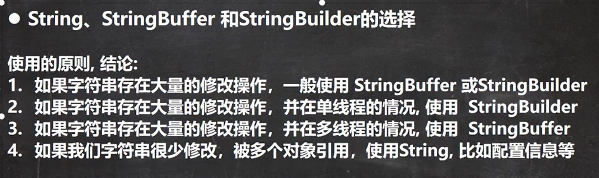
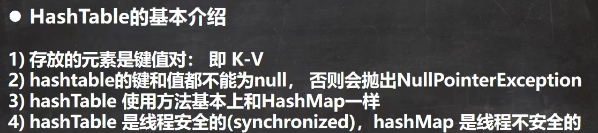
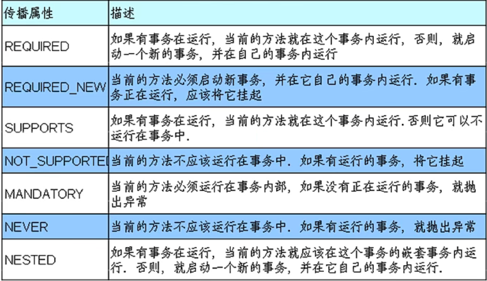

## 面向对象

面向对象对比面向过程，是两种不同的处理问题的角度，面向过程更注重事情的每一个步骤及顺序，面向对象更注重事情有哪些参与者（对象）、及各自需要做什么。面向过程比较直接高效，而面向对象更易于复用、扩展和维护

比如：洗衣机洗衣服

面向过程会将任务拆解成一系列的步骤（函数）

​	1、打开洗衣机--->2、放衣服---->3、放洗衣粉---->4、清洗.--->5、烘干

面向对象会拆出人和洗衣机两个对象：
	人：打开洗衣机放衣服放洗衣粉
	洗衣机：清洗烘干

​		面向对象编程是利用类和对象编程的一种思想。万物可归类，类是对于世界事物的高度抽象，不同的事物之间有不同的关系，一个类自身与外界的封装关系，一个父类和子类的继承关系，一个类和多个类的多态关系。万物皆对象，对象是具体的世界事物，面向对象的三大特征封装，继承，多态。封装，封装说明一个类行为和属性与其他类的关系，低耦合，高内聚；继承是父类和子类的关系，多态说的是类与类的关系。

​	封装隐藏了类的内部实现机制，可以在不影响使用的情况下改变类的内部结构，同时也保护了数据。对外界而已它的内部细节是隐藏的，暴露给外界的只是它的访问方法。

​		属性的封装：使用者只能通过事先定制好的方法来访问数据，可以方便地加入逻辑控制，限制对属性的不合理操作；		方法的封装：使用者按照既定的方式调用方法，不必关心方法的内部实现，便于使用；便于修改，增强代码的可维护性；

​	继承是从已有的类中派生出新的类，新的类能吸收已有类的数据属性和行为，并能扩展新的能力。在本质上是特殊~一般的关系，即常说的is-a关系。子类继承父类，表明子类是一种特殊的父类，并且具有父类所不具有的一些属性或方法。从多种实现类中抽象出一个基类，使其具备多种实现类的共同特性，当实现类用extends关键字继承了基类（父类）后，实现类就具备了这些相同的属性。继承的类叫做子类（派生类或者超类），被继承的类叫做父类（或者基类）。比如从猫类、狗类、虎类中可以抽象出一个动物类，具有和猫、狗、虎类的共同特性（吃、跑、叫等）。Java通过extends关键字来实现继承，父类中通过private定义的变量和方法不会被继承，不能在子类中直接操作父类通过private定义的变量以及方法。继承避免了对一般类和特殊类之间共同特征进行的重复描述，通过继承可以清晰地表达每一项共同特征所适应的概念范围，在一般类中定义的属性和操作适应于这个类本身以及它以下的每一层特殊类的全部对象。运用继承原则使得系统模型比较简练也比较清晰。增加了代码的复用性。

​	相比于封装和继承，Java多态是三大特性中比较难的一个，封装和继承最后归结于多态，多态指的是类和类的关系，两个类由继承关系，存在有方法的重写，故而可以在调用时有父类引用指向子类对象。多态必备三个要素：继承，重写，父类引用指向子类对象。增加了代码的灵活性。


### 封装：

​	封装的意义，在于明确标识出允许外部使用的所有成员函数和数据项内部细节对外部调用透明，外部调用无需修改或者关心内部实现
​	1、javabean的属性私有，提供getset对外访问，因为属性的赋值或者获取逻辑只能由javabean本身决定。而不能由外部胡乱修改，例如下面代码中name有自己的命名规则，不能由外部直接赋值。

```java
private String name;
public void setName(String name){
    this.name = "---"+name;
}
```

### orm框架

​	操作数据库，我们不需要关心链接是如何建立的、sql是如何执行的，只需要引入mybatis，调方法即可

### 继承：

​	继承基类的方法，并做出自己的改变和/或扩展

​	子类共性的方法或者属性直接使用父类的，而不需要自己再定义，只需扩展自己个性化的

### 多态：

​	基于对象所属类的不同，外部对同一个方法的调用，实际执行的逻辑不同。

继承，方法重写，父类引用指向子类对象，无法调用子类特有的功能

```
父类类型 变量名 = new 子类对象;
变量名.方法名();
```


## JDK、JRE、JVM三者区别和联系

JDK：Java Develpment kKit java开发工具
JRE：Java Runtime Environment java运行时环境
JVM：java Virtual Machine java虚拟机


## ==和equals的区别

== 对比的是栈中的值，基本数据类型是变量值，引用类型是堆中内存对象的地址

==：

1. 既可以判断基本类型，也可以判断引用类型
2. 判断基本类型，比较的是值是否相等
3. 判断引用类型，比较的是地址是否相等，即判定是不是同一个对象
4. 基本类型和引用类型，比较值是否相等

equals：

1. 是object类中的方法，只能判断引用类型。
2. 默认是判断地址是否相等，子类String、Integer等往往重写了该方法，用于判断内容是否相等。

Object 

```java
    public boolean equals（object obj）{
        return(this==obj);
    }
```

String 

```java
	public boolean equals(Object anObject) {
        if (this == anObject) {
            return true;
        }
        if (anObject instanceof String) {
            String anotherString = (String)anObject;
            int n = value.length;
            if (n == anotherString.value.length) {
                char v1[] = value;
                char v2[] = anotherString.value;
                int i = 0;
                while (n-- != 0) {
                    if (v1[i] != v2[i])
                        return false;
                    i++;
                }
                return true;
            }
        }
        return false;
    }
```


## final

### 使用：

1. final可以修饰类、属性、方法和局部变量。不能修饰构造器
2. 当不希望类被继承时，用final修饰类
3. 当不希望父类的某个方法被子类覆盖/重写时，用final修饰方法
4. 当不希望类的某个值或局部变量值被修改，可以用final修饰属性。
5. 如果是基本数据类型的变量，则其数值一旦在初始化之后便不能更改；
    如果是引用类型的变量，则在对其初始化之后便不能再让其指向另一个对象。但是引用的值是可变的。

### 注意事项：

1. final修饰的属性又叫做常量，在定义时必须赋初值且以后不能更改，一般用XXX_YYY_ZZZ命名

2. 赋初值时可以在定义时、构造器中、代码块中赋值；

    如果final修饰的属性是静态的，那么只能在定义时和静态代码块中赋值。

    如果final修饰的是局部变量，系统不会为局部变量进行初始化。因此使用final修饰局部变量时，即可以在定义时指定默认值，也可以不指定默认值，而在后面的代码中对final变量赋初值（仅一次赋值）

3. final类不能继承但能实例化对象

4. 不是final类但含有final对象，此方法不可重写，但类可以被继承。

5. 如果一个类已经是final类了，没有必要将方法修饰成final方法，（无法被继承即无法被重写）

6. final和static往往同时使用，效率更高，不会导致类的加载。

7. 包装类（String、Integer、Double）等都是final类

### 为什么局部内部类和匿名内部类只能访问局部final变量？

```java
public class test {
    public static void main(String[] args) {
    }
    //局部final变量a，b
    public void test(final int b) {
        final int a = 10;
        //匿名内部类
        new  Thread() {
            public void run(){
                System.out.println(a);
                System.out.println(b);
            };
        }.start();
    }
}

class OutClass{
    private final int age = 12;
    public void outPrint(final int x){
        class InClass{
            public void InPrint(){
                System.out.println(x);
                System.out.println(age);
            }
        }
        new InClass().InPrint();
    }
}
```

​	编译之后会生成两个class文件，Test.class Test1.class，内部类访问了局部变量时，IDE在编译时会自动加上final。

​	首先：内部类和外部类是处于同一个级别的，内部类不会因为定义在方法中就会随着方法的执行完毕就被销毁。

​	这里就会产生问题：当外部类的方法结束时，局部变量就会被销毁，但是内部类对象可能还存在（只有没有人再引用它时，才会死亡）。

​	当内部类对象访问了一个不存在的变量时，将局部变量复制了一份作为内部类的成员变量，这样当局部变量死亡后，内部类仍可以访问它，实际访问的是局部变量的“copy"”。这样就好像延长了局部变量的生命周期

​	将局部变量复制为内部类的成员变量时，必须保证这两个变量是一样的，也就是如果我们在内部类中修改了成员变量，方法中的局部变量也得跟着改变

​	所以就将局部变量设置为final，对它初始化后，就不能再去修改这个变量，就保证了内部类的成员变量和方法的局部变量的一致性。这实际上也是一种妥协。使得局部变量与内部类内建立的拷贝保持一致。

## String、StringBuffer、StringBuilder区别及使用场景

String是final修饰的，不可变，每次操作都会产生新的String对象，StringBuffer和StringBuilder都是在原对象上操作。

StringBuffer是线程安全的，StringBuilder线程不安全的，StringBuffer方法都是synchronized修饰的。

性能：StringBuilder>StringBuffer>String

场景：经常需要改变字符串内容时使用后面两个优先使用StringBuilder，多线程使用共享变量时使用StringBuffer



## 重载和重写的区别

重载：发生在同一个类中，方法名必须相同，参数类型不同、个数不同、顺序不同，方法返回值和访问修饰符可I以不同，发生在编译时。

重写：发生在父子类中，方法名、参数列表必须相同，返回值范围小于等于父类，抛出的异常范围小于等于父类，访问修饰符范围大于等于父类；如果父类方法访问修饰符为private则子类就不能重写该方法。

## 接口和抽象类的区别

区别：

​	抽象类可以存在普通成员函数，而接口中只能存在public abstract方法。

​	抽象类中的成员变量可以是各种类型的，而接口中的成员变量只能是public static final类型的。

​	抽象类只能继承一个，接口可以实现多个。

设计目的：

​	接口的设计目的，是对类的行为进行约束（更准确的说是一种“有”约束，因为接口不能规定类不可以有什么行为），也就是提供一种机制，可以强制要求不同的类具有相同的行为。它只约束了行为的有无，但不对如何实现行为进行限制。

​	而抽象类的设计目的，是代码复用。当不同的类具有某些相同的行为（记为行为集合A），且其中一部分行为的实现方式一致时（A的非真子集，记为B），可以让这些类都派生于一个抽象类。在这个抽象类中实现了B，避免让所有的子类来实现B，这就达到了代码复用的目的。而A减B的部分，留给各个子类自己实现。正是因为A-B在这里没有实现，所以抽象类不允许实例化出来（否则当调用到A-B时，无法执行）。

本质：

​	抽象类是对类本质的抽象，表达的是is-a的关系，比如：BMW is a car。抽象类包含并实现子类的通用特性，将子类存在差异化的特性进行抽象，交由子类去实现。

​	而接口是对行为的抽象，表达的是like-a的关系。比如：Bird like a Aircraft，但其本质上 is a Bird。接口的核心是定义行为，即实现类可以做什么，至于实现类主体是谁、是如何实现的，接口并不关心。

使用场景：

​	当你关注一个事物的本质的时候，用抽象类；当你关注一个操作的时候，用接口。
​	抽象类的功能要远超过接口，但是，定义抽象类的代价高。因为高级语言来说（从实际设计上来说也是）每个类只能继承一个类。在这个类中，你必须继承或编写出其所有子类的所有共性。虽然接口在功能上会弱化许多，但是它只是针对一个动作的描述。而且你可以在一个类中同时实现多个接口。在设计阶段会降低难度。

## List和Set的区别

List：有序，按对象进入的顺序保存对象，可重复，允许多个Nul元素对象，可以使用lterator取出所有元素 ( 增强for循环就是简易版的iterator)，在逐一遍历，还可以使用索引，get（int index）获取指定下表的元素。

Set：无序，不可重复，最多允许有一个Nul元素对象，取元素时只能用Iterator接口取得所有元素，在逐一遍历各个元素。

## hashCode与equals hashCode介绍

​	hashCode（）的作用是获取哈希码，也称为散列码；它实际上是返回一个int整数。这个哈希码的作用是确定该对象在哈希表中的索引位置。hashCode（）定义在JDK的Object.java中，Java中的任何类都包含有hashCode（）函数。散列表存储的是键值对（key-value），它的特点是：能根据”键”快速的检索出对应的“值”。这其中就利用到了散列码！（可以快速找到所需要的对象）

以“HashSet如何检查重复”为例子来说明为什么要有hashCode：

​	对象加入HashSet时，HashSet会先计算对象的hashcode值来判断对象加入的位置，看该位置是否有值，如果没有、HashSet会假设对象没有重复出现。但是如果发现有值，这时会调用equals（）方法来检查两个对象是否真的相同。如果两者相同，HashSet就不会让其加入操作成功。如果不同的话，就会重新散列到其他位置。这样就大大减少了equals的次数，相应就大大提高了执行速度。

- 如果两个对象相等则hashcode一定也是相同的
- 两个对象相等，对两个对象分别调用equals方法都返回true
- 两个对象有相同的hashcode值，它们也不一定是相等的
- 因此，如果equals方法被覆盖过，则hashCode方法也必须被覆盖
- hashCode（）的默认行为是对堆上的对象产生独特值。如果没有重写hashCode（），则该class的两个对象无论如何都不会相等（即使这两个对象指向相同的数据）

## ArrayList和LinkedList区别

ArrayList：

​	基于动态数组，连续内存存储，适合下标访问（随机访问）

​	扩容机制：因为数组长度固定，超出长度存数据时需要新建数组，然后将老数组的数据拷贝到新数组，如果不是尾部插入数据还会涉及到元素的移动（往后复制一份，插入新元素），使用尾插法并指定初始容量可以极大提升性能、甚至超过linkedList（需要创建大量的node对象）

LinkedList：

​	基于链表，可以存储在分散的内存中，适合做数据插入及删除操作

​	不适合查询：需要逐一遍历遍历LinkedList必须使用iterator不能使用for循环，因为每次for循环体内通过get（i）取得某一元素时都需要对list重新进行遍历，性能消耗极大。另外不要试图使用indexof等返回元素索引，并利用其进行遍历，使用indexloflist进行了遍历，当结果为空时会遍历整个列表。


ArrayList和LinkedList都实现了List接口，他们有以下的不同点：

​		ArrayList是基于索引的数据接口，它的底层是数组。它可以以O（1）时间复杂度对元素进行随机访问。与此对应，		LinkedList是以元素列表的形式存储它的数据，每一个元素都和它的前一个和后一个元素链接在一起，在这种情况下，查找某个元素的时间复杂度是O（n）。
​	相对于ArrayList，LinkedList的插入，添加，删除操作速度更快，因为当元素被添加到集合任意位置的时候，不需要像数组那样重新计算大小或者是更新索引。LinkedListt比ArrayList更占内存，因为LinkedList为每一个节点存储了两个引用，一个指向前一个元素，一个指向下一个元素。

1）因为Array 是基于索引（index）的数据结构，它使用索引在数组中搜索和读取数据是很快的。Array获取数据的时间复杂度是O（1），但是要删除数据却是开销很大的，因为这需要重排数组中的所有数据。

2）相对于ArrayList，LinkedList 插入是更快的。因为LinkedList不像ArrayList一样，不需要改变数组的大小，也不需要在数组装满的时候要将所有的数据重新装入一个新的数组，这是ArrayList 最坏的一种情况，时间复杂度是O（n），而LinkedList中插入或删除的时间复杂度仅为O（1）。ArrayList在插入数据时还需要更新索引（除了插入数组的尾部）。

3）类似于插入数据，删除数据时，LinkedList 也优于ArrayList。

4）LinkedList 需要更多的内存，因为Arraylist的每个索引的位置是实际的数据，而LinkedList中的每个节点中存储的是实际的数据和前后节点的位置（一个LinkedList 实例存储了两个值：Node<E>first和Node<E>last分别表示链表的其实节点和尾节点，每个Node实例存储了三个值：E item，Node next，Node pre）。

什么场景下更适宜使用LinkedList，而不用ArrayList

1）你的应用不会随机访问数据。因为如果你零要LinkeList中的笔n今元幸的时候，你需要以第个元素顺序数到第n个数据：

然后读取数据。

2）你的应用更多的插入和删除元素，更少的读取数据。因为插入和删除元素不涉及重排数据，所以它要比ArrayList要快。

## HashMap和HashTable有什么区别？

区别：
（1）HashMap方法没有synchronized修饰，线程非安全，HashTable线程安全；
（2）HashMap允许key和value为null，而HashTable不允许
底层实现：数组+链表实现

jdk8开始链表高度到8、数组长度超过64，链表转变为红黑树，元素以内部类Node节点存在
	计算key的hash值，二次hash然后对数组长度取模，对应到数组下标，
	如果没有产生hash冲突（下标位置没有元素），则直接创建Node存入数组，
	如果产生hash冲突，先进行equal比较，相同则取代该元素，不同，则判断链表高度插入链表，链表高度达到8，并且数	组长度到64则转变为红黑树，长度低于64则将红黑树转回链表
	key为null，存在下标0的位置

HashMap


HashTable



​	底层有数组Hashtable$Entry[] 初始大小为11，临界值threshold 8 = 11 * 0.75。执行方法addEntry(hash，key， value， index)；添加K-V封装到Entry。当if(count >=threshold)满足时，按照int newCapacity = (oldCapacity<<1)+1（两倍加一）的大小来扩容。

## ConcurrentHashMap

jdk7：数据结构：ReentrantLock+Segment+HashEntry，一个Segment中包含一个HashEntry数组，每个HashEntry又是一个链表结构
元素查询：二次hash，第一次Hash定位到Segment，第二次Hash定位到元素所在的链表的头部锁：Segment分段锁 Segment继承了ReentrantLock，锁定操作的Segment，其他的Segment不受影响，并发度为segment个数，可以通过构造函数指定，数组扩容不会影响其他的segment get方法无需加锁，volatile保证
jdk8：
数据结构：synchronized+CAS+Node+红黑树，Node的val和next都用volatile修饰，保证可见性查找，替换，赋值操作都使用CAS锁：锁链表的head节点，不影响其他元素的读写，锁粒度更细，效率更高，扩容时，阻塞所有的读写操作、并发扩容
读操作无锁：
Node的val和next使用volatile修饰，读写线程对该变量互相可见数组用volatile修饰，保证扩容时被读线程感知

## JDK1.8的新特性

一、接口的默认方法
Java8允许我们给接口添加一个非抽象的方法实现，只需要使用default关键字即可，这个特征又叫做扩展方法，示例如下：代码如下：

```java
interface Formula{double calculate（int a）；
default double sqrt（int a）{return Math.sqrt（a）；}}
```

Formula接口在拥有calculate方法之外同时还定义了sqrt方法，实现了Formula接口的子类只需要实现一个calculate方法，默认方法sqrt将在子类上可以直接使用。
代码如下：

```java
Formula formula=new Formula）{@Override public double calculate（int a）{return sqrt（a*100）；}}；formula.calculate（100）；//100.0 
formula.sqrt（16）；//4.0
```

文中的formula被实现为一个匿名类的实例，该代码非常容易理解，6行代码实现了计算 sqrt（a*100）。在下一节中，我们将会看到实现单方法接口的更简单的做法。
译者注：在Java中只有单继承，如果要让一个类赋予新的特性，通常是使用接口来实现，在C++中支持多继承，允许一个子类同时具有多个父类的接口与功能，在其他语言中，让一个类同时具有其他的可复用代码的方法叫做mixin。新的Java8的这个特新在编译器实现的角度上来说更加接近Scala的trait。在C#中也有名为扩展方法的概念，允许给已存在的类型扩展方法，Java8的这个在语义上有差别。

二、Lambda表达式

首先看看在老版本Java中是如何排列字符串的：代码如下：
List<string> names=Arrays.asList（"peterF"，"anna"，"mike"，"xenia"）；Collections.sort（names，new Comparator<string>（）{@Override public int compare（String a，String b）{
return b.compareTo（a）；}}）；

只需要给静态方法 Collections.sort 传入一个List对象以及一个比较器来按指定顺序排列。通常做法都是创建一个匿名的比较器对象然后将其传递给sort方法。
在Java 8中你就没必要使用这种传统的匿名对象的方式了，Java8提供了更简洁的语法，lambda表达式：
代码如下：
Collections.sort（names，（String a，String b）->{return b.compareTo（a）；}）；看到了吧，代码变得更段且更具有可读性，但是实际上还可以写得更短：

代码如下：
Collections.sort（names，（String a，String b）->b.compareTo（a））；对于函数体只有一行代码的，你可以去掉大括号以及return关键字，但是你还可以写得更短点：
代码如下：
Collections.sort（names，（a，b）>b.compareTo（a）；Java编译器可以自动推导出参数类型，所以你可以不用再写一次类型。接下来我们看看lambda表达式还能作出什么更方便的东西来：

三、函数式接口

Lambda表达式是如何在java的类型系统中表示的呢？每一个lambda表达式都对应一个类型，通常是接口类型。
而“函数式接口”是指仅仅只包含一个抽象方法的接口，每一个该类型的lambda表达式都会被匹配到这个抽象方法。因为默认方法不算抽象方法，所以你也可以给你的函数式接口添加默认方法。
我们可以将lambda表达式当作任意只包含一个抽象方法的接口类型，确保你的接口一定达到这个要求，你只需要给你的接口添加@Functionallnterface 注解，编译器如果发现你标注了这个注解的接口有多于一个抽象方法的时候会报错的。

四、方法与构造函数引用

前一节中的代码还可以通过静态方法引用来表示：代码如下：
Converter<String，Integer>converter=Integer:：valueOf；Integer converted =converter.convert（"123"）；System.out.printin（converted）；//123
Java8允许你使用：：关键字来传递方法或者构造函数引用，上面的代码展示了如何引用一个静态方法，我们也可以引用一个对象的方法：代码如下：
converter=something:startsWith；String converted=converter.convert（"Java"）；System.out.printin（converted）；//y""

五、Lambda作用域
在lambda表达式中访问外层作用域和老版本的匿名对象中的方式很相似。你可以直接访问标记了final的外层局部变量，或者实例的字段以及静态变量。
六、访问局部变量
我们可以直接在lambda表达式中访问外层的局部变量：

LocalTime 本地时间
LocalTime定义了一个没有时区信息的时间，例如晚上10点，或者17：30：15。下面的例子使用前面代码创建的时区创建了两个本地时间。之后比较时间并以小时和分钟为单位计算两个时间的时间差：

十、Annotation注解
在Java 8中支持多重注解了，先看个例子来理解一下是什么意思。首先定义一个包装类Hints注解用来放置一组具体的Hint注解：

## 字节码

什么是字节码：

​	java中的编译器和解释器：Java中引入了虚拟机的概念，即在机器和编译程序之间加入了一层抽象的虚拟的机器。这台虚拟的机器在任何平台上都提供给编译程序一个的共同的接口。
​	编译程序只需要面向虚拟机，生成虚拟机能够理解的代码，然后由解释器来将虚拟机代码转换为特定系统的机器码执行。在Java中，这种供虚拟机理解的代码叫做字节码（即扩展名为.class的文件），它不面向任何特定的处理器，只面向虚拟机。
​	每一种平台的解释器是不同的，但是实现的虚拟机是相同的。Java源程序经过编译器编译后变成字节码，字节码由虚拟机解释执行，虚拟机将每一条要执行的字节码送给解释器，解释器将其翻译成特定机器上的机器码，然后在特定的机器上运行。这也就是解释了Java的编译与解释并存的特点。
​	Java源代码>编译器-->j/m可执行的java字节码（即虚拟指令）--->jvm--->jvm中解释器--->机器可执行的二进制机器码--->程序运行。

采用字节码的好处：

​	Java语言通过字节码的方式，在一定程度上解决了传统解释型语言执行效率低的问题，同时又保留了解释型语言可移植的特点。所以ava程序运行时比较高效，而且，由于字节码并不专对一种特定的机器，因此，Java程序无须重新编译便可在多种不同的计算机上运行。

## Java类加载器

​	JDK自带有三个类加载器：bootstrap ClassLoader、ExtclassLoader、AppClassLoader。

1. BootStrapClassLoader是ExtClassLoader的父类加载器，默认负责加载%AVA_HOME%lib下的jar包和class文件。
2. ExtClassLoader是AppClassLoader的父类加载器，负责加载%JAVA_HOME%/lib/ext文件夹下的jar包和class类。
3. AppClassLoader是自定义类加载器的父类，负责加载classpath下的类文件。
4. 继承ClassLoader实现自定义类加载器

## Java中的异常体系

Java中的所有异常都来自顶级父类Throwable。Throwable下有两个子类Exception和Error。

Error是程序无法处理的错误，一旦出现这个错误，则程序将被迫停止运行。

Exception不会导致程序停止，又分为两个部分RunTimeException运行时异常和CheckedException检查异常。

RunTimeException常常发生在程序运行过程中，会导致程序当前线程执行失败。CheckedException常常发生在程序编译过程中，会导致程序编译不通过。


常见的运行时异常

​	1.NullPointerException空指针异常：当程序在需要对象的地方使用null时

​	2.ArithmeticException数学运算异常：出现了异常的运算条件时

​	3.ArrayIndexOutOfBoundsException数组下标越界异常：用非法索引访问数组时

​	4.ClassCastException类型转换异常：当试图将对象强制转换为不是实例的子类时

​	5.NumberFormatException数字格式不正确异常：当字符串不能转换成一种数值类型的适当格式时

常见的编译异常

1. SQLException 操作数据库时，查询表异常
2. IOException操作文件时
3. FileNotfoundException操作一个不存在的文件时
4. ClassNotFoundException加载类时，该类不存在
5. EOFException操作文件，到文件末尾发生异常
6. ILLegalArguementException参数异常

异常处理

编译时异常必须try-catch-finally和throws二选一；运行时异常默认为throws处理，不要求显式处理。

try-catch-finally程序员在代码中捕获可能发生的异常，自行处理

1.一个方法中可能生成某种异常，但不确定如何处理时，throws将发生的异常抛出，交给调用方（方法）来处理，最顶级的处理者是JVM，输出异常信息然后退出程序。

2.在方法声明中用throws语句可以声明抛出异常的列表，throws后面的异常类型可以是方法中产生的异常类型，也可以是其父类。

3.子类重写该方法时，子类所抛出的异常类型要么一致，要么是父类异常类型的子类。

## 线程的生命周期和状态

线程有几种状态：

1.线程通常有五种状态，创建，就绪，运行、阻塞和死亡状态。

​	1.新建状态（New）：新创建了一个线程对象。

​	2.就绪状态（Runnable）：线程对象创建后，其他线程调用了该对象的start方法。该状态的线程位于可运行线程池中，	变得可运行，等待获取CPU的使用权。

​	3.运行状态（Running）：就绪状态的线程获取了CPU，执行程序代码。

​	4.阻塞状态（Blocked）：阻塞状态是线程因为某种原因放弃CPU使用权，暂时停止运行。直到线程进入就绪状态，才	有机会转到运行状态。

​	5.死亡状态（Dead）：线程执行完了或者因异常退出了run方法，该线程结束生命周期。

2.阻塞的情况又分为三种：

（1）、等待阻塞：运行的线程执行wait方法，该线程会释放占用的所有资源，JVM会把该线程放入“等待池”中。进入这个状态后，是不能自动唤醒的，必须依靠其他线程调用notify或notifyA方法才能被唤醒，wait是object类的方

（2）、同步阻塞：运行的线程在获取对象的同步锁时，若该同步锁被别的线程占用，则VM会把该线程放入“锁池"中。

（3）、其他阻塞：运行的线程执行sleep或join方法，或者发出了I/O请求时，JVM会把该线程置为阻塞状态。当sleep状态超时、join等待线程终止或者超时、或者I/O处理完毕时，线程重新转入就绪状态。sleep是Thread类的方法


## 线程常用方法的区别

1.锁池
	所有需要竞争同步锁的线程都会放在锁池当中，比如当前对象的锁已经被其中一个线程得到，则其他线程需要在这个锁池进行等待，当前面的线程释放同步锁后锁池中的线程去竞争同步锁，当某个线程得到后会进入就绪队列进行等待cpu资源分配。
2.等待池
	当我们调用wait（）方法后，线程会放到等待池当中，等待池的线程是不会去竞争同步锁。只有调用了notify（）或notifyAl（）后等待池的线程才会开始去竞争锁，notify（）是随机从等待池选出一个线程放到锁池，而notifyAll（）是将等待池的所有线程放到锁池当中


sleep()、wait()的区别：

1、sleep是Thread类的静态本地方法，wait则是Object类的本地方法。

2、sleep方法不会释放lock，但是wait会释放，而且会加入到等待队列中。
	sleep就是把cpu的执行资格和执行权释放出去，不再运行此线程，当定时时间结束再取回cpu资源，参与cpu的调度，获取到cpu资源后就可以继续运行了。而如果sleep时该线程有锁，那么sleep不会释放这个锁，而是把锁带着进入了冻结状态，也就是说其他需要这个锁的线程根本不可能获取到这个锁。也就是说无法执行程序。如果在睡眠期间其他线程调用了这个线程的interrupt方法，那么这个线程也会抛出interruptexception异常返回，这点和wait是一样的。

3、sleep方法不依赖于同步器synchronized，但是wait需要依赖synchronized关键字。

4、sleep不需要被唤醒（休眠之后推出阻塞），但是wait需要（不指定时间需要被别人中断）。

5、sleep一般用于当前线程休眠，或者轮循暂停操作，wait 则多用于多线程之间的通信。

6、sleep会让出CPU执行时间且强制上下文切换，而 wait 则不一定，wait 后可能还是有机会重新竞争到锁继续执行的。

join()、yield()的区别：

yield（）执行后线程直接进入就绪状态，马上释放了cpu的执行权，但是依然保留了cpu的执行资格，所以有可能cpu下次进行线程调度还会让这个线程获取到执行权继续执行。

join（）执行后线程进入阻塞状态，例如在线程B中调用线程A的join（），那线程B会进入到阻塞队列，直到线程A结束或中断线程。


## 线程安全的理解：

​	1.不是线程安全、应该是内存安全，堆是共享内存，可以被所有线程访问。

​	当多个线程访问一个对象时，如果不用进行额外的同步控制或其他的协调操作，调用这个对象的行为都可以获得正确的结果，我们就说这个对象是线程安全的

​	2.堆是进程和线程共有的空间，分全局堆和局部堆。全局堆就是所有没有分配的空间，局部堆就是用户分配的空间。堆在操作系统对进程初始化的时候分配，运行过程中也可以向系统要额外的堆，但是用完了要还给操作系统，要不然就是内存泄漏。

​	在Java中，堆是Java虚拟机所管理的内存中最大的一块，是所有线程共享的一块内存区域，在虚拟机启动时创建。堆所存在的内存区域的唯一目的就是存放对象实例，几乎所有的对象实例以及数组都在这里分配内存。

​	3.栈是每个线程独有的，保存其运行状态和局部自动变量的。栈在线程开始的时候初始化，每个线程的栈互相独立，因此，栈是线程安全的。操作系统在切换线程的时候会自动切换栈。栈空间不需要在高级语言里面显式的分配和释放。

​	4.目前主流操作系统都是多任务的，即多个进程同时运行。为了保证安全，每个进程只能访问分配给自己的内存空间，而不能访问别的进程的，这是由操作系统保障的。
在每个进程的内存空间中都会有一块特殊的公共区域，通常称为堆（内存）。进程内的所有线程都可以访问到该区域，这就是造成问题的潜在原因。

## Thread、Runable的区别

​	Thread和Runnable的实质是继承关系，没有可比性。无论使用Runnable还是Thread，都会new Thread，然后执行run方法。用法上，如果有复杂的线程操作需求，那就选择继承Thread，如果只是简单的执行一个任务，那就实现runnable。


MyTread创建了两个实例，属于用法错误


## 守护线程的理解：

​	守护线程：为所有非守护线程提供服务的线程；任何一个守护线程都是整个JVM中所有非守护线程的保姆；

​	守护线程类似于整个进程的一个默默无闻的小喽喽；它的生死无关重要，它却依赖整个进程而运行；哪天其他线程结束了，没有要执行的了，程序就结束了，理都没理守护线程，就把它中断了；注意：由于守护线程的终止是自身无法控制的，因此千万不要把IO、File等重要操作逻辑分配给它；因为它不靠谱；

守护线程的作用是什么：

​	举例，GC垃圾回收线程：就是一个经典的守护线程，当我们的程序中不再有任何运行的Thread，程序就不会再产生垃圾，垃圾回收器也就无事可做，所以当垃圾回收线程是JVM上仅剩的线程时，垃圾回收线程会自动离开。它始终在低级别的状态中运行，用于实时监控和管理系统中的可回收资源。

应用场景：

（1）来为其它线程提供服务支持的情况；

（2）或者在任何情况下，程序结束时，这个线程必须正常且立刻关闭，就可以作为守护线程来使用；

（3）反之，如果一个正在执行某个操作的线程必须要正确地关闭掉否则就会出现不好的后果的话，那么这个线程就不能是守护线程，而是用户线程。通常都是些关键的事务，比方说，数据库录入或者更新，这些操作都是不能中断的。

用法：

```java
//将子线程设置为守护线程。则当main线程结束时，子线程自动结束
public class Test {
    public static void main(String[] args) throws InterruptedException {
        T t = new T();
        t.setDaemon(true);
        t.start();
    }
}
```

thread.setDaemon（true）必须在thread.start（）之前设置，否则会跑出一个llegalThreadStateException异常。你不能把正在运行的常规线程设置为守护线程。

在Daemon线程中产生的新线程也是Daemon的。

守护线程不能用于去访问固有资源，比如读写操作或者计算逻辑。因为它会在任何时候甚至在一个操作的中间发生中断。

Java自带的多线程框架，比如ExecutorService，会将守护线程转换为用户线程，所以如果要使用后台线程就不能用java的线程池

## 并发、并行、串行的区别

并发：同一个时刻，多个任务交替执行，造成一种“貌似同时”的错觉，简单的说，单核cpu实现的多任务就是并发。

并行：同一个时刻，多个任务同时执行。多核cpu可以实现并行。

串行：在时间上不可能发生重叠，前一个任务没搞定，下一个任务就只能等着。

## spring是什么：

​	轻量级的开源J2EE框架。它是一个容器框架，用来装javabean I（java对象），中间层框架（万能胶）可以起一个连接作用，比如说把Struts和hibernate粘合在一起运用，可以让我们的企业开发更快、更简洁Spring是一个轻量级的控制反转（IOC）和面向切面（AOP）的容器框架

​		-从大小与开销两方面而言Spring都是轻量级的。
​		-通过控制反转（loC）的技术达到松耦合的目的
​		-提供了面向切面编程的丰富支持，允许通过分离应用的业务逻辑与系统级服务进行内聚性的开发
​		-包含并管理应用对象（Bean）的配置和生命周期，这个意义上是一个容器。
​		-将简单的组件配置、组合成为复杂的应用，这个意义上是一个框架。

## AOP的理解

​	系统是由许多不同的组件所组成的，每一个组件各负责一块特定功能。除了实现自身核心功能之外，这些组件还经常承担着额外的职责。例如日志、事务管理和安全这样的核心服务经常融入到自身具有核心业务逻辑的组件中去。
​	这些系统服务经常被称为横切关注点，因为它们会跨越系统的多个组件。
​	当我们需要为分散的对象引入公共行为的时候，OOP则显得无能为力。也就是说，OOP允许你定义从上到下的关系，但并不适合定义从左到右的关系。例如日志功能。

日志代码往往水平地散布在所有对象层次中，而与它所散布到的对象的核心功能毫无关系。

在OOP设计中，它导致了大量代码的重复，而不利于各个模块的重用。

AOP：将程序中的交叉业务逻辑（比如安全，日志，事务等），封装成一个切面，然后注入到目标对象（具体业务逻辑）中去。AOP可以对某个对象或某些对象的功能进行增强，比如对象中的方法进行增强，可以在执行某个方法之前额外的做一些事情，在某个方法执行之后额外的做一些事情

## IOC的理解

容器概念、控制反转、依赖注入

Ioc容器：

​	实际上就是个map（key，value），里面存的是各种对象（在xml里配置的bean节点、@repository、@service、@controller、@component），在项目启动的时候会读取配置文件里面的bean节点，根据全限定类名使用反射创建对象放到map里、扫描到打上上述注解的类还是通过反射创建对象放到map里。

​	这个时候map里就有各种对象了，接下来我们在代码里需要用到里面的对象时，再通过DI注入（autowired、resource等注解，xml里bean节点内的ref属性，项目启动的时候会读取xml节点ref属性根据id注入，也会扫描这些注解，根据类型或id注入；id就是对象名）。

控制反转：

​	没有引入IOC容器之前，对象A依赖于对象B，那么对象A在初始化或者运行到某一点的时候，自己必须主动去创建对象B或者使用已经创建的对象B。无论是创建还是使用对象B，控制权都在自己手上。
​	引入IOC容器之后，对象A与对象B之间失去了直接联系，当对象A运行到需要对象B的时候，IOC容器会主动创建一个对象B注入到对象A需要的地方。
​	通过前后的对比：对象A获得依赖对象B的过程，由主动行为变为了被动行为，控制权颠倒过来了，这就是“控制反转”。全部对象的控制权全部上缴给第三方IOC容器，所以，IOC容器成了整个系统的关键核心，它把系统中的所有对象粘合在一起发挥作用，如果没有这个“粘合剂”，对象与对象之间会彼此失去联系。

依赖注入：

​	获得依赖对象的过程被反转了”。控制被反转之后，获得依赖对象的过程由自身管理变为了IOC容器主动注入。
依赖注入是实现IOC的方法，就是由IOC容器在运行期间，动态地将某种依赖关系注入到对象之中。

## 如何实现一个IOC容器

IOC概念：

​		控制反转（Inversion of Control，缩写为IoC），是面向对象编程中的一种设计原则，可以用来减低计算机代码之间的耦合度。其中最常见的方式叫做依赖注入（Dependency Injection，简称DI），还有一种方式叫“依赖查找”（Dependency Lookup）。通过控制反转，对象在被创建的时候，由一个调控系统内所有对象的外界实体将其所依赖的对象的引用传递给它。也可以说，依赖被注入到对象中。

​		即把对象创建和对象之间的调用过程，交给 Spring 进行管理。

过程：

1、配置文件配置包扫描路径
2、递归包扫描获取.class文件
3、反射、确定需要交给IOC管理的类
4、对需要注入的类进行依赖注入

详细过程：

- 配置文件中指定需要扫描的包路径
- 定义一些注解，分别表示访问控制层、业务服务层、数据持久层、依赖注入注解、获取配置文件注解
- 从配置文件中获取需要扫描的包路径，获取到当前路径下的文件信息及文件夹信息，我们将当前路径下所有以.class结尾的文件添加到一个Set集合中进行存储
- 遍历这个set集合，获取在类上有指定注解的类，并将其交给IOC容器，定义一个安全的Map用来存储这些对
- 遍历这个IOC容器，获取到每一个类的实例，判断里面是有有依赖其他的类的实例，然后进行递归注入

## BeanFactory和ApplicationContext有什么区别

ApplicationContext是BeanFactory的子接口，Applicationcontext提供了更完整的功能：
	①继承MessageSource，因此支持国际化。
	②统一的资源文件访问方式。
	③提供在监听器中注册bean的事件。
	④同时加载多个配置文件。
	⑤载入多个（有继承关系）上下文，使得每一个上下文都专注于一个特定的层次，比如应用的web层。

区别：

​	BeanFactroy采用的是延迟加载形式来注入Bean的，即只有在使用到某个Bean时（调用getBean（）），才对该Bean进行加载实例化。这样，我们就不能发现一些存在的Spring的配置问题。如果Bean的某一个属性没有注入，BeanFacotry加载后，直至第一次使用调用getBean方法才会抛出异常。

​	ApplicationContext，它是在容器启动时，一次性创建了所有的Bean。这样，在容器启动时，我们就可以发现Spring中存在的配置错误，这样有利于检查所依赖属性是否注入。ApplicationContext启动后预载入所有的单实例Bean，通过预载入单实例bean，确保当你需要的时候，你就不用等待，因为它们已经创建好了。

​	相对于基本的BeanFactory，ApplicationContext 唯一的不足是占用内存空间。当应用程序配置Bean较多时，程序启动较慢。

​	BeanFactory通常以编程的方式被创建，ApplicationContext还能以声明的方式创建，如使用ContextLoader。Spring中定义Bean的方式可以分为两类，分别是声明式和编程式。顾名思义，声明式可以理解为用一个的标记去标识相关的信息，代码底层再对这些标识符进行一个解析处理；编程式则更多侧重于使用代码的形式去处理相关逻辑。前者使用更友好，后者更底层。

​	BeanFactory和ApplicationContext都支持BeanPostProcessor、BeanFactoryPostProcessor的使用，但两者之间的区别是：BeanFactory需要手动注册，而ApplicationContext则是自动注册。

## Spring Bean的生命周期

-属性赋值--初始化--使用--销毁

bean 生命周期有七步
（1）通过构造器创建 bean 实例（无参数构造）

（2）为 bean 的属性设置值和对其他 bean 引用（调用 set 方法）

（3）调用BeanPostProcessor的初始化前的方法 postProcessBeforeInitialization 

（4）调用 bean 的初始化的方法（需要进行配置初始化的方法）

（5）把 bean 实例传递 bean 后置处理器的方法 postProcessAfterInitialization

（6）bean 可以使用了（对象获取到了）

（7）当容器关闭时候，调用 bean 的销毁的方法（需要进行配置销毁的方法）

实例化：

1. 解析类得到BeanDefinition
2. 如果有多个构造方法，则要推断构造方法
3. 确定好构造方法后，进行实例化得到一个对象

属性赋值（依赖注入）：

1. 对对象中的加了@Autowired注解的属性进行属性填充
2. 回调Aware方法，比如BeanNameAware，BeanFactoryAware

初始化

1. 调用BeanPostProcessor的初始化前的方法
2. 调用初始化方法
3. 调用BeanPostProcessor的初始化后的方法，在这里会进行AOP
4. 如果当前创建的bean是单例的则会把bean放入单例池

使用bean

销毁

​	Spring容器关闭时调用DisposableBean中destory（）方法

## 解释下Spring支持的几种bean的作用域。

singleton：默认，每个容器中只有一个bean的实例，单例的模式由BeanFactory自身来维护。该对象的生命周期是Spring IOC容器一致的（但在第一次被注入时才会创建）。

prototype：为每一个bean请求提供一个实例。在每次注入时都会创建一个新的对象

request:bean被定义为在每个HTTP请求中创建一个单例对象，也就是说在单个请求中都会复用这一个单例对象。

session：与request范围类似，确保每个session中有一个bean的实例，在session过期后，bean会随之失效。

application: bean被定义为在ServletContext的生命周期中复用一个单例对象。

websocket: bean被定义为在websocket的生命周期中复用一个单例对象。

## Spring框架中的单例Bean是线程安全的么？

Spring中的Bean默认是单例模式的，框架并没有对bean进行多线程的封装处理。

如果Bean是有状态的那就需要开发人员自己来进行线程安全的保证，最简单的办法就是改变bean的作用域把
"singleton"改为“protopyte'这样每次请求Bean就相当于是new Bean）这样就可以保证线程的安全了。

有状态就是有数据存储功能
无状态就是不会保存数据

​	controller、service和dao层本身并不是线程安全的，只是如果只是调用里面的方法，而且多线程调用一个实例的方法，会在内存中复制变量，这是自己的线程的工作内存，是安全的。
​	Dao会操作数据库Connection，Connection是带有状态的，比如说数据库事务，

​	Spring的事务管理器使用Threadlocal为不同线程维护了一套独立的connection副本，保证线程之间不会互相影响（Spring是如何保证事务获取同一个Connection的）不要在bean中声明任何有状态的实例变量或类变量，如果必须如此，那么就使用ThreadLocal把变量变为线程私有的，如果bean的实例变量或类变量需要在多个线程之间共享，那么就只能使用synchronized、lock、CAS等这些实现线程同步的方法了。

## Spring框架中的设计模式

简单工厂：

​	由一个工厂类根据传入的参数，动态决定应该创建哪一个产品类。
Spring中的BeanFactory就是简单工厂模式的体现，根据传入一个唯一的标识来获得Bean对象，但是否是在传入参数后创建还是传入参数前创建这个要根据具体情况来定。

工厂方法：

​	实现了FactoryBean接口的bean是一类叫做factory的bean。其特点是，spring会在使用getBean（）调用获得该bean时，会自动调用该bean的getobject（）方法，所以返回的不是factory这个bean，而是这个bean.getojbect（）方法的返回值。

单例模式：

​	保证一个类仅有一个实例，并提供一个访问它的全局访问点spring对单例的实现：spring中的单例模式完成了后半句话，即提供了全局的访问点BeanFactory。但没有从构造器级别去控制单例，这是因为spring管理的是任意的java对象。

适配器模式：
	Spring定义了一个适配接口，使得每一种controller有一种对应的适配器实现类，让适配器代替contro11er执行相应的方法。这样在扩展Control1er时，只需要增加一个适配器类就完成了springVc的扩展了。

装饰器模式：

​	动态地给一个对象添加一些额外的职责。就增加功能来说，Decorator模式相比生成子类更为灵活。Spring中用到的包装器模式在类名上有两种表现：一种是类名中含有wrapper，另一种是类名中含有Decorator。

动态代理：

​	切面在应用运行的时刻被织入。一般情况下，在织入切面时，AOP容器会为目标对象创建动态的创建一个代理对象。
SpringAOP就是以这种方式织入切面的。
​	织入：把切面应用到目标对象并创建新的代理对象的过程。

观察者模式：

spring的事件驱动模型使用的是观察者模式，Spring中observer模式常用的地方是Listener的实现。

策略模式：

spring框架的资源访问Resource接口。该接口提供了更强的资源访问能力，spring框架本身大量使用了Resource接口来访问底层资源。

## Spring事务的实现方式和原理以及隔离级别？

​	在使用Spring框架时，可以有两种使用事务的方式，一种是编程式的，一种是申明式的，@Transactional注解就是申明式的。

​	首先，事务这个概念是数据库层面的，Spring只是基于数据库中的事务进行了扩展，以及提供了一些能让程序员更加方便操作事务的方式。比如我们可以通过在某个方法上增加@Transactiona注解，就可以开启事务，这个方法中所有的sql都会在一个事务中执行，统一成功或失败。

​	在一个方法上加了@Transactional注解后，Spring会基于这个类生成一个代理对象，会将这个代理对象作为bean，当在使用这个代理对象的方法时，如果这个方法上存在@Transactional注解，那么代理逻辑会先把事务的自动提交设置为false，然后再去执行原本的业务逻辑方法，如果执行业务逻辑方法没有出现异常，那么代理逻辑中就会将事务进行提交，如果执行业务逻辑方法出现了异常，那么则会将事务进行回滚。

当然，针对哪些异常回滚事务是可以配置的，可以利用@Transactional注解中的rollbackFor属性进行配置，默认情况下会对RuntimeException和Error进行回滚。

spring事务隔离级别就是数据库的隔离级别：外加一个默认级别
	read uncommitted（未提交读）
	read committed（提交读、不可重复读） Oracle默认级别
	repeatable read（可重复读） Mysql默认级别
	serializable（可串行化）

数据库的配置隔离级别是Read Commited，而Spring配置的隔离级别是Repeatab1e Read，请问这时隔离级别是以哪一个为准？

​	以Spring配置的为准，如果spring设置的隔离级别数据库不支持，效果取决于数据库

## 多个事务方法相互调用时事务如何在这些方法间传播

​	方法A是一个事务的方法，方法A执行过程中调用了方法B，那么方法8有无事务以及方法B对事务的要求不同都会对方法A的事务具体执行造成影响，同时方法A的事务对方法B的事务执行也有影响，这种影响具体是什么就由两个方法所定义的事务传播类型所决定。




​	REQUIRES_NEW是新建一个事务并且新开启的这个事务与原有事务无关，而NESTED则是当前存在事务时（我们把当前事务称之为父事务）会开启一个嵌套事务（称之为一个子事务）。在NESTED情况下父事务回滚时，子事务也会回滚，而在REQUIRES_NEW情况下，原有事务回滚，不会影响新开启的事务。

​	REQUIRED情况下，调用方存在事务时，则被调用方和调用方使用同一事务，那么被调用方出现异常时，由于共用一个事务，所以无论调用方是否catch其异常，事务都会回滚，而在NESTED情况下，被调用方发生异常时，调用方可以catch其异常，只有子事务回滚，父事务不受影响。

## spring事务什么时候会失效？

​	spring事务的原理是AOP，进行了切面增强，那么失效的根本原因是这个AOP不起作用了！常见情况有如下几种

1、发生自调用，类里面使用this调用本类的方法（this通常省略），此时这个this对象不是代理类，而是Userservice对象本身！解决方法很简单，让那个this变成UserService的代理类即可！
2、方法不是public的
@Transactional只能用于public的方法上，否则事务不会失效，如果要用在非public方法上，可以开启Aspectj代理模式。
3、数据库不支持事务
4、没有被spring管理
5、异常被吃掉，事务不会回滚（或者抛出的异常没有被定义，默认为RuntimeException）


1、bean对象没有被spring容器管理
2、方法的访问修饰符不是public
3、自身调用问题
4、数据源没有配置事务管理器
5、数据库不支持事务
6、异常被捕获
7、异常类型错误或者配置错误

## Spring Boot、Spring MVC和Spring有什么区别

spring是一个IOC容器，用来管理Bean，使用依赖注入实现控制反转，可以很方便的整合各种框架，提供AOP机制弥补OOP的代码重复问题、更方便将不同类不同方法中的共同处理抽取成切面、自动注入给方法执行，比如日志、异霸等

springmvc是spring对web框架的一个解决方案，提供了一个总的前端控制器Servlet，用来接收请求，然后定义了一套路由策略（url到handle的映射）及适配执行handle，将handle结果使用视图解析技术生成视图展现给前端

springboot是spring提供的一个快速开发工具包，让程序员能更方便、更快速的开发spring+springmvc应用，简化了配置（约定了默认配置），整合了一系列的解决方案（starter机制）、redis、mongodb、es，可以开箱即用

spring和springMvc：
1.spring是一个一站式的轻量级的java开发框架，核心是控制反转（IOC）和面向切面（AOP），针对于开发的WEB层（springMvc）、业务层（loc）、持久层（jdbcTemplate）等都提供了多种配置解决方案；
2.springMvc是spring基础之上的一个MVC框架，主要处理web开发的路径映射和视图渲染，属于spring框架中web层的一部分

springMvc和springBoot：
1、springMvc属于一个企业WEB开发的MVC框架，涵盖面包括前端视图开发、文件配置、后台接口逻辑开发等，XML、config等配置相对比较繁琐复杂；
2、springBoot框架相对于springMvc框架来说，更专注于开发微服务后台接口，不开发前端视图，同时遵循默认优于配置，简化了插件配置流程，不需要配置xml，相对springmvc，大大简化了配置流程；总结：
1、Spring框架就像一个家族，有众多衍生产品例如boot、security、jpa等等。但他们的基础都是Spring的ioc、aop等.ioc提供了依赖注入的容器，aop解决了面向横切面编程，然后在此两者的基础上实现了其他延伸产品的高级功能；
2、springMvc主要解决WEB开发的问题，是基于Servlet的一个MVC框架，通过XML配置，统一开发前端视图和后端逻辑；

## SpringMVC工作流程

1）用户发送请求至前端控制器 DispatcherServlet。
2）DispatcherServlet 收到请求调用HandlerMapping 处理器映射器。
3）处理器映射器找到具体的处理器（可以根据xml配置、注解进行查找），生成处理器及处理器拦截器（如果有则生成）一并返回给DispatcherServlet。
4）DispatcherServlet 调用HandlerAdapter处理器适配器。
5）HandlerAdapter 经过适配调用具体的处理器（Controller，也叫后端控制器）
6）Controller 执行完成返回ModelAndView。
7）HandlerAdapter 将 controller 执行结果ModelAndView 返回给 DispatcherServlet。8）DispatcherServlet将ModelAndView传给ViewReslover 视图解析器。
9）ViewReslover 解析后返回具体View。
10）Dispatcherservlet 根据View进行渲染视图（即将模型数据填充至视图中）。
11）Dispatcherservlet响应用户。

## Spring MVC的主要组件

Handler：

也就是处理器。它直接应对着MVC中的C也就是Controller层，它的具体表现形式有很多，可以是类，也可以是方法。在Controller层中@RequestMapping标注的所有方法都可以看成是一个Handler，只要可以实际处理请求就可以是Handler.

1、HandlerMapping initHandlerMappings（context），处理器映射器，根据用户请求的资源uri来查找Handler的。在SpringMVC中会有很多请求，每个请求都需要一个Handler处理，具体接收到一个请求之后使用哪个Handler进行，这就是HandlerMapping需要做的事。

2、HandlerAdapter initHandlerAdapters（context），适配器。因为SpringMVC中的Handler可以是任意的形式，只要能处理请求就ok，但是Servlet需要的处理方法的结构却是固定的，都是以request和response为参数的方法。如何让固定的Servlet处理方法调用灵活的Handler来进行处理呢？这就是HandlerAdapter要做的事情。Handler是用来干活的工具；HandlerMapping用于根据需要干的活找到相应的工具；HandlerAdapter是使用工具干活的人。

3、HandlerExceptionResolver initHandlerExceptionResolvers（context），其它组件都是用来干活的。在干活的过程中难免会出现问题，出问题后怎么办呢？这就需要有一个专门的角色对异常情况进行处理，在SpringMVC中就是HandlerExceptionResolver。具体来说，此组件的作用是根据异常设置ModelAndView，之后再交给render方法进行渲染。

4、ViewResolver initviewResolvers（context），ViewResolver用来将String类型的视图名和Locale解析为View类型的视图。View是用来渲染页面的，也就是将程序返回的参数填入模板里，生成html（也可能是其它类型）文件。这里就有两个关键问题：使用哪个模板？用什么技术（规则）填入参数？这其实是ViewResolver主要要做的工作，ViewResolver需要找到渲染所用的模板和所用的技术（也就是视图的类型）进行渲染，真体的渲染过程则交由不同的视图自己完成。

5、RequestToViewNameTranslator initRequest roViewNarme Translacor（context），ViewResolver是根据ViewName查找View，但有的Handler处理完后并没有设置View也没有设置ViewName，这时就需要从request获取ViewName7如何从request中获取ViewName就是RequestToViewNameTranslator要做的事情了。RequestToViewNameTranslator在Spring MVC容器里只可以配置一个，所以所有request到ViewName的转换规则都要在一个Translator里面全部实现。

6、LocaleResolver initLocaleResolver（context），解析视图需要两个参数：一是视图名，另一个是Locale。视图名是处理器返回的，Locale是从哪里来的？这就是LocaleResolver要做的事情。LocaleResolver用于从request解析出Locale，Locale就是zh-cn之类，表示一个区域，有了这个就可以对不同区域的用户显示不同的结果。SpringMVC主要有两个地方用到了Locale：一是ViewResolver视图解析的时候；二是用到国际化资源或者主题的时候。

7、ThemeResolver initThemeResolver（context），用于解析主题。SpringMVC中一个主题对应一个properties文件，里面存放着跟当前主题相关的所有资源、如图片、css样式等。SpringMVC的主题也支持国际化，同一个主题不同区域也可以显示不同的风格。SpringMVC中跟主题相关的类有ThemeResolver、ThemeSource和Theme。主题是通过一系列资源来具体体现的，要得到一个主题的资源，首先要得到资源的名称，这是ThemeResolver的工作。然后通过主题名称找到对应的主题（可以理解为一个配置）文件，这是ThemeSource的工作。最后从主题中获取资源就可以了。

8、MultipartResolver initMultipartResolver（context），用于处理上传请求。处理方法是将普通的request包装成MultipartHttpServletRequest，后者可以直接调用getFile方法获取File，如果上传多个文件，还可以调用getFileMap得到FileName->File结构的Map。此组件中一共有三个方法，作用分别是判断是不是上传请求，将request包装成MultipartHttpServletRequest、处理完后清理上传过程中产生的临时资源。

9、FlashMapManager initFlashMapManager（context），用来管理FlashMap的，FlashMap主要在redirect中传递参数。

## mybatis的优缺点

优点：

1、基于SOL语句编程，相当灵活，不会对应用程序或者数据库的现有设计造成任何影响，SQL写在XML里，解除sql与程序代码的耦合，便于统一管理；提供XML标签，支持编写动态SQL语句，并可重用。
2、与JDBC相比，减少了50%以上的代码量，消除了JDBC大量冗余的代码，不需要手动开关连接；
3、很好的与各种数据库兼容（因为MyBatis使用JDBC来连接数据库，所以只要DBC支持的数据库MyBatis都支持）。
4、能够与Spring很好的集成；
5、提供映射标签，支持对象与数据库的ORM字段关系映射；提供对象关系映射标签，支持对象关系组件维护。

缺点：

1、SQL语句的编写工作量较大，尤其当字段多、关联表多时，对开发人员编写SQL语句的功底有一定要求。
2、SQL语句依赖于数据库，导致数据库移植性差，不能随意更换数据库。

## MyBatis 与Hibernate 有哪些不同？

1.开发速度的对比：

​	Hibernate的真正掌握要比Mybatis难些。Mybatis框架相对简单很容易上手，但也相对简陋些。比起两者的开发速度，不仅仅要考虑到两者的特性及性能，更要根据项目需求去考虑究竟哪一个更适合项目开发，比如：一个项目中用到的复杂查询基本没有，就是简单的增删改查，这样选择hibernate效率就很快了，因为基本的sql语句已经被封装好了，根本不需要你去写sql语句，这就节省了大量的时间，但是对于一个大型项目，复杂语句较多，这样再去选择hibernate就不是一个太好的选择，选择mybatis就会加快许多，而且语句的管理也比较方便。

2.开发工作量的对比：

​	Hibernate和MyBatis都有相应的代码生成工具。可以生成简单基本的DAO层方法。针对高级查询，Mybatis需要手动编写SQL语句，以及ResultMap。而Hibernate有良好的映射机制，开发者无需关心SQL的生成与结果映射，可以更专注于业务流程.

3.sql优化方面：

​	Hibernate的查询会将表中的所有字段查询出来，这一点会有性能消耗。Hibernate也可以自己写SQL来指定需要查询的字段，但这样就破坏了Hibernate开发的简洁性。而Mybatis的SQL是手动编写的，所以可以按需求指定查询的字段。
Hibernate HQL语句的调优需要将SQL打印出来，而Hibernate的SQL被很多人嫌弃因为太丑了。MyBatis的SQL是自己手动写的所以调整方便。但Hibernate具有自己的日志统计。Mybatis本身不带日志统计，使用Log4进行日志记录。

4.对象管理的对比：

​	Hibernate 是完整的对象/关系映射解决方案，它提供了对象状态管理（state management）的功能，使开发者不再需要理会底层数据库系统的细节。也就是说，相对于常见的JDBC/SQL持久层方案中需要管理SQL语句，Hibernate采用了更自然的面向对象的视角来持久化Java应用中的数据。
换句话说，使用Hibernate的开发者应该总是关注对象的状态（state），不必考虑SQL语句的执行。这部分细节已经由Hibernate掌管妥当，只有开发者在进行系统性能调优的时候才需要进行了解。而MyBatis在这一块没有文档说明，用户需要对对象自己进行详细的管理。

5.缓存机制对比：

​	相同点：都可以实现自己的缓存或使用其他第三方缓存方案，创建适配器来完全覆盖缓存行为。
​	不同点：Hibernate的二级缓存配置在SessionFactory生成的配置文件中进行详细配置，然后再在具体的表-对象映射中配置是哪种缓存。
​	MyBatis的二级缓存配置都是在每个具体的表-对象映射中进行详细配置，这样针对不同的表可以自定义不同的缓存机制。并且Mybatis可以在命名空间中共享相同的缓存配置和实例，通过Cache-ref来实现。
​	

6.两者比较：

​	因为Hibernate对查询对象有着良好的管理机制，用户无需关心SQL。所以在使用二级缓存时如果出现脏数据，系统会报出错误并提示。而MyBatis在这一方面，使用二级缓存时需要特别小心。如果不能完全确定数据更新操作的波及范围，避免Cache的盲目使用。否则，脏数据的出现会给系统的正常运行带来很大的隐患。

​	Hibernate功能强大数据库无关性好，O/R映射能力强，如果你对Hibernate相当精通，而且对Hibernate进行了适当的封装，那么你的项目整个持久层代码会相当简单，需要写的代码很少，开发速度很快，非常爽。Hibernate的缺点就是学习门槛不低，要精通门槛更高，而且怎么设计O/R映射，在性能和对象模型之间如何权衡取得平衡，以及怎样用好Hibernate方面需要你的经验和能力都很强才行。

​	MyBATIS入门简单，即学即用，提供了数据库查询的自动对象绑定功能，而且延续了很好的SQL使用经验，对于没有那么高的对象模型要求的项目来说，相当完美。MyBATIS的缺点就是框架还是比较简陋，功能尚有缺失，虽然简化了数据绑定代码，但是整个底层数据库查询实际还是要自己写的，工作量也比较大，而且不太容易适应快速数据库修改。

## Mybatis中#{}和${}的区别是什么？

1. #）是预编译处理、是占位符，$是字符串替换、是拼接符。
2. Mybatis 在处理#时，会将sql中的#{}替换为？号，调用Preparedstatement 来赋值；
3. Mybatis 在处理$0时，就是把${}替换成变量的值，调用Statement来赋值；
4. #{}的变量替换是在DBMS中、变量替换后，#0对应的变量自动加上单引号
5. ${}的变量替换是在DBMS外、变量替换后${}对应的变量不会加上单引号
6. 使用#份可以有效的防止SQL注入，提高系统安全性。

## 简述Mybatis的插件运行原理，如何编写一个插件。

​	Mybatis 只支持针对ParametefHandler、ResultSetHandler、StatementHandler、Executor这4种接口的插件，Mybatis 使用JDK的动态代理，为需要拦截的接口生成代理对家以实现接口方法拦戳功能，每当执行这4种接口对象的方法时，就会进入拦截方法，具体就是InvocationHandler的invoke（）方法，拦截那些你指定需要拦截的方法。

​	编写插件：实现Mybatis的Interceptor 接口并复写intercept（）方法，然后在给插件编写注解，指定要拦截哪一个接口的哪些方法即可，在配置文件中配置编写的插件。

## 索引的基本原理

索引用来快速地寻找那些具有特定值的记录。如果没有索引，一般来说执行查询时遍历整张表。
索引的原理：就是把无序的数据变成有序的查询
1.把创建了索引的列的内容进行排序
2.对排序结果生成倒排表
3.在倒排表内容上拼上数据地址链
4.在查询的时候，先拿到倒排表内容，再取出数据地址链，从而拿到具体数据

## SQL的隔离级别

MySQL定义了四种隔离级别，包括一些具体规则，用于限定事务内外哪些改变是可见的，哪些改变是不可见的。
低级别的隔离一般支持更高的并发处理，并且拥有更低的系统开销。

READ UNCOMMITTED 读取未提交内容
在这个隔离级别，所有事务都可以“看到“未提交事务的执行结果。在这种级别上，可能会产生很多问题，除非用户真的知道自己在做什么，并有很好的理由选择这样做本隔离级别很少用于实际应用，因为它的性能也不必其他性能好多少，而别的级别还有其他更多的优点。读取未提交数据，也被称为“脏读”

词READCOMMITTED 读取提交内容
大多数数据库系统的默认隔离级别（但是不是MySQL的默认隔离级别），满足了隔离的早先简单定义：一个事务开始时，只能“看见”已经提交事务所做的改变，一个事务从开始到提交前，所做的任何数据改变都是不可见的，除非已经提交。这种隔离级别也支持所谓的“不可重复读”。这意味着用户运行同一个语句两次，看到的结果是不同的。

REPEATABLE READ 可重复读
MySQL数据库默认的隔离级别。该级别解决了READ UNCOMMITTED隔离级别导致的问题。它保证同一事务的多个实例在并发读取事务时，会“看到同样的"数据行。不过，这会导致另外一个棘手问题“幻读”。InnoDB和Falcon存储引擎通过多版本并发控制机制解决了幻读问题。

SERIALIZABLE可串行化
该级别是最高级别的隔离级。它通过强制事务排序，使之不可能相互冲突，从而解决幻读问题。简而言之，SERIALIZABLE是在每个读的数据行上加锁。在这个级别，可能导致大量的超时Timeout和锁竞争Lock Contention现象，实际应用中很少使用到这个级别，但如果用户的应用为了数据的稳定性，需要强制减少并发的话，也可以选择这种隔离级。
